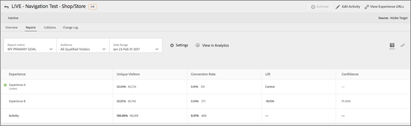

# [!DNL Adobe Analytics] como fuente de informes para [!DNL Adobe Target] (A4T)

[!DNL Adobe Analytics for Target] (A4T) es una integración de soluciones cruzadas que le permite crear actividades basadas en las métricas de conversión y los segmentos de público de [!DNL Analytics] Esta integración de A4T le permite utilizar informes de [!DNL Analytics] para examinar sus resultados. Si usa [!DNL Analytics] como fuente de informes de una actividad, todos los informes y la segmentación de dicha actividad se basarán en la recopilación de datos de [!DNL Analytics].

## Información general {#section_92B66069210C40DBA937790E8CC596CF}

La integración de [!DNL Analytics for Target] entre [!DNL Analytics] y [!DNL Target] proporciona potentes herramientas de análisis y ahorro de tiempo para su programa de optimización.

Estos son los tres beneficios principales de utilizar los datos de [!DNL Analytics] en [!DNL Target]:

* Los especialistas en marketing pueden aplicar de forma dinámica métricas de éxito o segmentos de informes de [!DNL Analytics] a los informes de actividad de [!DNL Target] en cualquier momento. No es necesario especificarlo todo antes de ejecutar la actividad.
* Disponer de una única fuente de datos elimina la variación derivada de la recopilación de datos de dos sistemas distintos.
* La implementación de [!DNL Analytics] existente recopila todos los datos necesarios. No es necesario implementar mboxes en páginas con el único objetivo de recopilar datos para informes.

Si usa [!DNL Analytics] como fuente de informes de una actividad, todos los informes y la segmentación de dicha actividad se basarán en [!DNL Analytics].

Todas las métricas de [!DNL Analytics], incluidas las calculadas, están disponibles en [!DNL Target] y en el informe [!UICONTROL Actividades de Target] en [!DNL Analytics], con una excepción. No se admiten las métricas calculadas para [!UICONTROL Alza y confianza]. Del mismo modo, cualquier segmento disponible en [!DNL Analytics] puede aplicarse a ambas soluciones. Puede aplicar la métrica o el público al informe en [!DNL Target] después de haber iniciado la prueba, o incluso después de que se haya completado la prueba.

Se incluyen todas las métricas, incluida cualquier métrica de cliente o calculada que esté integrada en [!DNL Analytics].

Tras el periodo de clasificación, los datos aparecen en estos informes aproximadamente una hora después de recabarse del sitio web. Todas las métricas, los segmentos y los valores de los informes proceden del grupo de informes que seleccionó cuando configuró la actividad.

Tenga en cuenta los siguientes puntos cuando vaya a utilizar A4T:

* Para usar [!DNL Analytics] como la fuente de informes para [!DNL Target], tanto el usuario como la empresa deben tener acceso a [!DNL Analytics] y a [!DNL Target]. [Póngase en contacto con su representante de cuentas](/help/main/cmp-resources-and-contact-information.md#concept_34A1CA16F2244D42930BB77846A5ABBB) si necesita alguna de estas soluciones.
* La fuente de informes se establece por actividad. [!DNL Target] continuará recopilando datos para usarlos en los informes y los datos de [!DNL Target] seguirán estando disponibles si prefiere que las actividades se basen en datos recopilados por [!DNL Target].
* Debe usar una de las dos fuentes de informes. No puede recopilar datos de una única actividad desde ambas fuentes.
* Al utilizar A4T, todas las métricas de éxito disponibles para sus actividades serán métricas de [!DNL Analytics]. Sin embargo, su métrica de objetivos se puede basar en una llamada de mbox si usa at.js. Por ejemplo, puede utilizar las funcionalidades de seguimiento de clics integradas en A4T en lugar de tener que implementar el código de seguimiento de clics de [!DNL Analytics].
* Cuando revise los informes de una actividad de A4T en la interfaz de usuario de [!DNL Target], estará viendo datos de [!DNL Analytics]. Por ejemplo, si usa la métrica [!UICONTROL Visitante] en [!DNL Target], está usando la métrica [!DNL Analytics] [!UICONTROL Visitante], no la métrica [!DNL Target] [!UICONTROL Visitantes], que ahora se llama [!UICONTROL Participantes]. Esta diferencia es especialmente importante para métricas de tráfico básicas ([!UICONTROL Visitantes], [!UICONTROL Visitas], [!UICONTROL Vistas de página]) y métricas de conversión.
* Las actividades de [!DNL Target] existentes seguirán utilizando la recopilación de datos de [!DNL Target] y no se verán afectadas por la habilitación de A4T.
* Solo se permite una métrica basada en mbox al utilizar A4T.
* Una llamada de servidor a servidor desde [!DNL Target] hacia [!DNL Analytics] envía la información de actividad y de experiencia a [!DNL Analytics]. Esta integración no genera llamadas al servidor adicionales para [!DNL Target] o [!DNL Analytics].

  En algunas situaciones, las clasificaciones de [!DNL Target] a [!DNL Analytics] falla y las actividades no muestran datos en [!DNL Analytics]. Consulte [Resolución de problemas de integración de Analytics y Target (A4T)](/help/main/c-integrating-target-with-mac/a4t/c-a4t-troubleshooting/a4t-troubleshooting.md). También puede [ponerse en contacto con Atención al cliente](/help/main/cmp-resources-and-contact-information.md#concept_34A1CA16F2244D42930BB77846A5ABBB) para obtener más ayuda.

## Implementación de A4T

Para obtener información sobre la implementación de A4T con at.js y [!DNL Adobe Experience Platform Web SDK], consulte [ Implementación de Analytics for  [!DNL Target] ](/help/main/c-integrating-target-with-mac/a4t/a4timplementation.md).

## Tipos de actividades compatibles {#section_F487896214BF4803AF78C552EF1669AA}

Las secciones siguientes contienen información sobre tipos de actividades compatibles al usar [!DNL Adobe Experience Platform Web SDK] o at.js:

| Tipos de actividad | Compatible con A4T | Notas, si corresponde |
|--- |--- |--- |
| [Actividad A/B con división de tráfico manual](/help/main/c-activities/t-test-ab/test-ab.md) | Sí |  |
| [Actividad A/B con asignación automática](/help/main/c-activities/automated-traffic-allocation/automated-traffic-allocation.md) | Sí | Consulte [Compatibilidad de A4T con actividades de asignación automática y segmentación automática](/help/main/c-integrating-target-with-mac/a4t/a4t-at-aa.md). |
| [Actividad A/B con segmentación automática](/help/main/c-activities/auto-target/auto-target-to-optimize.md) | Sí | Ahora, la compatibilidad de A4T con actividades de Segmentación automática es compatible para ambos [!DNL Platform Web SDK] y at.js. |
| [Segmentación de experiencias (XT)](/help/main/c-activities/t-experience-target/experience-target.md) | Sí |  |
| [Prueba multivariable (MVT)](/help/main/c-activities/c-multivariate-testing/multivariate-testing.md) | Sí | Requiere una métrica de objetivos basada en mbox para obtener el informe [!UICONTROL Contribución de elementos]. El informe [!UICONTROL Contribución de elementos] no admite actualmente métricas de [!DNL Analytics]. |
| [Actividad de Automated Personalization (AP)](/help/main/c-activities/t-automated-personalization/automated-personalization.md) | No |  |
| [Actividad de Recommendations](/help/main/c-recommendations/recommendations.md) | Sí |  |
| [Cualquier actividad que utilice una oferta de redireccionamiento](/help/main/c-integrating-target-with-mac/a4t/r-a4t-faq/a4t-faq-redirect-offers.md) | Sí |  |

Dado que, de momento, no todos los tipos de actividades son compatibles con A4T, es recomendable mantener o implementar algunos mboxes de conversión importantes, como el mbox `orderConfirmPage`.

## Ejemplos de informes de A4T {#section_F0A43A1CB2F04E8282B909E4D7034361}

Para ver los informes de A4T en [!DNL Target], haga clic en **[!UICONTROL Actividades]**, haga clic en la actividad deseada en la lista que usa [!DNL Analytics] como fuente de informes y, a continuación, haga clic en la ficha **[!UICONTROL Informes]**.

>[!NOTE]
>
>Puede usar la lista desplegable [!UICONTROL Reporting Source] en la parte superior de la página [!UICONTROL Actividades] para mostrar solo las actividades que usan A4T.

Para cambiar entre la [!UICONTROL vista de tabla] y la [!UICONTROL vista de gráfico] del informe, haga clic en el icono correspondiente en la parte superior derecha del informe.

La siguiente ilustración muestra la [!UICONTROL vista de gráfico] de un informe de A4T. La lista desplegable [!UICONTROL Métrica de informes] muestra las métricas de objetivo de [!DNL Analytics] disponibles:

La siguiente ilustración muestra la [!UICONTROL vista de gráfico] de un informe de A4T. La lista desplegable [!UICONTROL Audiencia] muestra las audiencias [!DNL Analytics] disponibles:

En la ilustración siguiente, se muestra la [!UICONTROL Visualización de tabla] de un informe de A4T:

Para ver el informe en [!DNL Analytics] en lugar de en [!DNL Target], haga clic en **[!UICONTROL Ver en Analytics]** en la parte superior del informe.

## Tutorial Analytics &amp; Target: Best Practices for Analysis (en inglés) {#section_3438E6E77A464424B717A4FD333B84B2}

Abra el tutorial [Analytics &amp; Target: Best Practices for Analysis](https://spark.adobe.com/page/Lo3Spm4oBOvwF/) (Analytics y Target: prácticas recomendadas para el análisis), proporcionado por [!DNL Adobe Experience League].

## Vídeos de formación:

Los siguientes vídeos contienen más información sobre los conceptos mencionados en este tema.

### Analytics for Adobe Target (A4T) (4:32) 

Este vídeo explica cómo utilizar [!DNL Analytics] como una fuente de informes en [!DNL Target] para dirigir el análisis de su programa de optimización.

* Explicar qué es A4T y por qué debería utilizarlo
* Explicar cómo funciona A4T
* Entender los requisitos necesarios antes de utilizar A4T

>[!VIDEO](https://video.tv.adobe.com/v/17384)

### Integración de Analytics/Adobe Target (A4T) (40:33) 

Este vídeo es una grabación de “[Horario de oficina](/help/main/cmp-resources-and-contact-information.md#concept_58EA30379D3B48C4848BA2A8C464A5B7)”, una iniciativa dirigida por el equipo de atención al cliente de Adobe.

* Cómo configurar y validar que la integración está funcionando
* Cómo funciona la integración
* Obtenga información sobre los informes ideales para su uso en Analytics
* Respuestas a preguntas más frecuentes sobre A4T

[Integración de Analytics/Target (A4T) Horario de oficina](https://helpx.adobe.com/es/customer-care-office-hours/target/analytics-target-A4T-integration.html)

>[!MORELIKETHIS]
>
>* [Implementación de Analytics for  [!DNL Target] ](/help/main/c-integrating-target-with-mac/a4t/a4timplementation.md): Contiene información de implementación para at.js y el SDK web de Platform.
>* [Ofertas de redireccionamiento: preguntas más frecuentes sobre A4T](/help/main/c-integrating-target-with-mac/a4t/r-a4t-faq/a4t-faq-redirect-offers.md)
>* [¿Qué es el SDK web de Adobe Experience Platform?](https://experienceleague.adobe.com/docs/experience-platform/edge/home.html?lang=es): Contiene información general sobre el SDK web de Platform.
>* [Información general de Target](https://experienceleague.adobe.com/docs/experience-platform/edge/personalization/adobe-target/target-overview.html?lang=es): Contiene información específica de [!DNL Target] y [!DNL Platform Web SDK].
