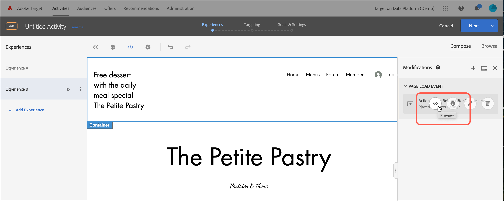

# Uso de decisiones de oferta

Uso [!DNL Adobe Target] con [!DNL Adobe Journey Optimizer] decisiones de oferta para determinar y entregar la siguiente mejor oferta para sus visitantes en la web y dispositivos móviles.

Agregar decisiones de oferta creadas en [!DNL Adobe Journey Optimizer] a [!DNL Target] actividades (manual [!UICONTROL Prueba A/B] o [!UICONTROL Segmentación de experiencias]) mediante [!UICONTROL Compositor de experiencias visuales] (VEC) o [!UICONTROL Compositor basado en formularios] para probar y entregar ofertas personalizadas a los visitantes en los canales entrantes ofrecidas por [!DNL Target].

Para obtener más información, consulte [!DNL Adobe Journey Optimizer] y las decisiones de oferta, consulte los temas siguientes en la sección *[!DNL Journey Optimizer]* documentación:

* [Introducción a Journey Optimizer](https://experienceleague.adobe.com/docs/journey-optimizer/using/get-started/get-started.html)

* [Acerca de la gestión de decisiones](https://experienceleague.adobe.com/docs/journey-optimizer/using/offer-decisioniong/get-started/starting-offer-decisioning.html)

## Requisitos previos  

Para usar las decisiones de oferta en [!DNL Target], necesita lo siguiente:

* [!DNL Adobe Target Standard] o [!DNL Adobe Target Premium] implementado usando la variable [SDK web de Adobe Experience Platform](/help/main/c-implementing-target/c-implementing-target-for-client-side-web/aep-web-sdk.md).

   La función no está disponible al implementar [!DNL Target] con at.js u otros [!DNL Target] SDK.

* [!DNL Adobe Journey Optimizer Ultimate] (AJ0 + Offer decisioning) o [!DNL Adobe Experience Platform] y [!UICONTROL offer decisioning] complemento del servicio de aplicaciones.

## Ejemplos de uso

Los siguientes ejemplos son casos de uso de cómo puede usar la variable [!DNL Target]/[!DNL Adobe Journey Optimizer] integración para utilizar las decisiones de oferta en [!DNL Target] actividades:

### Comercialización deportiva

Como especialista en marketing de una liga deportiva, desea personalizar el contenido en su página principal (tanto en el sitio web de escritorio como en el móvil). Desea personalizar el contenido basado en varias dimensiones y presentar una oferta a los productos de franquicia relacionados con la tienda. Le interesa:

* El equipo favorito del visitante
* Actividad reciente del atleta/jugador (por ejemplo, movimiento del equipo, actualizaciones de contratos o lesiones)

Por ejemplo, desea ofrecer una experiencia personalizada para cada una de las regiones siguientes: Dortmund, Frankfurt y Bochum, así como para los usuarios que son seguidores implícitos y explícitos de estos equipos. Como métricas, le interesa ver las visitas y los clics en el sitio de mercadotecnia.

Desea diseñar un [!UICONTROL Prueba A/B] actividad (50/50 dividido) entre la experiencia predeterminada y la experiencia personalizada (que incluye una decisión de oferta con ofertas para cada región y equipo). Desea utilizar esta actividad para determinar la conversión y el alza de la experiencia personalizada frente al control.

### Plataformas de transmisión de juegos

Como comerciante de una organización de juegos, desea ofrecer una oferta personalizada para una plataforma de transmisión de juegos para usuarios de equipos de escritorio y móviles de diferentes regiones geográficas: Alemania, Francia, México y Brasil. Cuando un visitante accede al escritorio o al sitio web móvil desde una de esas regiones geográficas, desea ofrecer una oferta para la transmisión de juegos en el idioma local y con el precio correspondiente para la moneda local.

En [!DNL Adobe Journey Optimizer], puede crear una oferta de página principal personalizada para cada una de las regiones geográficas objetivo, además de una oferta de reserva con una página principal predeterminada. A continuación, puede crear una decisión de oferta que incorpore estas ofertas y sus reglas de idoneidad. A continuación, en [!DNL Target], puede crear un [!DNL Experience Targeting] (XT) e inserte esa decisión de oferta en su sitio web de escritorio o móvil para ofrecer la experiencia personalizada a los visitantes.

## Cree una experiencia que use una decisión de oferta:

1. Mientras edita o crea un manual [!UICONTROL Prueba A/B] o [!UICONTROL Segmentación de experiencias] (XT) en la [!UICONTROL Compositor de experiencias visuales] (VEC), haga clic en un elemento de página para mostrar el [menú opciones](/help/main/c-experiences/c-visual-experience-composer/viztarget-options.md).

   

   >[!NOTE]
   >
   >También puede crear una experiencia que utilice [!UICONTROL Decisiones de oferta] en el [[!UICONTROL Compositor de experiencias basadas en formularios]](/help/main/c-experiences/form-experience-composer.md).

1. Haga clic en **[!UICONTROL Insertar antes]**, **[!UICONTROL Insertar después]** o **[!UICONTROL Reemplazar contenido]** y haga clic en **[!UICONTROL Decisión de oferta]**.

   La variable [!UICONTROL Decisión de oferta] está disponible al editar o crear [manual [!UICONTROL Prueba A/B]](/help/main/c-activities/t-test-ab/test-ab.md#types) o [[!UICONTROL Segmentación de experiencias]](/help/main/c-activities/t-experience-target/experience-target.md) (XT) solo. Esta opción no está disponible para otros tipos de actividades. Las opciones disponibles en el menú varían en función del elemento seleccionado.

   

1. En el **[!UICONTROL Agregar decisión de oferta]** seleccione el entorno limitado y la ubicación que desee.

   A [entorno limitado](https://experienceleague.adobe.com/docs/experience-platform/sandbox/ui/overview.html){target=_blank} en la sección [!DNL Adobe Experience Platform] permite particionar la instancia en entornos virtuales. Por ejemplo, puede tener un entorno de producción y un entorno de ensayo. A [placement](https://experienceleague.adobe.com/docs/journey-optimizer/using/offer-decisioniong/create-components/creating-placements.html){target=_blank} en [!DNL Adobe Journey Optimizer] ayuda a garantizar que el contenido de oferta correcto se muestre en la ubicación correcta.

   

1. Seleccione la decisión de oferta que desee y haga clic en **[!UICONTROL Crear]**.

   

   Su sitio web se muestra en el VEC, donde puede ver la decisión de oferta recién creada en la [!UICONTROL Modificaciones] en el lado derecho. Puede pasar el ratón sobre la modificación y hacer clic en la [!UICONTROL Vista previa] para examinar la decisión de la oferta.

   

   Puede examinar las distintas ofertas contenidas en la oferta haciendo clic en el icono correspondiente en la parte inferior del [!UICONTROL Vista previa de oferta] , incluida la oferta de reserva. Una oferta de reserva es la oferta predeterminada que se muestra cuando un visitante no es apto para ninguna de las ofertas personalizadas de la colección.

   

1. Termine de crear la actividad completando la [!UICONTROL Segmentación] y [!UICONTROL Objetivos y configuración] pasos del flujo de trabajo guiado de tres partes.

   >[!IMPORTANT]
   >
   >Para garantizar que la variable [!DNL Target] actividad personalizada, asegúrese de que las fechas de inicio y finalización de la actividad actual estén sincronizadas con las fechas de inicio y finalización de la decisión de oferta en [!DNL Adobe Journey Optimizer]. Si la variable [!DNL Target] las fechas de inicio y finalización están fuera del intervalo de fechas de inicio y finalización de la decisión de oferta, el valor predeterminado [!DNL Target] El contenido se muestra a los visitantes.

   

## Notas y limitaciones

Tenga en cuenta la siguiente información cuando trabaje con decisiones de oferta:

* La integración de offer decisioning funciona para [!DNL Target] implementaciones basadas en [SDK web de Adobe Experience Platform](/help/main/c-implementing-target/c-implementing-target-for-client-side-web/aep-web-sdk.md). Esta función no está disponible al implementar [!DNL Target] con at.js u otros [!DNL Target] SDK.

* La integración de Target/Adobe Journey Optimizer es compatible con [manual [!UICONTROL Prueba A/B]](/help/main/c-activities/t-test-ab/test-ab.md#types) y [[!UICONTROL Segmentación de experiencias]](/help/main/c-activities/t-experience-target/experience-target.md) (XT) solo. Esta función no está disponible para otros tipos de actividades.

* Las ofertas con el tipo de contenido text/html no admiten la entrega de contenido deliveryURL. deliveryURL solo es compatible con el Compositor de experiencias basadas en formularios cuando el cliente es responsable de recuperar y componer el contenido explícitamente.

* [!DNL Target] los informes no proporcionan informes a nivel de decisión de oferta.

* Visualización [Vínculos de control de calidad](/help/main/c-activities/c-activity-qa/activity-qa.md) para [!DNL Target] las experiencias que contienen decisiones de oferta afectan al límite de frecuencia establecido en [!DNL Adobe Journey Optimizer] para esas decisiones de oferta.
