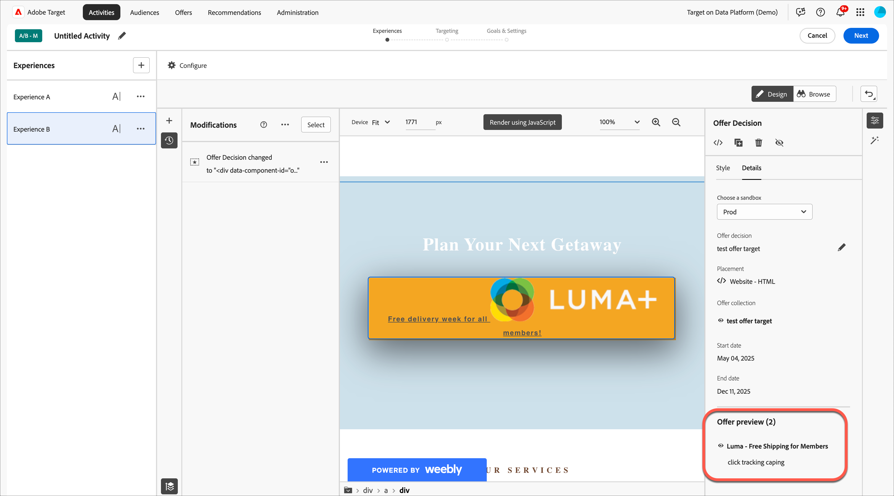

# Uso de decisiones de oferta

Use [!DNL Adobe Target] con [!DNL Adobe Journey Optimizer] decisiones de oferta para determinar y entregar la siguiente mejor oferta para sus visitantes en la web y dispositivos móviles.

Agregue decisiones de oferta creadas en [!DNL Adobe Journey Optimizer] a [!DNL Target] actividades (prueba manual [!UICONTROL Prueba A/B] o [!UICONTROL Segmentación de experiencias]) usando el [!UICONTROL Compositor de experiencias visuales] (VEC) o el [!UICONTROL Compositor basado en formularios] para probar y entregar ofertas personalizadas a sus visitantes en sus canales entrantes con tecnología [!DNL Target].

Para obtener más información acerca de [!DNL Adobe Journey Optimizer] y las decisiones de oferta, consulte los siguientes temas en la documentación de *[!DNL Journey Optimizer]*:

* [Introducción a Journey Optimizer](https://experienceleague.adobe.com/docs/journey-optimizer/using/get-started/get-started.html)

* [Acerca de Administración de decisiones](https://experienceleague.adobe.com/docs/journey-optimizer/using/offer-decisioning/get-started-decision/starting-offer-decisioning.html?lang=es)

## Requisitos previos

Para usar decisiones de oferta en [!DNL Target], necesita lo siguiente:

* [!DNL Adobe Target Standard] o [!DNL Adobe Target Premium] implementados usando [Adobe Experience Platform Web SDK](https://experienceleague.adobe.com/docs/target-dev/developer/client-side/aep-web-sdk.html?lang=es){target=_blank}.

  La característica no está disponible al implementar [!DNL Target] con at.js u otros SDK de [!DNL Target].

* [!DNL Adobe Journey Optimizer Ultimate] (AJO + Offer Decisioning) o [!DNL Adobe Experience Platform] y el complemento del servicio de aplicaciones [!UICONTROL Offer Decisioning].

## Ejemplos de uso

Los siguientes ejemplos son casos de uso de cómo puede usar la integración [!DNL Target]/[!DNL Adobe Journey Optimizer] para usar decisiones de oferta en actividades [!DNL Target]:

### Comercialización deportiva

Como experto en marketing de una liga deportiva, desea personalizar el contenido de su página de inicio (tanto en el escritorio como en el sitio web móvil). Desea personalizar el contenido en función de varias dimensiones y presentar una oferta para la mercancía de la franquicia relacionada con la tienda. Está interesado en:

* El equipo favorito del visitante
* Actividad reciente del atleta/jugador (por ejemplo, movimiento del equipo, actualizaciones de contrato o lesiones)

Por ejemplo, desea ofrecer una experiencia personalizada para cada una de las siguientes regiones: Dortmund, Frankfurt y Bochum, y para los usuarios que son seguidores implícitos y explícitos de estos equipos. Como métricas, le interesa ver las visitas y los clics en el sitio de productos.

Desea diseñar una actividad [!UICONTROL Prueba A/B] (división 50/50) entre la experiencia predeterminada y la experiencia personalizada (que incluye una decisión de oferta con ofertas para cada región y equipo). Desea utilizar esta actividad para determinar la conversión y el alza de la experiencia personalizada en comparación con el control.

### Plataformas de transmisión de juegos

Como experto en marketing de una organización de juegos, le interesa ofrecer una oferta personalizada para una plataforma de transmisión de juegos para usuarios de equipos de escritorio y móviles de diferentes regiones geográficas: Alemania, Francia, México y Brasil. Cuando un visitante accede al sitio web de escritorio o móvil desde una de esas ubicaciones geográficas, desea ofrecerle una oferta de transmisión de juegos en línea en el idioma local y con el precio correspondiente en la moneda local.

En [!DNL Adobe Journey Optimizer], puede crear una oferta de imagen a pantalla completa personalizada para cada una de las regiones segmentadas, además de una oferta de reserva con una imagen a pantalla completa predeterminada. A continuación, puede crear una decisión de oferta que incorpore estas ofertas y sus reglas de idoneidad. A continuación, en [!DNL Target], puede crear una actividad [!DNL Experience Targeting] (XT) e insertar esa decisión de oferta en su sitio web de escritorio o móvil para ofrecer la experiencia personalizada a los visitantes.

## Cree una experiencia que utilice una decisión de oferta:

1. Mientras edita o crea una actividad [!UICONTROL Prueba A/B] o [!UICONTROL Segmentación de experiencias] (XT) manual en el [!UICONTROL Compositor de experiencias visuales] (VEC), haga clic en un elemento de página para mostrar el [menú de opciones](/help/main/c-experiences/c-visual-experience-composer/viztarget-options.md).

   

   >[!NOTE]
   >
   >También puede crear una experiencia que use [!UICONTROL Decisiones de oferta] en el [[!UICONTROL Compositor de experiencias basadas en formularios]](/help/main/c-experiences/form-experience-composer.md).

1. Haga clic en **[!UICONTROL Reemplazar contenido]** y luego haga clic en **[!UICONTROL Decisión de oferta]**.

   La opción [!UICONTROL Decisión de oferta] está disponible al editar o crear [prueba [!UICONTROL A/B manual]](/help/main/c-activities/t-test-ab/test-ab.md#types) o [[!UICONTROL Segmentación de experiencias]](/help/main/c-activities/t-experience-target/experience-target.md) (XT) solamente. Esta opción no está disponible para otros tipos de actividades. Las opciones disponibles en el menú varían según el elemento seleccionado.

   

1. En el carril **[!UICONTROL Agregar decisión de oferta]** que se encuentra en el lado derecho del VEC, seleccione la zona protegida que desee y, a continuación, haga clic en Seleccionar decisión de oferta.placement.

   Una [zona protegida](https://experienceleague.adobe.com/docs/experience-platform/sandbox/ui/overview.html){target=_blank} en [!DNL Adobe Experience Platform] le permite particionar la instancia en entornos virtuales. Por ejemplo, puede tener un entorno de producción y un entorno de ensayo. Una [ubicación](https://experienceleague.adobe.com/docs/journey-optimizer/using/offer-decisioning/create-components/creating-placements.html){target=_blank} en [!DNL Adobe Journey Optimizer] ayuda a garantizar que el contenido de la oferta correcta se muestre en la ubicación correcta.

   

1. Seleccione la ubicación de oferta y la decisión de oferta que desee y haga clic en **[!UICONTROL Agregar]**.

   

   Su sitio web se muestra en el VEC donde puede ver la decisión de oferta recién creada en el carril [!UICONTROL Modificaciones]. Puede hacer clic en una oferta de [!UICONTROL Vista previa de la oferta] en la parte inferior del carril de [!UICONTROL Decisión de oferta] para examinar la decisión de la oferta.

   <!--You can examine the various offers contained in the offer by clicking the appropriate icon at the bottom of the [!UICONTROL Offer Preview] dialog box, including the fallback offer. A fallback offer is the default offer displayed when a visitor is not eligible for any of the personalized offers in the collection.-->

   

1. Termine de crear la actividad completando los pasos de [!UICONTROL Segmentación] y [!UICONTROL Objetivos y configuración] del flujo de trabajo guiado de tres partes.

   >[!IMPORTANT]
   >
   >Para asegurarse de que la actividad [!DNL Target] esté personalizada, asegúrese de que las fechas de inicio y finalización de la actividad actual estén sincronizadas con las fechas de inicio y finalización de la decisión de oferta en [!DNL Adobe Journey Optimizer]. Si las [!DNL Target] fechas de inicio y finalización están fuera del intervalo de fechas de inicio y finalización de la decisión de oferta, se muestra el contenido predeterminado [!DNL Target] a los visitantes.

## Notas y limitaciones

Tenga en cuenta la siguiente información al trabajar con decisiones de oferta:

* La integración de Offer Decisioning funciona para implementaciones de [!DNL Target] basadas en [Adobe Experience Platform Web SDK](https://experienceleague.adobe.com/docs/target-dev/developer/client-side/aep-web-sdk.html?lang=es){target=_blank}. Esta característica no está disponible al implementar [!DNL Target] con at.js u otros SDK de [!DNL Target].

* La integración de [!DNL Target]/[!DNL Adobe Journey Optimizer] solo admite [pruebas [!UICONTROL A/B manuales]](/help/main/c-activities/t-test-ab/test-ab.md#types) y [[!UICONTROL actividades de segmentación de experiencias]](/help/main/c-activities/t-experience-target/experience-target.md) (XT). Esta función no está disponible para otros tipos de actividades.

* No puede usar [[!UICONTROL Analytics como fuente de informes]](/help/main/c-integrating-target-with-mac/a4t/a4t.md) (A4T) si usa decisiones de oferta en una actividad. Elija [!DNL Target] como fuente de informes en la página [!UICONTROL Objetivos y configuración] durante la configuración de la actividad si usa decisiones de oferta en la actividad.

* Las ofertas con el tipo de contenido text/html no admiten la entrega de contenido deliveryURL. deliveryURL es compatible a través de [Compositor de experiencias basadas en formularios](/help/main/c-experiences/form-experience-composer.md) solamente donde el cliente es responsable de recuperar y maquetar explícitamente el contenido.

* Los informes de [!DNL Target] no proporcionan informes de nivel de decisión de oferta.

* La visualización de [vínculos de control de calidad](/help/main/c-activities/c-activity-qa/activity-qa.md) para [!DNL Target] experiencias que contienen decisiones de oferta afecta al límite de frecuencia establecido en [!DNL Adobe Journey Optimizer] para esas decisiones de oferta.
