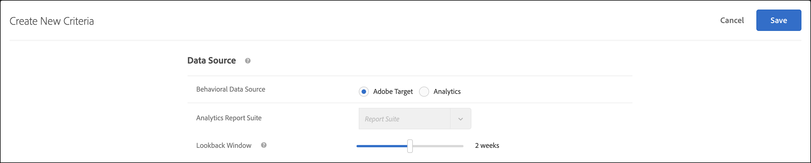

# Crear criterios

Los criterios de [!UICONTROL Adobe Target] [!UICONTROL Recommendations] controlan el contenido de sus actividades [!UICONTROL Recommendations]. Cree criterios para mostrar las recomendaciones que más se ajusten a su actividad. Estos criterios utilizan las acciones del visitante para determinar qué contenido o productos mostrar.

En las secciones siguientes se explica cómo crear un nuevo criterio.

## Acceso a la pantalla Crear nuevos criterios

Existen varias formas de llegar a la pantalla [!UICONTROL Create New Criteria]. Algunas opciones de pantalla dependen de cómo llega a la pantalla.

* En la pantalla de la biblioteca **[!UICONTROL Recommendations]** > **[!UICONTROL Criteria]**, haga clic en **[!UICONTROL Create Criteria]** > **[!UICONTROL Create Criteria]**. Los criterios que crea aquí quedan disponibles automáticamente para todas las actividades de [!DNL Recommendations].
* Cuando crea una actividad [!DNL Recommendations] con el [!UICONTROL Visual Experience Composer] (VEC), se le redirige inmediatamente a la pantalla [!UICONTROL Select Criteria] después de seleccionar un elemento en la página y hacer clic en [!UICONTROL Replace w/ Recommendations], [!UICONTROL Insert Recommendations Before] o [!UICONTROL Insert Recommendations After]. Puede seleccionar un criterio disponible o hacer clic en **[!UICONTROL Create Criteria]**. Si crea un nuevo criterio, tiene la opción de guardarlo para utilizarlo con otras [!DNL Recommendations] actividades. Para obtener más información, consulte [Crear una actividad de Recommendations](/help/main/c-recommendations/t-create-recs-activity/create-recs-activity.md).
* Cuando esté editando una actividad [!DNL Recommendations], haga clic en un cuadro [!UICONTROL Recommendations Location] de la página y seleccione **[!UICONTROL Change Criteria]**. En la pantalla [!UICONTROL Select Criteria], haga clic en **[!UICONTROL Create Criteria]**. Tendrá la opción de guardar los nuevos criterios para usarlos con otras actividades de [!DNL Recommendations].

Los siguientes pasos dan por sentado que tiene acceso a la pantalla de [!UICONTROL Create New Criteria] mediante el primer método: la pantalla de biblioteca **[!UICONTROL Recommendations]** > **[!UICONTROL Criteria]**.

1. Haga clic en **[!UICONTROL Recommendations]** > **[!UICONTROL Criteria]**.

1. Haga clic en **[!UICONTROL Create Criteria]** > **[!UICONTROL Create Criteria]**.

   

1. Configure la información en las secciones siguientes.

## [!UICONTROL Basic Information] {#info}

1. Escriba un **[!UICONTROL Criteria Name]**.

   Es el nombre “interno” que se usa para describir los criterios. Por ejemplo, quizá use el nombre “Productos con más margen” para los criterios, pero es probable que no quiera que ese título se muestre al público. Consulte el paso siguiente para establecer el título que se presenta al público.

   

1. Escriba un **[!UICONTROL Display Title]** público para que aparezca en la página para todas las recomendaciones que usen este criterio.

   Por ejemplo, una idea es mostrar “Las personas que han visto esto también vieron” o “Productos similares” cuando use estos criterios para mostrar recomendaciones.

1. Escriba un **[!UICONTROL Description]** corto de los criterios.

   La descripción le ayudará a identificar los criterios y puede incluir información sobre el propósito de los criterios.

1. Seleccione un sector vertical según los objetivos de su actividad de recomendaciones.

   | Sector | Objetivo |
   |--- |--- |
   | Venta minorista/Comercio electrónico | Conversión que termina en compra |
   | Generación de vanguardia/B2B/Servicios financieros | Conversión sin compra |
   | Medios/Publicación | Participación |

   Otras opciones de criterios cambiarán según el sector que seleccione.

1. Seleccione un(a) **[!UICONTROL Page Type]**.

   Puede seleccionar varios tipos de página.

   En conjunto, el sector y los tipos de página se usan para categorizar los criterios guardados, facilitando su reutilización para otras actividades de [!DNL Recommendations].

## [!UICONTROL Recommendations Algorithm] {#rec-algo}

1. Seleccionar un(a) **[!UICONTROL Algorithm Type]** y **[!UICONTROL Algorithm]**:

   

   | Tipo de algoritmo | Cuándo usar | Algoritmos disponibles |
   | --- | --- | --- |
   | [!UICONTROL Cart-Based] | Haga recomendaciones basadas en el contenido del carro de compras del usuario. | <ul><li>Los ususarios que vieron estos, vieron aquellos</li><li>Los ususarios que vieron esto, compraron aquello.</li><li>Los ususarios que compraron estos, compraron aquellos</li></ul> |
   | [!UICONTROL Popularity-Based] | Haga recomendaciones basadas en la popularidad general de un elemento en el sitio o en la popularidad de elementos dentro de la categoría, marca, género, etc. favoritos o más vistos de un usuario. | <ul><li>Más visitados en todo el sitio</li><li>Más visitados por categoría</li><li>Más visitados por atributo de artículo</li><li>Principales vendedores en todo el sitio</li><li>Principales vendedores por categoría</li><li>Principales vendedores por atributo de artículo</li><li>Superior por métrica de Analytics</li></ul> |
   | [!UICONTROL Item-Based] | Haga recomendaciones basadas en la búsqueda de artículos similares a los que el usuario está viendo en este momento o ha visto recientemente. | <ul><li>Los usuarios que vieron esto, vieron aquello.</li><li>Los usuarios que vieron esto, compraron aquello.</li><li>Los usuarios que compraron esto, compraron aquello.</li><li>Artículos con atributos similares</li></ul> |
   | [!UICONTROL User-Based] | Haga recomendaciones basadas en el comportamiento del usuario. | <ul><li>Artículos vistos recientemente. </li><li>Recomendado para usted</li></ul> |
   | [!UICONTROL Custom Criteria] | Cree recomendaciones basadas en un archivo personalizado que haya cargado. | <ul><li>Algoritmo personalizado</li></ul> |

   >[!NOTE]
   >
   >Si selecciona **[!UICONTROL Items]**/ **[!UICONTROL Media with Similar Attributes]**, tendrá la opción de establecer [reglas de similitud de contenido](#similarity).

1. Si es necesario, seleccione un **atributo de elemento** y un **atributo de perfil que coincida**, una **clave de recomendación**, **clave de filtrado** o **métrica de Analytics** para configurar el algoritmo.

Las opciones de configuración del algoritmo restante varían según el algoritmo seleccionado. Para finalizar la configuración del algoritmo, seleccione un [!UICONTROL Recommendation Key], [!UICONTROL Filtering Key], [!UICONTROL Co-Occurrence Basis], [!UICONTROL Analytics Metric], y/o [!UICONTROL Item Attribute] y [!UICONTROL Profile Attribute to Match].

Para obtener más información acerca de cómo elegir un(a) [!UICONTROL Recommendation Key], vea [Basar la recomendación en una clave de recomendación](/help/main/c-recommendations/c-algorithms/base-the-recommendation-on-a-recommendation-key.md).

## [!UICONTROL Data Source] {#data-source}

1. Seleccione el(la) **[!UICONTROL Behavioral Data Source]** deseado(a): [!UICONTROL Adobe Target] o [!UICONTROL Analytics].

   >[!NOTE]
   >
   >La sección [!UICONTROL Behavioral Data Source] solo se muestra si su implementación usa [Analytics for Target](/help/main/c-integrating-target-with-mac/a4t/a4t.md) (A4T).

   

   Si elige [!UICONTROL Analytics], seleccione el grupo de informes deseado.

   Si los criterios utilizan [!DNL Adobe Analytics] como fuente de datos de comportamiento, una vez creados, el tiempo de disponibilidad de los criterios depende de si el grupo de informes seleccionado y la ventana de vista al pasado se han utilizado para otros criterios, como se explica a continuación:

   * **Configuración de grupos de informes única**: La primera vez que se utiliza un grupo de informes con una ventana retrospectiva de intervalo de datos determinada, [!DNL Target Recommendations] puede tardar de dos a siete días en descargar completamente los datos de comportamiento del grupo de informes seleccionado de [!DNL Analytics]. Este lapso de tiempo depende de la carga del sistema [!DNL Analytics].
   * **Criterios nuevos o editados que usan un grupo de informes ya disponible**: Al crear un nuevo criterio o editar uno existente, si el grupo de informes seleccionado ya se ha utilizado con [!DNL Target Recommendations] con un intervalo de datos igual o inferior al seleccionado, entonces los datos estarán disponibles inmediatamente y no se requiere una configuración única. En este caso, o si la configuración de un algoritmo se edita sin modificar el grupo de informes o el intervalo de datos seleccionado, el algoritmo se ejecuta o vuelve a ejecutarse en un plazo de 12 horas.
   * **Se ejecuta el algoritmo en curso**: Los datos fluyen desde [!DNL Analytics] a [!DNL Target Recommendations] diariamente. Por ejemplo, para la recomendación [!UICONTROL Viewed Affinity], cuando un usuario ve un producto, se pasa una llamada de seguimiento de vista de producto a [!DNL Analytics] casi en tiempo real. Los datos de [!DNL Analytics] se insertan en [!DNL Target] al principio del día siguiente y [!DNL Target] ejecuta el algoritmo en menos de 12 horas.

   Para obtener más información, consulte [Usar Adobe Analytics con Recommendations de Target](/help/main/c-recommendations/c-algorithms/use-adobe-analytics-with-recommendations.md).

1. Establezca **[!UICONTROL Lookback Window]** para determinar el intervalo de tiempo de los datos de comportamiento del usuario históricos disponibles que se utilizarán al determinar qué recomendaciones mostrar. Esta opción está disponible para todos los algoritmos, excepto para los elementos con atributos similares y algoritmos personalizados.

   

   Si el sitio tiene mucho tráfico y los comportamientos cambian con frecuencia, elija un período de datos más breve. Un periodo más breve permite a [!DNL Recommendations]responder mejor a los cambios del mercado y de su empresa. Por ejemplo, un periodo breve significa que [!DNL Recommendations]detectará cambios en el comportamiento de los visitantes a medida que estos comiencen a realizar compras de temporada, como las compras de vuelta al colegio o las compras navideñas, y recomendará artículos apropiados para esas temporadas.

   Si no dispone de muchos datos o el comportamiento de los visitantes no cambia con frecuencia, puede elegir un período de tiempo más largo. Sin embargo, para muchos sitios, una ventana más corta resulta en recomendaciones de mayor calidad.

   Los intervalos de fechas que hay disponibles son:

   | Opción Ventana retroactiva | Frecuencia actualizada (mostrada al pasar el ratón por encima) | Algoritmos admitidos |
   | --- | --- | --- |
   | Seis horas | El algoritmo se ejecuta cada 3 a 6 horas | [!UICONTROL Popularity-Based] algoritmos cuando el [!UICONTROL Behavioral Data Source] seleccionado es [!DNL Adobe Target] |
   | Un día | El algoritmo se ejecuta cada 12 a 24 horas | [!UICONTROL Popularity-Based] algoritmos |
   | Dos días | El algoritmo se ejecuta cada 12 a 24 horas | <ul><li>[!UICONTROL Popularity-Based] algoritmos</li><li>[!UICONTROL Item-Based] algoritmos</li><li>[!UICONTROL User-Based] algoritmos</li><li>[!UICONTROL Cart-Based] algoritmos</li></ul> |
   | Una semana | El algoritmo se ejecuta cada 24 a 48 horas | <ul><li>[!UICONTROL Popularity-Based] algoritmos</li><li>[!UICONTROL Item-Based] algoritmos</li><li>[!UICONTROL User-Based] algoritmos</li><li>[!UICONTROL Cart-Based] algoritmos</li></ul> |
   | Dos semanas | El algoritmo se ejecuta cada 24 a 48 horas | <ul><li>[!UICONTROL Popularity-Based] algoritmos</li><li>[!UICONTROL Item-Based] algoritmos</li><li>Todos los algoritmos de [!UICONTROL User-Based]</li><li>[!UICONTROL Cart-Based] algoritmos</li></ul> |
   | Un mes (30 días) | El algoritmo se ejecuta cada 24 a 48 horas | <ul><li>[!UICONTROL Popularity-Based] algoritmos</li><li>[!UICONTROL Item-Based] algoritmos</li><li>[!UICONTROL User-Based] algoritmos</li><li>[!UICONTROL Cart-Based] algoritmos</li></ul> |
   | Dos meses (61 días) | El algoritmo se ejecuta cada 24 a 48 horas | <ul><li>[!UICONTROL Popularity-Based] algoritmos</li><li>[!UICONTROL Item-Based] algoritmos</li><li>[!UICONTROL User-Based] algoritmos</li><li>[!UICONTROL Cart-Based] algoritmos</li></ul> |

## [!UICONTROL Backup Content] {#content}

[!UICONTROL Backup Content] reglas determinan qué sucede si el número de artículos recomendados no cumple con su [diseño de recomendaciones](/help/main/c-recommendations/c-design-overview/design-overview.md). Es posible que [!DNL Recommendations] criterios devuelvan menos recomendaciones de las que exige el diseño. Por ejemplo, si el diseño tiene espacios para cuatro artículos, pero los criterios hacen que solo se recomienden dos artículos, puede dejar vacíos los espacios restantes, puede utilizar recomendaciones de copia de seguridad para rellenar los espacios adicionales o puede elegir no mostrar recomendaciones.

1. (Opcional) Deslice el conmutador **[!UICONTROL Partial Design Rendering]** a la posición &quot;Activado&quot;.

   Se rellenarán tantas ranuras como sea posible, pero la plantilla de diseño puede incluir espacio en blanco para las ranuras restantes. Si esta opción está deshabilitada y no hay suficiente contenido para rellenar todas las ranuras disponibles, las recomendaciones no se proporcionan y se muestra el contenido predeterminado en su lugar.

   Active esta opción si desea que las recomendaciones se proporcionen con espacios en blanco. Utilice recomendaciones de copia de seguridad si desea que las ranuras de recomendación se llenen de contenido basado en sus criterios con ranuras vacías llenas de contenido similar o popular de su sitio, como se explica en el siguiente paso.

1. (Opcional) Deslice el conmutador **[!UICONTROL Show Backup Content]** a la posición &quot;Activado&quot;.

   Rellene las ranuras vacías restantes del diseño con una selección aleatoria de los productos más vistos de todo el sitio.

   El uso de recomendaciones de copia de seguridad garantiza que el diseño de recomendaciones llene todas las ranuras disponibles. Supongamos que tiene un diseño de 4 x 1, como se muestra a continuación:

   

   Supongamos que sus criterios hacen que solo se recomienden dos artículos. Si habilita la opción [!UICONTROL Partial Design Rendering], las dos primeras ranuras se llenarán, pero las dos ranuras restantes permanecerán vacías. Sin embargo, si habilita la opción [!UICONTROL Show Backup Recommendations], las dos primeras ranuras se rellenan según los criterios especificados y las dos ranuras restantes se rellenan según las recomendaciones de copia de seguridad.

   La matriz siguiente muestra el resultado que observará al utilizar las opciones [!UICONTROL Partial Design Rendering] y [!UICONTROL Backup Content]:

   | Procesamiento de diseño parcial | Contenido de copia | Resultado |
   |--- |--- |--- |
   | Deshabilitado | Deshabilitado | Si se devuelven menos recomendaciones que las que llama el diseño, el diseño de recomendaciones se reemplaza por el contenido predeterminado y no se muestran recomendaciones. |
   | Habilitado | Deshabilitado | Se procesa el diseño, pero puede incluir espacio en blanco si se devuelven menos recomendaciones que las que llama el diseño. |
   | Habilitado | Habilitado | Las recomendaciones de copia de seguridad llenarán “ranuras” de diseño disponible, procesando completamente el diseño. Si la aplicación de reglas de inclusión a las recomendaciones de copia de seguridad restringe el número de recomendaciones de copia de seguridad correspondiente al punto de que no se pueda llenar el diseño, se procesa parcialmente el diseño. Si el criterio no devuelve ninguna recomendación, y las reglas de inclusión restringen las recomendaciones de copia de seguridad a cero, el diseño se reemplaza por el Contenido predeterminado. |
   | Deshabilitado | Habilitado | Las recomendaciones de copia de seguridad llenarán “ranuras” de diseño disponible, procesando completamente el diseño. Si la aplicación de reglas de inclusión a las recomendaciones de copia de seguridad restringe el número de recomendaciones de copia de seguridad correspondiente al punto de que no se pueda llenar el diseño, el diseño se reemplaza por el contenido predeterminado y no se muestran recomendaciones. |

   Para obtener más información, vea [Usar una recomendación de copia de seguridad](/help/main/c-recommendations/c-algorithms/backup-recs.md).

1. (Condicional) Si seleccionó **[!UICONTROL Show Backup Content]** en el paso anterior, puede habilitar **[!UICONTROL Apply inclusion rules to backup recommendations]**.

   Las reglas de inclusión determinan qué artículos se incluyen en las recomendaciones. Las opciones disponibles dependen del sector.

   Para obtener más información, consulte [Especificar reglas de inclusión](#inclusion) a continuación.

## Similitud de contenido {#similarity}

Utilice reglas de [!UICONTROL Content Similarity] para hacer recomendaciones basadas en elementos o atributos de medios.

>[!NOTE]
>
>Si seleccionó **[!UICONTROL Item-Based]**/ **[!UICONTROL Media with Similar Attributes]** como su Tipo de algoritmo y Algoritmo, tiene la opción de establecer reglas de similitud de contenido.

La similitud de contenido compara palabras clave de los atributos de los artículos y realiza recomendaciones basándose en la cantidad de palabras clave que los artículos tienen en común. Las recomendaciones que se basan en la similitud de contenido no requieren información anterior para ofrecer buenos resultados.

Resulta especialmente eficaz usar la similitud de contenido para generar recomendaciones en los artículos nuevos, ya que es poco probable que estos aparezcan en las recomendaciones usando *Otras personas que vieron esto también vieron* y otras lógicas basadas en el comportamiento anterior. También puede utilizar la similitud de contenido si quiere generar recomendaciones útiles para los nuevos visitantes, que no han hecho ninguna compra ni tienen datos históricos.

Al seleccionar **[!UICONTROL Item-Based]**/ **[!UICONTROL Media with Similar Attributes]**, tiene la opción de crear reglas para aumentar o reducir la importancia de atributos de elementos específicos a la hora de determinar las recomendaciones. En el caso de artículos como libros, puede aumentar la importancia de atributos como el *género*, el *autor* o la *serie* para recomendar libros parecidos.

Como la similitud de contenido emplea palabras clave para comparar los artículos, algunos atributos, como *mensaje* o *descripción*, pueden producir “ruido” en la comparación. Puede crear reglas para pasar por alto estos atributos.

De forma predeterminada, todos los atributos están definidos en *Línea de base*. Solo es necesario crear una regla si quiere cambiar esta configuración.

>[!NOTE]
>
>El algoritmo de similitud de contenido puede utilizar muestreo aleatorio para calcular la similitud entre los elementos. Como resultado, las clasificaciones de similitud entre los elementos pueden variar entre las ejecuciones de algoritmos.

## Reglas de inclusión {#inclusion}

Existen varias opciones que le ayudan a reducir el número de artículos que aparecen en las recomendaciones. Puede utilizar reglas de exclusión al crear criterios o promociones.

Las reglas de inclusión son opcionales, pero definir estos detalles permite controlar mejor los artículos que aparecen en las recomendaciones. Cada detalle que se configure reduce un poco más los criterios de visualización.

Por ejemplo, puede que desee mostrar únicamente los zapatos de mujer que tengan un precio entre 25 y 45 dólares y de los que haya más de 50 pares disponibles en el inventario. También puede ponderar cada atributo para que los artículos que son más importantes para su negocio tengan más posibilidades de aparecer.

Otro ejemplo: puede elegir mostrar ofertas de trabajo solo a quienes visiten su sitio desde determinadas ciudades, o tengan una determinada titulación universitaria.

Las opciones de reglas de inclusión varían por sector. De forma predeterminada, las reglas de inclusión se aplican a recomendaciones de copia de seguridad.

>[!IMPORTANT]
>
>Debería usar las reglas de inclusión con cautela. Estos filtros son útiles si, por ejemplo, su organización ha establecido reglas que exigen que una marca no se recomiende al mismo tiempo que se está viendo otra marca. Sin embargo, esta función tiene un coste de oportunidad, ya que posiblemente pueda perder un porcentaje de alza al restringir la presentación de algunos elementos que normalmente se mostrarían con los criterios de la actividad.

Las reglas de inclusión se unen mediante Y. Deben cumplirse todas las reglas para incluir un artículo en una recomendación.

Para crear una regla de inclusión sencilla, como se mencionó, previamente, que muestre únicamente zapatos de mujer de entre 25 y 45 dólares y de los que haya más de 50 pares en el inventario, siga los pasos siguientes:

1. (Condicional) Deslice el conmutador **[!UICONTROL Allow recently purchased items to be recommended?]** a la posición &quot;Activado&quot;.

   Esta configuración se basa en `productPurchasedId`. El comportamiento predeterminado es no recomendar artículos comprados previamente. En la mayoría de los casos, no desea promocionar artículos que un cliente haya comprado recientemente. Es útil si vende artículos que la gente suele comprar solo una vez como, por ejemplo, canoas. Si vende artículos que la gente vuelve a comprar de forma repetida, como champú u otros artículos personales, debe activar esta opción.

1. Establezca un rango de precios para los productos que desea recomendar.
1. Defina la cantidad mínima en inventario para los productos que desea recomendar.
1. Configure la recomendación para que únicamente muestre los artículos cuando cumplan determinados criterios.

   

   Puede especificar que los artículos se incluyan solamente cuando uno de los atributos de la lista cumpla o no una o varias condiciones especificadas.

   Los evaluadores que hay disponibles dependen del valor que elija en la primera lista desplegable. Puede listar varios elementos. Estos artículos se evaluarán con O.

   Si hay varias reglas, se combinan con una Y.

   >[!NOTE]
   >
   >Esta opción limita los artículos mostrados en la recomendación. No afecta a las páginas en las que aparece la recomendación. Para limitar dónde se muestra la recomendación, seleccione las páginas en el Compositor de experiencias visuales.

Para obtener más información, vea [Usar reglas de inclusión dinámicas y estáticas](/help/main/c-recommendations/c-algorithms/use-dynamic-and-static-inclusion-rules.md).

## Ponderación de atributos {#weighting}

Puede agregar varias reglas para &quot;desplazar&quot; el algoritmo basado en información o metadatos importantes acerca del catálogo de contenido, de modo que es más probable que se muestren determinados elementos.

Por ejemplo, puede aplicar una ponderación más alta a los artículos en venta para que aparezcan con más frecuencia en la recomendación. Los artículos que no están en liquidación no quedan completamente excluidos, pero aparecen con menos frecuencia. Se pueden aplicar múltiples atributos ponderados al mismo algoritmo y los atributos ponderados se pueden probar sobre el tráfico dividido en la recomendación.

1. Elija un valor.

   Determina el tipo de elemento que es más probable que se muestre, en función de uno de los numerosos criterios disponibles.

1. Elija un evaluador.

1. Escriba la palabra clave para completar los atributos de la regla.

   Por ejemplo, la regla completa podría ser &quot;La categoría contiene zapatos de subcadena&quot;.

   

1. Seleccione la ponderación para asignarla a la regla.

   Las opciones varían de 0 a 100 en incrementos de 25.

1. Si lo desea, agregue reglas adicionales.

Cuando termine, haga clic en **[!UICONTROL Save]**.

Si está creando una nueva actividad [!UICONTROL Recommendations] o está editando una existente, la casilla de verificación **[!UICONTROL Save criteria for later]** está seleccionada de manera predeterminada. Si no desea usar los criterios en otras actividades, desmarque la casilla antes de guardar.

## Vídeo de formación: Crear criterios en Recommendations (12:33) 

Este vídeo contiene la información siguiente:

* Crear criterios
* Crear secuencias de criterios
* Cargar criterios personalizados

>[!VIDEO](https://video.tv.adobe.com/v/27694?quality=12)
