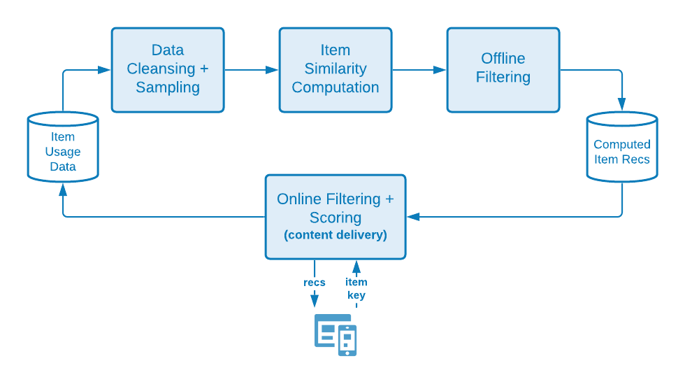

#  La ciencia detrás de los algoritmos de recomendaciones de Target

Una descripción detallada de los algoritmos utilizados en [!DNL Adobe Target Recommendations], incluidos la lógica y los detalles matemáticos de la formación del modelo y el proceso de servicio del modelo.

La formación del modelo es el proceso de generación de recomendaciones por parte de la variable [!DNL Adobe Target] algoritmos de aprendizaje. El servicio de modelos es cómo [!DNL Target] envía recomendaciones a los visitantes del sitio (también conocidos como entrega de contenido).

[!DNL Target] incluye los siguientes tipos amplios de algoritmos en [!DNL Recommendations]:

* **Algoritmos basados en elementos**: Incluya algoritmos que sigan la lógica &quot;Las personas que vieron/compraron este artículo también vieron/compraron estos artículos&quot;. Estos algoritmos se agrupan en el filtro colaborativo de términos generales de elemento, así como [!UICONTROL Elementos con atributos similares] algoritmos.

* **Algoritmos basados en el usuario**: Incluya la variable [!UICONTROL Vistos recientemente] y [!UICONTROL Recomendado para usted] algoritmos.

* **Algoritmos basados en popularidad**: Incluya algoritmos que devuelvan los artículos más vistos o comprados en todo el sitio web, o bien los más vistos o comprados por categoría o atributo de artículo.

* **Algoritmos basados en el carro de compras**: Incluya recomendaciones basadas en varios artículos con la lógica &quot;las personas que vieron/compraron estos artículos, también vieron/compraron esos artículos&quot;.

* **Criterios personalizados**: Incluir recomendaciones basadas en archivos personalizados cargados en [!DNL Target].

>[!NOTE]
>
>Para obtener información más general sobre cada tipo de algoritmo y los algoritmos individuales, consulte [Basar la recomendación en una clave de recomendación](/help/main/c-recommendations/c-algorithms/base-the-recommendation-on-a-recommendation-key.md).

Muchos de los algoritmos enumerados anteriormente se basan en la presencia de una o varias claves. Estas claves se utilizan para recuperar elementos similares en el momento de la entrega del contenido (cuando se realizan recomendaciones). Las claves especificadas por el cliente pueden incluir el artículo actual que alguien está viendo, el último artículo visto o comprado, el artículo más visto, la categoría actual o la categoría favorita para ese visitante. Otros algoritmos, como las recomendaciones basadas en el carro de compras o en el usuario, utilizan claves implícitas (que el cliente no puede configurar). Para obtener más información, consulte *Claves de recomendación*, en [Basar la recomendación en una clave de recomendación](/help/main/c-recommendations/c-algorithms/base-the-recommendation-on-a-recommendation-key.md#keys). Sin embargo, tenga en cuenta que estas claves son relevantes solo en el momento de entrega del modelo (entrega de contenido). Estas claves no afectan a la lógica del tiempo de formación &quot;sin conexión&quot; o del modelo.

Las siguientes secciones agrupan los algoritmos de una manera ligeramente diferente a los tipos de algoritmo descritos anteriormente. La siguiente agrupación se basa en la similitud de la lógica de formación del modelo.

## Filtrado colaborativo de elementos

Los algoritmos incluyen:

* [!UICONTROL Los usuarios que vieron esto, vieron aquello.]
* [!UICONTROL Los usuarios que vieron esto, compraron aquello.]
* [!UICONTROL Los usuarios que compraron esto, compraron aquello.]

Los algoritmos de recomendación de filtrado colaborativo de elementos se basan en la idea de que debe utilizar los patrones de comportamiento de muchos usuarios (por lo tanto, en colaboración) para proporcionar recomendaciones útiles para un elemento determinado (por ejemplo, filtrar el catálogo de posibles artículos que recomendar). Aunque hay muchos algoritmos diferentes que caen dentro del paraguas general de [filtrado colaborativo](https://en.wikipedia.org/wiki/Collaborative_filtering), estos algoritmos utilizan de forma universal las fuentes de datos de comportamiento como entradas. En [!DNL Target Recommendations], estas entradas son las vistas únicas y las compras de artículos por parte de los usuarios.

Para el algoritmo &quot;Otras personas que vieron/compraron este artículo también vieron/compraron estos artículos&quot;, el objetivo es calcular una similitud s (A,B) entre todos los pares de artículos. Para un elemento A determinado, las recomendaciones principales se ordenan según su similitud s(A,B).

Un ejemplo de semejante similitud es la aparición conjunta entre elementos: un recuento simple del número de usuarios que compraron ambos artículos. Aunque es intuitiva, tal métrica es ingenua en el sentido de que está sesgada a recomendar elementos populares. Por ejemplo, si en un supermercado la mayoría de las personas compran pan, el pan tendrá una incidencia alta con todos los artículos, pero no necesariamente es una buena recomendación. [!DNL Target] en su lugar, utiliza una métrica de similitud más sofisticada conocida como la relación de probabilidad de registro (LLR). Esta cantidad es grande cuando la probabilidad de que dos artículos, A y B, se coproduzcan es muy diferente a la probabilidad de que no ocurran. Para obtener información concreta, considere un caso de [!UICONTROL Los usuarios que vieron esto, compraron aquello.] algoritmo. La similitud LLR es grande cuando la probabilidad de que se haya adquirido B es *not* independientemente de si alguien ha visto A.

Por ejemplo, si

entonces no se recomienda el elemento B con el elemento A. Se proporcionan todos los detalles de este cálculo de similitud de relación de probabilidad de registro [en este PDF](/help/main/c-recommendations/c-algorithms/assets/log-likelihood-ratios-recommendation-algorithms.pdf).

El flujo lógico de la implementación real del algoritmo se muestra en el siguiente diagrama esquemático:

Los detalles de estos pasos son los siguientes:

* **Datos de entrada**: Datos de comportamiento, en forma de vistas y compras de visitantes recopiladas al [implementar Target](/help/main/c-recommendations/plan-implement.md#pass-behavioral) o [Adobe Analytics](/help/main/c-recommendations/c-algorithms/use-adobe-analytics-with-recommendations.md).

* **Formación del modelo**:

   * **Limpieza de datos y muestreo**: En el caso de los algoritmos con retrospectiva de N días, los datos de comportamiento se filtran primero para incluir solo esos N días de datos. A continuación, se aplican reglas de recopilación y exclusiones globales para eliminar cualquier elemento que no se deba recomendar. Por último, los visitantes que interactuaron con más de 1000 artículos tienen datos de uso muestreados a solo 1000 artículos.
   * **Cálculo de similitud de artículos**: Este es el paso de computación principal: calcular la similitud de la relación de probabilidad de registro entre todos los pares de elementos candidatos y clasificar pares de elementos por esta puntuación de similitud.
   * **Filtro sin conexión**: Por último, se aplican cualquier otro filtro dinámico aplicable (por ejemplo, exclusiones de categoría dinámicas). Después de este paso, las recomendaciones precalculadas se almacenan en la caché global para que estén disponibles para su uso.

* **Servicio de modelo**: El contenido de Recommendations se entrega desde [!DNL Target]&#39;s [red global &quot;Edge&quot;](/help/main/c-intro/how-target-works.md#concept_0AE2ED8E9DE64288A8B30FCBF1040934). Cuando las solicitudes de mbox se realizan en [!DNL Target] y se determina que el contenido de las recomendaciones debe enviarse a la página, la solicitud de [clave del elemento](/help/main/c-recommendations/c-algorithms/base-the-recommendation-on-a-recommendation-key.md#keys) para el algoritmo de recomendaciones, se analiza desde la solicitud o se busca desde el perfil del usuario y, a continuación, se utiliza para recuperar las recomendaciones calculadas en los pasos anteriores. Se aplican filtros dinámicos adicionales en este momento, antes de que [diseño](/help/main/c-recommendations/c-design-overview/create-design.md) se procesa.

## Similitud de contenido

Algoritmo incluido:

* [!UICONTROL Elementos con atributos similares]

En este tipo de algoritmo, se considera que dos elementos están relacionados si sus nombres y descripciones textuales son semánticamente similares. A diferencia de la mayoría de los algoritmos de recomendaciones en los que se deben utilizar fuentes de datos de comportamiento, los algoritmos de similitud de contenido utilizan metadatos de catálogos de productos para derivar la similitud entre elementos. [!DNL Target] por lo tanto, puede generar recomendaciones en los llamados escenarios de &quot;inicio en frío&quot;, en los que no se han recopilado datos de comportamiento (por ejemplo, al principio de un [!DNL Target] actividad).

Aunque los aspectos del servicio de modelos y la entrega de contenido de [!DNL Target]Los algoritmos de similitud de contenido de son idénticos a otros algoritmos basados en elementos, los pasos de formación del modelo son muy diferentes e implican una serie de pasos de procesamiento y preprocesamiento de lenguajes naturales, como se muestra en el diagrama siguiente. El núcleo del cálculo de similitud es el uso de la similitud de coseno de los vectores tf-idf modificados que representan cada elemento del catálogo.

Los detalles de estos pasos son los siguientes:

* **Datos de entrada**: Como se ha descrito anteriormente, este algoritmo se basa exclusivamente en los datos del catálogo (incorporados a [!DNL Target] a través de una [Fuente de catálogo, API de entidades o desde actualizaciones en la página](/help/main/c-recommendations/plan-implement.md#rec-catalog).

* **Formación del modelo**:

   * **Extracción de atributos**: Después de la aplicación de filtros estáticos normales, reglas de catálogo y exclusiones globales, este algoritmo extrae campos textuales relevantes del esquema de entidad. [!DNL Target] utiliza automáticamente los campos nombre, mensaje y categoría de los atributos de entidad e intenta extraer cualquier campo de cadena de los campos personalizados [atributos de entidad](/help/main/c-recommendations/c-products/entity-attributes.md). Este proceso se realiza asegurándose de que la mayoría de los valores de ese campo no se puedan analizar como un número, una fecha o un booleano.
   * **Eliminación de palabras clave y de palabras clave**: Para una coincidencia de similitudes de texto más precisa, es prudente eliminar las palabras &quot;stop&quot; muy comunes que no alteren significativamente el significado de un elemento (por ejemplo, &quot;was&quot;, &quot;is&quot;, &quot;and&quot;, etc.). Del mismo modo, la derivación se refiere al proceso de reducción de palabras con diferentes sufijos a su palabra raíz, que tiene un significado idéntico (por ejemplo, &quot;conectar&quot;, &quot;conectar&quot; y &quot;conexión&quot;, todos tienen la misma palabra raíz: &quot;connect&quot;). [!DNL Target] utiliza el tallo de bola de nieve. [!DNL Target] realiza primero la detección automática del idioma y puede detener la eliminación de palabras hasta en 50 idiomas y la derivación para 18 idiomas.
   * **Creación de n-gramas**: Después de los pasos anteriores, cada palabra se trata como un token. El proceso de combinación de secuencias contiguas de tokens en un único token se denomina creación de n-gramas. [!DNL Target]Los algoritmos de consideran hasta 2 gramos.
   * **cálculo de tf-idf**: El siguiente paso implica la creación de vectores tf-idf para reflejar la importancia relativa de los tokens en la descripción del elemento. Para cada token/término t en un elemento i, en un catálogo D con |D| elementos, el término frecuencia TF(t, i) se calcula primero (el número de veces que el término aparece en el elemento i), así como la frecuencia del documento DF(t, D). En esencia, el número de elementos en los que existe el token. La medida tf-idf es entonces

      

      [!DNL Target] utiliza Apache Spark *tf-idf* implementación de featurización, que en el capó coloca cada token en un espacio de 218 tokens. En este paso, el aumento y la combustión de atributos especificados por el cliente también se aplican ajustando las frecuencias de los términos en cada vector en función de la configuración especificada en la variable [criterios](/help/main/c-recommendations/c-algorithms/create-new-algorithm.md#similarity).

   * **Cálculo de similitud de artículos**: El cálculo de similitud del elemento final se realiza utilizando una similitud de coseno aproximada. Para dos artículos, *A* y *B*, con los vectores tA y tB, la similitud de coseno se define como:

      

      Para evitar una complejidad significativa en la computación de similitudes entre todos los elementos N x N, la variable *tf-idf* el vector se trunca para contener solo sus 500 entradas más grandes y, a continuación, calcular las similitudes de coseno entre los elementos que utilizan esta representación vectorial truncada. Este enfoque resulta más robusto para los cálculos de similitud vectorial dispersa, en comparación con otras técnicas de vecindad aproximada más cercana (ANN), como el hashing sensible a la localidad.

   * **Servicio de modelo**: Este proceso es idéntico al de las técnicas de filtrado colaborativo de elementos descritos en la sección anterior.

## Recomendaciones de varias claves

Los algoritmos incluyen:

* Recomendaciones basadas en el carro de compras
* [!UICONTROL Recomendado]

Las adiciones más recientes a [!DNL Target] grupo de algoritmos de recomendaciones [!UICONTROL Recomendado] y una serie de algoritmos de recomendaciones basadas en el carro de compras. Ambos tipos de algoritmos utilizan técnicas de filtrado colaborativas para formar recomendaciones individuales basadas en elementos. A continuación, en el momento del envío, varios elementos en el historial de navegación del usuario (para [!UICONTROL Recomendado]), o el carro de compras actual del usuario (para recomendaciones basadas en el carro de compras) se utilizan para recuperar estas recomendaciones basadas en artículos, que luego se combinan para formar la lista final de recomendaciones. Tenga en cuenta que existen muchos sabores de algoritmos de recomendación personalizados. La elección de un algoritmo con varias claves significa que las recomendaciones están disponibles inmediatamente después de que un visitante tenga algún historial de navegación y las recomendaciones se pueden actualizar para responder al comportamiento del visitante más reciente.

Estos algoritmos se basan en las técnicas de filtrado colaborativas básicas descritas en la sección de recomendaciones basadas en elementos, pero también incorporan el ajuste de hiperparámetros para determinar la métrica de similitud óptima entre elementos. El algoritmo realiza una división cronológica de los datos de comportamiento de cada usuario y forma los modelos de recomendación en los datos anteriores mientras intenta predecir los artículos que el usuario ve o compra más tarde. La métrica de similitud que produce la métrica óptima [Precisión media](https://en.wikipedia.org/wiki/Evaluation_measures_(information_retrieval)#Mean_average_precision) a continuación, se elige.

La lógica de los pasos de entrenamiento y puntuación del modelo se muestra en el siguiente diagrama:

Los detalles de estos pasos son los siguientes:

* **Datos de entrada**: Esto es idéntico a los métodos de filtrado colaborativo (CF) de elementos. [!UICONTROL Ambas Se Recomiendan Para Usted] y los algoritmos basados en el carro de compras utilizan datos de comportamiento, en forma de vistas y compras de usuarios recopiladas al [implementar Target](/help/main/c-recommendations/plan-implement.md#pass-behavioral) o [Adobe Analytics](/help/main/c-recommendations/c-algorithms/use-adobe-analytics-with-recommendations.md).

* **Formación del modelo**:

   * **Limpieza de datos y muestreo**: Esto es de nuevo lo mismo que para los métodos de filtrado colaborativos, donde la ventana retrospectiva se aplica para filtrar datos de comportamiento a un intervalo de fechas adecuado, seguido de la aplicación de reglas de catálogo y exclusiones globales. Los visitantes que han interactuado con más de 1000 elementos solo tienen en cuenta los 1000 usos más recientes.
   * **División de prueba del tren**: Realice una división cronológica de los usos para cada usuario, asignando el 80% de los primeros usos a los datos de capacitación, y el 20% restante se asigna a los datos de prueba.
   * **Formación del modelo de similitud de artículos**: El cálculo de similitud de elementos principales difiere para [!UICONTROL Recomendado] y algoritmos basados en el carro de compras de la forma en que se construyen los vectores de elementos candidatos. Para [!UICONTROL Recomendado], los vectores de elementos tienen usuarios de dimensión, donde cada entrada representa la suma de clasificaciones implícitas para ese usuario del elemento; a las compras de un elemento se les asigna un peso de dos veces superior al de las vistas del elemento. Para las recomendaciones basadas en el carro de compras, los vectores de artículos tienen entradas binarias; si el comportamiento dentro de la sesión debe considerarse solamente, hay una nueva entrada para cada sesión. De lo contrario, hay una entrada en este vector de elemento para cada visitante.

   El paso de formación calcula varios tipos de similitudes vectoriales: Similitud LLR ([discutido aquí](/help/main/c-recommendations/c-algorithms/assets/log-likelihood-ratios-recommendation-algorithms.pdf)), similitud de coseno (definida anteriormente) y similitud de L2 normalizada, definida como:

   

   * **Evaluación del modelo de similitud de artículos**: La evaluación del modelo se realiza tomando las recomendaciones generadas en el paso anterior y haciendo predicciones en el conjunto de datos de prueba. La fase de puntuación en línea se imita ordenando cronológicamente los usos de elementos de cada usuario en el conjunto de datos de prueba y, a continuación, haciendo 100 recomendaciones para subconjuntos ordenados de elementos en un intento de predecir vistas y compras posteriores. Una métrica de recuperación de información, la variable [Precisión media](https://en.wikipedia.org/wiki/Evaluation_measures_(information_retrieval)#Mean_average_precision), se utiliza para evaluar la calidad de estas recomendaciones. Esta métrica tiene en cuenta el orden de las recomendaciones y favorece a los elementos relevantes en una posición superior en la lista de recomendaciones, que es una propiedad importante para los sistemas de clasificación.
   * **Selección de modelo**: Después de la evaluación sin conexión, se selecciona el modelo que tiene la precisión media más alta y se calculan todas las recomendaciones de elementos individuales.
   * **Filtro sin conexión**: La etapa final de la formación del modelo es la aplicación de cualquier filtro dinámico aplicable. Después de este paso, las recomendaciones precalculadas se almacenan en la caché global para que estén disponibles para su uso.

* **Servicio de modelo**: A diferencia de los algoritmos anteriores en los que las recomendaciones de servicio implican especificar una sola clave para la recuperación, seguido de la aplicación de reglas comerciales, la variable [!UICONTROL Recomendado para usted] y los algoritmos basados en el carro de compras emplean un proceso de ejecución más complejo.

   * **Recuperación y combinación de varias claves**: Para las recomendaciones basadas en el carro de compras, hasta diez artículos que se pasan en el carro de compras se consideran claves para la recuperación y las recomendaciones de cada uno se ponderan de manera equitativa. Para [!UICONTROL Recomendado para usted], hasta los últimos cinco artículos vistos únicos y los últimos cinco artículos comprados únicos se consideran claves para la recuperación, y las recomendaciones que surgen de artículos comprados se ponderan el doble que las recomendaciones que surgen de artículos vistos. Al combinar recomendaciones, si un elemento aparece en varias listas individuales de recomendaciones, se agregan sus puntuaciones de similitud ponderadas. La lista final de recomendaciones de esta etapa es la lista combinada de recomendaciones ponderadas de nuevo, clasificadas en orden descendente.
   * **Filtrado**: A continuación, se aplican reglas de filtrado como la eliminación de elementos vistos o comprados anteriormente, así como otras reglas comerciales dinámicas.

Estos procesos se ilustran en la imagen siguiente, donde un visitante ha visto el artículo A y comprado el artículo B. Las recomendaciones individuales se recuperan con las puntuaciones de similitud sin conexión que se muestran debajo de cada etiqueta de artículo. Después de la recuperación, las recomendaciones se combinan con puntuaciones de similitud ponderadas sumadas. Por último, en un escenario en el que el cliente ha especificado que los artículos vistos y comprados anteriormente deben filtrarse, el paso de filtrado elimina los artículos A y B de la lista de recomendaciones.

## Basado en popularidad

Los algoritmos incluyen:

* [!UICONTROL Más visitados en todo el sitio]
* [!UICONTROL Más visitados por categoría]
* [!UICONTROL Más visitados por atributo de artículo]
* [!UICONTROL Principales vendedores del sitio]
* [!UICONTROL Principales vendedores por categoría]
* [!UICONTROL Principales vendedores por atributo de artículo]

[!DNL Target] proporciona algoritmos basados en popularidad tanto para los artículos más vistos como para los artículos más vendidos en un sitio web, o bien desglosados por un atributo o categoría de artículo. Los algoritmos basados en popularidad clasifican los elementos en función del número de sesiones en las que el artículo se vio o compró en un intervalo de tiempo determinado.

Todos estos algoritmos combinan datos de comportamiento agregados en los que el número total de sesiones en las que se vieron y compraron artículos se registra en las resoluciones por hora y por día. A continuación, los algoritmos individuales encuentran los artículos más vistos o comprados para la ventana retrospectiva configurada por el cliente.

Los matices de algoritmo individuales son los siguientes:

* [!UICONTROL Más visitados en todo el sitio] y [!UICONTROL Principales vendedores del sitio] clasifique los elementos por los recuentos agregados de sesiones en las que estos artículos se vieron o compraron respectivamente. El resultado es una lista única (sin clave) de artículos recomendados.
* La mayoría de los vendedores/principales por categoría/atributo de artículo son recomendaciones en las que los artículos se ordenan según los recuentos agregados de sesiones en las que se vieron o compraron estos artículos, pero se agrupan por categoría de artículo o atributo de artículo específico. Los resultados son listas de artículos recomendados, claves por valores de categorías o valores de atributos de artículos.

## Vistos recientemente

El algoritmo de recomendaciones &quot;vistas recientemente&quot; permite la personalización de recomendaciones durante la sesión. Este algoritmo no requiere &quot;formación de modelos&quot; sin conexión. En su lugar, [!DNL Target] utiliza la variable única [Perfil del visitante](/help/main/c-target/c-visitor-profile/visitor-profile.md) para mantener una lista en ejecución de los artículos que se han visto en una sesión determinada y que pueden aparecer en las actividades de recommendations. Esto permite realizar actualizaciones en tiempo real de las recomendaciones y la personalización de la página siguiente.

## Criterios personalizados

Los criterios personalizados permiten a los clientes [cargar sus propias recomendaciones a [!DNL Target]](/help/main/c-recommendations/c-algorithms/recommendations-csv.md), lo que proporciona una flexibilidad importante y permite capacidades de &quot;traer su propio modelo&quot;. Los criterios personalizados sustituyen la parte &quot;formación sin conexión&quot; de [!UICONTROL Basado en elementos] recomendaciones, pero se comportan de manera similar a los algoritmos de recomendaciones basadas en elementos durante la fase de entrega de contenido en línea, ya que se utiliza una sola clave para recuperar recomendaciones y luego se aplican reglas o filtros comerciales.
