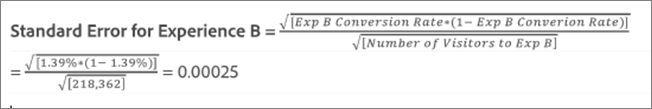

# Alza promedio, límites de alza e intervalo de confianza

Los informes incluyen varios puntos de datos y representaciones de visualización que le ayudarán a comprender los límites de alza y el nivel de confianza asociados con su actividad de [!DNL Adobe Target] para que pueda determinar un ganador con mayor precisión.

>[!NOTE]
>
>Esta característica solo está disponible cuando se visualizan informes en la vista [!UICONTROL Table]. Esta característica no está disponible para actividades que utilicen [Analytics como fuente de informes (A4T)](/help/main/c-integrating-target-with-mac/a4t/a4t.md#concept_7540C8C04259434AB6EE33B09F47A1DE).

## Interpretación de los datos {#section_62C0D7E76F3D49A7B3C371C82AEF27D5}

La siguiente ilustración muestra información de [!UICONTROL Lift Bounds and Confidence Level]:

La información de alza y confianza en la interfaz de usuario de informes [!DNL Target] incluye:

### Alza

El gran número y la flecha reflejan el valor esperado del alza. Este número es el punto medio del rango de los límites de aumento. La flecha de aumento esperada se muestra en gris hasta que la confianza pasa el 95 %. Después de este umbral, la flecha se muestra en rojo o verde en función del aumento negativo o positivo, respectivamente.

### Límites de alza

Este es el intervalo de confianza del 95 % del alza. Se muestra como un rango por debajo del alza promedio. Consulte [Cálculo de ejemplo](#example) a continuación para ver un ejemplo de cómo se calculan estos límites de alza.

### Gráfico de diagramas de cajas

El gráfico de gráfico de cuadro de la interfaz [!DNL Target] representa el valor esperado y el intervalo de confianza del 95 % de la métrica de éxito en cuestión. Piense en ello como una forma gráfica de ver la información de aumento y los límites de aumento.

Hay algunas formas clave en las que [!DNL Target] le ayuda a interpretar la información de confianza, una de las cuales es el color. El gráfico muestra cualquier superposición en el intervalo de confianza de una experiencia específica con el intervalo de confianza del control en gris y cualquier rango de intervalo de confianza de una experiencia específica que esté por encima o por debajo del intervalo de confianza de control como el verde o el rojo, respectivamente.

La longitud de la barra del gráfico del cuadro representa cómo de grande es el intervalo de confianza de una manera fácil de entender. A medida que recoge más datos en su actividad, la barra se mueve y cambia. El intervalo de confianza se deriva de la varianza y el tamaño de la muestra (cantidad de visitantes). Cuanto menor sea la varianza y cuanto mayor sea el tamaño de la muestra, más limitado será el intervalo de confianza.

### Confianza

La confianza de una experiencia u oferta mostrada es una probabilidad (expresada como porcentaje) de obtener un resultado _menos extremo_ que el que se observa realmente, _si la hipótesis nula es verdadera_, es decir, si no hay diferencia en las tasas de conversión entre esa experiencia u oferta y la experiencia/oferta de control. En términos de valores p, esta confianza mostrada es `1 - p-value`. Dicho de forma más sencilla, una mayor confianza indica que los datos son menos coherentes con el supuesto de que la oferta/experiencia de control y la que no es de control tienen tasas de conversión iguales.

## Comprender cómo se determina el intervalo de confianza para el alza {#pdf}

Descargue el [intervalo de confianza para el alza](/help/main/assets/confidence_interval_lift.pdf) para obtener más información.

## ¿Cómo se calculan los límites de alza? {#section_1D360781D972483693680BE0F07AEAD1}

Los límites de elevación representan los intervalos de confianza del 95 % del aumento que tiene la experiencia u oferta específica sobre la experiencia u oferta de control. En términos generales, significa que el aumento real tiene aproximadamente un 95 % de posibilidades de estar entre estos límites.

Los límites de alza se calculan con la siguiente fórmula:

Hay algunos cálculos adicionales para llegar a la entrada de nuestros límites de alza:

* **valor t:** La estadística crítica para nuestro nivel de confianza del 95 % es 1,96. Puede obtener más información sobre [valores t aquí](https://en.wikipedia.org/wiki/T-statistic).
* **Varianza de alza:** el error estándar de la métrica de éxito de la experiencia N y el error estándar de la métrica de éxito de la experiencia de control son necesarios para determinar la varianza de aumento, que se calcula con la siguiente fórmula (ilustrada en el caso de que la métrica de éxito sea conversión).

  

* **Error estándar de métrica de porcentaje de conversión/éxito:** el error estándar se calcula de la misma manera para la experiencia N y de control, utilizando la siguiente fórmula (ilustrada en el caso de que la métrica de éxito sea la conversión). Puede obtener [más información sobre el error estándar aquí](https://en.wikipedia.org/wiki/Standard_error).

  

  >[!NOTE]
  >
  >El error estándar para las actividades de métricas de éxito de ingresos se basa en la variación de muestra de los ingresos.

## Ejemplo de cálculo {#example}

Consideremos una actividad de ejemplo con dos experiencias y los siguientes resultados:

| Experiencia | Visitantes | Conversiones | Tasa de conversión |
|--- |--- |--- |--- |
| Experiencia A (Control) | 219 328 | 2466 | 1,12 % |
| Experiencia B | 218 362 | 3040 | 1,39 % |

De acuerdo con nuestras fórmulas, podemos calcular las entradas que necesitamos para los límites de alza.

**Error estándar para la experiencia A (control)**

**Error estándar para la experiencia B**

**Varianza del alza para la experiencia B**

**Límites del alza para la experiencia B**

Alza esperada para la experiencia B:

Por lo tanto, los límites de alza para la Experiencia B serían:

>[!NOTE]
>
>Espere variaciones menores entre los cálculos manuales utilizando las fórmulas mencionadas anteriormente y los números mostrados en el informe. La diferencia se puede atribuir al hecho de que los números de las vistas de página utilizados en los cálculos manuales están redondeados. El alza que se muestra en el informe [!DNL Target] se basa en las cifras exactas obtenidas de la participación total y el recuento de participación. Los números de participación se pueden obtener a través de la API de informe de rendimiento.

## ¿Cuándo no se muestran los límites de alza? {#section_C5622E1E94684DAD937249B51A9E42CC}

En algunos casos, [!DNL Target] no muestra los límites de alza:

* Para cualquier actividad, cuando el número total de visitas o visitantes es menor a 30.
* Para las actividades [!UICONTROL Auto-Allocate], no se muestran límites de alza hasta que una experiencia haya alcanzado el 60% de confianza.
