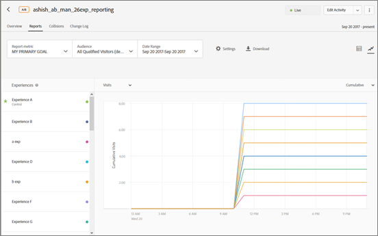

# Configuración de informes

Información para configurar los elementos que desea que aparezcan en el informe en [!DNL Adobe Target]. Las opciones de configuración de los informes se pueden guardar para usarlas posteriormente.

Para mostrar un informe:

1. Haga clic en **[!UICONTROL Actividades]** y luego en una actividad de la lista.
1. Haga clic en la pestaña **[!UICONTROL Informes]**.

   

## Ajuste preestablecido de Target {#section_51F67341465045BEB4F1A2FB638A8EB1}

Puede guardar hasta diez ajustes preestablecidos de un informe de actividad después de configurarlo a su gusto (métricas, intervalos de fechas, audiencias, configuración avanzada, etcétera). Todo [!DNL Target] los usuarios pueden mostrar, editar y eliminar los distintos ajustes preestablecidos, independientemente de quién los haya creado.

También puede configurar un informe de actividad a su gusto y después guardar dicha configuración como su ajuste preestablecido predeterminado/favorito. Esta es la vista que se muestra cuando ve avanzar el informe de la actividad.

### Crear un ajuste preestablecido o un ajuste preestablecido predeterminado

1. Configure el informe de actividad como desee.

   A continuación se explica la configuración disponible, que incluye métricas, intervalos de fechas, audiencias, configuración avanzada, etc.

1. Junto a **[!UICONTROL Ajuste preestablecido de Target]**, haga clic en el icono de tres elipses verticales > **[!UICONTROL Guardar como Nuevo]**.

   

   Se muestra el cuadro de diálogo Nuevo ajuste preestablecido:

   

1. Revise la información de la sección **[!UICONTROL Filtros]** y **[!UICONTROL Configuración]** para asegurarse de que el informe esté configurado como desee y, a continuación, especifique la **[!UICONTROL Nombre de ajuste preestablecido]** (hasta 50 caracteres).
1. (Condicional) Si desea que esta sea su vista de informe predeterminada/favorito, deslice la **[!UICONTROL Establecer como ajuste preestablecido predeterminado]** cambie a la posición Activado.
1. Haga clic en **[!UICONTROL Guardar]**.

### Seleccionar un ajuste preestablecido diferente

Seleccione el ajuste preestablecido que desee en la lista desplegable **[!UICONTROL Ajuste preestablecido de Target]**.

### Editar un ajuste preestablecido

1. Seleccione el ajuste preestablecido que desee editar.
1. Edite la configuración del informe a su gusto (métricas, intervalos de fechas, audiencias, configuración avanzada, etc.).

   Después de hacer clic en [!UICONTROL Guardar] después de editar la configuración del informe, aparece un asterisco ( &#42; ) aparece después del nombre del ajuste preestablecido para indicar que ha cambiado, como se muestra a continuación:

   

1. Haga clic en el icono de tres elipses verticales > **[!UICONTROL Guardar como Nuevo]** para crear un ajuste preestablecido nuevo.

   O

   Haga clic en el icono de tres elipses verticales > **[!UICONTROL Actualizar]** para actualizar el ajuste preestablecido actual.

   

### Eliminar un ajuste preestablecido

1. Seleccione el ajuste preestablecido que desee eliminar.
1. Haga clic en el icono de tres elipses verticales > **[!UICONTROL Eliminar]**.

   

1. Haga clic en **[!UICONTROL Eliminar]** para confirmar la eliminación (los ajustes preestablecidos eliminados no se pueden recuperar).

### Gestión de errores de ajustes preestablecidos

Si un ajuste preestablecido deja de ser válido, se indica mediante avisos y mensajes dentro de los informes. El aviso o mensaje le indica que elija otra audiencia, métrica, grupo de hosts o experiencia para crear un ajuste preestablecido válido.

La lista siguiente describe algunas de las situaciones que pueden provocar que un ajuste preestablecido deje de ser válido:

* Se elimina una audiencia de informes de la actividad, pero la definición del ajuste preestablecido sigue haciendo referencia a ella.
* Se eliminan una o más métricas, pero la definición del ajuste preestablecido sigue haciendo referencia a ellas. Por ejemplo, podría eliminar una o más métricas de la actividad y, después, agregar nuevas métricas.
* Uno o más grupos de hosts (entorno) no existen, pero la definición del ajuste preestablecido hace referencia a ellos.
* Se eliminan una o más experiencias tras la creación del ajuste preestablecido, pero la definición del ajuste sigue haciendo referencia a ellas.
* Un ajuste preestablecido no es semánticamente válido porque algunas entidades referidas siguen existiendo, pero se han actualizado de un modo que la definición del ajuste preestablecido ha cambiado semánticamente. Por ejemplo, suponga que creó un ajuste preestablecido denominado “Ingresos en Chrome”. Posteriormente actualizó la actividad para medir la métrica Conversión en vez de Ingresos. Esta actualización de la definición de la actividad invalida semánticamente la definición del ajuste preestablecido.

## Métrica de informes {#section_894ABD7148244806B7CE556EBBA2AD62}

Haga clic en la lista desplegable **[!UICONTROL Métrica de informes]** para seleccionar una [métrica de éxito](/help/main/c-activities/r-success-metrics/success-metrics.md#reference_D011575C85DA48E989A244593D9B9924) diferente o varias métricas que se mostrarán en los gráficos y diagramas.

De manera predeterminada, la métrica principal se determina al configurar las métricas de éxito al crear la actividad. Si cambia la configuración y vuelve a guardar la actividad, se actualizará la métrica principal para informes.

Para obtener más información acerca de la selección de varias métricas que se deben visualizar en los informes, consulte  [Visualización de varias métricas en un informe](/help/main/c-reports/c-report-settings/view-multiple-metrics.md#concept_9E3C3F6F3EC1412FAF252975AC0720B7).

## Audiencia {#section_70926EB4618945D9AFF2B0564FF3717B}

Haga clic en la lista desplegable [!UICONTROL Audiencia] para cambiar la audiencia mostrada en el informe.

Para obtener más información, consulte [Audiences](/help/main/c-target/target.md#concept_A782F8481A5041EBA75103CB26376522).

## Intervalo de fechas {#section_A410A768403C4E01891F95CB357E63ED}

El cuadro Intervalo de fechas muestra el intervalo de fechas actual del informe. Si hace clic en el icono desplegable, aparece un calendario que le permite cambiar el intervalo de fechas del informe.

Seleccione las nuevas fechas **[!UICONTROL inicial]** y **[!UICONTROL final]** del informe. También puede usar la variable **[!UICONTROL Desde el inicio de la actividad]** y **[!UICONTROL Finalización de la actividad]** casillas de verificación.

Haga clic **[!UICONTROL Fechas personalizadas]** para seleccionar intervalos de fecha predefinidos: Últimos 7 días, Últimos 15 días o Últimos 30 días. Estos intervalos de fechas predefinidos se pueden extender. Si la fecha inicial es menor que el número de días elegido, el calendario mostrará el intervalo a partir de la ficha inicial, pero se extenderá una vez que la fecha inicial sea anterior al número de días elegido a medida que se incremente la duración de la actividad.

Los informes tienen las siguientes restricciones de fechas:

* La fecha de inicio del informe debe estar entre los dos últimos años.
* Los informes de grupos de ofertas están limitados a 99 días a partir de la fecha actual.
* Los informes por horas tienen un límite de 15 días.

## Configuración {#section_D99CE462107D45CABE0960F820E1E972}

Para configurar las opciones del informe:

1. Haga clic en el icono del engranaje y realice los cambios que desee (como se explica más abajo).
1. Haga clic en **[!UICONTROL Guardar]** cuando termine.

La siguiente ilustración muestra el cuadro de diálogo Configuración para una actividad A/B:

Las opciones dependen del tipo de actividad que se seleccione:

### Metodología de contabilización

Seleccione la metodología deseada:

* Visitantes
* Visitas
* Impresiones de actividad

### Control

seleccione la experiencia de control que quiere usar para calcular y comparar alzas.

### Entorno {#environment}

Seleccione el entorno (grupo de hosts) que se usará para el informe. Para obtener más información, consulte [Hosts](/help/main/administrating-target/hosts.md#concept_516BB01EBFBD4449AB03940D31AEB66E).

>[!NOTE]
>
>Si su organización está utilizando [Adobe Experience Platform](https://experienceleague.adobe.com/docs/experience-platform/landing/home.html){target=_blank} (AEP) para enviar datos de métricas a [!DNL Target], el entorno del almacén de datos de AEP debe coincidir con el entorno del [!DNL Target] configuración del informe.

### Restablecer datos del informe

Restablezca los datos del informe para eliminar los datos antiguos. Los visitantes actuales permanecerán en la actividad.  Esta opción solo está disponible para aquellos que tengan [!UICONTROL Aprobador] permisos.

>[!IMPORTANT]
>
>Esta es una acción permanente y no se puede deshacer.

### Excluir valores extremos

La variable [!UICONTROL Excluir valores extremos] esta opción solo se aplica a las actividades con tipos de métrica de ingresos y participación. Para obtener más información, consulte [Exclusión de pedidos extremos](/help/main/c-reports/c-report-settings/excluding-extreme-orders.md#task_2AE7743FFCDD466DAEEB720BE5F33DAA).

## Descargar   {#section_77E65C50BAAF4AB79242DB3A8778ADEF}

Haga clic en el **[!UICONTROL Descargar]** para descargar datos de informes en un [!DNL .csv] para una importación rápida en Excel, Access u otros programas de análisis de datos.

Para obtener más información, consulte [Descarga de datos en un archivo CSV](/help/main/c-reports/c-report-settings/downloading-data-in-csv-file.md).

## Actualizar {#section_E203729F2F314DF3856D2EE67C60B370}

Haga clic en el **[!UICONTROL Actualizar]** para actualizar la tabla y la visualización de gráfico de un informe sin necesidad de actualizar toda la página, su configuración o su intervalo de fechas.

## Más opciones {#section_AB1B5C695D7045A0A0AC0E2698D2E7DE}

Haga clic en el icono de Más opciones (tres elipses verticales) para acceder a las opciones [!UICONTROL Editar actividad] y [!UICONTROL Ver las URL de la experiencia].

## Ver opciones

Puede ver el informe en varios formatos, según el tipo de actividad. Seleccione una opción.

* **Vista de tabla**: Haga clic en el **[!UICONTROL Vista de tabla]** para ver el informe como una tabla.
* **Visualización de gráfico**: Haga clic en el **[!UICONTROL Visualización de gráfico]** para ver el informe como un gráfico.
* **Segmentos automatizados**:(Disponible solo para actividades de Automated Personalization (AP) y Segmentación automática (AT)). Haga clic en **[!UICONTROL Segmentos automatizados] para ver el [Informe Segmentos automatizados](/help/main/c-reports/c-personalization-insights-reports/automated-segments-report.md).
* **Atributos importantes**: (Disponible solo para actividades de Automated Personalization (AP) y Segmentación automática (AT)). Haga clic en **[!UICONTROL Atributos importantes] para ver el [Informe Atributos importantes](/help/main/c-reports/c-personalization-insights-reports/important-attributes-report.md).

## Alza promedio, límites de alza e intervalo de confianza {#section_0D87615B1D3344B3858BA494EEBC16FB}

Los informes incluyen varios puntos de datos y representaciones de visualización que comprenden los límites de la elevación y el nivel de confianza asociado a su actividad. Esto le ayuda a determinar un ganador con mayor precisión.

Para obtener más información, consulte [Cálculos estadísticos en Pruebas A/Bn](/help/main/c-reports/statistical-methodology/statistical-calculations.md).

Tenga en cuenta lo siguiente:

* Solo disponible al ver informes en la vista Tabla.
* Esta característica no está disponible para actividades que utilicen [Analytics como fuente de informes (A4T)](/help/main/c-integrating-target-with-mac/a4t/a4t.md).

## Contribución de ubicación.  {#section_5832F126AC114AE1ABFFF4D9B904393B}

Haga clic en el icono de **[!UICONTROL Contribución de ubicación]** para que el informe muestre la contribución por ubicación.

## Experiencias {#section_3A450DE1FA7E43F0AAB73165EC3D1C34}

(solo disponible al visualizar el informe en Visualización de gráfico)

Seleccione o anule la selección de las experiencias en la parte izquierda de la tabla para mostrar u ocultar las experiencias correspondientes.

En la siguiente ilustración, vemos que en el informe solo aparecen las experiencias Predeterminada, Oriente medio y Total. La experiencia de Asia está oculta en el gráfico.

## Media móvil {#section_59066693158C4433B87D07402C2BC6CD}

(solo disponible al visualizar el informe en Visualización de gráfico)

&quot;Media móvil&quot; refleja las conversiones acumulativas (desde el inicio de la ventana de informes hasta la fecha representada en el gráfico) divididas por los visitantes acumulados.

Seleccione la visualización de gráfico que desee:

* Media móvil
* Alza media móvil
* Diario
* Alza diaria

El nombre de esta lista desplegable varía en función de la vista seleccionada, pero será una de las vistas enumeradas arriba.

## Metodología de contabilización {#section_01B0ED5665C74AE1AE97259800190C3E}

(solo disponible al visualizar el informe en Visualización de gráfico)

Puede elegir la metodología de contabilización para los gráficos de los informes. Tenga en cuenta que esto no es compatible con [!UICONTROL Automated Personalization] (AP).

Para acceder a la [!UICONTROL Metodología de contabilización] , mientras visualiza un informe en modo gráfico, haga clic en la opción **[!UICONTROL Mi objetivo principal]** lista desplegable y, a continuación, seleccione la metodología de recuento.

La metodología de contabilización será la misma que se seleccionó en el cuadro de diálogo [!UICONTROL Ajustes] descrito anteriormente.

De forma predeterminada, el gráfico se representa en modo [!UICONTROL Diario].

Para cambiar el modo, haga clic en el botón [!UICONTROL Diario] lista desplegable y, a continuación, seleccione una opción acumulativa.

>[!NOTE]
>
>El nombre de esta lista desplegable varía según el modo seleccionado.

Existen cuatro modos para las actividades de segmentación automática: Control diario, A diario con segmentación, Control acumulativo y Acumulativo segmentado.

El orden predeterminado de representación del gráfico es el siguiente:

* **Pruebas A/B (incluidas la asignación automática y Automated Personalization)**: Orden de creación de la experiencia, en orden descendente.
* **Segmentación de experiencias (XT)**: Orden de las experiencias en la actividad.
* **Prueba multivariable (MVT)**: Alfabético por nombre de experiencia.
* **Recommendations**: Orden de creación de la experiencia, en orden descendente.

Al trabajar con las opciones de Metodología de contabilización, tenga en cuenta las siguientes advertencias:

* Para [Actividades de segmentación automática](/help/main/c-activities/auto-target/auto-target-to-optimize.md), no hay opción para seleccionar &quot;Visitantes&quot; como metodología de recuento. El tipo de actividad Segmentación automática es el único que no se puede representar por visitantes.
* Para actividades que usan [Analytics como fuente de informes (A4T)](/help/main/c-integrating-target-with-mac/a4t/a4t.md), no puede trazar visitantes, visitas o impresiones de forma acumulativa.

## Trabajo con gráficos que tienen más de 16 experiencias en la actividad

Si una actividad tiene menos de 16 experiencias, cada una se representa en el gráfico con un color distinto.

Si una actividad tiene más de 16 experiencias, en el gráfico se muestran las líneas coloreadas para las 16 primeras. Las demás aparecen atenuadas en el panel Experiencias del lado izquierdo y sus líneas correspondientes no se representan en el gráfico. No pueden mostrarse más de 16 experiencias al mismo tiempo.

Si pasa el cursor sobre cualquiera de las experiencias en gris, en el gráfico se muestra temporalmente su correspondiente nueva línea de diagrama gris. Para representar en color la línea de diagrama de una experiencia en gris, puede anular la selección de una de las experiencias que se muestran en color haciendo clic en su nombre y, a continuación, haciendo clic en el nombre de la experiencia en gris deseada.

A modo de ejemplo, la siguiente ilustración muestra un gráfico de actividad con 26 experiencias:

En el gráfico se representan las líneas de las 16 primeras experiencias (algunas se solapan, por lo que parece que hay menos de 16 líneas). El punto de color del panel Experiencias, situado la izquierda junto a cada nombre de experiencia, indica que la línea de diagrama de la experiencia se muestra en su color correspondiente.

Si se desplaza hacia abajo en el panel Experiencias, verá que los nombres de los puestos 17.º a 26.º aparecen atenuados, como se ven en esta ilustración:

Si pasa el cursor sobre una de las experiencias en gris, en el gráfico se muestra temporalmente su correspondiente nueva línea de diagrama gris.

Suponga que quiere mostrar la línea de diagrama de la Experiencia R pero no quiere ver la de la Experiencia P. Puede hacer clic en el nombre de la Experiencia P para anular su selección y, a continuación, hacer clic en el nombre de la Experiencia R para seleccionarla, como se muestra a continuación:

