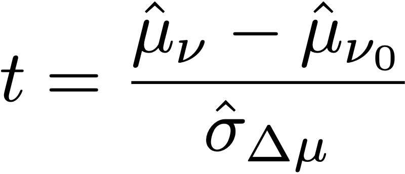

# Cálculos estadísticos en pruebas A/Bn

Este artículo documenta los cálculos estadísticos detallados utilizados en las pruebas A/Bn manuales en [!DNL Adobe Target]. Las definiciones están previstas para [!UICONTROL Tasa de conversión], [!UICONTROL Intervalo de confianza de la tasa de conversión], [!UICONTROL Alza], [!UICONTROL Intervalo de confianza para el alza]y [!UICONTROL Confianza].

>[!NOTE]
>
>La información de este artículo sustituye al *Cálculos de Adobe Target para pruebas A/B* archivo pdf que anteriormente estaba disponible para su descarga en este sitio.

![Informe de Target que muestra la variable [!UICONTROL Tasa de conversión], [!UICONTROL Intervalo de alza y confianza promedio]y [!UICONTROL Confianza] de una actividad de prueba A/B.](/help/main/c-reports/statistical-methodology/img/target_report.png)

## Rendimiento medio

En la siguiente sección se explican los cálculos utilizados en la ilustración anterior.

### Tasa de conversión e ingresos por campaña de visitante (RPV)

La siguiente ilustración muestra [!UICONTROL Tasa de conversión], [!UICONTROL Intervalo de confianza de la tasa de conversión]y el número de [!UICONTROL Conversiones] en un [!DNL Target] informe. Por ejemplo, la primera línea muestra que para la Experiencia A: el [!UICONTROL Tasa de conversión] es 25,81% con un [!UICONTROL Intervalo de confianza] de ±7,7% y 32 conversiones se registraron. Dado que 124 visitantes vieron la experiencia, esto equivale a 32/124 = 25,81%.

<p style="text-align:center;"></p>

La tasa de conversión o **medium**, *μ<sub>ν</sub>*, para cada experiencia *ν* en un experimento se define como una proporción de la suma de la métrica con respecto al número de unidades asignadas a esa métrica, *N<sub>ν</sub>*:

<p style="text-align:center;"></p>

Aquí,

* *Y<sub>iν</sub>* es el valor de la métrica para cada unidad *i*, que se ha asignado a una experiencia determinada *ν*.

* La suma sobre unidades *i* depende de la elección de la metodología de contabilización.

   * If *[!UICONTROL Visitantes]* se utiliza como metodología de contabilización, cada unidad es un visitante único definido como un participante único en la actividad durante toda la actividad.
   * If *[!UICONTROL Visitas]* se utiliza como metodología de contabilización, cada unidad es una visita única definida como un participante único en una experiencia durante un [!DNL Target] sesión (con una `sessionId`). Cuando la variable `sessionId` cambia, o si el visitante llega al paso de conversión, se cuenta una nueva visita.
   * If *[!UICONTROL Impresiones de actividad]* se utiliza como metodología de contabilización, cada unidad es una impresión única definida como cada vez que un visitante carga una página de la actividad.

## [!UICONTROL Intervalo de confianza de la media]/[!UICONTROL Tasa de conversión]

El intervalo de confianza de la tasa de conversión se define de forma intuitiva como un intervalo de tasas de conversión posibles que sea coherente con los datos subyacentes.

Al ejecutar experimentos, la tasa de conversión de una experiencia determinada es de *estimación* de la tasa de conversión &quot;true&quot;. Para cuantificar la incertidumbre de esta estimación, [!DNL Target] utiliza un intervalo de confianza. [!DNL Target] siempre informa de un intervalo de confianza del 95 %, lo que significa que al final, el 95 % de los intervalos de confianza calculados incluyen la tasa de conversión verdadera de la experiencia.

Un intervalo de confianza del 95 % de la tasa de conversión *μ<sub>ν</sub>* se define como el rango de valores:

<p style="text-align:center;"></p>

Donde el error estándar de la media se define como

<p style="text-align:center;"></p>

Cuando se utilice una estimación imparcial de la desviación estándar de la muestra:

<p style="text-align:center;"></p>

Cuando la campaña es una campaña de tasa de conversión (es decir, la métrica de conversión es binaria), el error estándar se reduce a:

<p style="text-align:center;"></p>

## Alza

La siguiente ilustración muestra [!UICONTROL Alza] y [!UICONTROL Intervalo de confianza del alza] en un [!DNL Target] Informe. El número representa el promedio del rango de los límites de alza y la flecha refleja si el alza es positiva o negativa. La flecha aparece en gris hasta que la confianza pasa el 95 %. Una vez que la confianza supera el umbral, la flecha es verde o roja, en función de un alza positiva o negativa.

<p style="text-align:center;"></p>

El alza entre una experiencia  *ν* y la experiencia de control *ν<sub>0</sub>* es el &quot;delta&quot; relativo en las tasas de conversión, definido como

<p style="text-align:center;"></p>

Donde las tasas de conversión individuales son las definidas anteriormente. Más simplemente,

```
Lift(Experience N) = (Performance_Experience_N - Performance_Control)/ Performance_Control
```

Si la tasa de conversión de la experiencia de control *ν<sub>0</sub>* es 0, no hay ascensor.

## [!DNL Confidence Interval of Lift]

El gráfico de boxplot en la [!UICONTROL Intervalo de alza y confianza promedio] representa el valor promedio y 95% [!UICONTROL Intervalo de confianza del alza]. El gráfico del cuadro aparece en gris cuando hay alguna superposición en el intervalo de confianza de una experiencia no de control determinada con el intervalo de confianza de la experiencia de control. El gráfico del cuadro aparece en verde o rojo cuando el intervalo de confianza de una experiencia determinada está por encima o por debajo del intervalo de confianza de la experiencia de control.

El error estándar del alza entre una experiencia  *ν* y la experiencia de control  *ν<sub>0</sub>* se define como:

<p style="text-align:center;"></p>

A continuación, el intervalo de confianza del 95 % del alza es:

<p style="text-align:center;"></p>

Este cálculo utiliza el método &quot;Delta&quot; y se describe [en más detalle en este documento](/help/main/assets/confidence_interval_lift.pdf)

## [!UICONTROL Confianza]

La última columna muestra la confianza en un [!DNL Target] informe. La confianza de una experiencia es una probabilidad (indicada como porcentaje) de obtener un resultado menos extremo que el observado, dado que la hipótesis nula es verdadera. En términos de valores p, la confianza mostrada es *1 - valor p*. Intuitivamente, una mayor confianza implica que es menos probable que la experiencia de control y de no control tenga tasas de conversión iguales.

En [!DNL Target], un **Prueba T de Welch** se realiza entre la experiencia de prueba y la experiencia de control para comprobar si los medios de las experiencias de prueba y control son los mismos. Debido a que normalmente no sabemos si los tamaños de muestra y las variaciones de dos grupos son los mismos antes de ejecutar el experimento, y [!DNL Target] también le permite que se envíen porcentajes desiguales de tráfico a cada experiencia. no suponemos que la varianza de cada experiencia sea igual. Por lo tanto, se elige la prueba T de Welch en lugar de la prueba T de estudiante.

Para realizar la prueba T de Welch, primero empezamos a calcular la estadística t y los grados de libertad y luego ejecutamos una prueba T bidireccional para generar el valor p. Finalmente, calculamos la confianza en función del valor p.

La variable *t*-estadística se define como la diferencia de los medios de dos variables aleatorias independientes, *ν* y *ν<sub>0</sub>*, dividido por el error estándar de la diferencia:

<p style="text-align:center;"></p>

Donde *μ<sub>v</sub>* y *μ<sub>v0</sub>* son los medios de *ν*  y *ν<sub>0</sub>* respectivamente, y el error estándar de la diferencia entre *μ<sub>v</sub>* y *μ<sub>v0</sub>* están dadas por:

<p style="text-align:center;"></p>

Donde *σ<sup>2</sup><sub>v</sub>* y *σ<sup>2</sup><sub>v<sub>0</sub></sub>* son las variaciones de dos experiencias *ν*  y *ν<sub>0</sub>* respectivamente, y *N<sub>v</sub>* y *N<sub>v<sub>0</sub></sub>* son tamaños de muestra para *ν* y *ν<sub>0</sub>* respectivamente.

Para la prueba T de Welch, el grado de libertad se calcula de la siguiente manera:

<p style="text-align:center;"></p>

Y grado de libertad para *ν*  y *ν<sub>0</sub>* se definen como:

<p style="text-align:center;"></p>

<p style="text-align:center;"></p>

A continuación, el valor p se puede calcular desde el área en la cola del *t*-distribución:

<p style="text-align:center;"></p>

Por último, la confianza notificada en [!DNL Target] se define como:

<p style="text-align:center;"></p>

## Realización de cálculos sin conexión

El [informe CSV descargado](/help/main/c-reports/c-report-settings/downloading-data-in-csv-file.md) solo contiene datos sin procesar; no incluye métricas calculadas, como los ingresos por visitante, el alza o la confianza, utilizadas en las pruebas A/B.

Para calcular estas cantidades estadísticas, descargue el [Calculadora de confianza completa](/help/main/assets/complete_confidence_calculator.xlsx) Archivo de Excel para introducir el valor de la actividad.