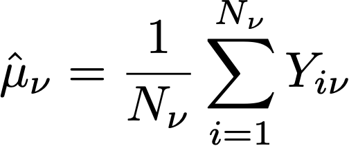
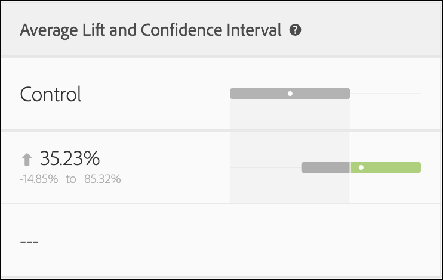

# Cálculos estadísticos en Pruebas A/Bn

Este artículo documenta los cálculos estadísticos detallados utilizados en las pruebas A/Bn manuales en [!DNL Adobe Target]. Se proporcionan definiciones para **[!UICONTROL tasa de conversión]**, **[!UICONTROL intervalo de confianza de la tasa de conversión]**, **[!UICONTROL alza]**, **[!UICONTROL intervalo de confianza para la elevación]**, **[!UICONTROL confianza]** y **[!UICONTROL bayesiana]** métricas de decisión.

Una actividad **[!UICONTROL Prueba A/B]** (manual) admite dos metodologías estadísticas, seleccionadas por actividad en [Objetivos y configuración](/help/main/c-activities/t-test-ab/t-test-create-ab/ab-goals-and-settings.md#section_13119392051044FBA6387D9B3B1C43CF):

* [Prueba t de Welch](#welchs-t-test): una metodología frecuentista que informa un porcentaje e intervalo de confianza de **[!UICONTROL Confianza]**, basado en una prueba de hipótesis de tamaño de muestra fijo. Se usa para actividades con un objetivo principal **[!UICONTROL Ingresos]** o **[!UICONTROL Participación]**.

* [Bayesiano](#bayesian-statistics): informa de los resultados como probabilidades, como **[!UICONTROL Posibilidad de control de pulsaciones]** e intervalos creíbles, calculados a partir de la distribución posterior completa de la métrica objetivo de cada experiencia. Esta configuración solo está disponible para actividades cuya métrica de objetivo principal sea **[!UICONTROL Conversión]**.

## Prueba T de Welch

### Rendimiento medio

En la siguiente sección se explican los cálculos utilizados en la siguiente ilustración.

![Informe de destino que muestra la [!UICONTROL tasa de conversión], el [!UICONTROL intervalo promedio de alza y confianza] y la [!UICONTROL confianza] de una actividad de prueba A/B.](/help/main/c-reports/statistical-methodology/img/target_report.png)

#### Campañas de tasa de conversión e ingresos por visitante (RPV)

La siguiente ilustración muestra **[!UICONTROL Tasa de conversión]**, **[!UICONTROL Intervalo de confianza de la tasa de conversión]** y el número de **[!UICONTROL conversiones]** en un informe de [!DNL Target]. Por ejemplo, la primera línea muestra que para la Experiencia A: la **[!UICONTROL Tasa de conversión]** es del 25,81% con un **[!UICONTROL Intervalo de confianza]** de ±7,7% y se registraron 32 conversiones. Dado que 124 visitantes vieron la experiencia, esto equivale a 32/124 = 25,81 %.

<p style="text-align:center;"></p>

La tasa de conversión de **media**, *<sub></sub>*, para cada experiencia ** de un experimento se define como una relación entre la suma de la métrica y el número de unidades asignadas a esa métrica, *N<sub></sub>*:

<p style="text-align:center;"></p>

Aquí,

* *Y<sub>i</sub>* es el valor de la métrica para cada unidad *i*, que se ha asignado a una experiencia determinada **.

* La suma sobre las unidades *i* depende de la elección de la metodología de conteo.

  * Si se usa **[!UICONTROL Visitantes]** como metodología de conteo, cada unidad es un visitante único definido como un participante único en la actividad durante toda la actividad.
  * Si se usa **[!UICONTROL Visitas]** como metodología de conteo, cada unidad es una visita única definida como un participante único en una experiencia durante una sesión de [!DNL Target] (con un(a) `sessionId` único(a). Cuando `sessionId` cambia o el visitante llega al paso de conversión, se cuenta una nueva visita.
  * Si se usa **[!UICONTROL Impresiones de actividad]** como metodología de contabilización, cada unidad es una impresión única definida como cada vez que un visitante carga una página de la actividad.

### [!UICONTROL Intervalo de confianza de la media]/[!UICONTROL Tasa de conversión]

El intervalo de confianza de la tasa de conversión se define de forma intuitiva como un rango de posibles tasas de conversión que es coherente con los datos subyacentes.

Al ejecutar experimentos, la tasa de conversión de una experiencia determinada es de *estimación* de la tasa de conversión &quot;verdadera&quot;. Para cuantificar la incertidumbre de esta estimación, [!DNL Target] utiliza un intervalo de confianza. [!DNL Target] siempre informa de un intervalo de confianza del 95 %, lo que significa que al final, el 95 % de los intervalos de confianza calculados incluyen la tasa de conversión real de la experiencia.

También se indica un número de &quot;Confianza&quot; junto a la experiencia principal o ganadora actual. Esta cifra solo se registra hasta que **[!UICONTROL Confianza]** de la experiencia líder alcance al menos el 60 %. Si hay dos experiencias presentes en la actividad, este número representa el nivel de confianza de que la experiencia tiene un mejor rendimiento que la otra experiencia. Si hay más de dos experiencias presentes en la actividad, este número representa el nivel de confianza de que la experiencia tiene un mejor rendimiento que la experiencia de &quot;control&quot; definida. Si la experiencia &quot;Control&quot; es la ganadora, no se informa de ninguna cifra &quot;Confianza&quot;.

Un intervalo de confianza del 95 % de la tasa de conversión *<sub></sub>* se define como el intervalo de valores:

<p style="text-align:center;"></p>

Donde el error estándar de la media se define como

<p style="text-align:center;"></p>

Cuando se utilice una estimación imparcial de la desviación típica de la muestra:

<p style="text-align:center;"></p>

Cuando la campaña es una campaña de tasa de conversión (es decir, la métrica de conversión es binaria), el error estándar se reduce a:

<p style="text-align:center;"></p>

### Alza

La siguiente ilustración muestra **[!UICONTROL Alza]** e **[!UICONTROL Intervalo de confianza del alza]** en un informe de [!DNL Target]. El número representa la media del rango de los límites del alza, y la flecha refleja si el alza es positiva o negativa. La flecha se muestra en gris hasta que la confianza pasa el 95 %. Una vez que la confianza ha superado el umbral, la flecha aparece en verde o en rojo según un alza positiva o negativa.

<p style="text-align:center;"></p>

El alza entre una experiencia ** y la experiencia de control *<sub>0</sub>* es el &quot;delta&quot; relativo en las tasas de conversión, definido como

<p style="text-align:center;"></p>

Donde las tasas de conversión individuales son las definidas anteriormente. Más sencillamente,

```
Lift(Experience N) = (Performance_Experience_N - Performance_Control)/ Performance_Control
```

Si la tasa de conversión de la experiencia de control *<sub>0</sub>* es 0, no hay alza.

### [!DNL Confidence Interval of Lift]

El gráfico de gráfico de cuadro de la columna **[!UICONTROL Intervalo promedio de alza y confianza]** representa el valor promedio y el intervalo de confianza del 95 % **[!UICONTROL del alza]**. El gráfico del cuadro aparece en gris cuando hay alguna superposición en el intervalo de confianza de una experiencia no de control determinada con el intervalo de confianza de la experiencia de control. El gráfico del cuadro es de color verde o rojo cuando el intervalo de confianza de una experiencia determinada está por encima o por debajo del intervalo de confianza de la experiencia de control.

El error estándar del alza entre una experiencia ** y la experiencia de control *<sub>0</sub>* se define de la siguiente manera:

<p style="text-align:center;"></p>

A continuación, el intervalo de confianza del 95 % del alza es:

<p style="text-align:center;"></p>

Este cálculo usa el método &quot;Delta&quot; y se describe [con más detalle en este documento](/help/main/assets/confidence_interval_lift.pdf)

### [!UICONTROL Confianza]

La última columna muestra la confianza en un informe [!DNL Target]. La confianza de una experiencia es una probabilidad (denotada como porcentaje) de obtener un resultado tan extremo como el que se observa, dado que la hipótesis nula es cierta. En términos de valores p, la confianza mostrada es *1 - valor p*. De forma intuitiva, una mayor confianza significa que es menos probable que la experiencia de control y la que no es de control tengan tasas de conversión iguales.

En [!DNL Target], se realiza una prueba t de **Welch** de dos colas entre la experiencia de prueba y la experiencia de control para comprobar si los medios de las experiencias de prueba y control son los mismos. Debido a que generalmente no sabemos si los tamaños de muestra y las variaciones de dos grupos son iguales antes de ejecutar el experimento y [!DNL Target] también le permite tener porcentajes desiguales de tráfico enviado a cada experiencia, no asumimos que la variación de cada experiencia sea igual. Por lo tanto, se elige la prueba T de Welch en lugar de la prueba T de estudiante.

Para realizar la prueba T de Welch, primero se empieza a calcular la estadística t y los grados de libertad y, a continuación, se ejecuta una prueba T de dos colas para generar el valor p. Finalmente, calculamos la confianza en función del valor p.

La estadística *t* se define como la diferencia de las medias de dos variables aleatorias independientes, ** y *<sub>0</sub>*, divididas por el error estándar de la diferencia:

<p style="text-align:center;"></p>

Donde *<sub>v</sub>* y *<sub>v0</sub>* son los medios de ** y *<sub>0</sub>* respectivamente, y el error estándar de la diferencia entre *<sub>v</sub>* y *<sub>v0</sub>* lo dan:

<p style="text-align:center;"></p>

Donde *<sup>2</sup><sub>v</sub>* y *<sup>2</sup><sub>v<sub>0</sub></sub>* son las variaciones de dos experiencias **&#x200B; y *<sub>0</sub>* respectivamente, y *N<sub>v</sub>* y *N<sub>v<sub>0</sub></sub>* son tamaños de muestra para &#x200B;** y *<sub>0</sub>* respectivamente.

Para la prueba T de Welch, el grado de libertad se calcula de la siguiente manera:

<p style="text-align:center;"></p>

Y el grado de libertad de ** y *<sub>0</sub>* se define de la siguiente manera:

<p style="text-align:center;"></p>

<p style="text-align:center;"></p>

A continuación, el valor p se puede calcular a partir del área de las colas de la distribución *t*:

<p style="text-align:center;"></p>

Finalmente, la confianza notificada en [!DNL Target] se define como:

<p style="text-align:center;"></p>

## Estadísticas bayesianas

En lugar de calcular un valor p a partir de una distribución aproximada, el informe de una actividad **[!UICONTROL bayesiana]** expresa los resultados como probabilidades, calculados a partir de la distribución posterior completa de la métrica objetivo de cada experiencia. Esto hace que sea seguro supervisar un informe **[!UICONTROL bayesiano]** continuamente, ya que no hay una penalización estadística para comprobar los resultados antes de alcanzar un tamaño de muestra fijo, y puede converger más rápido en muestras más pequeñas que **[!UICONTROL prueba t de Welch]**.

La metodología **[!UICONTROL Bayesiana]** también permite a los especialistas en mercadotecnia alimentarse de una hipótesis basada en su experimentación anterior y en los resultados de la variante de control.

La metodología **[!UICONTROL Bayesiana]** solo está disponible para actividades cuya métrica de objetivo principal es **[!UICONTROL Conversión]**, las actividades con un objetivo principal de **[!UICONTROL Ingresos]** o **[!UICONTROL Participación]** siempre usan la prueba T de **[!UICONTROL Welch]**. Para obtener más información acerca de cómo seleccionar una metodología, vea [Objetivos y configuración](/help/main/c-activities/t-test-ab/t-test-create-ab/ab-goals-and-settings.md#section_13119392051044FBA6387D9B3B1C43CF).

### Alza promedio e intervalo creíble

<p style="text-align:center;"></p>

El promedio de alza y el intervalo creíble juntos miden la mejora del rendimiento y su incertidumbre en una actividad **[!UICONTROL bayesiana]**. El alza media es el cambio porcentual medio entre un tratamiento y el control, mientras que el intervalo creíble define el intervalo dentro del cual el alza real se encuentra en una probabilidad especificada.

### [!UICONTROL Posibilidad de control de pulsaciones]

<p style="text-align:center;"></p>

**[!UICONTROL Posibilidad de batir el control]** es la probabilidad de que la métrica de objetivo de una experiencia supere a la experiencia **[!UICONTROL Control]**; por ejemplo, &quot;probabilidad B del 92 % supera a A&quot;. Esta es la métrica de decisión principal para una actividad **[!UICONTROL Bayesiana]**: una experiencia de aspirante es candidata para reemplazar a **[!UICONTROL Control]** cuando su **[!UICONTROL oportunidad de vencer al control]** cumple con el umbral de decisión de la actividad.

<!--
### [!UICONTROL Probability to be Best]

[!UICONTROL Probability to be Best] is the probability that an experience is the single best of all experiences in the activity. Use this decision metric to pick which winner to ship in a test with more than one challenger experience.
-->

## Realización de cálculos sin conexión

El [informe CSV descargado](/help/main/c-reports/c-report-settings/downloading-data-in-csv-file.md) solo contiene datos sin procesar; no incluye métricas calculadas, como los ingresos por visitante, el alza o la confianza, utilizadas en las pruebas A/B.

Para calcular estas cantidades estadísticas, descargue el archivo de Excel [!DNL Target] [Calculadora de confianza completa](/help/main/assets/complete_confidence_calculator.xlsx) para introducir el valor de la actividad.
