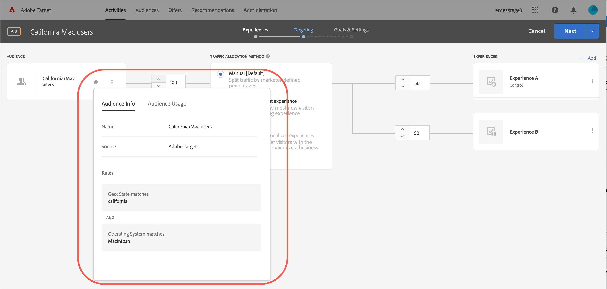

# Crear públicos

Las audiencias de [!DNL Adobe Target] determinan quién ve el contenido y las experiencias en una actividad segmentada.

Las audiencias se utilizan siempre que está disponible la determinación de objetivos. Al segmentar una actividad, tiene las siguientes opciones:

* Seleccione una audiencia reutilizable de la lista [!UICONTROL Audiencias]
* [Cree una audiencia específica de actividad](/help/main/c-target/creating-activity-only-audience.md) y asígnele un objetivo
* [Combinar varias audiencias](/help/main/c-target/combining-multiple-audiences.md#concept_A7386F1EA4394BD2AB72399C225981E5) para crear una audiencia ad hoc

También puede usar datos de audiencia recopilados por [!DNL Adobe Analytics] para personalización y segmentación en tiempo real en [!DNL Target] y otras [!DNL Adobe Experience Cloud] aplicaciones. Consulte [Audiencias de Experience Cloud](https://experienceleague.adobe.com/docs/core-services/interface/audiences/audience-library.html?lang=es) en la guía de *Componentes de la interfaz central de Experience Cloud*.

Hay dos tipos de audiencias en [!DNL Target]:

* **Audiencias de destino:** Se usa para entregar contenido diferente a distintos tipos de visitantes.
* **Audiencias de informes:** Se usa para determinar cómo responden los distintos tipos de visitantes al mismo contenido y así poder analizar los resultados de las pruebas.

  En [!DNL Target], los públicos de informes solo se pueden configurar si se usa [!DNL Target] como fuente de informes. Si usa [Adobe Analytics como fuente de informes](/help/main/c-integrating-target-with-mac/a4t/a4t.md) (A4T), debe configurar las audiencias de informes en [!DNL Analytics].

## Usar la lista [!UICONTROL Audiencias] {#use-list}

Para acceder a la lista [!UICONTROL Audiencias], haga clic en **[!UICONTROL Audiencias]** en la barra de menús superior:

![[!UICONTROL Lista de audiencias]](assets/audiences_list.png)

La lista [!UICONTROL Audiencias] contiene las audiencias que puede usar en sus actividades. Utilice la lista [!UICONTROL Audiencias] para crear, editar, duplicar, copiar o combinar audiencias. La lista también muestra la fuente en la que se creó la audiencia:

* [!DNL Adobe Target]
* [!DNL Adobe Target Classic]
* [!DNL Experience Cloud]
* [!DNL Adobe Experience Platform]

  >[!NOTE]
  >
  >El origen de [!DNL Adobe Experience Platform] está disponible para todos los clientes de [!DNL Target] que usan [Adobe Experience Platform Web SDK](https://experienceleague.adobe.com/docs/target-dev/developer/client-side/aep-web-sdk.html?lang=es){target=_blank}. Las audiencias disponibles de [!DNL Adobe Experience Platform] se pueden usar tal cual o [combinadas con audiencias existentes](/help/main/c-target/combining-multiple-audiences.md).
  >
  >Los usuarios deben tener el estado [!UICONTROL Aprobador] o superior en [!DNL Target] para configurar las tarjetas [!DNL Target] [!UICONTROL Destinos] en AEP/RTCDP ([!DNL Real-time Customer Data Platform]).
  >
  >Para obtener más información, consulte [Usar audiencias de Adobe Experience Platform](#aep).

No se puede cambiar el nombre de las audiencias predefinidas como &quot;[!UICONTROL Nuevos visitantes]&quot; y &quot;[!UICONTROL Visitantes que regresan]&quot;.

Al trabajar con audiencias que se crearon originalmente en [!DNL Experience Cloud] o [!DNL Adobe Experience Platform], [!DNL Target] le alerta si hace referencia a una audiencia en [!DNL Target] actividades que se eliminaron posteriormente en [!DNL Experience Cloud] o [!DNL Adobe Experience Platform].

* Si se eliminó una audiencia en [!DNL Experience Cloud] o [!DNL Adobe Experience Platform], aparece un icono de advertencia en la lista [!UICONTROL Audiencia] y en el selector de audiencias. La información del objeto en la interfaz de usuario [!DNL Target] también indica que la audiencia se eliminó en [!DNL Experience Cloud] o [!DNL Adobe Experience Platform].
* Si intenta combinar varias audiencias con una audiencia eliminada, o si intenta guardar una actividad que hace referencia a una audiencia eliminada, aparecerá un mensaje de advertencia.

También puede segmentar parámetros de perfil personalizados y parámetros de `user.`. Al crear una audiencia, arrastre los atributos que desee utilizar para segmentar la actividad en la ventana del generador de audiencias. Si el atributo deseado no se muestra, significa que un mbox no ha activado el atributo. Encontrará otros parámetros personalizados disponibles de mbox en la lista desplegable [!UICONTROL Parámetros personalizados].

Utilice el botón [!UICONTROL Filtros] para filtrar la lista de [!UICONTROL Audiencias] por origen: [!DNL Adobe Target], [!DNL Adobe Target Classic], [!DNL Experience Cloud] y [!DNL Adobe Experience Platform].

Opción ![Filtros en la lista [!UICONTROL Audiencias]](assets/filters.png)

Use el cuadro [!UICONTROL Buscar audiencias] para buscar en la lista [!UICONTROL Audiencias]. Puede buscar cualquier parte del nombre de una audiencia, o bien encerrar entre comillas una cadena específica.

Puede ordenar la lista [!UICONTROL Audiencias] por nombre o por la fecha de la última modificación. Para ordenar por nombre o fecha, haga clic en el encabezado de columna y, a continuación, seleccione si quiere mostrar los públicos en orden ascendente o descendente.

## Ver definiciones de audiencia {#section_11B9C4A777E14D36BA1E925021945780}

Puede ver los detalles de definición de audiencia en una tarjeta emergente en varios lugares de la interfaz de usuario de [!DNL Target] sin necesidad de abrir la audiencia. Esta funcionalidad se aplica a las audiencias creadas en [!DNL Target Standard/Premium] y a las audiencias importadas desde [!DNL Target Classic] o creadas mediante API.

Por ejemplo, para acceder a la siguiente definición de audiencia, haga clic en el icono [!UICONTROL Ver detalles] de la audiencia que desee:

Para acceder a la siguiente definición de audiencia, haga clic en el icono [!UICONTROL Ver detalles] en la página [!UICONTROL Información general] de una actividad:

La tarjeta de definición de audiencia muestra el tipo, la fuente y los atributos de la audiencia. Haga clic en **[!UICONTROL Ver detalles completos]** para ver otras actividades que hagan referencia a esa audiencia, si corresponde. Si está viendo una tarjeta de definición de audiencia desde la página [!UICONTROL Información general] de una actividad, haga clic en **[!UICONTROL Uso de audiencia]**.

La información de uso de la audiencia puede ayudarle a evitar un impacto accidental en otras actividades al editar audiencias. La información incluye [!UICONTROL Actividades activas], [!UICONTROL Actividades inactivas], [!UICONTROL Actividades archivadas] y [!UICONTROL Actividades de sincronización]. Esta característica está disponible para todas las audiencias (audiencias de biblioteca y [audiencias solo de actividad](/help/main/c-target/creating-activity-only-audience.md#concept_A6BADCF530ED4AE1852E677FEBE68483)).

Si una audiencia está [combinada con otra audiencia](/help/main/c-target/combining-multiple-audiences.md) y la audiencia combinada se usa para crear una actividad, la información de uso de ambas audiencias enumera esa actividad recién creada.

<!--
The following audience definition card is for an audience imported from the Adobe Experience Cloud. In this instance, the audience was imported from Adobe Audience Manager (AAM).

The following details are available for these imported audience types:

| Audience Type | Details |
|--- |--- |
|Mobile audience|Marketing Name, Vendor, and Model. The `matches | does not match` operator displays instead of `equals | does not equal` .|
|Visitor-behavior audience|**user.categoryAffinity:** `categoryAffinity` with `FAVORITE` parameter.  **Monitoring:** Monitoring service equals true. **No Monitoring Service:** Monitoring service equals false. |
|Audiences using the NOT operator|**Single Rule:** Target displays the audience in the format `[All Visitor AND [NOT [rule]`. Single NOT rule displays with AND with `AllVisitor` audience. |

Keep the following points in mind as you work with imported audiences:

* Expression target audiences are no longer supported in Target Standard/Premium. 
* Target Standard/Premium does not support some deprecated audiences or has improved operators for ease of use. Because of this, the definition of an imported audience, although working as per definition, does not mean that same is now available for creation in the Standard/Premium interface. For example, Social Audiences are visible with their rules but Target Standard/Premium does not allow social audiences to be created.
-->

## Uso de públicos de [!DNL Adobe Experience Platform] {#aep}

Usar audiencias creadas en [!DNL Adobe Experience Platform] proporciona datos de clientes más completos que conducen a una personalización más impactante.

Para obtener más información, consulte [Usar audiencias de [!DNL Adobe Experience Platform]](/help/main/c-integrating-target-with-mac/integrating-with-rtcdp.md#aep).

## Vídeo de formación: Uso de audiencias 

Este vídeo contiene información sobre el uso de las audiencias.

* Explicar el término “público”
* Explicar las dos formas de usar audiencias para la optimización
* Buscar audiencias en la lista de audiencias
* Dirigir una actividad a una audiencia
* Usar audiencias para la creación pasiva de informes en una actividad

>[!VIDEO](https://video.tv.adobe.com/v/17398)
