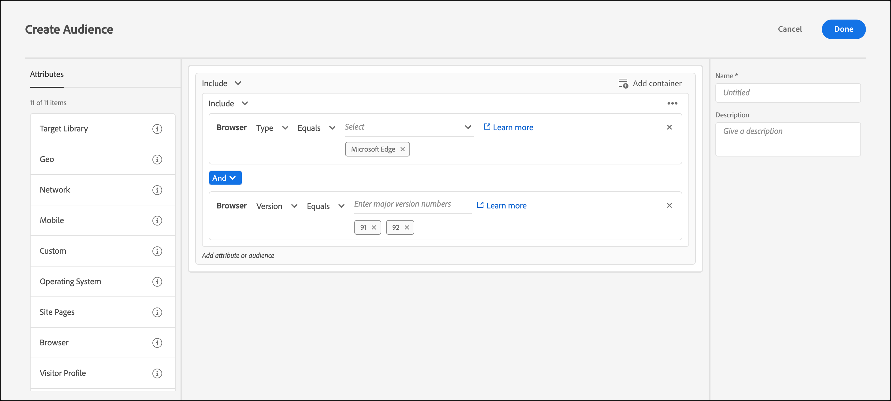

# [!UICONTROL Browser]

Puede segmentar usuarios que usen un navegador específico y opciones del navegador concretas cuando visiten una página.

Se pueden segmentar los siguientes navegadores:

* [!UICONTROL Chrome]
* [!UICONTROL Firefox]
* [!UICONTROL Safari]
* [!UICONTROL Internet Explorer]
* [!UICONTROL Microsoft Edge]
* [!UICONTROL Opera]
* [!DNL iPad]
* [!DNL iPhone]

>[!IMPORTANT]
>
>Empezando por [!DNL Target] Standard/Premium 24.3.1 (del 4 al 6 de marzo de 2024), audiencias integradas creadas con la interfaz de usuario de Target, como `Browser:iPad` y `Browser:iPhone` se han actualizado para realizar el direccionamiento adecuado para [!DNL iPad] y [!DNL iPhone] usando `profile.mobile.deviceVendor`, `profile.mobile.isMobilePhone`, y `profile.mobile.isTablet`.
>
>Esta actualización no requiere ninguna acción por parte de los clientes. Las etiquetas de la [!DNL Target] La interfaz de usuario se cambiará en el futuro y se anunciará en [[!DNL Target] Notas de la versión (actual)](/help/main/r-release-notes/release-notes.md) cuando se realicen estos cambios.
>
>Para ver la configuración de la solución, consulte [Actualizaciones para [!DNL iPad] y [!DNL iPhone] in [!UICONTROL Browser] atributos de audiencia (30 de abril de 2024)](#updates) más abajo.

Hay dos formar de segmentar según el navegador:

* **Audiencia prediseñada:** utilice la audiencia prediseñada si quiere segmentar solo los visitantes que usan un navegador concreto para visitar el sitio. Por ejemplo, si ofrece un [!DNL Chrome] extensión, solo debe segmentar [!DNL Chrome] usuarios.

   1. Al configurar la actividad, seleccione el explorador en la lista desplegable.

      Esta opción dirige la actividad únicamente a los visitantes que usan el navegador especificado.

      

* **Regla de audiencia del explorador personalizada:** Una audiencia personalizada le permite dirigirse a varios exploradores o configurar reglas o exclusiones para exploradores, versiones de exploradores o idiomas específicos. Esta funcionalidad proporciona una flexibilidad considerable a la hora de segmentar una actividad según los atributos del explorador.

   1. En el [!DNL Target] interfaz, haga clic en **[!UICONTROL Audiences]** > **[!UICONTROL Create Audience]**.
   1. Asigne un nombre a la audiencia y añada una descripción opcional.
   1. Arrastrar y soltar **[!UICONTROL Browser]** en el Generador de audiencias.

      

   1. Clic **[!UICONTROL Select]**, luego seleccione una de las siguientes opciones:

      * **Tipo:** dirija la actividad a un navegador o exclúyalo. Consulte [Tipo](/help/main/c-target/c-audiences/c-target-rules/browser.md#section_6ADC758F23F145B3A310151546D83D56).
      * **Idioma:** Dirija la actividad ciertos navegadores configurados en idiomas específicos o exclúyalos. Consulte [Idioma](/help/main/c-target/c-audiences/c-target-rules/browser.md#section_7520D1AA464A45A6843EABE2D2B431A1).
      * **Versión:** dirija la actividad a ciertas versiones del navegador o exclúyalas. Consulte [Versión](/help/main/c-target/c-audiences/c-target-rules/browser.md#section_37CC8CE45DA04E8682AE6388321BA6EF).

   1. (Opcional) Configure reglas adicionales para la audiencia.
   1. Haga clic en **[!UICONTROL Done]**.

  El siguiente ejemplo muestra una audiencia que incluye [!DNL Microsoft Edge] usuarios en las versiones 91 o 92:

  

## Opciones del navegador {#concept_221D8EEF53CC45AEACEB17CF336A3658}

Dirija la actividad a visitantes o exclúyalos en función del tipo, el idioma o la versión de navegador que tengan.

### Tipo  {#section_6ADC758F23F145B3A310151546D83D56}

Dirija la actividad a un navegador o exclúyalo.

Seleccionar **[!UICONTROL Type]**, elija igual a o no es igual a.

* [!UICONTROL Equals]: Oriente los exploradores seleccionados.
* [!UICONTROL Does not equal]: excluir los exploradores seleccionados.

Seleccione uno o varios. Si hay varias opciones, se conectan con un parámetro O.

### Idioma  {#section_7520D1AA464A45A6843EABE2D2B431A1}

Dirija la actividad ciertos navegadores que estén configurados en idiomas específicos o exclúyalos.

Por ejemplo, si una oferta solo está disponible en español, puede segmentar exploradores en los que el idioma establecido sea el español. O, si su página no está habilitada para los idiomas de doble byte, puede excluir los navegadores en los que se haya establecido un idioma asiático oriental.

La inclusión o exclusión de idiomas de navegador puede proporcionar una segmentación del visitante más precisa que segmentarlos según la ubicación geográfica, al menos en aquellos casos en los que el idioma es más importante que la ubicación. Si, por ejemplo, ofrece un artículo escrito en español, puede dirigirlo a los países de habla hispana o a los navegadores en los que el idioma establecido es el español. Segmentar según el navegador facilita el artículo a los hablantes de español ubicados en países en los que el español no es el principal idioma.

Seleccionar **[!UICONTROL Language]**, elija igual a o no es igual a.

* [!UICONTROL Equals]: establezca como objetivo los idiomas de explorador seleccionados.
* [!UICONTROL Does not equal]: excluir los idiomas del explorador seleccionados.

Seleccione uno o varios. Si hay varias opciones, se conectan con un parámetro O.

Los siguientes idiomas de navegador se pueden incluir o excluir de la segmentación:

* Inglés
* Francés
* Alemán
* Japonés
* Coreano
* Portugués
* Ruso
* Español
* Chino tradicional

### Versión  {#section_37CC8CE45DA04E8682AE6388321BA6EF}

Dirija la actividad a ciertas versiones del navegador o exclúyalas.

Por ejemplo, si la página no aparece correctamente en [!DNL Internet Explorer] versión 11 o anterior, puede crear una audiencia que excluya esas versiones. En ese caso, debe configurar una regla en la que el tipo de explorador sea igual a [!DNL Internet Explorer] y agregue una segunda regla en la que la versión sea menor o igual que 11.

Seleccionar **[!UICONTROL Version]** y, a continuación, elija un operador:

* [!UICONTROL Equals]
* [!UICONTROL Does not equal]
* [!UICONTROL Is greater than]
* Es mayor que o igual a
* [!UICONTROL Is less than]
* [!UICONTROL Is less than or equal to]

Escriba el número de versión. En el campo de texto solo se pueden introducir versiones principales. Es decir, la versión especificada incluye las versiones secundarias de la principal. Por ejemplo, si especifica la versión 10, también se incluyen los visitantes de la versión 10.1.

Si hay varias opciones, se conectan con un parámetro O.

## Vídeo de formación: Creación de audiencias 

Este vídeo contiene información sobre el uso de las categorías de audiencias.

* Crear audiencias
* Definir categorías de audiencias

>[!VIDEO](https://video.tv.adobe.com/v/17392)

## Actualizaciones para [!DNL iPad] y [!DNL iPhone] in [!UICONTROL Browser] atributos de audiencia (30 de abril de 2024) {#updates}

[!DNL Adobe Target] le permite [segmentar en cualquiera de los atributos de categoría](/help/main/c-target/c-audiences/c-target-rules/target-rules.md), incluidos los usuarios que usan un explorador específico u opciones del explorador cuando visitan la página.

Empezando por [!DNL Target] Standard/Premium 24.3.1 (del 4 al 6 de marzo de 2024), audiencias integradas creadas con la interfaz de usuario de Target, como `Browser:iPad` y `Browser:iPhone` se han actualizado para realizar el direccionamiento adecuado para [!DNL iPad] y [!DNL iPhone] usando `profile.mobile.deviceVendor`, `profile.mobile.isMobilePhone` y `profile.mobile.isTablet`.

Audiencias integradas creadas con [!DNL Target] IU, como `Browser:iPad` y `Browser:iPhone`, se moverá automáticamente a la nueva definición de audiencia y no requiere ninguna acción por parte de los clientes. Sin embargo, en adelante, debe utilizar los ajustes de [se describe a continuación](#ui).

Si utiliza `user.browserType` en cualquier script de perfil para comprobar si es un [!DNL iPhone] o [!DNL iPad] (por ejemplo, `user.browserType == 'iphone'` o `user.browserType != 'ipad'`), los scripts de perfil deben cambiarse como [se indica a continuación](#profile-scripts) antes del 30 de abril de 2024 para garantizar que estas audiencias sigan funcionando según lo esperado.

Las audiencias de JavaScript son audiencias heredadas que utilizan [!DNL Target] expresiones que quedaron obsoletas con el [!DNL Target Classic] IU. Estas audiencias se pueden modificar únicamente mediante API. Los clientes deben actualizar estas audiencias solo si siguen utilizando audiencias heredadas en las actividades de.

### Audiencias creadas con [!DNL Target] IU {#ui}

Se pueden utilizar los siguientes ajustes a partir de ahora:

* **Para coincidencias de explorador[!DNL Apple]**: [!UICONTROL Mobile] > [!UICONTROL Device Vendor] [!UICONTROL matches] [!DNL Apple]

  

* **Para las coincidencias de navegador y tableta**: [!UICONTROL Mobile] > [!UICONTROL is Tablet] > [!UICONTROL true]

  

* **Para coincidencias de explorador con iPad**: [!UICONTROL Mobile] > [!UICONTROL Device Marketing Name] [!UICONTROL matches] [!DNL iPad] con un contenedor Y con [!UICONTROL Mobile] > [!UICONTROL Is Tablet] es [!DNL true]

  

* **Para coincidencias de explorador con iPhone**: [!UICONTROL Mobile] > [!UICONTROL Device Marketing Name] [!UICONTROL matches] [!DNL iPhone] con un contenedor Y con [!UICONTROL Mobile] > [!UICONTROL Is Mobile Phone] es [!DNL true]

  

Existen muchas otras configuraciones posibles que se pueden utilizar, por ejemplo, cuando se niegan condiciones. Algunos ejemplos de condiciones negadas podrían tener el siguiente aspecto:

* **Para el navegador no coincide con iPhone**: [!UICONTROL Mobile] > [!UICONTROL Device Vendor] [!UICONTROL does not match] [!UICONTROL Apple] con un contenedor O con [!UICONTROL Mobile] > [!UICONTROL Is Mobile Phone] es [!UICONTROL false]

  

* **Para el navegador no coincide con iPad**: [!UICONTROL Mobile] > [!UICONTROL Device Vendor] [!UICONTROL does not match] [!UICONTROL Apple] con un contenedor O con [!UICONTROL Mobile] > [!UICONTROL Is Tablet] es [!UICONTROL false].

  

### Audiencias creadas con scripts de perfil {#profile-scripts}

Si utiliza `user.browserType` en heredado [!DNL Target Classic] o en los scripts de perfil, los cambios deben incluir lo siguiente:

* **BrowserType es iPhone**:

  Reemplazar:

  `user.browserType=="iphone"`

  Con:

  `profile.mobile.deviceVendor == "Apple" && profile.mobile.isMobilePhone`

* **BrowserType no es iPhone**:

  Reemplazar:

  `user.browserType!="iphone"`

  Con:

  `profile.mobile.deviceVendor != "Apple" || !profile.mobile.isMobilePhone`

* **BrowserType es iPad**:

  Reemplazar:

  `user.browserType=="ipad"`

  Con:

  `profile.mobile.deviceVendor == "Apple" && profile.mobile.isTablet`

* **BrowserType no es iPad**:

  Reemplazar:

  `user.browserType!="ipad"`

  Con:

  `profile.mobile.deviceVendor != "Apple" || !profile.mobile.isTablet`