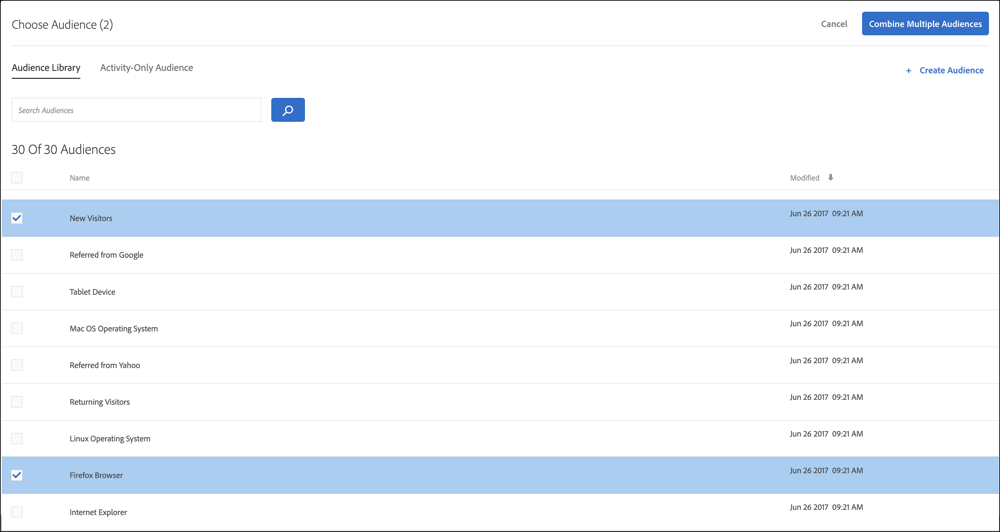
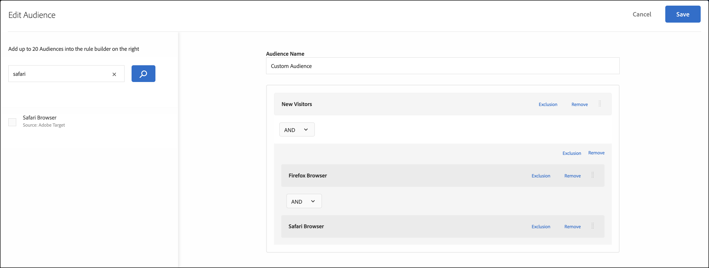
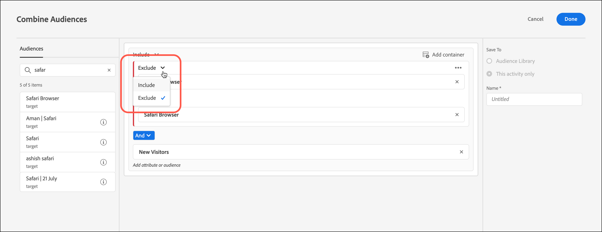
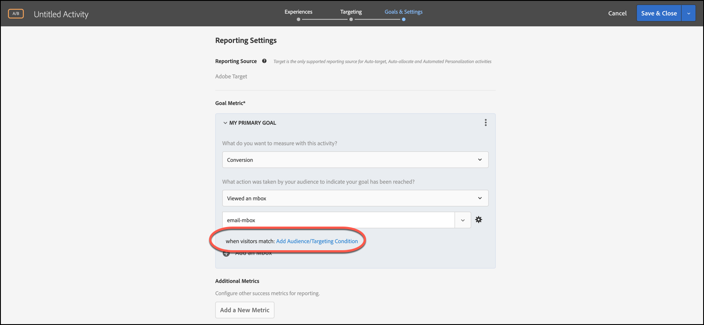
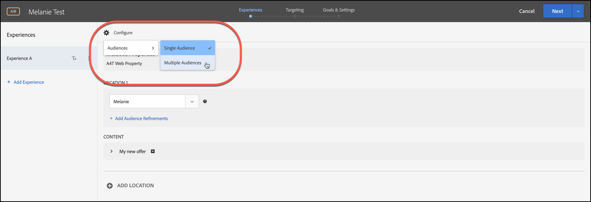

# Combinación de varios públicos

Combine varias audiencias (incluidas las audiencias [!DNL Adobe Experience Cloud], [!DNL Adobe Experience Platform] y [!DNL Target]) sobre la marcha para crear audiencias específicas. También puede crear reglas de exclusión y excluir audiencias de una regla.

>[!NOTE]
>
>El origen de [!DNL Adobe Experience Platform] está disponible para todos los clientes de [!DNL Target] que usan [Adobe Experience Platform Web SDK](https://experienceleague.adobe.com/docs/target-dev/developer/client-side/aep-web-sdk.html?lang=en){target=_blank}. Las audiencias disponibles de [!DNL Adobe Experience Platform] se pueden usar tal cual o combinadas con audiencias existentes, como se explica en este tema.
>
>Para obtener más información, consulte [Usar audiencias de Adobe Experience Platform](/help/main/c-target/c-audiences/audiences.md#aep).

Imagine que tiene los públicos “Visitantes nuevos” y “Usuarios de Chrome”. Para una actividad concreta, puede combinar estas audiencias existentes para dirigirse a los visitantes nuevos que utilicen navegadores Chrome. En lugar de crear una tercera audiencia y almacenarla en la biblioteca [!UICONTROL Audiencias], puede combinar las dos audiencias al crear o editar una actividad existente.

Otro ejemplo: puede dirigirse a todos los clientes fieles. Por ejemplo, puede incluir una audiencia [!DNL Audience Manager] específica para el estado de fidelidad y combinarla con una audiencia [!DNL Target] compuesta por personas que se registraron en el programa de fidelidad durante la sesión actual. Combinar estas dos audiencias es más fácil que crear una tercera audiencia permanente.

Puede combinar hasta 20 audiencias utilizando los operadores AND y OR.

Puede crear y usar públicos combinados en varios lugares de la interfaz de usuario de [!DNL Target]..

## Crear una audiencia combinada al crear una actividad {#section_2F1CE9434CC04174B4BA2BFC89B85D77}

Puede crear una audiencia combinada ad hoc en la página de [!UICONTROL Target] de la actividad durante el flujo de trabajo guiado de tres pasos.

1. Al crear una [actividad](/help/main/c-activities/activities.md#concept_D317A95A1AB54674BA7AB65C7985BA03), en la página **[!UICONTROL Segmentación]**, haga clic en los tres puntos verticales y luego haga clic en **[!UICONTROL Reemplazar audiencia]**.

   

1. En la página **[!UICONTROL Elegir audiencia]**, marque las casillas de verificación de las audiencias que quiera usar como componentes básicos en la audiencia combinada.

   Use el cuadro [!UICONTROL Buscar audiencias] para restringir la búsqueda de la audiencia deseada.

   

1. Haga clic en **[!UICONTROL Combinar varias audiencias]** en la esquina superior derecha.

   

1. (Condicional) Edite el nuevo público combinado si lo desea.

   En el cuadro de diálogo [!UICONTROL Editar audiencia], puede arrastrar otros componentes básicos de audiencia desde el lado izquierdo y soltarlos en la nueva audiencia combinada. También puede añadir reglas de exclusión y excluir audiencias.

   1. Utilice la funcionalidad de arrastrar y soltar para agregar audiencias dentro de una sección existente como un bloque de creación de nivel 2.

      Supongamos que, en el ejemplo anterior, queremos incluir a los usuarios de Safari en el público combinado. Busque y arrastre el público “Explorador Safari” al cuadro “Explorador Firefox” de la derecha, como se ve a continuación:

      

      Observe que el operador que separa los dos públicos de tipo de navegador es “Y”. Seleccione la lista desplegable [!UICONTROL And] y elija el valor &quot;OR&quot; para crear una audiencia combinada nueva para los visitantes nuevos que utilizan Firefox o Safari. Tenga cuidado de evitar crear reglas que excluyen todos los miembros potenciales del público. Por ejemplo, no es posible visitar una página con los navegadores Firefox y Safari simultáneamente.

      >[!NOTE]
      >
      >El operador Y u O (AND u OR) debe ser el mismo durante la combinación de públicos. No puede combinar distintos operadores.

   1. Para agregar una exclusión a una regla, haga clic en **[!UICONTROL Excluir]**.

      

      Arrastre y suelte una audiencia.

      Por ejemplo, para excluir de los visitantes nuevos a los de Estados Unidos, puede arrastrar la audiencia de Mercado: Estados Unidos al cuadro.

      Este público combinado incluye a todos los visitantes nuevos que llegan a su sitio usando Safari o Firefox (excepto a los de San Francisco).

   1. Para excluir de una regla a una audiencia, haga clic en **[!UICONTROL Exclusión]** > **[!UICONTROL Excluir esta audiencia]**.

      Por ejemplo, puede crear una audiencia combinada que incluya a todos los visitantes nuevos que lleguen a su sitio excluyendo a los que lo hagan por medio de Firefox. Excluir a los visitantes que usan Firefox es más fácil y rápido que crear una audiencia combinada que incluya explícitamente varios navegadores (Safari, Chrome e Internet Explorer) y que excluya Firefox.

1. Asigne un nombre descriptivo a la audiencia combinada y haga clic en **[!UICONTROL Listo]**.

## Crear una audiencia combinada para usarla en la segmentación de métricas {#section_A42E795AFCBD4575809C5942039910F0}

Puede crear una audiencia combinada ad-hoc en la página [!UICONTROL Objetivos y configuración] de la actividad para usarla en la segmentación de métrica. Por ejemplo, para crear una segmentación según la conversión empleando una audiencia combinada:

1. Al editar o crear una [actividad](/help/main/c-activities/activities.md#concept_D317A95A1AB54674BA7AB65C7985BA03), en la página **[!UICONTROL Objetivos y configuración]**, seleccione **[!UICONTROL Conversión]** para la métrica de éxito y, a continuación, seleccione **[!UICONTROL Visualizó un Mbox]** como acción.
1. Elija el mbox que quiera en el campo **[!UICONTROL Buscar mbox]**.

   

1. Haga clic en el icono del engranaje y luego en **[!UICONTROL Añadir destino de la audiencia]**.
1. Haga clic en el vínculo **[!UICONTROL Agregar condición de Público/Objetivo]** para mostrar el cuadro de diálogo [!UICONTROL Elegir audiencia].

   

1. Realice el [paso 2](/help/main/c-target/combining-multiple-audiences.md#section_2F1CE9434CC04174B4BA2BFC89B85D77) de la sección “Crear un público combinado al crear una actividad” para crear un público combinado.

## Crear una audiencia combinada para usarla en los informes {#section_4682D342EFBB43C38E54B99B3A1E14CD}

Puede crear una audiencia combinada ad-hoc en la página [!UICONTROL Objetivos y configuración] de la actividad para usarla en los informes.

1. Al editar o crear una [actividad](/help/main/c-activities/activities.md#concept_D317A95A1AB54674BA7AB65C7985BA03), en la página **[!UICONTROL Objetivos y configuración]**, haga clic en el icono **[!UICONTROL Agregar audiencia]** debajo de [!UICONTROL Audiencias para informes] para mostrar la página [!UICONTROL Elegir audiencia].

   

1. Realice el [paso 2](/help/main/c-target/combining-multiple-audiences.md#section_2F1CE9434CC04174B4BA2BFC89B85D77) de la sección “Crear un público combinado al crear una actividad” para crear un público combinado.

## Crear una audiencia combinada al editar una actividad {#section_364A12CE96E04B61B7C18113AA586C2C}

Cuando edita una actividad existente, puede crear un público combinado ad-hoc.

1. En la página [!UICONTROL Actividades], pase el ratón sobre la actividad que quiera y haga clic en el icono **[!UICONTROL Editar]**.

   O bien

   Haga clic en la actividad para abrirla y luego haga clic en **[!UICONTROL Editar actividad]**.

1. Haga clic en **[!UICONTROL Configurar]** > **[!UICONTROL Audiencias]** > **[!UICONTROL Varias audiencias]**.

   

1. Haga clic en el icono de más opciones (tres puntos verticales), junto a la audiencia actual de la actividad y luego haga clic en **[!UICONTROL Cambiar audiencia]**.

   

1. Realice el [paso 2](/help/main/c-target/combining-multiple-audiences.md#section_2F1CE9434CC04174B4BA2BFC89B85D77) de la sección “Crear un público combinado al crear una actividad” para crear un público combinado.
