# Notas de la versión para versiones anteriores{#release-notes-for-previous-releases}

Notas de la versión de versiones anteriores de Target, incluidas las notas de la versión Target Standard/Premium, la plataforma Target y las bibliotecas Javascript de Target (at.js y mbox.js). Las notas de la versión se presentan en orden descendente por mes y año de publicación.

>[!NOTE]
>
>Consulte [Notas de la versión de Target (actual)](../r-release-notes/release-notes.md#reference_8FE40B43A5A34DDF8F26A53D55EE036A) para obtener información sobre las versiones de Target del mes actual (plataforma y Target Standard/Premium).

## Notas de la versión - 2020

### Target Standard/Premium 20.5.1 (17 de junio de 2020). 

| Función.  / Mejora | Descripción |
| --- | --- |
| Analytics for Target (A4T) compatibilidad con actividades de asignación  automática | [!UICONTROL Las actividades de asignación] automática ahora admiten [Analytics para Destinatario](/help/c-integrating-target-with-mac/a4t/a4t.md).<br>Esta integración le permite utilizar la función de bandidos multiarmados de asignación [!UICONTROL automática] para dirigir el tráfico a las experiencias ganadoras, mientras utiliza una métrica de objetivos de [!UICONTROL Adobe Analytics] y/o funciones de sistema de informes y análisis de [!UICONTROL Adobe Analytics] .<br>Si ya ha [implementado A4T](/help/c-integrating-target-with-mac/a4t/a4timplementation.md) para su uso con actividades de Prueba A/B y de segmentación de experiencias, ¡ya está todo preparado!<br>Para obtener más información, consulte Compatibilidad [de Analytics para Destinatario (A4T) con actividades](/help/c-integrating-target-with-mac/a4t/campaign-creation.md#a4t-aa) de asignación automática en la creación *de* Actividades. |
| Tokens de respuesta para el método de asignación de tráfico para el Destinatario automático y las actividades de Automated Personalization | Se han agregado dos tokens [de](/help/administrating-target/response-tokens.md) respuesta a las actividades de Destinatario  automático y [!UICONTROL Automated Personalization] para permitir determinar si un visitante recibió una experiencia concreta como resultado de la asignación al tráfico &quot;de control&quot; o &quot;dirigido&quot;.<ul><li>`experience.trafficAllocationId` devolverá 0 si un visitante ha recibido una experiencia por estar en tráfico de &quot;control&quot; y 1 si un visitante ha recibido una experiencia de la distribución de tráfico de &quot;objetivo&quot;.</li><li>`experience.trafficAllocationType` devolverá &quot;control&quot; o &quot;segmentado&quot;.</li></ul>Para obtener más información sobre el control y el tráfico dirigido, consulte [Seleccionar el control para la actividad](/help/c-activities/t-automated-personalization/experience-as-control.md)de Destinatario automático o Automated Personalization. |
| [!UICONTROL Función de editor] | Esta nueva función es similar a la función [!UICONTROL Observador] actual (puede crear actividades de vista, pero no puede crearlas o editarlas). Sin embargo, la función [!UICONTROL Editor] tiene el permiso adicional para activar actividades.<br>Para obtener más información, consulte: <ul><li>**Usuarios** de Target Standard: [Especifique funciones y permisos](/help/administrating-target/c-user-management/c-user-management/user-management.md#roles-permissions) en *Usuarios*.</li><li>**Usuarios** de destinatario Premium: [Paso 6: Especifique funciones y permisos](/help/administrating-target/c-user-management/property-channel/properties-overview.md#section_8C425E43E5DD4111BBFC734A2B7ABC80) en *Configurar permisos* de empresa.</li></ul> |
| Asistencia técnica de A4T el 25 [!DNL Analysis Workspace]<br>de junio de 2020 | [!UICONTROL Ahora se admite Analytics para Destinatario] (A4T) en [!DNL Analysis Workspace]. El panel  Análisis para Destinatario (A4T) le permite analizar sus [!DNL Adobe Target] actividades y experiencias en [!DNL Analysis Workspace].<br>Para obtener más información, consulte [Informes en Analytics](/help/c-integrating-target-with-mac/a4t/reporting.md) en el panel *sistema de informes* de [A4T y](https://docs.adobe.com/content/help/en/analytics/analyze/analysis-workspace/panels/a4t-panel.html) Analytics para Destinatario (A4T) en la Guía *de herramientas de* Analytics. |

**Mejoras, correcciones y cambios**

* Se ha corregido un problema que provocaba que la métrica &quot;visitantes&quot; se almacenara en la definición de la actividad en lugar de &quot;Visitantes únicos&quot;. (TGT-37098)
* Se ha corregido un problema en la interfaz de usuario que provocaba que la barra de desplazamiento vertical no funcionara correctamente en la página [!DNL Target] Audiencias  . (TGT-36968)

### Versiones de at.js 1.8.2 y at.js 2.3.1 (15 de junio de 2020)

Se han realizado las siguientes mejoras y correcciones en las bibliotecas de [!DNL Target] at.js:

| Función.  / Mejora | Descripción |
| --- | --- |
| at.js.  1.8.2 | Esta versión de at.js es una versión de mantenimiento que incluye la siguiente corrección:<ul><li>Se ha corregido un problema que se producía al utilizar CNAME y la anulación de bordes, at.js 1.*x* podría crear incorrectamente el dominio del servidor, lo que ocasionaba que fallara la [!DNL Target] solicitud. (TNT-35064)</li></ul>For more information, see [at.js version details](/help/c-implementing-target/c-implementing-target-for-client-side-web/target-atjs-versions.md). |
| at.js 2.3.1 | Esta versión de at.js es de mantenimiento e incluye las siguientes mejoras y correcciones:<ul><li>Se ha hecho que la `deviceIdLifetime` configuración se pueda anular mediante [targetGlobalSettings](/help/c-implementing-target/c-implementing-target-for-client-side-web/targetgobalsettings.md). (TNT-36349)</li><li>Se ha corregido un problema que se producía al utilizar CNAME y la anulación de bordes, at.js 2.*x* podría crear incorrectamente el dominio del servidor, lo que ocasionaba que fallara la [!DNL Target] solicitud. (TNT-35065)</li><li>Se ha corregido un problema que se producía al usar la [!DNL Target] extensión v2 y la [!DNL Launch] extensión, [!DNL Adobe Analytics] al retrasar la [!DNL Launch] [!DNL Target] [!DNL Analytics] `sendBeacon` llamada. (TNT-36407, TNT-35990, TNT-36000)</li></ul>For more information, see [at.js version details](/help/c-implementing-target/c-implementing-target-for-client-side-web/target-atjs-versions.md). |

### Cambios en la API de estado de lote de perfil v2 (14 de mayo de 2020)

Con la versión del 20 de mayo, el estado de Lote de Perfil solo devolverá datos de error de nivel de fila a partir de ahora (no se devolverán datos de éxito). La API devolverá los ID de perfil fallidos a partir de ahora.

Las respuestas de API anteriores y nuevas son las siguientes:

`ProfileBatchStatus Api
http://<<edge>>/m2/<<client>>/profile/batchStatus?batchId=<batchid>`

**Actualmente vemos la respuesta como:**

```
<response>
 
    <batchId>samplebatch-1585929692655-59449976</batchId>
 
    <status>complete</status>
 
    <batchSize>164</batchSize>
 
    <profile>
 
        <id>1514187733806-729395</id>
 
        <status>success</status>
 
    </profile>
 
    <profile>
 
        <id>1573612762055-214017</id>
 
        <status>success</status>
 
    </profile>
 
    <profile>
 
        <id>some profile id</id>
 
        <status>failed</status>
 
    </profile>
 
</response>
```

**Después del 4 de mayo, la respuesta será:**

```
<response>
 
    <batchId>samplebatch-1585929692655-59449976</batchId>
 
    <status>complete</status>
 
    <batchSize>164</batchSize>
 
    <profile>
 
        <id>some profile id</id>
 
        <status>failed</status>
 
    </profile>
 
</response>
```

### Target Standard/Premium 20.4.1 (6 de mayo de 2020). 

Esta versión contiene las siguientes mejoras, correcciones y cambios:

* Se ha corregido un problema que no cumplía correctamente los requisitos de un dispositivo y un tipo de explorador para una audiencia. (TGT-36266)
* Se ha corregido un problema que impedía que los datos del informe se mostraran cuando se visualizaban en pantallas de menos de 963 píxeles de ancho. (TGT-36549)
* Se ha corregido un problema que provocaba que los informes de Personalización automática no se representaran correctamente. (TGT-36619)
* Se ha corregido un problema que permitía seleccionar métricas incompatibles en la asignación automática y en actividades de Destinatario automático que usan Analytics para Destinatario (A4t). (TGT-36646)
* Se ha corregido un problema que provocaba que determinadas opciones del Compositor de experiencias visuales (VEC) no se mostraran correctamente. (TGT-36571)
* Se ha corregido un problema en la interfaz de usuario de Destinatario que hacía que otras previsualizaciones de oferta de Recommendations mostraran el contenido editado después de que un usuario reemplazara el contenido en una única experiencia. (TGT-36053 y TGT-36894)
* Se ha corregido un problema que impedía que algunos usuarios eliminaran elementos de un catálogo de Recommendations. (TGT-36455)
* Se ha corregido un problema que impedía a los usuarios guardar criterios de Recommendations en una actividad de varias páginas. (TGT-36249)
* Se ha corregido un problema que provocaba que los botones de radio del origen de datos de comportamiento desaparecieran al editar los criterios por segunda vez consecutiva. (TGT-36796)
* Se ha corregido un problema de visualización que provocaba que un algoritmo de Recommendations mostrara &quot;resultados de búsqueda&quot; durante un período prolongado. (TGT-36550 y TGT-36551)
* Se han actualizado muchas cadenas de IU traducidas en varios idiomas.

### Destinatario at.js (25 de marzo de 2020)

Están disponibles las siguientes versiones nuevas de las bibliotecas JavaScript de Destinatario at.js:

* Versión 2.3.0 de at.js
* Versión 1.8.1 de at.js

For more information, see [at.js version details](/help/c-implementing-target/c-implementing-target-for-client-side-web/target-atjs-versions.md).

### Target Standard/Premium 20.2.1 (23 de marzo de 2020). 

>[!IMPORTANT]
>
>Consulte la información anterior sobre la desaprobación de mbox.js.

Esta versión contiene las siguientes mejoras, correcciones y cambios:

* Se ha corregido un problema que impedía a los clientes seleccionar una colección al realizar una búsqueda en el catálogo. (TGT-36230)
* Se corrigió un problema en el cual un criterio creado mediante API, pero al que no hace referencia una actividad creada en la interfaz de usuario de Destinatario, podía eliminarse erróneamente de la interfaz de usuario. (TGT-35917)
* Se han implementado mejoras de seguridad en la directiva de seguridad de contenido (CSP). (TGT-36190)
* Se ha corregido un problema que hacía que se mostrara &quot;NaN%&quot; al desplazar la barra de porcentaje Ponderación de atributo al extremo izquierdo. (TGT-36211)
* Se han resuelto problemas de localización para que el texto de la interfaz de usuario en varios idiomas se muestre correctamente.
* Hemos estandarizado la lista de las métricas disponibles de las actividades de Adobe Analytics para Destinatario (A4T) al dejar de utilizar las métricas de Adobe Analytics no admitidas en la versión actual de las API de Adobe Analytics. Esto nos permitirá ampliar nuestra compatibilidad con A4T en futuras versiones de Adobe Target.

   Se han realizado los siguientes cambios:

   * &quot;Tiempo promedio empleado en la página&quot; se ha sustituido por &quot;Tiempo promedio invertido en el sitio&quot;. Todas las actividades que usen esto como métrica en la métrica Objetivo principal tendrán &quot;Tiempo promedio invertido en el sitio&quot; (nota: medida en minutos en lugar de segundos) seleccionada como métrica de objetivo principal la próxima vez que se edite la actividad.
   * &quot;Visitantes&quot; se ha sustituido por &quot;Visitantes únicos&quot;. Cualquier actividad que utilice esta métrica como métrica de objetivo principal tendrá &quot;Visitantes únicos&quot; seleccionados como métrica de objetivo principal la próxima vez que se edite la actividad.

* Las siguientes métricas han quedado obsoletas y ya no se pueden seleccionar como métrica de objetivo principal al crear una nueva actividad de A4T.

   | Métricas obsoletas | Métricas de reemplazo sugeridas |
   |--- |--- |
   | Visitantes diarios, Visitantes por hora, Visitantes mensuales, Visitantes trimestrales, Visitantes semanales, Visitantes anuales | Visitantes únicos |
   | Profundidad promedio de la visita | n/a. No sugerida como métrica de objetivo principal |
   | Bots | n/a. No sugerida como métrica de objetivo principal |
   | Tasa de bloqueo móvil, Longitud promedio de sesión anterior móvil, Clasificación promedio de la tienda de aplicaciones móviles, Tasa de bloqueo del rendimiento de la aplicación móvil, Puntuación promedio de la tienda de aplicaciones móviles | n/a. No sugerida como métrica de objetivo principal |

### Navegación de Adobe Experience Cloud (22 de febrero de 2019)

* Al iniciar sesión en el [!DNL Adobe Experience Cloud], se le dirigirá a la nueva navegación de encabezado. Se parece mucho a la navegación anterior con la barra negra en la parte superior, pero ofrece las siguientes mejoras:

   * Cambio más fácil entre organizaciones [!DNL Identity Management System] (IMS) o con una solución diferente.
   * Se ha mejorado la ayuda del usuario: Los resultados de la búsqueda incluyen los resultados de la documentación del [!DNL Target] producto, así como los foros de la comunidad y más contenido de vídeo, lo que facilita el acceso a más contenido para sacar el máximo partido [!DNL Target]. También hemos agregado un mecanismo de comentarios en el menú [!UICONTROL Ayuda] , lo que facilita informar sobre problemas o compartir ideas.

   * Se ha mejorado la funcionalidad de comentarios de Net Promoter Score (NPS), de modo que el modo de encuesta no interrumpe el flujo de trabajo.
   * Se ha mejorado el flujo de inicio de sesión. Anteriormente, todos [!DNL Target] los clientes aterrizaban en la página de aterrizaje de Destinatario después de hacer clic en el [!DNL Target] icono del encabezado. A continuación, esta página permite a los clientes avanzar con [!DNL Target Standard/Premium], [!DNL Search&Promote]o [!DNL Recommendations Classic], como se muestra a continuación:

      

      Eliminamos esta página de aterrizaje para todos nuestros clientes. Ahora siempre se le dirigirá directamente a la página de Lista [!UICONTROL de] Actividades haciendo clic en el [!DNL Target] icono de la nueva barra de navegación de encabezado.

      Si utiliza [!DNL Recommendations Classic], puede ir directamente a la solución o puede ir desde el vínculo corto creado en la ficha [!UICONTROL Recommendations] , como se muestra a continuación:

      

      Si utiliza [!DNL Search&Promote], debe ir directamente a la URL [de la](https://center.atomz.com/center/?ims=1) Search&amp;Promote (https://center.atomz.com/center/?ims=1). Se ha eliminado completamente la ruta [!DNL Search&Promote] de acceso desde el interior de [!DNL Adobe Target] .

   * Las notificaciones para [!DNL Target] no están disponibles actualmente en la lista desplegable [!UICONTROL Notificaciones] del encabezado.
   >[!NOTE]
   >
   >Como parte de la implementación de la nueva barra de navegación, también verá algunos cambios en la dirección URL. Todos los vínculos con marcador anteriores siguen funcionando pero le recomendamos que marque nuevos vínculos para una apertura más rápida.

### Target Standard/Premium 20.1.1 (4 de febrero de 2020)

La versión Target Standard/Premium 20.1.1 es una versión de mantenimiento que incluye mejoras y mejoras en el servidor. Además, se incluyen las siguientes correcciones:

* Se ha corregido un problema que provocaba que el campo del servidor de seguimiento de Adobe Analytics estuviera vacío en la página Objetivos y configuración para actividades de Adobe para Destinatario (A4T) existentes. (TGT-35960)
* Se ha corregido un problema en la interfaz de usuario que provocaba que la selección en la segunda lista desplegable no se mostrara al crear una audiencia para la afinidad de categorías. (TGT-36098)

## Notas de la versión - 2019 {#releases-2019}

### Destinatario Java SDK versión 1.1.0 (16 de diciembre de 2019)

* Se agregó compatibilidad con la configuración proxy debido a una contribución de código abierto de @hisham-hassan.

Para obtener más información, consulte [Notas de la versión: SDK](/help/c-implementing-target/c-api-and-sdk-overview/releases-target-java-sdk.md)de Java de Destinatario.

### Destinatario Java SDK versión 1.0.1 (11 de noviembre de 2019)

Se ha solucionado el siguiente problema en la versión 1.0.1:

* Envíe un ID de datos suplementario en una solicitud de Destinatario incluso cuando no haya una cookie de API de Visitante presente.

Para obtener más información, consulte [Notas de la versión: SDK](/help/c-implementing-target/c-api-and-sdk-overview/releases-target-java-sdk.md)de Java de Destinatario.

### Plataforma de destinatario (31 de octubre de 2019)

| Función.  / Mejora | Descripción |
| --- | --- |
| Java SDK | El SDK de [!DNL Target] Java permite implementar [!DNL Target] el servidor. Este SDK de Java le ayuda a integrarse fácilmente [!DNL Target] con otras [!DNL Adobe Experience Cloud] soluciones, como [!DNL Adobe Experience Cloud Identity Service], [!DNL Adobe Analytics]y [!DNL Adobe Audience Manager].<br>El SDK de Java presenta prácticas recomendadas y elimina las complejidades al integrarlo con [!DNL Target] nuestra API de envío, de modo que sus equipos de ingeniería puedan centrarse en la lógica empresarial. Las siguientes son funciones destacadas que presentamos en la versión más reciente:<ul><li>Compatibilidad con la recuperación previa y las notificaciones que le permiten optimizar el rendimiento mediante almacenamiento en caché.</li><li>Compatibilidad para optimizar el rendimiento cuando se dispone de una integración híbrida de [!DNL Target] en las páginas web y en el servidor. Estamos introduciendo una configuración llamada `serverState` que se rellena con las experiencias recuperadas a través del servidor para que at.js 2.2 ya no realice una llamada adicional al servidor para recuperar las experiencias. Este método optimiza el rendimiento de carga de la página.</li><li>Compatibilidad con la recuperación de actividades creadas por VEC mediante el SDK de Java, lo cual es posible gracias a la nueva API de Envío.</li><li>Abra source para que los desarrolladores puedan contribuir al SDK [Java de](https://github.com/adobe/target-java-sdk)Destinatario.</li></ul>Para obtener más información, consulte [Notas de la versión: SDK](/help/c-implementing-target/c-api-and-sdk-overview/releases-target-java-sdk.md)de Java de Destinatario.<br>Obtenga más información sobre el SDK de Java de Destinatario en el blog técnico de Adobe: Optimización del lado del [servidor con el nuevo SDK](https://medium.com/adobetech/server-side-optimization-with-the-new-target-java-sdk-421dc418a3f2)de Java de Destinatario. |

### Target Standard/Premium 19.10.2 (31 de octubre de 2019)

| Función.  / Mejora | Descripción |
| --- | --- |
|  Premium | A veces desea trabajar con un campo de varios valores. Veamos los siguientes ejemplos:<ul><li>Las películas se oferta a los usuarios. Una película determinada tiene múltiples actores.</li><li>Vendes entradas a conciertos. Un usuario determinado tiene varias bandas favoritas.</li><li>Vendes ropa. Hay una camisa disponible en varios tamaños.</li></ul>Para administrar las recomendaciones en estos casos, puede pasar datos de varios valores a Destinatario Recommendations y utilizar operadores especiales de varios valores.<br>Para obtener más información, consulte [Trabajo con atributos](/help/c-recommendations/c-algorithms/work-with-multi-value-attributes.md)de varios valores. |

### Target Standard/Premium 19.10.1 (22 de octubre de 2019)

| Función.  / Mejora | Descripción |
| --- | --- |
|  Premium para Recommendations<br>basada en el usuario (24 de octubre de 2019) | Recomienda artículos en función del historial de exploración, visualización y compra de cada visitante. Estos artículos generalmente se conocen como &quot;Recomendado para usted&quot;.<br>Este criterio le permite entregar contenido y experiencias personalizadas a visitantes nuevos y reincidentes. La lista de las recomendaciones se pondera en función de la actividad más reciente del visitante y se actualiza durante la sesión y se personaliza a medida que el visitante navega por el sitio.<br>Para obtener más información, consulte &quot;Recommendations basado en usuarios&quot; en [Criterios/Algoritmos](/help/c-recommendations/c-algorithms/algorithms.md#criteria-algorithms). |

**Navegación de Adobe Experience Cloud**

* Al iniciar sesión en el [!DNL Adobe Experience Cloud], se le dirigirá a la nueva navegación de encabezado. Se parece mucho a la navegación anterior con la barra negra en la parte superior, pero ofrece las siguientes mejoras:

   * Cambio más fácil entre organizaciones [!DNL Identity Management System] (IMS) o con una solución diferente.
   * Se ha mejorado la ayuda del usuario: Los resultados de la búsqueda incluyen los resultados de la documentación del [!DNL Target] producto, así como los foros de la comunidad y más contenido de vídeo, lo que facilita el acceso a más contenido para sacar el máximo partido [!DNL Target]. También hemos agregado un mecanismo de comentarios en el menú [!UICONTROL Ayuda] , lo que facilita informar sobre problemas o compartir ideas.

   * Se ha mejorado la funcionalidad de comentarios de Net Promoter Score (NPS), de modo que el modo de encuesta no interrumpe el flujo de trabajo.
   * Se ha mejorado el flujo de inicio de sesión. Anteriormente, todos [!DNL Target] los clientes aterrizaban en la página de aterrizaje de Destinatario después de hacer clic en el [!DNL Target] icono del encabezado. A continuación, esta página permite a los clientes avanzar con [!DNL Target Standard/Premium], [!DNL Search&Promote]o [!DNL Recommendations Classic], como se muestra a continuación:

      

      Eliminamos esta página de aterrizaje para todos nuestros clientes. Ahora siempre se le dirigirá directamente a la página de Lista [!UICONTROL de] Actividades haciendo clic en el [!DNL Target] icono de la nueva barra de navegación de encabezado.

      Si utiliza [!DNL Recommendations Classic], puede ir directamente a la solución o puede ir desde el vínculo corto creado en la ficha [!UICONTROL Recommendations] , como se muestra a continuación:

      

      Si utiliza [!DNL Search&Promote], debe ir directamente a la URL [de la](https://center.atomz.com/center/?ims=1) Search&amp;Promote (https://center.atomz.com/center/?ims=1). Se ha eliminado completamente la ruta [!DNL Search&Promote] de acceso desde el interior de [!DNL Adobe Target] .

   * Las notificaciones para [!DNL Target] no están disponibles actualmente en la lista desplegable [!UICONTROL Notificaciones] del encabezado.
   >[!NOTE]
   >
   >Estas funciones no se implementarán a la vez ni se distribuirán a todos los clientes. Estas funciones se implementarán durante las próximas semanas, a partir de la versión [!DNL Target Standard/Premium] 19.10.1 (22 de octubre de 2019).
   >
   >Como parte de la implementación de la nueva barra de navegación, también verá algunos cambios en la dirección URL. Todos los vínculos con marcador anteriores siguen funcionando pero le recomendamos que marque nuevos vínculos para una apertura más rápida.

### Versión 2.2 y 1.8 de at.js (10 de octubre de 2019)

| Función.  / Mejora | Descripción |
| --- | --- |
| Versión 2.2.<br><br>y at.js versión 1.8 de at.js | Estas versiones de at.js proporcionan:<ul><li>Se ha mejorado el rendimiento al usar tanto el servicio de ID de Experience Cloud (ECID) v4.4 como at.js 2.2 o at.js 1.8 en las páginas web.</li><li>Anteriormente, el ECID realizaba dos llamadas de bloqueo antes de que at.js pudiera recuperar experiencias. Esto se ha reducido a una sola llamada, lo que mejora significativamente el rendimiento.</li></ul> Para aprovechar estas mejoras de rendimiento, actualice a at.js 2.2 o at.js 1.8 junto con la biblioteca ECID v4.4.<br>at.js 2.2 proporciona:<ul><li>**serverState**: Una configuración disponible en at.js v2.2+ que se puede utilizar para optimizar el rendimiento de la página cuando se implementa una integración híbrida de Destinatario. La integración híbrida significa que se utiliza at.js v2.2+ en el cliente y la API de envío o un SDK de Destinatario en el servidor para ofrecer experiencias. `serverState` proporciona a at.js v2.2+ la capacidad de aplicar experiencias directamente desde el contenido recuperado en el servidor y devuelto al cliente como parte de la página que se está ofreciendo.<br>Para obtener más información, consulte &quot;serverState&quot; en [targetGlobalSettings](/help/c-implementing-target/c-implementing-target-for-client-side-web/targetgobalsettings.md#server-state).</li></ul> |

### Plataforma de destinatario (9 de octubre de 2019)

| Función.  / Mejora | Descripción |
| --- | --- |
| SDK de Node.js versión 1.0 | El SDK de Node.js de Destinatario permite implementar Destinatario en el servidor.<br>Este SDK de Node.js ayuda a integrar fácilmente el Destinatario con otras soluciones Experience Cloud, como Adobe Experience Cloud Identity Service, Adobe Analytics y Adobe Audience Manager.<br>El SDK de Node.js presenta prácticas recomendadas y elimina las complejidades al integrarse con Adobe Target a través de nuestra API de envío para que sus equipos de ingeniería puedan centrarse en la lógica empresarial. Las siguientes son funciones destacadas que presentamos en la versión más reciente:<ul><li>Compatibilidad con la recuperación previa y las notificaciones que le permiten optimizar el rendimiento mediante almacenamiento en caché.</li><li>Compatibilidad para optimizar el rendimiento cuando se dispone de una integración híbrida de Destinatario tanto en las páginas web como en el servidor. Estamos introduciendo una configuración llamada `serverState` que se rellenará con las experiencias recuperadas a través del servidor para que at.js 2.2 ya no realice una llamada adicional al servidor para recuperar las experiencias. Este método optimiza el rendimiento de carga de la página.</li><li> Compatibilidad con la recuperación de actividades creadas por VEC mediante el SDK Node.js, lo cual es posible gracias a la nueva API de Envío.</li><li>Abra source para que los desarrolladores puedan contribuir al SDK de Node.js.</li></ul><br>Para obtener más información, consulte [Notas de la versión: SDK](/help/c-implementing-target/c-api-and-sdk-overview/releases-nodejs.md)de Destinatario Node.js. |
| API de envío | Hay disponible un extremo de API de envío completamente nuevo (/v1/envío) en producción. Las características destacables son:<ul><li>Un punto final para recuperar experiencias para uno o varios mboxes.</li><li>Recupere actividades creadas por VEC mediante la API.</li><li>Compatibilidad con un objeto completamente nuevo llamado Vistas que se utiliza en aplicaciones de una sola página (SPA) y aplicaciones móviles.</li></ul><br>Para obtener más información, consulte [Notas de la versión: Destinatario de las API](/help/c-implementing-target/c-api-and-sdk-overview/releases-server-side.md)del lado del servidor. |

### Target Standard/Premium 19.9.2 (30 de septiembre de 2019)

Esta versión de mantenimiento incluye las siguientes mejoras:

* Varias correcciones de seguridad, incluida una actualización de seguridad del Editor de texto enriquecido (RTE) en el Compositor de experiencias visuales (VEC). (TGT-35383)
* Las Ofertas de Recommendations ahora se pueden agregar a elementos que no sean DIV (por ejemplo, P, UL, H1), además de DIV, en actividades de Prueba A/B y Segmentación de experiencias. (TGT-34333)
* Las notificaciones de evento (el icono de la campana en la interfaz de usuario de Destinatario) ya no están disponibles. Próximamente se lanzará una nueva búsqueda de notificaciones.

### Target Standard/Premium 19.9.1 (10 de septiembre de 2019)

| Función.  / Mejora | Descripción |
| --- | --- |
|  Premium | Con la versión de Destinatario de septiembre de 2019, los permisos de Enterprise proporcionan a los clientes los siguientes controles de acceso:<UL><li>Puede elegir los espacios de trabajo a los que se puede aplicar la integración.</li><li>Puede aplicar una función a la integración de Adobe I/O: Aprobador, Editor u Observador.</li></ul>Para obtener instrucciones paso a paso y más información, consulte [Concesión de integraciones de Adobe I/O a espacios de trabajo y asignación de funciones](/help/administrating-target/c-user-management/property-channel/configure-adobe-io-integration.md). |

### Target Standard/Premium 19.7.1 (24 de julio de 2019) {#tgt-19-7-1}

Esta versión incorpora las siguientes nuevas funciones y mejoras:

(Los números entre paréntesis son para uso interno de Adobe).

| Función.  / Mejora | Descripción |
| --- | --- |
| <br> Recommendations en las actividades de prueba A/B y segmentación de experiencias (XT) | El estado de oferta de Recommendations (algoritmo) aparece en la página Información general de las actividades de prueba A/B y XT que contienen ofertas de Recommendations. Los estados incluyen: Resultados preparados, Resultados no preparados y Error de fuente. (TGT-33649)<br>Consulte [Recommendations como oferta](/help/c-recommendations/recommendations-as-an-offer.md#status). |
| Compatibilidad de seguimiento entre dominios para at.js 2.0+ a través de la biblioteca de Experience Cloud ID (ECID) | Anteriormente, el seguimiento entre dominios no era compatible con at.js 2.*x*. Con esta versión, los clientes que utilizan at.js 2.0 o una versión superior pueden utilizar el seguimiento entre dominios a través de la biblioteca ECID. La biblioteca ECID debe instalarse en la página junto con at.js 2.0 o una versión superior para que funcione el seguimiento entre dominios. [Se debe utilizar la biblioteca de ID de Experience Cloud 4.3.0+](https://docs.adobe.com/content/help/en/id-service/using/release-notes/release-notes.html) .<br>Consulte [Compatibilidad con seguimiento entre dominios en at.js 2.x](/help/c-implementing-target/c-implementing-target-for-client-side-web/upgrading-from-atjs-1x-to-atjs-20.md#cross-domain). |
| Compatibilidad de Target con ITP 2.1 y ITP 2.2 de Apple a través de la biblioteca 4.3 de Experience Cloud ID (ECID) | Actualmente, los clientes de Target pueden mitigar ITP 2.1 y ITP 2.2 de Apple mediante el uso del programa de certificación CNAME de Adobe.<br>Con esta versión, Destinatario presenta una integración perfecta con la biblioteca ECID 4.3, que aprovecha una cookie del lado del servidor para mitigar ITP 2.1 e ITP 2.2. Se recomienda encarecidamente que los clientes de Destinatario implementen la biblioteca [ECID 4.3+](https://docs.adobe.com/content/help/en/id-service/using/release-notes/release-notes.html) junto con la biblioteca JavaScript de Destinatario para mitigar cualquier versión futura de ITP. La biblioteca ECID ofrecerá más mejoras que proporcionen una solución sólida para las cambiantes políticas de cookies ingresadas por los exploradores.<br>Consulte [Prevención inteligente del seguimiento de Apple (ITP) 2.x.](/help/c-implementing-target/c-considerations-before-you-implement-target/c-privacy/apple-itp-2x.md). |

**Mejoras, correcciones y cambios**

* Se ha corregido un problema que impedía borrar valores de exclusión en actividades de Recommendations al agregar valores duplicados. (TGT-34996)
* Ahora puede quitar un diseño en una actividad de Recommendations desde la página Segmentación (Paso 2 del flujo de trabajo guiado de tres partes). Tenga en cuenta que para quitar un diseño debe haber más de uno seleccionado. (TGT-35118)
* Se ha corregido un problema que impedía que las tarjetas de criterios personalizados para algunos clientes se cargaran correctamente en la interfaz de usuario de Target o que se pudieran editar. (TGT-35170)

### Versión 2.1.1 de at.js (24 de julio de 2019)

Esta versión de at.js es de mantenimiento e incluye las siguientes mejoras y correcciones:

(Los números entre paréntesis son para uso interno de Adobe).

* Se ha corregido un problema que hacía que se activaran varios avisos al utilizar la métrica Rastreo de clics en la página Objetivos y configuración del Compositor de experiencias visuales (VEC). (TNT-32812)
* Se ha corregido un problema que causaba que `triggerView()` no procesara ofertas más de una vez. (TNT-32780)
* Se ha corregido un problema con `triggerView()` al garantizar que la solicitud contenga información de Experience Cloud ID (ECID). (TNT-32776)
* Se ha corregido un problema que impedía que se activara la notificación `triggerView()` aunque no hubiera vistas guardadas. (TNT-32614)
* Se ha corregido un problema que provocaba un error debido al uso de decodeURIcomponent, que causaba problemas cuando la dirección URL contenía un parámetro de cadena de consulta incorrecto. (TNT-32710)
* El indicador de señalización ahora se establece como “true” en el contexto de las solicitudes de envío enviadas mediante la API `Navigator.sendBeacon()`. (TNT-32683)
* Se ha corregido un problema que impedía que las ofertas de Recommendations se mostraran en sitios web para algunos clientes. Los clientes podían ver el contenido de la oferta en la llamada de API de entrega, pero la oferta no se aplicaba al sitio web. (TNT-32680)
* Se ha corregido un problema que provocaba que el seguimiento de clics en varias experiencias no funcionara según lo esperado. (TNT-32644)
* Se ha corregido un problema que impedía que at.js aplicara la segunda métrica después de que fallara la representación de la primera. (TNT-32628)
* Se ha corregido un problema al pasar `mboxThirdPartyId` con la función `targetPageParams` que provocaba que la carga útil de la solicitud no estuviera presente en los parámetros de consulta ni en la carga útil de la misma. (TNT-32613)
* Se ha corregido un problema que provocaba que las respuestas de notificación de clics y visualización se bloquearan en exploradores basados en Chromium (incluido Google Chrome). (TNT-32290)

Para obtener más información sobre esta versión y las anteriores de at.js, consulte [Detalles de la versión de at.js](/help/c-implementing-target/c-implementing-target-for-client-side-web/target-atjs-versions.md).

### Target Standard/Premium 19.6.1 (26 de junio de 2019) {#tgt-19-6-1-historical}

Esta versión incorpora las siguientes nuevas funciones y mejoras:

(Los números entre paréntesis son para uso interno de Adobe).

| Función.  / Mejora | Descripción |
| --- | --- |
| Compositor de experiencias visuales (VEC) | **Nuevas opciones de menú VEC**: Al hacer clic en un elemento de página del VEC, un menú muestra las opciones disponibles para ese tipo de elemento.<ul><li>Ahora puede utilizar la opción [!UICONTROL Estilos > Fondo] para cambiar la imagen de fondo y el color del elemento seleccionado. (TGT-15001)</li></ul>Consulte *Estilos* en las [Opciones de experiencia visual](/help/c-experiences/c-visual-experience-composer/viztarget-options.md#styles).<br>**Mejoras en el seguimiento de clics**: Hemos mejorado el proceso para configurar el seguimiento de clics dentro del VEC y el VEC de aplicación de una sola página (SPA).<ul><li>Al seleccionar elementos que se utilizan en el seguimiento de clics, los nombres de todos los elementos disponibles se muestran en el panel Modificaciones del lado derecho, lo que facilita y simplifica la selección de los elementos deseados.</li><li>La página [!UICONTROL Objetivos y configuración] del flujo de trabajo de actividades guiadas de tres partes muestra un número que representa el número de elementos seleccionados para el seguimiento de clics. Puede pasar el ratón sobre este número para ver los nombres de todos los elementos seleccionados. (TGT-33878)</li></ul>Consulte [Seguimiento de clics](/help/c-activities/r-success-metrics/click-tracking.md). |
| Compositor de experiencias visuales para aplicaciones de una sola página.  (SPA VEC) | **Flujo de trabajo guiado**: Un nuevo flujo de trabajo guiado le ayuda a comprender cómo deben configurarse los ajustes de las reglas de entrega de páginas para ejecutar una actividad correctamente en la aplicación de una sola página. (TGT-33718)<br> Consulte el [Compositor de experiencias visuales de la aplicación de una sola página (SPA)](/help/c-experiences/spa-visual-experience-composer.md#page-delivery-settings).<br>**Clonar modificaciones**: Ahora puede definir una modificación con el VEC de SPA y luego clonarla para usarla en otras vistas de la aplicación de una sola página. (TGT-33882)<br>Consulte el [Compositor de experiencias visuales de una aplicación de una sola página (SPA)](/help/c-experiences/spa-visual-experience-composer.md). |
|  Automated Personalization (AP) y Segmentación automática | **Experiencia específica como control**: Puede seleccionar una experiencia para utilizarla como control mientras crea una actividad de AP o de Segmentación automática. Esta función le permite dirigir todo el tráfico de control a una experiencia específica, según el porcentaje de asignación de tráfico configurado en la actividad. Luego puede evaluar los informes de rendimiento del tráfico personalizado respecto al tráfico de control a esa experiencia. La opción de control actual (experiencias proporcionadas aleatoriamente) seguirá disponible. (TGT-32801, TGT-26572 y TGT-26571)<br>Consulte [Seleccionar el control de la actividad de Automated Personalization o de Segmentación automática](/help/c-activities/t-automated-personalization/experience-as-control.md). Tenga en cuenta que existe un [problema conocido](/help/r-release-notes/known-issues-resolved-issues.md) con esta función actualmente.<br>**Informes de Perspectivas de personalización**: La denominación fácil de utilizar para los atributos cuando un visitante ve un contenido específico en una ubicación específica proporciona información más significativa. (TGT-33421 y TGT-34957)<br>Consulte [Recopilación de datos para los algoritmos de personalización de Target](/help/c-activities/t-automated-personalization/ap-data.md). |
|  Recommendations | Puede utilizar la opción Recomendar elementos adquiridos anteriormente al crear la lógica de elementos visualizados recientemente. (TGT-34030)<br>Para obtener más información, consulte [Artículos vistos recientemente](/help/c-recommendations/c-algorithms/create-new-algorithm.md#previously-purchased) en “Crear criterios”. |
| Políticas de cookies de Google Chrome samesite | Google ha anunciado recientemente que a partir de Chrome 76, del que se planea una versión el 30 de julio de 2019, los desarrolladores deben especificar explícitamente qué cookies pueden funcionar en distintos sitios web y qué cookies pueden rastrear usuarios.<br>Mientras el sector realiza avances para crear una web más segura para los consumidores, Target está absolutamente comprometido a ofrecer experiencias personalizadas sin dejar de superar las expectativas de privacidad de los visitantes.<br>Consulte [Políticas de cookies de Google Chrome](/help/c-implementing-target/c-considerations-before-you-implement-target/c-privacy/google-chrome-samesite-cookie-policies.md). |

### Versión 2.1.0 de at.js (3 de junio de 2019)  {#atjs-210}

Estamos encantados de anunciar las increíbles siguientes funciones en at.js 2.1.0:

| Función.  / Mejora | Descripción |
| --- | --- |
| Compatibilidad con Adobe Opt-in | Adobe Opt-In es una forma de simplificar las integraciones de soluciones de Adobe con plataformas de administración de consentimiento.<br>Para obtener más información sobre Adobe Opt-in, consulte [Privacidad y Reglamento General de Protección de Datos (RGPD)](/help/c-implementing-target/c-considerations-before-you-implement-target/c-privacy/cmp-privacy-and-general-data-protection-regulation.md). |
| Conforme con el CSP estándar del sector | at.js ya no utiliza eval() para ejecutar JavaScript. |
| Registro de Analytics en el lado del cliente | Proporciona control total a los clientes sobre cómo desean enviar datos de análisis a Adobe Analytics, ya sea en el lado del cliente o en el del servidor.<br>Para obtener más información, consulte [Registro de Analytics en el lado del cliente](/help/c-integrating-target-with-mac/a4t/before-implement.md#client-side) en *Antes de implementar*. |
| Enviar notificaciones | Permite a los desarrolladores enviar notificaciones cuando se procesa una experiencia por su código en lugar de utilizar `applyOffer()` o `applyOffers()`.<br>Para obtener más información, consulte [adobe.target.sendNotifications(options)](/help/c-implementing-target/c-implementing-target-for-client-side-web/adobe.target.sendnotifications-atjs-21.md). |
| Tamaño de archivo reducido | El tamaño de at.js se reduce en un ~24%. El menor tamaño de archivo mejora el rendimiento de carga de página y reduce el tiempo para descargar at.js en la página. |
| Actualizaciones de documentación de at.js | Para obtener una lista completa de todos los artículos actualizados por la versión de at.js 2.1.0, consulte las entradas del 3 de junio de 2019 en los [Cambios de la documentación](/help/r-release-notes/doc-change.md). |

### [!DNL Target] Standard/Premium 19.5.1 (21 de mayo de 2019) {#tgt-19-5-1-historical}

(Los números entre paréntesis son para uso interno de [!DNL Adobe]).

#### Actualizaciones de funciones

| Función.  / Mejora | Descripción |
| --- | --- |
| Compositor de experiencias visuales para aplicaciones de una sola página.  (SPA VEC) | El SPA VEC incluye las siguientes mejoras para que su trabajo sea más fácil y eficiente:<ul><li>Al hacer clic en una acción en el SPA se resalta el elemento del sitio donde se aplicará esta acción. Cada acción del VEC creada en una Vista tiene cuatro iconos correspondientes: Información, Editar, Mover y Eliminar. La nueva funcionalidad «Mover» de esta versión permite mover la acción a un evento de carga de página o a cualquier otra vista que ya exista en el panel de modificaciones. (TGT-33746)</li><li>Puede realizar muchas acciones antes de que la página se cargue en VEC o incluso si la página no se carga completamente (por ejemplo, si el código personalizado ya no funciona). Las acciones que no se pueden editar antes de que el sitio web cargue no aparecerán en la IU de Target. (TGT-33851 y TGT-34149)</li></ul>Para obtener más información, consulte [Compositor de experiencias visuales de la aplicación de una sola página (SPA)](/help/c-experiences/spa-visual-experience-composer.md). |

#### Mejoras, correcciones y cambios

* Los iconos de la barra de herramientas se muestran correctamente después de cancelar la carga de una página dentro del VEC. Si no se pueden realizar acciones específicas hasta que la página se haya cargado por completo, los iconos de la barra de herramientas asociados se desactivan. (TGT-33811)

### [!DNL Target] Standard/Premium 19.4.2 (30 de abril de 2019) {#release-19-4-2}

Esta versión incorpora las siguientes funciones, cambios y mejoras:

(Los números entre paréntesis son para uso interno de [!DNL Adobe]).

#### Actualizaciones de funciones

| Función.  / Mejora | Descripción |
| --- | --- |
| [!UICONTROL Compositor de experiencias visuales] | El [!UICONTROL Compositor de experiencias visuales] (VEC) incluye las siguientes mejoras para que su funcionamiento sea más rápido y eficiente:<ul><li>La función de ruta DOM ahora está disponible al configurar el rastreo de clics.<br>Para obtener más información, consulte [Rastreo de clics](/help/c-activities/r-success-metrics/click-tracking.md#considerations).</li><li>Utilice el panel Estilos para ver o editar el valor de los estilos existentes para el elemento seleccionado. También puede añadir estilo adicional.<br>Para acceder al panel Estilos, haga clic en un elemento de página desde el VEC y, a continuación, haga clic [!UICONTROL en Editar] > [!UICONTROL Estilos].<br>El panel Estilos aparece a la derecha del VEC. El panel contiene una lista de estilos que le permite editar o agregar al elemento seleccionado. Un editor CSS en tiempo real permite ver cambios y agregar estilos si se siente cómodo utilizando hojas de estilo en cascada (CSS) o si recibe código de su desarrollador.<br>Para obtener más información, consulte [Estilos](/help/c-experiences/c-visual-experience-composer/viztarget-options.md#styles) en *opciones del Compositor de experiencias visuales*.</li><li>El Editor de texto enriquecido ahora admite elementos anidados HTML 5.<br>Las especificaciones HTML 5 permiten nuevas combinaciones de etiquetas para anidar. La versión anterior del editor de texto enriquecido no permitía el anidamiento nuevo de etiquetas como lo permitía la especificación HTML 5. Como resultado, los elementos anidados seleccionados en el VEC no se gestionaban correctamente, lo que producía cambios HTML no deseados. (TGT -33618)<br>Para obtener más información, consulte [Editar texto/HTML](/help/c-experiences/c-visual-experience-composer/viztarget-options.md#edit-text-html) en *las opciones del Compositor de experiencias visuales*.</li> |

#### Mejoras, correcciones y cambios

* Hemos mejorado el flujo de trabajo de eliminación de recursos con el VEC. Los activos eliminados no aparecerán tampoco en la [!UICONTROL Biblioteca de ofertas] ni en [!DNL Scene7] (si procede). Los recursos eliminados ya no se muestran en los resultados de la búsqueda. (TGT-31981)
* Ahora puede eliminar carpetas de recursos incluso si contienen imágenes (carpetas que no estén vacías). (TGT-33265)

   Anteriormente, no se podía eliminar una carpeta que no estaba vacía de la biblioteca de ofertas de imágenes de Target ([!UICONTROL Ofertas] > [!UICONTROL Ofertas de imágenes]). Obtendría una «Carpeta no está vacía». al intentar eliminar la carpeta de la interfaz de usuario. Con esta función, hemos añadido la capacidad de permitir la eliminación de carpetas para eliminar una carpeta entera que contenga cualquier número de recursos y subcarpetas dentro de. Esta función está disponible en la interfaz de usuario de Target también en la interfaz de usuario de Recursos de Adobe Experience Cloud.

   * Las carpetas que no estén vacías en la biblioteca de ofertas de imágenes se pueden eliminar. Si no se hace referencia a todas las imágenes de la carpeta en ninguna actividad, se eliminará toda la carpeta y su contenido. Si se hace referencia a algunas imágenes dentro de la carpeta en cualquier actividad, se eliminan todas las imágenes sin referencia, pero se conservan las imágenes y carpetas que contienen esas imágenes.
   * La representación de ofertas de imágenes en el selector de recursos de imagen se hace más rápida y eficaz.

   Para obtener más información, consulte [Trabajo con contenido en la biblioteca](/help/c-experiences/c-manage-content/assets-working.md). (TGT-32897)

* Hemos mejorado la representación de ofertas de imagen en el Selector de recursos. Ahora, mostrar y seleccionar ofertas de imagen es más rápido y eficaz. (TGT-32897)
* Se ha mejorado la gestión de las redirecciones a las URL cuando se cancela la carga de una página dentro del VEC. (TGT-33815)
* Después de seleccionar una colección de [!UICONTROL Recommendations] en el Selector de colecciones, debe hacer clic en el botón [!UICONTROL Guardar]. Este flujo de trabajo es coherente respecto a otros flujos de trabajo dentro de [!DNL Target]. (TGT-33205)
* Se ha corregido un problema que provocaba que un pequeño conjunto de informes de Insight devolviera tasas de conversión del 0% en lugar de las tasas de conversión reales. (TNT-32125)

### [!DNL Target] Standard/Premium 19.4.1 (15 de abril de 2019) {#release-19-4-1}

Esta es una versión de mantenimiento e incluye el siguiente cambio:

(Los números entre paréntesis son para uso interno de [!DNL Adobe]).

* Se ha actualizado la interfaz de usuario de [!DNL Adobe Experience Cloud] para reflejar los cambios en las marcas y productos. (TGT-33546, TGT-33272 y TGT-33331)

#### [!DNL Target] Standard/Premium 19.3.1 (29 de marzo de 2019) {#release-19-3-1}

Esta versión incorpora las siguientes funciones, cambios y mejoras:

(Los números entre paréntesis son para uso interno de [!DNL Adobe]).

| Función.  / Mejora | Descripción |
| --- | --- |
| Compositor de experiencias visuales | El Compositor de experiencias visuales (VEC) incluye las siguientes mejoras para que su funcionamiento sea más rápido y eficiente:<ul><li>Ahora puede cancelar la carga de un sitio web en el VEC para desbloquear la edición de una actividad. Esta mejora es útil si, por ejemplo, necesita hacer un pequeño cambio en una actividad, revisar su configuración o añadir código personalizado y no quiere esperar a que se cargue el sitio web. (TGT -31288)<br>Consulte [Cancelar carga de una página dentro del VEC](/help/c-experiences/c-visual-experience-composer/visual-experience-composer.md#cancel-loading).</li><li>Puede realizar muchas acciones antes de que la página se cargue en VEC o incluso si la página no se carga completamente (por ejemplo, si el código personalizado ya no funciona). Las acciones que no se pueden editar antes de que el sitio web cargue no aparecerán en la IU de Target. (TGT-31288, TGT-31611 y TGT-32602)<br>Consulte [Editar una página mientras se carga la página o después de que la página no se haya cargado](/help/c-experiences/c-visual-experience-composer/visual-experience-composer.md#loading).</li><li>El VEC muestra la ruta DOM para que pueda seleccionar fácilmente el elemento que necesite durante la creación o edición de experiencias. (TGT -13422)<br>Consulte [Navegación por elementos utilizando la ruta DOM](/help/c-experiences/c-visual-experience-composer/viztarget-options.md#dom-path).</li></ul> |

### Versión 2.0.1 de at. js (19 de marzo de 2019) {#atjs201}

Esta es una versión de mantenimiento e incluye las siguientes mejoras y correcciones:

(Los números entre paréntesis son para uso interno de [!DNL Adobe]).

* Se ha corregido una condición de carrera en el código de sondeo DOM que provocaba excepciones de JavaScript para ciertos clientes. (TNT-31869)
* Se han desunido las notificaciones que visualizaban los controladores de eventos de seguimiento de clics. Inicialmente, Target no enviaba notificaciones si no se podían adjuntar controladores de eventos de clic que pertenecían a una vista representada. Target ahora envía una notificación de vista incluso cuando no se encuentran elementos de clic. (TNT-31969)
* Se ha corregido un problema que provocaba que el indicador de redireccionamiento de eventos de solicitud se defina siempre como verdadero. (TNT-31907)
* Se ha corregido un problema que provocaba que la acción de reorganizar VEC se registrara como éxito, incluso cuando faltaban elementos. (TNT-31924)
* Se ha corregido un problema que causaba que las notificaciones para determinados clientes no contenderan el token de propiedad de permisos de Enterprise. (TNT-31999)

>[!NOTE]
>
>Si necesita [!DNL Adobe] soporte de Opt-in para el Reglamento General de Protección de Datos (RGPD), debe implementar at.js 1.7.1., ya que el soporte de Opt-in no está disponible actualmente para at.js 2.*x*.

### Versión 1.7.1 de at. js (19 de marzo de 2019) {#atjs171}

Esta es una versión de mantenimiento e incluye la siguiente corrección:

(Los números entre paréntesis son para uso interno de [!DNL Adobe]).

* Se ha corregido una condición de carrera en el código de sondeo DOM que provocaba excepciones de JavaScript para ciertos clientes. (TNT-31869)

### Cambios de la plataforma (19 de febrero de 2019) {#atjs2}

| Función/Mejora | Descripción |
| --- | --- |
| Versión 2.0.0 de at.js<br>19 de febrero de 2019 | Ya está disponible la versión 2.x de at.js.<br>La versión más reciente de at.js proporciona conjuntos de funciones enriquecidos que equipan su negocio para ejecutar la personalización en tecnologías de próxima generación del lado cliente. Esta nueva versión se centra en actualizar at.js para tener interacciones armoniosas con aplicaciones de una sola página (SPA).<br>Estos son algunos de los beneficios de utilizar at.js 2.x que no están disponibles en versiones anteriores:<ul><li>La capacidad de almacenar en caché todas las ofertas al cargar la página para reducir el número de llamadas al servidor a una sola llamada.</li><li>Importante mejora de las experiencias de los usuarios finales en su sitio porque las ofertas se muestran inmediatamente a través de la caché sin ningún tiempo de retraso que introducen las llamadas tradicionales al servidor.</li><li>Código sencillo de una línea y configuración de desarrollador única para permitir que sus especialistas en marketing creen y ejecuten actividades A/B y Experiencia (XT) a través del Compositor de experiencias visuales (VEC) en sus aplicaciones de una sola página.</li></ul>at.js 2.x presenta las siguientes funciones nuevas:<ul><li>getOffers()</li><li>applyOffers()</li><li>triggerView()</li></ul>Las siguientes funciones han quedado obsoletas con la introducción de at.js 2.x:<ul><li>mboxCreate()</li><li>mboxDefine</li><li>registerExtension()</li></ul>Para obtener más información, consulte [Actualización de at.js 1.x a at.js 2.x](/help/c-implementing-target/c-implementing-target-for-client-side-web/upgrading-from-atjs-1x-to-atjs-20.md) y [funciones at.js](/help/c-implementing-target/c-implementing-target-for-client-side-web/cmp-atjs-functions.md).<br>**Nota**: Si necesita soporte de Adobe Opt-in para el [Reglamento General de Protección de Datos](/help/c-implementing-target/c-considerations-before-you-implement-target/c-privacy/cmp-privacy-and-general-data-protection-regulation.md) (RGPD), actualmente debe utilizar at.js 1.7.0. El soporte de Opt-in no es compatible en at.js 2.x. |
| Versión 1.7.0 de at.js<br>14 de febrero de 2019 | La versión 1.7.0 de at.js. está disponible.<br>Esta versión es compatible con Adobe Opt-In. Adobe Opt-In es una forma de simplificar las integraciones de soluciones de Adobe con plataformas de administración de consentimiento.<br>Para obtener más información sobre Adobe Opt-in, consulte [Privacidad y Reglamento General de Protección de Datos](/help/c-implementing-target/c-considerations-before-you-implement-target/c-privacy/cmp-privacy-and-general-data-protection-regulation.md) (RGPD).<br>Esta versión también corrige un problema en el que Target podía anular los parámetros de URL de redireccionamiento con parámetros procedentes de la dirección URL de redireccionamiento.<br>**Nota**: Si necesita soporte de Adobe Opt-in para el RGPD, actualmente debe utilizar at.js 1.7.0. El soporte de Opt-in no es compatible con at.js 2.x<br>Para obtener una lista de todas las versiones, consulte [Detalles de la versión de at.js](/help/c-implementing-target/c-implementing-target-for-client-side-web/target-atjs-versions.md). |

### [!DNL Target] Standard/Premium 19.2.1 (19 de febrero de 2019) {#target-19-2-1}

Esta versión incorpora las siguientes funciones, cambios y mejoras:

(Los números entre paréntesis son para uso interno de [!DNL Adobe]).

| Función.  / Mejora | Descripción |
| --- | --- |
| Compositor de experiencias visuales para aplicaciones de una sola página | El Compositor de experiencias visuales (VEC) para aplicaciones de una sola página (SPA) permite que los expertos en marketing creen pruebas y personalicen el contenido de las SPA de forma independiente sin tener que depender de un desarrollo continuo. El VEC puede usarse para crear actividades en los marcos más populares, como React y Angular. (TGT -27916)<br>Para obtener más información, consulte [Compositor de experiencias visuales de la aplicación de una sola página (SPA)](/help/c-experiences/spa-visual-experience-composer.md) e [Integración de aplicaciones de una sola página](/help/c-implementing-target/c-implementing-target-for-client-side-web/how-to-deployatjs/target-atjs-single-page-application.md).<br>Además del artículo anterior, existen muchos temas relacionados con las SPA y at.js que tratan sobre esta función y su implementación. Para obtener más información, consulte [Cambios de la documentación](/help/r-release-notes/doc-change.md). |
| Compositor de experiencias visuales | El Compositor de experiencias visuales (VEC) incluye las siguientes mejoras para que su funcionamiento sea más rápido y eficiente:<ul><li>Ahora puede utilizar las opciones Insertar antes e Insertar después del VEC al insertar [fragmentos de experiencia de AEM](/help/c-experiences/c-manage-content/aem-experience-fragments.md). Consulte las [opciones del Compositor de experiencias visuales](/help/c-experiences/c-visual-experience-composer/viztarget-options.md). (TGT-32385)</li><li>La extensión [!DNL Adobe Target]de explorador del VEC Helper para Google Chrome permite cargar sitios web de forma fiable dentro del VEC para crear y realizar controles de calidad de experiencias rápidamente. Consulte [Extensión de ayuda del Compositor de experiencias visuales](/help/c-experiences/c-visual-experience-composer/r-troubleshoot-composer/vec-helper-browser-extension.md). (TGT-32746)</li></ul> |
| <br> Recommendations en las actividades de [!UICONTROL prueba A/B] y [!UICONTROL segmentación de experiencias] | Ahora puede incluir recomendaciones dentro de la [!UICONTROL prueba A/B] (incluidas las actividades de [!UICONTROL Asignación automática] y [!UICONTROL Segmentación automática]) y las actividades de [!UICONTROL Segmentación de experiencias] (XT). Esto revela capacidades completamente nuevas, como:<ul><li>Recomendaciones de prueba y segmentación y contenido que no sea de recomendación dentro de la misma actividad.</li><li>Experimentar fácilmente con la colocación de recomendaciones en la página, incluido el orden de varias recomendaciones.</li><li>Insertar automáticamente tráfico a la experiencia de recomendaciones de mejor rendimiento mediante [!UICONTROL Asignación automática].</li><li>Asignar de forma dinámica a los visitantes a experiencias de recomendaciones adaptadas según su perfil mediante el uso de [!UICONTROL Segmentación automática].</li></ul>Para empezar, cree una actividad [!UICONTROL Prueba A/B] o de [!UICONTROL Segmentación de experiencias] con el VEC y use la acción [!UICONTROL Insertar antes], [!UICONTROL Insertar después] o [!UICONTROL Reemplazar con] para agregar recomendaciones a una experiencia. (RECS-6166)<br>Para obtener más información, consulte [Recommendations como oferta](/help/c-recommendations/recommendations-as-an-offer.md). |
| <br>Compatibilidad con los permisos de Enterprise en las API de Target | Las [API de administrador de Adobe Target](http://developers.adobetarget.com/api/#admin-apis) ahora aprovechan al máximo las mismas capacidades de permisos de Enterprise que se encuentran en la interfaz de usuario de Target. A partir del **21 de febrero de 2019**, los administradores de sistemas podrán acceder mediante programación a los datos del informe, así como crear y administrar actividades, ofertas y audiencias dentro de cualquier espacio de trabajo. Anteriormente, estas acciones estaban limitadas únicamente al espacio de trabajo predeterminado. La compatibilidad con las actividades de Personalización automatizada (AP) se publicará en una versión futura.<br>**Nota:** Hay un problema [conocido](/help/r-release-notes/known-issues-resolved-issues.md#api) con respecto a esta funcionalidad. |

**Mejoras, correcciones y cambios**

* Para mejorar la seguridad, [!DNL Target] impide acceder a los extremos de los metadatos de Amazon Web Services (AWS) al cargar el VEC. (TGT-33129)

### Cambios en la plataforma (enero de 2019) {#platform-19-1-previous}

| Función.  / Mejora | Descripción |
| --- | --- |
| Segmentación<br>25 de enero de 2019 | Se han realizado cambios en la forma en que la segmentación coincide con la función para las comparaciones de “es igual que” con valores no decimales y decimales devueltos por los scripts de perfil o cualquier otra fuente de entrada, como parámetros de mbox, parámetros de perfil, etc.<br>Para obtener más información, consulte [Preguntas frecuentes sobre objetivos y audiencias](/help/c-target/c-troubleshooting-targets-and-audiences/troubleshooting-targets-and-audiences.md). |
| Secuencias de comandos de perfil<br>17 de enero de 2019 | Por motivos de rendimiento, recomendamos un valor de retorno que no tenga más de 256 caracteres.<br>Para un valor de retorno de cadena, si el tamaño del valor devuelto supera los 2048 caracteres, el sistema desactiva la secuencia de comandos.<br>Para un valor de devolución de matriz, si el tamaño de los valores concatenados de la matriz supera los 2048 caracteres, el sistema desactiva la secuencia de comandos.<br>Para saber más sobre los límites de caracteres y otros límites (tamaño de oferta, audiencias, perfiles, valores, parámetros, etc.) que afectan a las actividades y otros elementos de Target, consulte [Límites](../r-troubleshooting-target/target-limits.md). |
| at.js<br>16 de enero de 2019 | at.js 1.6.4 es una versión de mantenimiento y aborda los siguientes problemas:<ul><li>Se ha corregido una condición de carrera que se manifestaba en Microsoft Internet Explorer 11 y que provocaba que se aplicaran ofertas duplicadas. (TNT-31374)</li><li>Se ha corregido un problema que afectaba el rastreo de clics cuando existe una oferta predeterminada con ofertas de token y HTML de clic. (TNT-31493)</li><li>Se ha ampliado la cookie mboxEdgeCluster con cada solicitud de Target. Solo se usa cuando mboxEdgeOverride está habilitado. (TNT-31485)</li></ul> |

### [!DNL Target] Standard/Premium 19.1.1 (22 de enero de 2019) {#release-19-1-1-previous}

Esta versión incorpora las siguientes funciones, cambios y mejoras:

(Los números entre paréntesis son para uso interno de Adobe).

| Función.  / Mejora | Descripción |
| --- | --- |
| <br/>[!UICONTROL Compatibilidad de Permisos empresariales] en las API de.[!DNL Target] | Las [API de administrador de Adobe Target](http://developers.adobetarget.com/api/#admin-apis) ahora aprovechan al máximo las mismas capacidades de permisos de Enterprise que se encuentran en la interfaz de usuario de Target. A partir del **21 de febrero de 2019**, los administradores de sistemas podrán acceder mediante programación a los datos del informe, así como crear y administrar actividades, ofertas y audiencias dentro de cualquier espacio de trabajo. Anteriormente, estas acciones estaban limitadas únicamente al espacio de trabajo predeterminado. La compatibilidad con las actividades de Personalización automatizada (AP) se publicará en una versión futura. |
| <br/>[!UICONTROL Recommendations]: filtrar colecciones y exclusiones por entorno (grupo de hosts). | Ahora puede obtener una vista previa del contenido de [!UICONTROL Recommendations] de colecciones y exclusiones de un entorno seleccionado (grupo de hosts).<br/>Anteriormente, cuando se veía una colección o una exclusión, los elementos mostrados contenían resultados para el grupo de hosts predeterminado (especificado en [!UICONTROL Recommendations > Configuración > Grupo de hosts predeterminado]).<br/>Ahora, al crear o actualizar una colección o exclusión, puede utilizar el selector [!UICONTROL Entorno] para elegir el entorno para la vista previa de los resultados. El nuevo filtro [!UICONTROL Entorno] le ahorra tiempo y esfuerzo porque ya no necesita navegar a la página [!UICONTROL Configuración] para seleccionar el grupo de hosts predeterminado adecuado antes de crear o editar colecciones y exclusiones.<br/>**Nota:** Después de cambiar el entorno seleccionado, debe hacer clic en Buscar para actualizar los resultados devueltos.<br/>El nuevo filtro [!UICONTROL Entorno] está disponible en los siguientes lugares de la interfaz de usuario de [!DNL Target]:<ul><li>[!UICONTROL Búsqueda en el catálogo] ([!UICONTROL Recommendations > Buscar en el catálogo])</li><li>[!UICONTROL Cuadro de diálogo Crear colección] ([!UICONTROL Recommendations > Colecciones > Crear nuevo])</li><li>[!UICONTROL Cuadro de diálogo Actualizar colección] ([!UICONTROL Recommendations > Colecciones > Editar])</li><li>[!UICONTROL Cuadro de diálogo Crear exclusión] ([!UICONTROL Recommendations > Exclusiones > Crear nuevo])</li><li>[!UICONTROL Cuadro de diálogo Actualizar exclusión] ([!UICONTROL Recommendations > Exclusiones > Editar])</li></ul><br>Para obtener más información, consulte los temas siguientes:<uL><li>[Colecciones](/help/c-recommendations/c-products/collections.md)</li><li>[Exclusiones](/help/c-recommendations/c-products/exclusions.md)</li><li>[Buscar en el catálogo](/help/c-recommendations/c-products/catalog-search.md)</li><li>[Configuración](/help/c-recommendations/plan-implement.md#concept_C1E1E2351413468692D6C21145EF0B84)</li><li>[Recommendations: filtrar colecciones y exclusiones por entorno (grupo de hosts)](/help/administrating-target/hosts.md)</li></ul>(TGT-20622)</ul> |

**Mejoras, correcciones y cambios**

* Se ha corregido un problema que hacía que el botón Guardar permaneciera deshabilitado cuando el usuario iniciaba sesión a través del cuadro de diálogo emergente de inicio de sesión al editar una audiencia. (TGT-32722)

## Notas de la versión - 2018 {#reference_36ACC83E135A41F28104C44755C26D5B}

### Plataforma (15 de noviembre de 2018){#section_484A56774E004282B98FFFF851E4E670}

<table id="table_7320E43397D2471FA313A9D6FC21E55F"> 
 <thead> 
  <tr> 
   <th colname="col1" class="entry"> Función.  / Mejora </th> 
   <th colname="col2" class="entry"> Descripción </th> 
  </tr>
 </thead>
 <tbody> 
  <tr> 
   <td colname="col1"> <p>at.js.  1.6.3 </p> </td> 
   <td colname="col2"> <p>Ya está disponible la versión 1.6.3 de at.js. </p> <p> 
     <ul id="ul_2C7CB74B1AAF4B52B6EB382977F7DC28"> 
      <li id="li_07CF8EDB25E24A7AB9B7A0F3402BAEB1"> <p>Los selectores eluden el CSS si contienen ID o clases de CSS que comiencen con un dígito, dos guiones o un guion seguido por un dígito (por ejemplo, n.º 123). (TNT-31061) </p> </li> 
      <li id="li_6504E90D7C534A1BB9A2DE8510CE3B90"> <p>Se ha corregido un problema introducido con at.js 1.6.2 en el que las ofertas del Compositor de experiencias visuales (VEC) de diferentes actividades y aplicables al mismo selector de CSS no respetaban la prioridad de la actividad. (TNT-31052) </p> </li> 
      <li id="li_D347CA513F1240E4BF79D757287AB30C"> <p>Se ha corregido un problema con el tiempo de espera de una promesa en entornos en los que no había compatibilidad nativa con las promesas. (TNT-30974) </p> </li> 
      <li id="li_17F41A84CCFF41D7993E35DE10F87066"> <p>Los problemas se registran y comunican correctamente mediante el evento fallido de representación de contenido. Es posible que anteriormente JavaScript haya informado que se ejecutó correctamente, incluso si no era así. (TNT-30599) </p> </li> 
     </ul> </p> <p>Para obtener más información, consulte <a href="../c-implementing-target/c-implementing-target-for-client-side-web/target-atjs-versions.md#reference_DBB5EDB79EC44E558F9E08D4774A0F7A" format="dita" scope="local">Detalles de la versión de at.js</a>. </p> </td> 
  </tr> 
 </tbody> 
</table>

### Target Standard/Premium 18.11.1 (12 de noviembre de 2018) {#section_6BBA8B1EE9D241C28E12856A375E97F6}

La versión de [!DNL Target] Standard/Premium del 12 de noviembre incluye ampliaciones back-end, soluciones y cambios. Los informes de [!UICONTROL Perspectivas de personalización] estarán disponibles el 14 de noviembre.

<table id="table_EF529199D1C741F7BDBC9C41A37B7D26"> 
 <thead> 
  <tr> 
   <th colname="col1" class="entry"> Función.  / Mejora </th> 
   <th colname="col2" class="entry"> Descripción </th> 
  </tr>
 </thead>
 <tbody> 
  <tr> 
   <td colname="col1" class="premium"> <p>Informes de Perspectivas de personalización </p> <p> <p>Nota: Disponible el 14 de noviembre de 2018. </p> </p> </td> 
   <td colname="col2"> <p>Hay disponibles dos informes especializados para los usuarios de actividades de <span class="wintitle">Personalización automatizada (AP)</span> y <span class="wintitle">Segmentación automática (AT)</span>: </p> <p> 
     <ul id="ul_C338AC34C57C49E1A8DFA471167EC40A"> 
      <li id="li_2329BFC8CC524EBBA99C2F8EDC745B90"> <p><b><span class="wintitle"> Segmentos automatizados</span>:</b> los distintos visitantes responden de forma diferente a las ofertas y experiencias de su actividad AP/AT. Este informe muestra cómo los distintos segmentos automatizados definidos por los modelos de personalización de Target respondieron a las ofertas y experiencias de la actividad. </p> </li> 
      <li id="li_48556C9BAD48476DA00DD666F5265E2B"> <p><b><span class="wintitle"> Atributos importantes</span>:</b> en las distintas actividades, distintos atributos son más o menos importantes para el modo en que el modelo decide realizar la personalización. Este informe muestra los atributos que más influyeron en el modelo y su importancia relativa. </p> </li> 
     </ul> </p> <p>Consulte <a href="../c-reports/c-personalization-insights-reports/personalization-insights-reports.md#concept_A897070E1EDC403EB84CFB7A6ECAD767" format="dita" scope="local"> Informes de Perspectivas de personalización</a>. </p> </td> 
  </tr> 
 </tbody> 
</table>

### Target Standard/Premium 18.10.1 (24 de octubre de 2018) {#section_FA37BF4E840B424E8BC4791D7234FE2A}

Esta versión incorpora las siguientes funciones y mejoras:

(Los números entre paréntesis son para uso interno de Adobe).

<table id="table_B1911F55CCE1428881D258380A8254A9"> 
 <thead> 
  <tr> 
   <th colname="col1" class="entry"> Función.  / Mejora </th> 
   <th colname="col2" class="entry"> Descripción </th> 
  </tr> 
 </thead>
 <tbody> 
  <tr> 
   <td colname="col1"> <p>Experiencias </p> </td> 
   <td colname="col2"> <p>Ahora puede copiar una experiencia en una actividad de Segmentación por experiencia (XT), por lo que puede realizar cambios menores sin tener que volver a crear la experiencia desde cero. Esta capacidad ya estaba disponible para las pruebas A/B. (TGT-31504) </p> <p>Consulte <a href="https://docs.adobe.com/content/help/en/target/using/activities/experience-targeting/create-targeting/xt-add-experience.html" format="html" scope="external">Crear experiencia</a>. </p> </td> 
  </tr> 
  <tr> 
   <td colname="col1" class="premium"> <p>Ofertas en actividades de Personalización Automatizada (AP) </p> </td> 
   <td colname="col2"> <p>En la versión de septiembre de 2018, agregamos una mejora que permite filtrar ofertas por grupos de informes. Ahora puede filtrar por Ofertas no asignadas, de modo que puede asignar un grupo de informes a una oferta que no está actualmente asignada a ningún grupo de informes. (TGT-31882) </p> <p>Consulte <a href="https://docs.adobe.com/content/help/en/target/using/activities/automated-personalization/create-ap-activity.html" format="html" scope="external">Crear una actividad de personalización automatizada</a>. </p> </td> 
  </tr> 
  <tr> 
   <td colname="col1"> <p>Fuente de informes para actividades </p> </td> 
   <td colname="col2"> <p>In <span class="wintitle"> Administration </span> &gt; <span class="wintitle"> Visual Experience Composer </span>, you can select the reporting source for your activities, either <span class="keyword"> Target </span> or <span class="keyword"> Adobe Analytics </span>. Si lo desea, también puede elegir la fuente de informes por actividad. </p> <p>A partir de esta versión, hay algunas consideraciones importantes sobre el flujo de trabajo que debe tener en cuenta al elegir el origen de informes en <span class="wintitle">Preferencias</span> o por actividad.</p></td> 
  </tr> 
 </tbody> 
</table>

**Mejoras, correcciones y cambios**

En esta versión de [!DNL Target] se incluyen las siguientes mejoras, correcciones y cambios:

* Se ha mejorado el manejo de audiencias a las que se hace referencia en las actividades de Target que se han eliminado en Adobe Audience Manager (AAM). (TGT-23338)

   * Si se eliminó una audiencia en AAM, se muestra un icono de advertencia tanto en la lista de [!UICONTROL Audiencias] como en el selector de audiencias. Una información sobre herramientas en la IU también indica que la audiencia se eliminó en AAM.
   * Si intenta combinar varias audiencias con una audiencia eliminada, o si intenta guardar una actividad que hace referencia a una audiencia eliminada, aparecerá un mensaje de advertencia.

   Consulte [Acerca de las audiencias](https://docs.adobe.com/content/help/en/target/using/audiences/create-audiences/audiences.html).

* Fixed an issue that prevented users in certain situations from being able to create an activity when Adobe Analytics was selected as the reporting source on the [!UICONTROL Administration] page. Los usuarios veían el mensaje “Seleccione un grupo de informes”, pero no se les daba la opción de seleccionar el grupo de informes. (TGT-31968)

### Plataforma (19 de octubre de 2018)

<table id="table_7320E43397D2471FA313A9D6FC21E55F"> 
 <thead> 
  <tr> 
   <th colname="col1" class="entry"> Función.  / Mejora </th> 
   <th colname="col2" class="entry"> Descripción </th> 
  </tr> 
 </thead>
 <tbody> 
  <tr> 
   <td colname="col1"> <p>at.js.  1.6.2 </p> </td> 
   <td colname="col2"> <p>Esta es una versión de mantenimiento y aborda el siguiente problema: </p> <p> 
     <ul id="ul_2C7CB74B1AAF4B52B6EB382977F7DC28"> 
      <li id="li_07CF8EDB25E24A7AB9B7A0F3402BAEB1"> <p>Se ha solucionado un problema que en algunos sitios de clientes conducía a un bucle infinito “asíncrono”. </p> </li> 
     </ul> </p> <p> <p>Importante: Además, la versión 1.6.2 de at.js también contiene todas las mejoras y correcciones incluidas en las versiones 1.6.1 y 1.6.0 de at.js. Estas versiones ya no están disponibles para descargar. Le recomendamos que actualice a la versión 1.6.2 si usa 1.6.1 o 1.6.0. </p> </p> <p>Para obtener más información, consulte <a href="https://docs.adobe.com/content/help/en/target/using/implement-target/client-side/target-atjs-versions.html" format="html" scope="external">Detalles de la versión de at.js</a>. </p> </td> 
  </tr> 
 </tbody> 
</table>

### Target Standard/Premium 18.9.1 (26 de septiembre de 2018) {#section_95CF405C95E44DBEA3CB308FDD5071CD}

<!-- 

target/r_release-notes-2018.xml

 -->

Esta versión incorpora las siguientes funciones y mejoras:

>[!NOTE]
>
>Los números entre paréntesis de los problemas son para uso interno de Adobe.

<table id="table_7ABC8E7477194D4C8C9E82ECE60E3498"> 
 <thead> 
  <tr> 
   <th colname="col1" class="entry"> Función.  / Mejora </th> 
   <th colname="col2" class="entry"> Descripción </th> 
  </tr> 
 </thead>
 <tbody> 
  <tr> 
   <td colname="col1" class="premium"> <p>Ofertas en actividades de Personalización Automatizada (AP) </p> </td> 
   <td colname="col2"> <p> 
     <ul id="ul_9C39ACD865CE4167BDBAA093EDFD3B68"> 
      <li id="li_19710BA5965E4F858B128E1E9FF89471"> <p>Puede utilizar varias ofertas desde la misma ubicación de un grupo de exclusión. Para una gran cantidad de exclusiones (orden de 1000), también observará una carga más rápida del cuadro de diálogo Administrar contenido y la página de vista previa al crear una actividad de Personalización automatizada (AP). (TGT-31329) Consulte  <a href="../c-activities/t-automated-personalization/managing-exclusions.md#topic_30B4E4F89C914EB2B20B038C0299ED2E" format="dita" scope="local"> Gestión de exclusiones</a>. </p> </li> 
      <li id="li_542C66E2998541BC87D0A96F4672C665"> <p>Ahora puede filtrar ofertas por grupos de informes. (TGT-31643) Consulte <a href="../c-activities/t-automated-personalization/create-ap-activity.md#task_8AAF837796D74CF893CA2F88BA1491C9" format="dita" scope="local"> Creación de una actividad de personalización automatizada</a>. </p> </li> 
     </ul> </p> </td> 
  </tr> 
  <tr> 
   <td colname="col1"> <p>Compositor de experiencias visuales (VEC) </p> </td> 
   <td colname="col2"> <p>Hemos agregado una acción <span class="wintitle">Insertar antes</span> al (VEC). Esto es similar a la opción previamente existente <span class="wintitle">Insertar después</span>. Al seleccionar un elemento en la página, puede hacer clic en <span class="wintitle">Insertar antes</span> y seleccionar si quiere insertar una imagen, HTML o texto. El elemento insertado aparece antes del elemento seleccionado. (TGT-30473) Consulte <a href="../c-experiences/c-visual-experience-composer/viztarget-options.md#reference_3BD1BEEAFA584A749ED2D08F14732E81" format="dita" scope="local"> Opciones del Compositor de experiencias visuales </a>. </p> </td> 
  </tr> 
 </tbody> 
</table>

**Mejoras, correcciones y cambios**

En esta versión de [!DNL Target] se incluyen las siguientes mejoras, correcciones y cambios:

* Actualizamos la apariencia de las tarjetas de Criterios para que sean más intuitivas y fáciles de usar. (TGT-30469)
* Mejoras de rendimiento en la interfaz de usuario para una carga más rápida de las páginas.

### Target Standard/Premium 18.8.1 (21 de agosto de 2018) {#section_66A0030993D54565BE30E56AC9CAC1DA}

Esta versión incorpora las siguientes funciones y mejoras:

>[!NOTE]
>
>Los números entre paréntesis de los problemas son para uso interno de Adobe.

<table id="table_4785030753B24AA1A973E1DF790B83DD"> 
 <thead> 
  <tr> 
   <th colname="col1" class="entry"> Función.  / Mejora </th> 
   <th colname="col2" class="entry"> Descripción </th> 
  </tr> 
 </thead>
 <tbody> 
  <tr> 
   <td colname="col1" class="premium"> <p>Informes de Perspectivas de personalización </p> </td> 
   <td colname="col2"> <p>Acceda a informes especiales para sus actividades de personalización automatizada (AP) y segmentación automática (AT): </p> <p> 
     <ul id="ul_54652C5AE0984657BB9A0E46673CB2F1"> 
      <li id="li_0807959BA7D94114BE47A43D3454CAB4"> <p><b>Segmentos automatizados: </b>Vea de qué manera los distintos segmentos automatizados definidos por los modelos de personalización de Target responden a las ofertas/experiencias en su actividad. </p> </li> 
      <li id="li_48210B1E4EB24288B96CDECAF1CEE34A"> <p><b>Clasificación de atributos de modelo: </b>Vea los principales atributos que influyen en los modelos de personalización de Target y la importancia relativa de cada atributo. </p> </li> 
     </ul> </p> <p> <p>Nota: Esta función estará disponible próximamente. Manténgase atento a un anuncio de la fecha exacta en que esta función estará lista para su uso. </p> </p> <p>Consulte <a href="../c-reports/c-personalization-insights-reports/personalization-insights-reports.md#concept_A897070E1EDC403EB84CFB7A6ECAD767" format="dita" scope="local"> Informes de Perspectivas de personalización</a>. </p> </td> 
  </tr> 
  <tr> 
   <td colname="col1"> <p>Compositor de experiencias visuales (VEC) </p> </td> 
   <td colname="col2"> <p> 
     <ul id="ul_406B95728467496CA6CC5892F88B69FE"> 
      <li id="li_6D717868FB204A3A95832E709773B424"> <p>Puede acoplar el panel Modificaciones verticalmente en el lateral de la interfaz de usuario de Target u horizontalmente en la parte inferior. </p> <p>Consulte <a href="../c-experiences/c-visual-experience-composer/c-vec-code-editor/vec-code-editor.md#concept_B3A6E9EE3A60406DB640E205EA1745B5" format="dita" scope="local">Modificaciones</a>. </p> </li> 
      <li id="li_27750AFBCB3E4CB8B0B53592B2447E59"> <p>Hemos agrupado varias acciones del VEC para que su trabajo sea más rápido y más eficaz. (TGT-30472) </p> <p>Consulte <a href="../c-experiences/c-visual-experience-composer/viztarget-options.md#reference_3BD1BEEAFA584A749ED2D08F14732E81" format="dita" scope="local"> Opciones del Compositor de experiencias visuales</a>. </p> </li> 
      <li id="li_27FEBEE245E64ADF9ADF561C6CBBDE8F"> <p>Puede editar las ofertas de una forma más eficaz, gracias a una ventana de edición más grande. (TGT-31052) </p> </li> 
     </ul> </p> </td> 
  </tr> 
  <tr> 
   <td colname="col1"> <p>Pestaña Sugerencias y trucos </p> </td> 
   <td colname="col2"> <p>Saque el máximo provecho de Adobe Target aprendiendo más cosas acerca de las distintas funciones y vea los motivos por los cuales debe darles una oportunidad. La funcionalidad de Sugerencias y trucos se muestra en la página de la lista de Actividades y proporciona enlaces a vídeos, casos de uso, blogs, documentación y mucho más. ¡Conviértase en un usuario avanzado de Target! </p> <p>Consulte <a href="../c-activities/activities.md#section_F77F30A246A14B538D9363B7F3639F97" format="dita" scope="local">Sugerencias y trucos</a>. </p> </td> 
  </tr> 
  <tr> 
   <td colname="col1"> <p>Serie de seminarios web sobre fundamentos de Target </p> </td> 
   <td colname="col2"> <p>Participe en la nueva  Serie de seminarios web sobre fundamentos de Target, una serie de seminarios web de éxito de los clientes ofrecida por la comunidad. </p> <p> El próximo seminario web, Prácticas recomendadas en informes y socialización de valores, está programado para el 22 de agosto de 2018 de 8 a 9 a.m. (PDT). </p> <p>Consulte <a href="../cmp-resources-and-contact-information.md#concept_11902FAC95C64479AABE020557A7EEE4" format="dita" scope="local"> Serie de seminarios web sobre fundamentos de Target</a>. </p> </td> 
  </tr> 
 </tbody> 
</table>

**Mejoras, correcciones y cambios**

En esta versión de [!DNL Target] se incluyen las siguientes mejoras, correcciones y cambios:

* Hemos agregado varias mejoras para hacer que Target sea incluso más seguro que antes. (TGT-31090, TGT-31089, TGT-31143)

### Target Standard/Premium 18.7.1 (25 de julio de 2018).  {#section_A4A9C20EB677455F84FF0BA389F645E5}

Esta versión incorpora las siguientes funciones y mejoras:

>[!NOTE]
>
>Los números entre paréntesis de los problemas son para uso interno de Adobe.

<table id="table_7E3513EABA4948DC92EADCCE0234A9FF"> 
 <thead> 
  <tr> 
   <th colname="col1" class="entry"> Función.  / Mejora </th> 
   <th colname="col2" class="entry"> Descripción </th> 
  </tr> 
 </thead>
 <tbody> 
  <tr> 
   <td colname="col1"> <p>Actividades A/B y Segmentación de experiencias (XT) </p> </td> 
   <td colname="col2"> <p>Edite y elimine experiencias directamente desde el diagrama de actividad. Ahora puede saltar al Compositor de experiencias visuales (VEC) para buscar una experiencia específica o eliminarla directamente desde el diagrama. </p> <p> 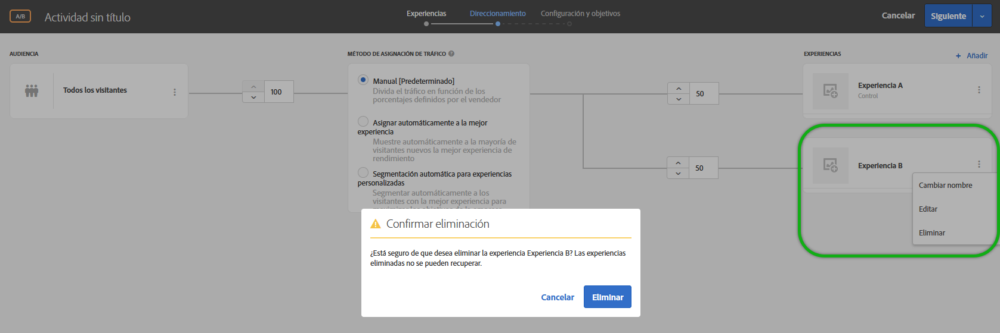 </p> <p>Consulte: </p> <p> 
     <ul id="ul_CB0C1146716F4C09BF924CF3DFA7DC1A"> 
      <li id="li_3767DD36F597481FB312CC577CD668F0"> <p>Actividad A/B:  <a href="../c-activities/t-test-ab/t-test-create-ab/ab-add-experience.md#task_454646F2895242D3B92DC395A0CE1A00" format="dita" scope="local"> Añadir experiencia </a> </p> </li> 
      <li id="li_E2990CA178C6446BA7206643A3164FEF"> <p>Actividad XT: <a href="../c-activities/t-experience-target/t-xt-create/xt-add-experience.md#task_454646F2895242D3B92DC395A0CE1A00" format="dita" scope="local">Crear una experiencia </a> </p> </li> 
     </ul> </p> <p>(TGT-30229) </p> </td> 
  </tr> 
  <tr> 
   <td colname="col1"> <p>Audiencias </p> </td> 
   <td colname="col2"> <p>Compare un atributo de perfil con otro, no con un número estático. </p> <p>Consulte <a href="../c-target/c-audiences/creating-a-profile-attribute-comparison-audience.md#concept_4C2124B79A5B4556A6C1D10C0F5E40A0" format="dita" scope="local"> Creación de una audiencia de comparación de atributos de perfil</a>. </p> <p> (TGT-28406) </p> </td> 
  </tr> 
  <tr> 
   <td colname="col1"> <p>Código personalizado </p> </td> 
   <td colname="col2"> <p>“Código personalizado” está ahora disponible en el panel “Agregar modificaciones”, ya no tiene su propia pestaña. También puede agregar más de un código personalizado y, si lo desea, asignarles nombres. (TGT-28504) </p> <p>Consulte <a href="../c-experiences/c-visual-experience-composer/c-vec-code-editor/vec-code-editor.md#concept_B3A6E9EE3A60406DB640E205EA1745B5" format="dita" scope="local">Modificaciones</a>. </p> </td> 
  </tr> 
  <tr> 
   <td colname="col1" class="premium"> <p>Recommendations </p> </td> 
   <td colname="col2"> <p> 
     <ul id="ul_371C18DFC6D24E94B3D4FFFD83FC8D3A"> 
      <li id="li_9D11939014E7479AB7FD8910852A5386"> <p>Vea una lista de las actividades que hacen referencia a un criterio seleccionado en su tarjeta Criterios. La tarjeta enumera las actividades activas e inactivas. (TGT-27672) </p> </li> 
      <li id="li_B97BF9305EB04F6D8B1F6178B2E0CB34"> <p>En el diagrama de actividad, las tarjetas de criterios ahora indican cuándo los resultados están listos para mostrarse. (TGT-27673) </p> <p>Consulte <a href="../c-recommendations/c-algorithms/algorithms.md#concept_4BD01DC437F543C0A13621C93A302750" format="dita" scope="local">Criterios</a>. </p> </li> 
     </ul> </p> </td> 
  </tr> 
  <tr> 
   <td colname="col1"> <p>Plantillas de experiencia </p> </td> 
   <td colname="col2"> <p>Las plantillas de experiencia de Adobe Target son ofertas precodificadas con entradas configurables que se utilizan en Target para ejecutar algunos casos de uso habituales para expertos en marketing. Estas plantillas de experiencia se proporcionan gratuitamente a los desarrolladores y expertos en marketing como punto de partida para la ejecución de algunos casos de uso externos habituales en Adobe Target, ya sea mediante el Compositor de experiencias visuales o el Compositor de experiencias basadas en formularios. Puede ser necesario realizar alguna personalización para que las plantillas se integren correctamente en el sitio web o en la arquitectura de la plataforma. </p> <p>Consulte <a href="../c-experiences/c-visual-experience-composer/c-vec-code-editor/experience-templates.md#concept_109BBD7EABC04DD39E6B7B1687786652" format="dita" scope="local"> Plantillas de experiencia</a>. </p> </td> 
  </tr> 
  <tr> 
   <td colname="col1"> <p>Serie de seminarios web sobre fundamentos de Target </p> </td> 
   <td colname="col2"> <p>Participe en la nueva  <a href="../cmp-resources-and-contact-information.md#concept_11902FAC95C64479AABE020557A7EEE4" format="dita" scope="local"> Serie de seminarios web sobre fundamentos de Target</a>, una serie de seminarios web de éxito de los clientes ofrecida por la comunidad. </p> </td> 
  </tr> 
 </tbody> 
</table>

**Mejoras, correcciones y cambios**

En esta versión de [!DNL Target] se incluyen las siguientes mejoras, correcciones y cambios:

* Se ha aumentado el tamaño del editor de texto enriquecido para mejorar su capacidad de uso. (TGT-24775)
* Se han rediseñado los diagramas del paso de Target (paso 2 del flujo de trabajo guiado de tres pasos) para las actividades de Personalización automatizada (AP) y Prueba multivariable (MVT) de modo que sean más coherentes con el diseño utilizado para las actividades A/B, de Segmentación de experiencias (XT) y de Recommendations. (TGT-30712)
* Ahora, el valor de métrica para el informe Contribución de ubicación de prueba multivariable (MVT) es más coherente con los valores de otras métricas, ya que se redondea con dos decimales. (TGT-30921)

### Versión 1.5.0 de at.js (22 de junio de 2018) {#section_53C622F4978F4BC9ACD932D4B7194C12}

<table id="table_B332A93D4A6E4568BA3F7FA8EC0787F4"> 
 <thead> 
  <tr> 
   <th colname="col1" class="entry"> Función.  / Mejora </th> 
   <th colname="col2" class="entry"> Descripción </th> 
  </tr> 
 </thead>
 <tbody> 
  <tr> 
   <td colname="col1"> <p>at.js </p> </td> 
   <td colname="col2"> <p>Ya está disponible la versión 1.5.0 de at.js. </p> <p> <p>Nota: Los números entre paréntesis son para uso interno de Adobe. </p> </p> <p> 
     <ul id="ul_41FE0EED2D8B4ADE84FC4CA0FA0CE8A0"> 
      <li id="li_2DC17381CB7949AFA35B054B9CA723FA"> <p>Los detalles del evento <span class="codeph">at-request-succeeded</span> contienen el indicador de redirección. Este indicador se puede utilizar para determinar si la página se redirigirá a una URL diferente. Si desea conocer la URL, suscríbase a <span class="codeph">at-content-rendering-redirect</span>. (TNT-29834) </p> </li> 
      <li id="li_2852878862724BB2BD475C8FC7BF20DA"> <p>Se solucionó un problema que provocaba que <span class="codeph">window.targetGlobalSettings.enabled</span> fallara con una excepción de tiempo de ejecución si se establecía en Falso. (TNT-29829) </p> </li> 
      <li id="li_96E5E409B36444F1B0E3E2606DC03996"> <p>Se solucionó un problema que provocaba que la página fallara al cargarse en el Compositor de experiencias visuales (VEC) si se incluía código personalizado en una solicitud mbox global y se utilizaba ocultación de texto. (TNT-29795) </p> </li> 
      <li id="li_818AA4EDDAC04D8B9BB4BA708D6BEF99"> <p>Se añadió compatibilidad con <span class="codeph">screenOrientation</span>, <span class="codeph">devicePixelRatio</span> y <span class="codeph">webGLRenderer</span>. Estos nuevos parámetros de solicitud de Target se utilizan para la detección de iPhone X y otros dispositivos modernos. Para obtener más información, consulte <a href="../c-target/c-audiences/c-target-rules/mobile.md#concept_2A794199DC1A4D349FFFBC7DCF1FEB89" format="dita" scope="local">Móvil</a>. (TNT-29781) </p> </li> 
      <li id="li_87E3FB8B423C472AB1EE0DF2D7C64885"> <p>Se solucionó un problema por el cual no siempre se enviaba la sugerencia de ubicación de Adobe Audience Manager (AAM). (TNT-29695) </p> </li> 
      <li id="li_E9E5A5035AC24F54ADEF5447E3F15D3B"> <p>En los navegadores compatibles, at.js 1.5.0 cambia a MutationObserver para el sondeo de selectores. Las versiones anteriores a at.js 1.0.0 utilizaban un polyfill MutationObserver que resultó problemático. Para evitar problemas de polyfill, la versión 1.5.0 utiliza el siguiente pseudocódigo a fin de decidir el mecanismo de programación que debe utilizarse: </p> <p> 
        <code>
          if MutationObserver is supported scheduler = MutationObserver else if document is visible scheduler = requestAnimationFrame else scheduler = setTimeout 
        </code> </p> </li> 
     </ul> </p> </td> 
  </tr> 
 </tbody> 
</table>

### Target Standard/Premium 18.6.1 (20 de junio de 2018) {#section_B63C660815B245DA9922BE33E03734A1}

Esta versión incorpora las siguientes funciones y mejoras:

>[!NOTE]
>
>Los números entre paréntesis de los problemas son para uso interno de Adobe.

<table id="table_5A60FFE5E86148F4BDC6A7031D03D6BA"> 
 <thead> 
  <tr> 
   <th colname="col1" class="entry"> Función.  / Mejora </th> 
   <th colname="col2" class="entry"> Descripción </th> 
  </tr> 
 </thead>
 <tbody> 
  <tr> 
   <td colname="col1"> <p>Compositor de experiencias visuales (VEC) </p> </td> 
   <td colname="col2"> <p>Cuando hace clic en una acción en el panel Modificaciones, el VEC desplaza automáticamente la página web y resalta el elemento correspondiente. Ya no es necesario desplazarse manualmente hacia abajo para encontrar el elemento HTML afectado por la modificación. </p> <p> 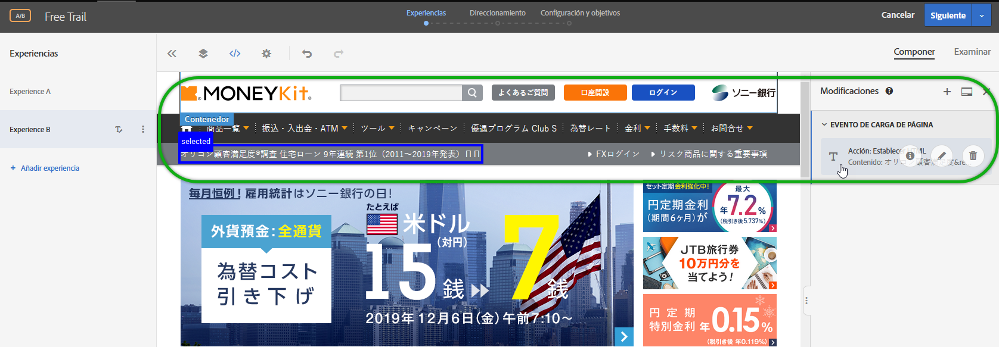 </p> <p>(TGT-30441) </p> </td> 
  </tr> 
  <tr> 
   <td colname="col1"> <p>Navegadores admitidos </p> </td> 
   <td colname="col2"> <p>Se ha agregado compatibilidad con Microsoft Edge para la interfaz de usuario de Target y la distribución de contenido. </p> <p>Para obtener más información, consulte <a href="../c-implementing-target/c-considerations-before-you-implement-target/supported-browsers.md#reference_01B4BF99E7D545A7998773202A2F6100" format="dita" scope="local"> Exploradores compatibles </a> (TGT-14102) </p> </td> 
  </tr> 
  <tr> 
   <td colname="col1" class="premium"> <p>Recommendations </p> </td> 
   <td colname="col2"> <p>Los criterios de Elementos visualizados recientemente ahora devuelven resultados específicos de un <a href="../administrating-target/hosts.md#concept_516BB01EBFBD4449AB03940D31AEB66E" format="dita" scope="local">entorno</a> determinado. Si dos sitios pertenecen a entornos distintos y un visitante alterna entre ellos, cada sitio muestra solo los elementos visualizados recientemente desde el sitio adecuado. Si dos sitios se encuentran en el mismo entorno y un visitante cambia entre los dos, el visitante verá los mismos artículos vistos recientemente en ambos. </p> <p>Para obtener más información, consulte <a href="../c-recommendations/c-algorithms/create-new-algorithm.md#task_2B0ED54AFBF64C56916B6E1F4DC0DC3B" format="dita" scope="local">Basar la recomendación en una clave de recomendación</a>. (RECS-5865) </p> </td> 
  </tr> 
 </tbody> 
</table>

**Mejoras, correcciones y cambios**

En esta versión de [!DNL Target] se incluyen las siguientes mejoras, correcciones y cambios:

* La fila Copia de seguridad de la descarga de CSV de Recomendaciones ahora comienza con &quot;*&quot; (un asterisco entre comillas dobles), no con * (un solo asterisco).
* La fila Más vendidos/Más visitados de la descarga de CSV de Recommendations ya no comienza con una coma.

### Cambios en la plataforma de Target (19 de junio de 2018).  {#section_0638BD69F3C640479A2A258AD78C0884}

Esta versión incluye la siguiente mejora:

>[!NOTE]
>
>Los números entre paréntesis de los problemas son para uso interno de Adobe.

* Se ha actualizado la lista de dispositivos para incluir los modelos de teléfono más recientes. Se ha agregado la capacidad de entregar contenido segmentado a modelos específicos de iPhone por medio del Nombre de marketing del dispositivo o el Modelo de dispositivo.

   Los clientes que utilicen el SDK móvil no tienen que hacer nada para aprovechar esta funcionalidad. Los clientes que utilicen at.js deben actualizar a la versión 1.5.0 de at.js.

   Para obtener más información, consulte [Móvil](../c-target/c-audiences/c-target-rules/mobile.md#concept_2A794199DC1A4D349FFFBC7DCF1FEB89). (TNT-26714 &amp; TNT-28288)

### API de descarga de Target (5 de junio de 2018).  {#section_B8729DA10F18433C8D8E01B04F308ED2}

Puede utilizar la API de descarga de Recommendations para descargar las recomendaciones en un archivo .CSV, que se puede visualizar en una hoja de cálculo o un editor de textos Para mejorar la seguridad, a partir del **5 de junio de 2018**, Target bloqueará las solicitudes HTTP y permitirá únicamente las solicitudes HTTPS.

### Target Standard/Premium 18.5.1 (22 de mayo de 2018).  {#section_7C1427793C2A48DBAC39F8290717DC5B}

Esta versión incorpora las siguientes funciones y mejoras:

>[!NOTE]
>
>Los números entre paréntesis de los problemas son para uso interno de Adobe.

<table id="table_1C51F61184684072BC69AD15BA68BEBB"> 
 <thead> 
  <tr> 
   <th colname="col1" class="entry"> Función </th> 
   <th colname="col2" class="entry"> Descripción </th> 
  </tr> 
 </thead>
 <tbody> 
  <tr> 
   <td colname="col1"> <p>Informes </p> </td> 
   <td colname="col2"> <p> 
     <ul id="ul_8D08FE4AC7D748EFB2BBFF87DBDC5CE5"> 
      <li id="li_B8929C19276D42168A28A3775CDEDFB3"> <p>Puede guardar hasta diez ajustes preestablecidos de un informe de actividad después de configurarlo a su gusto (métricas, audiencias, configuración avanzada, etcétera). Todos los usuarios de Target pueden visualizar, modificar y eliminar los distintos ajustes preestablecidos, independientemente de quién los haya creado. (TGT-21268) </p> </li> 
      <li id="li_7ADA62F2ACA049C9B4A8986B09A9F4AA"> <p>Puede configurar un informe de actividad a su gusto y después guardar dicha configuración como su ajuste preestablecido predeterminado/favorito. Esta es la vista que se muestra cuando ve avanzar el informe de la actividad. (TGT-10082) </p> </li> 
      <li id="li_DC63C04F3A884BDDA55B5515E4643B7B"> <p>Si alguna audiencia, métrica, grupo de hosts o experiencia se elimina de un informe preestablecido ya configurado, recibirá un aviso o mensaje al respecto dentro de los informes. El aviso o mensaje le indica que elija otra audiencia, métrica, grupo de hosts o experiencia para volver a crear un ajuste preestablecido. (TGT-29424) </p> </li> 
     </ul> </p> <p>Para obtener más información, consulte la sección Ajuste preestablecido de Target en  <a href="../c-reports/c-report-settings/report-settings.md#concept_3A80D5A394EC4B639DC715E06085BDB0" format="dita" scope="local"> Configuración del informe</a>. </p> </td> 
  </tr> 
  <tr> 
   <td colname="col1"> <p>Scripts de perfil </p> </td> 
   <td colname="col2"> <p> 
     <ul id="ul_F382C8E7708846A08676E1534BC92878"> 
      <li id="li_70E89504525C4119B588C230DCE772E8"> <p>Puede ver tarjetas emergentes con información sobre scripts de perfil similares a las tarjetas de información de ofertas. Estas tarjetas le permiten ver la lista de actividades que hacen referencia al script de perfil seleccionado, además de otros metadatos útiles. (TGT-28253) </p> <p>Para obtener más información, consulte la sección Visualización de tarjetas de información de scripts de perfil en  <a href="../c-target/c-visitor-profile/profile-parameters.md#concept_8C07AEAB0A144FECA8B4FEB091AED4D2" format="dita" scope="local"> Atributos de script de perfil </a>. </p> </li> 
     </ul> </p> </td> 
  </tr> 
  <tr> 
   <td colname="col1"> <p>Audiencias </p> </td> 
   <td colname="col2"> <p> 
     <ul id="ul_DFEB778393024E3EBBC482F31A5B39BC"> 
      <li id="li_4049E334A38F4F94842FF1E35F177FE9"> <p>La creación de audiencias personalizadas ahora le permite utilizar el parámetro del mbox directamente sin tener que especificar obligatoriamente el nombre del mbox. El nombre del mbox es ahora opcional. Este cambio le permite usar parámetros de varios mboxes o hacer referencia a un parámetro que aún no se haya registrado en el perímetro. También puede filtrar los parámetros de mbox empleando el filtro de nombres de mbox. </p> <p>Esta misma mejora se ha extendido también a Criterios de Recommendations, Promociones de Recommendations y las reglas de prueba de plantilla. </p> </li> 
     </ul> </p> <p>Para obtener más información, consulte  <a href="../c-target/c-audiences/c-target-rules/custom-parameters.md#concept_C4C6E00D7C5A4BE9B72D471DB2E3027B" format="dita" scope="local"> Parámetros personalizados</a>. </p> </td> 
  </tr> 
  <tr> 
   <td colname="col1" class="premium"> <p>Recommendations </p> </td> 
   <td colname="col2"> <p> 
     <ul id="ul_7765B69E679D4C94B1E863E340DFDE15"> 
      <li id="li_F2AF7E1AFBD6461990EF1D83D1989582"> <p>Cuando se seleccionan los criterios de Recommendations en el Compositor de experiencias basadas en formularios, ahora existe un vínculo directo a la tarjeta de criterios seleccionada de modo que pueda editarlos de forma rápida y sencilla. (TGT-28483) </p> <p>Para obtener más información, consulte <a href="../c-experiences/form-experience-composer.md#task_FAC842A6535045B68B4C1AD3E657E56E" format="dita" scope="local">Compositor de experiencias basadas en formularios</a>. </p> </li> 
      <li id="li_517F0A174587416B8621D6F710C1AC48"> <p>Ahora, la creación de Criterios de recomendaciones, Promociones de recomendaciones y reglas de prueba de plantilla permite utilizar directamente el parámetro del mbox sin necesidad de especificar obligatoriamente el nombre del mbox. El nombre del mbox es ahora opcional. Este cambio le permite usar parámetros de varios mboxes o hacer referencia a un parámetro que aún no se haya registrado en el perímetro. También puede filtrar los parámetros de mbox empleando el filtro de nombres de mbox. </p> <p>Esta misma mejora se ha extendido también a la creación de audiencias personalizadas. </p> <p>Para obtener más información, consulte <a href="../c-recommendations/c-recommendations-faq/recommendations-faq.md#concept_EF272DE4AC6C47B19026BFBE816F5DB8" format="dita" scope="local"> Preguntas más frecuentes de Recommendations</a>. </p> </li> 
      <li id="li_AAB242830D1E47B78E58A980B717C736"> <p>Se ha actualizado la interfaz de las tarjetas de diseño de Recommendations. </p> </li> 
      <li id="li_1BE3178663E54F4CA8714FE3ACDBB97B"> <p>La documentación de la API de Recommendations de Target se encuentra en el <a href="https://www.adobe.io/apis/experiencecloud/target/docs/getting-started.html" format="html" scope="external">sitio web de Adobe I/0 Adobe Target</a> (https://www.adobe.io/apis/experiencecloud/target/docs/getting-started.html). </p> </li> 
     </ul> </p> </td> 
  </tr> 
 </tbody> 
</table>

**Mejoras, correcciones y cambios**

En esta versión de [!DNL Target] se incluyen las siguientes mejoras, correcciones y cambios:

* Se ha actualizado la interfaz de usuario del paso 2 del flujo de trabajo guiado de tres pasos de Target utilizado para crear o editar una actividad de Prueba A/B, Segmentación de experiencias (XT) o Recommendations. (TGT-18911)

### Target Standard/Premium 18.4.1 (25 de abril de 2018) {#section_445DBC5402BA456BAF2D24AEA33A91C9}

Esta versión incorpora las siguientes funciones y mejoras:

>[!NOTE]
>
>Los números entre paréntesis de los problemas son para uso interno de Adobe.

<table id="table_6D99C48B72D24728BF623608053931D3"> 
 <thead> 
  <tr> 
   <th colname="col1" class="entry"> Función </th> 
   <th colname="col2" class="entry"> Descripción </th> 
  </tr> 
 </thead>
 <tbody> 
  <tr> 
   <td colname="col1"> <p>Fragmentos de experiencia de Adobe Experience Manager (AEM) </p> </td> 
   <td colname="col2"> <p>El empleo en actividades de Target de fragmentos de experiencia creados en AEM le permite combinar la facilidad de uso y la potencia de AEM con potentes capacidades de Inteligencia automatizada (AI) y Aprendizaje automático (ML) en Target para probar y personalizar experiencias a escala. &amp;nbsp;&amp;nbsp; </p> <p>AEM aúna todos sus contenidos y recursos en una ubicación centralizada que potencia su estrategia de personalización. AEM le permite crear fácilmente contenido para equipos de escritorio, tabletas y dispositivos móviles en una misma ubicación y sin tener que escribir código. No es necesario crear páginas para cada dispositivo: AEM ajusta automáticamente la experiencia empleando su contenido. </p> <p> Target le permite ofrecer experiencias personalizadas a escala empleando una combinación de enfoques de aprendizaje automático basados en reglas y dirigidos por AI que incorporan variables de comportamiento, contextuales y sin conexión.Target le permite configurar y ejecutar fácilmente actividades A/B y multivariable para determinar las mejores ofertas, contenidos y experiencias. </p> <p>Los fragmentos de experiencia representan un enorme paso adelante en el vínculo entre, por un lado, los creadores y gestores de contenido/experiencia y, por otro, los profesionales de la optimización y la personalización que dirigen mediante Target los resultados del negocio. </p> <p>Para obtener más información, consulte <a href="../c-experiences/c-manage-content/aem-experience-fragments.md#topic_1E1E4EA01F074349B2CF8785387B5FE8" format="dita" scope="local">Fragmentos de experiencia de AEM</a>. </p> </td> 
  </tr> 
  <tr> 
   <td colname="col1"> <p>Informes </p> </td> 
   <td colname="col2"> 
    <ul id="ul_EAB90C510EA04D6A8AEFF23A77DB2337"> 
     <li id="li_47DA6EB92CC84FFDBFDC9CC9386AF654"> <p>Ya puede volver a cargar un informe para actualizar su vista de gráfico y tabla sin volver a cargar toda la página, su configuración o su intervalo de datos. (TGT-28125) </p> <p>Para obtener más información, consulte <a href="../c-reports/c-report-settings/report-settings.md#concept_3A80D5A394EC4B639DC715E06085BDB0" format="dita" scope="local">Configuración de informes</a>. </p> </li> 
     <li id="li_AB2DE7A45D914FD7AEB0832187AF3844"> <p>El calendario de los informes contiene ahora intervalos de fechas predefinidos, como los últimos 7 días, los últimos 15 días, etc. (TGT-29171) </p> <p>Para obtener más información, consulte <a href="../c-reports/c-report-settings/report-settings.md#concept_3A80D5A394EC4B639DC715E06085BDB0" format="dita" scope="local">Configuración de informes</a>. </p> </li> 
     <li id="li_46DF9037E0ED4935B3BCDB35E8BED065"> <p>El ancho de columna de la vista de tabla se ha modificado para reducir el desplazamiento horizontal cuando hay varias métricas aplicadas. (TGT-26575) </p> </li> 
    </ul> </td> 
  </tr> 
  <tr> 
   <td colname="col1"> <p>Localización de la IU </p> </td> 
   <td colname="col2"> <p>La IU de Target ya se encuentra disponible en los siguientes idiomas: </p> <p> 
     <ul id="ul_DB6C771FCFDF43F498F8754920A70BCD"> 
      <li id="li_A65D07DF66844AC8BEEC1D413F214191"> <p>Chino simplificado </p> </li> 
      <li id="li_5986DD06AF5B4F76B3A02CFBF2DC3644"> <p>Chino tradicional </p> </li> 
      <li id="li_341FDC1CEC2B4C4BBD45CB2A0A54F2A3"> <p>Coreano </p> </li> 
      <li id="li_A4C31539B98E42348D5F1A18C63EAB6C"> <p>Italiano </p> </li> 
      <li id="li_97E3E0A916B64601BBF601AAED581174"> <p>Portugués </p> </li> 
     </ul> </p></td> 
  </tr> 
  <tr> 
   <td colname="col1"> <p>Audiencias </p> </td> 
   <td colname="col2"> <p>Al crear una audiencia personalizada basada en un parámetro de mbox, <span class="codeph">mboxParameter</span> ya no le pide que especifique un valor para <span class="codeph">mboxName</span>. El nombre del mbox es ahora opcional. Este cambio le permite usar parámetros de varios mboxes o hacer referencia a un parámetro que aún no se haya registrado en el perímetro. (TGT-25807) </p> <p> <p>Nota: Esta función está visible en la interfaz de usuario de Target, pero se encuentra deshabilitada. Se habilitará pronto (la fecha se comunicará más adelante). </p> </p> 
  </td> 
  </tr> 
 </tbody> 
</table>

**Mejoras, correcciones y cambios**

En esta versión de [!DNL Target] se incluyen las siguientes mejoras, correcciones y cambios:

* Seguridad de capa de transporte (TLS) es el protocolo de seguridad más implementado que se usa hoy en día para navegadores web y otras aplicaciones que requieren que los datos se intercambien de forma segura en una red. Adobe tiene estándares de cumplimiento de seguridad que requieren la discontinuación de protocolos más viejos y exigen el uso de TLS 1.2 para tener en uso la versión más actualizada y segura. A partir de la versión de Target 18.4.1 (25 de abril de 2018), Adobe Target tomará medidas para avanzar hacia el cifrado TLS 1.2 y habrá eliminado completamente la compatibilidad con el cifrado TLS 1.0 antes del 12 de septiembre de 2018. Es importante que revise los detalles específicos y que planifique los cambios para garantizar una transición sin contratiempos. Para obtener más información, consulte [Cambios de codificación de TLS (Transport Layer Security)](../c-implementing-target/c-considerations-before-you-implement-target/tls-transport-layer-security-encryption.md#concept_CC1001E9D3AE4BABAF90B8311B0A6451).
* Se ha mejorado la interfaz de usuario para tarjetas de criterio de recomendaciones, lo que permite una mejor utilización. (TGT-27829)

### at.js (3 de abril de 2018) {#section_932DF1004F4648668FE4984BFAF2EC49}

Esta versión incorpora las siguientes funciones y mejoras:

<table id="table_76576D9D931B4DA99900F2C03175938E"> 
 <thead> 
  <tr> 
   <th colname="col1" class="entry"> Función </th> 
   <th colname="col2" class="entry"> Descripción </th> 
  </tr> 
 </thead>
 <tbody> 
  <tr> 
   <td colname="col1"> <p>at.js </p> </td> 
   <td colname="col2"> <p>Ya está disponible la versión 1.3.0 de at.js. Para obtener más información, consulte <a href="../c-implementing-target/c-implementing-target-for-client-side-web/how-to-deployatjs/implementing-target-without-a-tag-manager.md#concept_1E1F958F9CCC4E35AD97581EFAF659E2" format="dita" scope="local">Descargar at.js</a> y <a href="../c-implementing-target/c-implementing-target-for-client-side-web/target-atjs-versions.md#reference_DBB5EDB79EC44E558F9E08D4774A0F7A" format="dita" scope="local">Detalles de la versión de at.js</a>. </p> <p> 
     <ul id="ul_349BEB37B6C94FF0801F121042037803"> 
      <li id="li_4C2F82F4DD394ED5A0BFF978B15FEDDF"> <p>Los siguientes eventos nuevos sirven para ayudar a rastrear, depurar y personalizar la interacción con at.js: </p> <p> 
        <ul id="ul_EFF7E2FCEA0D42298779DDE13B54503F"> 
         <li id="li_6A2B06A522004EDE96D9A552571A7C30"> <p>LIBRARY_LOADED </p> </li> 
         <li id="li_61AA203A21DF4B7EAE075374A09C8FF0"> <p>REQUEST_START </p> </li> 
         <li id="li_DAF9CC1E86834C62B93419429B43A2CB"> <p>CONTENT_RENDERING_START </p> </li> 
         <li id="li_A52DC337115248A1BE5AF5B358BE5A9A"> <p>CONTENT_RENDERING_NO_OFFERS </p> </li> 
         <li id="li_7D71E48016B1446995493EBBF7D32447"> <p>CONTENT_RENDERING_REDIRECT </p> </li> 
        </ul> </p> <p>Para obtener más información, consulte <a href="../c-implementing-target/c-implementing-target-for-client-side-web/cmp-atjs-functions.md#reference_A828E4BA535F4E7692A075F3D70CF6CD" format="dita" scope="local">Eventos personalizados de at.js</a>. </p> </li> 
      <li id="li_E2704294F8BA47FFAABE7572F67FB5C0"> <p>Puede aumentar una solicitud at.js con parámetros adicionales que provengan de los proveedores de datos. Los proveedores de datos deben añadirse a <span class="codeph">window.targetGlobalSettings</span> bajo la <span class="codeph">clave dataProviders</span>. </p> <p>Para obtener más información, consulte “Proveedores de datos” en <a href="../c-implementing-target/c-implementing-target-for-client-side-web/cmp-atjs-functions.md#concept_8DACBC47ABDE4279BB102B42609FE506" format="dita" scope="local">targetGlobalSettings()</a>. </p> </li> 
      <li id="li_02EAFE6DA0D44CF88980184FD14226A5"> <p>Las solicitudes at.js ahora usan GET, pero cambiarán a POST cuando el tamaño de la URL exceda los 2048 caracteres. Hay una nueva propiedad llamada <span class="codeph">urlSizeLimit</span> donde puede aumentar el límite de tamaño si es necesario. Este cambio permite que Target equipare at.js con AppMeasurement, que emplea la misma técnica. </p> </li> 
      <li id="li_43363A4F3A764394AA88D2595F93D8C0"> <p>El objetivo ahora impone que se use la clave <span class="codeph">mbox</span> en la función <span class="codeph">adobe.target.applyOffer(options)</span>. Esta clave se ha requerido en el pasado, pero Target impone ahora su uso para garantizar que Target tenga la validación adecuada y los clientes usen la función correctamente. </p> <p>Para obtener más información, consulte <a href="../c-implementing-target/c-implementing-target-for-client-side-web/cmp-atjs-functions.md#reference_BBE83F513B5B4E03BBC3F50D90864245" format="dita" scope="local">adobe.target.applyOffer(options)</a>. </p> </li> 
      <li id="li_7336D8D48A894291A378E0BB212B7F9B"> <p>at.js ha mejorado la funcionalidad de seguimiento de eventos y clics. at.js utiliza <span class="codeph">navigator.sendBeacon()</span> para enviar datos de seguimiento de eventos y se volverá a utilizar XHR sincrónico cuando no se admita <span class="codeph">navigator.sendBeacon()</span>. Este reutilización afecta principalmente a Internet Explorer 10 y 11 y algunas versiones de Safari. Safari añadirá compatibilidad para <span class="codeph">navigator.sendBeacon()</span> en la versión de iOS 11.3. </p> </li> 
      <li id="li_28D7324137B14C75BF6F1EA0B2487C9B"> <p>Ahora, at.js puede presentar ofertas incluso cuando una página se abre en pestañas de fondo. Algunos clientes de Target encontraban un problema cuando <span class="codeph">requestAnimationFrame()</span> se deshabilitaba debido al comportamiento de regulación del navegador para las pestañas de fondo. </p> </li> 
      <li id="li_3278979E1C6C41DEA7E8025AEB337985"> <p>Esta versión agrega muchas mejoras de rendimiento, incluyendo pilas de llamadas más cortas al inspeccionar un perfil de la CPU de Chrome. </p> </li> 
      <li id="li_AAA9C0DCC3354DFA8907968C8E6427F6"> <p>at.js 1.3.0 ya no admite la publicación de contenido en Microsoft Internet Explorer 9. Para ver la lista de navegadores compatibles, consulte  <a href="../c-implementing-target/c-considerations-before-you-implement-target/supported-browsers.md#reference_01B4BF99E7D545A7998773202A2F6100" format="dita" scope="local"> Exploradores admitidos</a>. En el futuro, todas las solicitudes se ejecutarán a través de <span class="codeph">XMLHttpRequest</span> con compatibilidad con CORS sin solicitudes JSONP. Este cambio mejora mucho la seguridad. </p> </li> 
     </ul> </p> </td> 
  </tr> 
 </tbody> 
</table>

### Target Standard/Premium 18.3.1 (20 de marzo de 2018).  {#section_880706BE15544A03A2C951F267F4AEC5}

Esta versión incorpora las siguientes funciones y mejoras:

>[!NOTE]
>
>Los números entre paréntesis de los problemas son para uso interno de Adobe.

<table id="table_AE38682151A948AEA21E35A353F18D76"> 
 <thead> 
  <tr> 
   <th colname="col1" class="entry"> Función </th> 
   <th colname="col2" class="entry"> Descripción </th> 
  </tr> 
 </thead>
 <tbody> 
  <tr> 
   <td colname="col1" class="premium"> <p>Atributo Popularidad por entidad </p> </td> 
   <td colname="col2"> <p><b>Nuevo: 22 de marzo de 2018</b> </p> <p>Ahora puede elegir el atributo Popularidad por entidad en el flujo existente cuando se selecciona un atributo personalizado como clave. </p> <p>Después de seleccionar la clave deseada (en este caso, un atributo de perfil personalizado), para “Lógica de recomendación”, puede elegir dos nuevas opciones: </p> <p> 
     <ul id="ul_7A6F2398ADE846EF8A7A3110C2736BF7"> 
      <li id="li_66BFF016564749B298B88F6B9638B64E"> <p>Más visitados </p> </li> 
      <li id="li_937FE5C40ED8471391B282D1ACE8C133"> <p>Principales vendedores </p> </li> 
     </ul> </p> <p>Para obtener más información, consulte la fila “Atributo personalizado” en  <a href="../c-recommendations/c-algorithms/create-new-algorithm.md#task_2B0ED54AFBF64C56916B6E1F4DC0DC3B" format="dita" scope="local">Basar la recomendación en una clave de recomendación</a>. </p> </td> 
  </tr> 
  <tr> 
   <td colname="col1"> <p>Audiencias </p> </td> 
   <td colname="col2"> <p>Al ver la tarjeta emergente de definiciones de audiencia (por ejemplo, desde la Biblioteca de audiencias), ahora puede ver otras actividades que hacen referencia a esa audiencia, si es aplicable. De esta forma, puede evitar impactos accidentales en otras actividades durante la edición de audiencias. </p> <p>Antes, al intentar eliminar una audiencia a la que se hacía referencia en alguna actividad, se mostraba un mensaje de advertencia que le informaba de que la audiencia en cuestión no podía eliminarse e indicaba una lista de, como máximo, 10 actividades en las que se hacía referencia a la audiencia. </p> <p>Para obtener más información, consulte <a href="../c-target/c-audiences/audiences.md#concept_65BE870D290E412D8BBF557EEA67C271" format="dita" scope="local">Acerca de las audiencias</a>. </p> </td> 
  </tr> 
  <tr> 
   <td colname="col1"> <p>Informes </p> </td> 
   <td colname="col2"> <p>Se mejoró la información de elevación y límites en los informes para que sea más completa y útil, incluida una información sobre herramientas que explica cómo se calculan los límites. (TGT-28729) </p> <p>Para obtener más información, consulte <a href="../c-reports/c-report-settings/average-lift-bounds-and-confidence-interval.md#topic_AFFDC672A8A34D028B100EF6BE5D8129" format="dita" scope="local">Promedio de alza, límites de alza e intervalo de confianza </a>. </p> </td> 
  </tr> 
  <tr> 
   <td colname="col1" class="premium"> <p>Actividades de personalización automatizada (AP) y segmentación automática </p> </td> 
   <td colname="col2"> <p>Encontrará disponibles más directrices en la IU y en la Ayuda para que pueda asignar los porcentajes de tráfico de forma más eficaz en las actividades de personalización automatizada y segmentación automática. </p> <p>Para obtener más información, consulte <a href="../c-activities/auto-target-to-optimize.md#section_AB3656F71D2D4C67A55A24B38092958F" format="dita" scope="local">Determinación de la asignación de tráfico</a> y <a href="../c-activities/t-automated-personalization/create-ap-activity.md#task_8AAF837796D74CF893CA2F88BA1491C9" format="dita" scope="local">Creación de una actividad de personalización automatizada</a>. </p> </td> 
  </tr> 
  <tr> 
   <td colname="col1" class="premium"> <p>Recommendations: reglas de inclusión, colecciones y exclusiones para criterios personalizados </p> </td> 
   <td colname="col2"> <p>Ahora puede realizar el filtrado en tiempo real sobre su propia salida de criterios personalizados. Por ejemplo, puede limitar sus artículos recomendados solo a aquellos de la categoría o marca favorita de un visitante. Esto le da la capacidad de combinar cálculos sin conexión con filtrado en tiempo real. </p> <p>Con la incorporación de reglas de inclusión en los criterios personalizados, las recomendaciones que anteriormente serían estáticas se convierten en dinámicas, en función de los intereses del visitante. </p> <p> 
     <ul id="ul_BDD55AB34F4A43C691D2399C16AA3D6C"> 
      <li id="li_133C33E0D02E4861A4C855BD8A492E69"> <p>Los criterios personalizados ya pueden configurarse al igual que los demás criterios de las recomendaciones. </p> </li> 
      <li id="li_AC201F0917BF465C985E8947635F762E"> <p>Puede usar colecciones, exclusiones e inclusiones (incluidas las reglas especiales para Precio e inventario) de la misma forma que cualquier otro criterio. Las colecciones y exclusiones ya eran compatibles. Esta versión añade inclusiones. </p> </li> 
     </ul> </p> <p>Para obtener más información, consulte  <a href="../c-recommendations/c-algorithms/algorithms.md#concept_4BD01DC437F543C0A13621C93A302750" format="dita" scope="local"> Criterios</a>. </p> <p>(TGT-28488) </p> </td> 
  </tr> 
  <tr> 
   <td colname="col1" class="premium"> <p>Recommendations: reglas de inclusión, colecciones y exclusiones para criterios de elementos visualizados recientemente </p> </td> 
   <td colname="col2"> <p>Los elementos vistos recientemente se pueden filtrar ahora para que solo se muestren los elementos con un atributo en particular. Por ejemplo, una empresa multinacional con múltiples negocios podría tener elementos de visualización de visitantes en múltiples propiedades digitales. En este caso, se pueden limitar los elementos vistos recientemente para que solo se muestren en relación con la propiedad respectiva en la que se visualizaron. Esto impide que los Elementos visualizados recientemente se muestren en el sitio de otra propiedad digital. </p> <p> 
     <ul id="ul_A2D260F01CA047EEA72EF56BD0EE88FA"> 
      <li id="li_DB107DD357B741CCB2B7A4FDAD16F9D6"> <p>Los criterios de elementos visualizados recientemente ya pueden configurarse al igual que los demás criterios de las recomendaciones. </p> </li> 
      <li id="li_85452C03F0924D4C8D854509F1293021"> <p>Puede usar colecciones, exclusiones e inclusiones (incluidas las reglas especiales para Precio e inventario) de la misma forma que cualquier otro criterio. Las colecciones y exclusiones ya eran compatibles. Esta versión añade inclusiones. </p> </li> 
     </ul> </p> <p>Para obtener más información, consulte  <a href="../c-recommendations/c-algorithms/algorithms.md#concept_4BD01DC437F543C0A13621C93A302750" format="dita" scope="local"> Criterios</a>. </p> <p>(TGT-22843) </p> </td> 
  </tr> 
  <tr> 
   <td colname="col1"> <p>Extensión de Target para Adobe Launch </p> </td> 
   <td colname="col2"> <p>Launch es la función de administración de etiquetas de próxima generación de Adobe. Launch ofrece a los clientes una alternativa sencilla para implementar y gestionar todas las etiquetas de análisis, marketing y publicidad necesarias para potenciar las importantes experiencias del cliente. </p> <p>Las extensiones de Target le permiten implementar Target en su entorno de forma rápida y fácil. </p> <p>Para obtener más información, consulte  <a href="../c-implementing-target/c-implementing-target-for-client-side-web/how-to-deployatjs/cmp-implementing-target-using-adobe-launch.md#topic_5234DDAEB0834333BD6BA1B05892FC25" format="dita" scope="local"> Implementar Target utilizando Adobe Launch</a>. </p> </td> 
  </tr> 
 </tbody> 
</table>

**Mejoras, correcciones y cambios**

En esta versión de [!DNL Target] se incluyen las siguientes mejoras, correcciones y cambios:

* Al crear o editar las actividades A/B y segmentación de experiencias (XT), Target retiene información sobre la última experiencia, página o versión de experiencia abierta (a través de la función de múltiples audiencias) y abre la página apropiada la próxima vez que abra la IU de destino. (TGT-28225)
* Se han efectuado correcciones de seguridad para fines de cumplimiento.

### Target Standard/Premium 18.2.1 (15 de febrero de 2018) {#section_837CBBB7A89D45D99855A8C5F5E7BFFB}

Esta versión incorpora las siguientes funciones y mejoras:

<table id="table_1C7A462AE8D4492FA5555F060031F665"> 
 <thead> 
  <tr> 
   <th colname="col1" class="entry"> Función </th> 
   <th colname="col2" class="entry"> Descripción </th> 
  </tr> 
 </thead>
 <tbody> 
  <tr> 
   <td colname="col1"> <p>Se ha cambiado el nombre de Adobe Marketing Cloud y ahora se conoce como Adobe Experience Cloud. </p> </td> 
   <td colname="col2"> <p>Experience Cloud es la familia integrada de soluciones y servicios de marketing digital de Adobe. También es una intuitiva interfaz que le permite acceder rápidamente a sus soluciones y servicios principales en la nube. </p> <p>Cambio de marca y cambios de IU: Adobe Marketing Cloud ha cambiado de marca y ahora se llama Adobe Experience Cloud. Además, verá modificaciones de la IU en la interfaz de Target y en la aplicación de cambio de solución. </p> <p>Para obtener más información sobre este cambio, consulte <a href="https://docs.adobe.com/content/help/en/core-services/interface/about-core-services/solutions-core-services.html" format="html" scope="external">Acerca de los nuevos nombres de las nubes en Experience Cloud</a>. </p> </td> 
  </tr> 
 </tbody> 
</table>

**Mejoras, correcciones y cambios**

Esta versión de [!DNL Target] incluye mejoras de back-end, correcciones y cambios.

### Plataforma de Target (18 de enero de 2018) {#section_F6A0DC31636D403F92BDB9DCE7A3F6ED}

Esta versión incorpora las siguientes funciones y mejoras:

<table id="table_0F5BF9370E214302BDFE0AC2D66EC773"> 
 <thead> 
  <tr> 
   <th colname="col1" class="entry"> Función </th> 
   <th colname="col2" class="entry"> Descripción </th> 
  </tr> 
 </thead>
 <tbody> 
  <tr> 
   <td colname="col1"> <p>at.js </p> </td> 
   <td colname="col2"> <p>at.js 1.2.3 incorpora compatibilidad con ofertas JSON. Las ofertas JSON solo se admiten en actividades creadas con el Compositor de experiencias basadas en formularios. En estos momentos, la única forma de utilizar las ofertas JSON es mediante llamadas directas a API. Consulte <a href="../c-experiences/c-manage-content/create-json-offer.md#concept_63C7BEE1F0DB4A7596D997219B7C136D" format="dita" scope="local">Creación de una oferta JSON</a>. </p> </td> 
  </tr> 
  <tr> 
   <td colname="col1"> <p>Otros cambios </p> </td> 
   <td colname="col2"> <p>Ahora las reglas de exclusión, los catálogos, las reglas de inclusión de algoritmos y el filtrado en tiempo de ejecución distinguen entre mayúsculas y minúsculas. </p> </td> 
  </tr> 
 </tbody> 
</table>

### Target Standard/Premium 18.1.1 (23 de enero de 2018).  {#section_3A2216543B064D6F82EC03E1F8AEC74D}

Esta versión incorpora las siguientes funciones y mejoras:

>[!NOTE]
>
>Los números entre paréntesis de los problemas son para uso interno de Adobe.

<table id="table_872FE2BE61CC4A5CA369D9A6C730686E"> 
 <thead> 
  <tr> 
   <th colname="col1" class="entry"> Función </th> 
   <th colname="col2" class="entry"> Descripción </th> 
  </tr> 
 </thead>
 <tbody> 
  <tr> 
   <td colname="col1"> <p>Audiencias </p> </td> 
   <td colname="col2"> <p> 
     <ul id="ul_42D7C86043C94A7BBA5ED405B2902E3A"> 
      <li id="li_50F2A7D05AB244E18D263A476BD906B3"> <p>Ahora puede crear audiencias de Periodo de tiempo sin fechas de inicio o de fin. Esto le permite utilizar la misma audiencia en diferentes actividades (sin hacer ninguna copia de la audiencia), mientras controla las fechas de inicio y de fin en el nivel de actividad. Consulte <a href="../c-target/c-audiences/c-target-rules/time-frame.md#concept_0FE1E8DACD104F8B870B0BADE3197F0A" format="dita" scope="local">Lapso de tiempo</a>. (TGT-25975) </p> </li> 
      <li id="li_6F08D63BC4F040859D51C47C3521C5E1"> <p>La funcionalidad de Copiar y editar está disponible para audiencias solo de actividad. Para utilizarla, pase el cursor por encima de la audiencia en la página Elegir audiencia &gt; Audiencia solo de actividad. Anteriormente, esta funcionalidad solo se utilizaba en la biblioteca de audiencias. Consulte <a href="../c-target/creating-activity-only-audience.md#concept_A6BADCF530ED4AE1852E677FEBE68483" format="dita" scope="local"> Creación de una audiencia solo de actividad</a>. (TGT-27410) </p> </li> 
      <li id="li_A8CF45E6DC37401AA273F7D6CF617524"> <p>Las audiencias solo de actividad en actividades pueden tener el mismo nombre. Anteriormente, si había nombres duplicados, se añadían marcas de tiempo; una audiencia duplicada denominada “Segmentación en día laboral” se guardaba como “Segmentación en día laboral-1456732099201”. </p> <p>Para la biblioteca de audiencias se siguen requiriendo nombres únicos. (TGT-17967) </p> </li> 
     </ul> </p> </td> 
  </tr> 
  <tr> 
   <td colname="col1"> <p>Informes </p> </td> 
   <td colname="col2"> <p> 
     <ul id="ul_C595EEF916494342AD99FF0FDF999927"> 
      <li id="li_8C74478D3480406591DC876F69C19329"> <p>Ahora puede ver los intervalos de confianza para variables continuas. (TGT-22085) </p> </li> 
      <li id="li_21B31F91685C46CAA47688FDE5735312"> <p>Ahora Target muestra en los informes los límites de alza cuando son estadísticamente significativos.(TGT-27301, TGT-27794 y TGT-26387) </p> </li> 
     </ul> </p> <p>Consulte <a href="../c-reports/c-report-settings/report-settings.md#concept_4BB6A7FDAB6F4806A632F9CD989B8BFA" format="dita" scope="local">Configuración de informes </a>. </p> </td> 
  </tr> 
  <tr> 
   <td colname="col1"> <p>Ofertas </p> </td> 
   <td colname="col2"> <p> 
     <ul id="ul_BD0C5B260E7E4F139FBC1FBA286C0B81"> 
      <li id="li_FCDBABE6C5034A3596F5BBF024245FB9"> <p>Ahora Target admite la creación de ofertas JSON en la biblioteca de ofertas para utilizarlas en el Compositor de experiencias basadas en formularios. Consulte <a href="../c-experiences/c-manage-content/create-json-offer.md#concept_63C7BEE1F0DB4A7596D997219B7C136D" format="dita" scope="local">Creación de una oferta JSON</a>. (TGT-27064) </p> </li> 
      <li id="li_5500AE7DCF4146E88E4619382CE8E836"> <p>Ahora puede ver las actividades que hacen referencia a una oferta de código en cada tarjeta emergente de definición de la oferta. Esta funcionalidad no se aplica a ofertas de imagen. Consulte  <a href="../c-experiences/c-manage-content/manage-content.md#concept_17874A6FCBB743AA84C5988E8571CCF3" format="dita" scope="local"> Ofertas</a>. (TGT-26277) </p> </li> 
     </ul> </p> </td> 
  </tr> 
  <tr> 
   <td colname="col1" class="premium"> <p>Recommendations </p> </td> 
   <td colname="col2"> <p> 
     <ul id="ul_63613AD2D744442AA12CD23F4DAC75B4"> 
      <li id="li_4DD5CF06D93A4083BCB34A4FFA293C89"> <p>Ahora en la IU se muestra el estado de carga de los datos del algoritmo personalizado para recomendaciones. Consulte <a href="../c-recommendations/c-algorithms/recommendations-csv.md#task_1BBA49883E794670A09F0ABE1B3F4288" format="dita" scope="local">Cargar criterios personalizados</a>. (TGT-23891) </p> </li> 
      <li id="li_14FCFDD0A0E84B47AF1488DB4DDF197B">Ahora los operadores “El valor está presente” y “El valor no está presente” están disponibles durante la creación de reglas de inclusión de algoritmos. Consulte  <a href="../c-recommendations/c-algorithms/use-dynamic-and-static-inclusion-rules.md#concept_4CB5C0FA705D4E449BD0B37B3D987F9F" format="dita" scope="local"> Uso de reglas de inclusión dinámicas y estáticas</a>. (TGT-24110) </li> 
     </ul> </p> </td> 
  </tr> 
  <tr> 
   <td colname="col1"> <p>Boletín de información Adobe Target Insider </p> </td> 
   <td colname="col2"> <p>Adobe Target Insider es un boletín de información mensual para los miembros de la comunidad de Adobe Target. Obtenga información sobre actualizaciones de productos y planes futuros, consejos y trucos para la personalización y la optimización, casos de éxito de clientes, eventos próximos, libros blancos repletos de información, publicaciones populares en blogs y más. Para obtener más información, lea la <a href="https://theblog.adobe.com/stay-optimized-adobe-target-insider-newsletter/" format="https" scope="external">carta de anuncio</a>. </p> <p> <a href="https://www.adobe.com/subscription/adobe_target_newsletter.html" format="html" scope="external"> Suscríbase al boletín de información</a> para proporcionar experiencias de cliente excepcionales que le lleven al éxito empresarial. </p> </td> 
  </tr> 
 </tbody> 
</table>

**Mejoras, correcciones y cambios**

Esta versión de [!DNL Target] incluye las siguientes mejoras, correcciones y cambios de cara al cliente:

* Ahora, durante la creación de actividades, puede desplazarse por la página y reorganizar experiencias en el Paso 2 del flujo de trabajo guiado en tres pasos. (TGT-27652)
* Puede hacer clic con el botón derecho en una actividad de la lista de actividades para que se abra en una pestaña nueva. Por ejemplo, en Firefox, haga clic con el botón derecho en la actividad deseada > Abrir vínculo en una pestaña nueva. (TGT-27409)
* Se han realizado mejoras de rendimiento en la página Diseños (Recommendations > Diseños). Se ha mejorado la velocidad en que se muestran y buscan diseños. (TGT-21792)
* Ahora at.js es la opción de implementación predeterminada que hay que bajar. (TGT-24676)
* Ahora la validación de URL permite utilizar el símbolo de igual en la URL. Anteriormente, no se podían cargar direcciones URL con el símbolo de igual en el Compositor de experiencias visuales (VEC). (TGT-28176)
* Se han aplicado varias correcciones de localización de la IU en los idiomas admitidos.

## Versiones 2017 {#reference_59C7622A111C4147804A8AAC6D27BB8D}

### Plataforma de Target (8 de noviembre de 2017) {#section_536B3C0F32ED441C8D82704B94F6AF7E}

Esta versión incorpora las siguientes funciones y mejoras:

<table id="table_793CDDF1BD9E48BDBABBF6CD979BE186"> 
 <thead> 
  <tr> 
   <th colname="col1" class="entry"> Función </th> 
   <th colname="col2" class="entry"> Descripción </th> 
  </tr> 
 </thead>
 <tbody> 
  <tr> 
   <td colname="col1"> <p>at.js </p> </td> 
   <td colname="col2"> <p>Ya está disponible la versión 1.2.2 de at.js. Para obtener más información, consulte <a href="../c-implementing-target/c-implementing-target-for-client-side-web/how-to-deployatjs/implementing-target-without-a-tag-manager.md#concept_1E1F958F9CCC4E35AD97581EFAF659E2" format="dita" scope="local">Descargar at.js</a>. </p> <p> 
     <ul id="ul_3C4C9385A0F3489AA2137A2C88AE93CF"> 
      <li id="li_E658799D930547E6901ACFBF7C541F1F"> <p>Se ha corregido un problema que devolvía un error de JavaScript cuando la biblioteca de Target se cargaba en una página que utilizaba el modo QUIRKS. (TNT-28312) </p> </li> 
      <li id="li_050620115ED84CBDA736D94E9AAC6550"> <p>Se ha corregido un problema que provocaba que el rastreo de clics de Target bloqueara las llamadas de recopilación de datos de Analytics. (TNT-28261) </p> </li> 
      <li id="li_97BC1B7295364ACDAD3FB07005ED592F"> <p>Se ha corregido un problema que provocaba que <span class="codeph">getOffer() params</span> fallara cuando <span class="codeph">targetPageParams()</span> devolvía una cadena vacía. (TNT-28359) </p> </li> 
      <li id="li_B542D4A4E37141BA8BE79D416E1B58DB"> <p>Se ha corregido un problema con la generación del ID de sesión al utilizar x-solamente. (TNT-28361) </p> </li> 
     </ul> </p> <p>El tiempo de espera predeterminado para at.js ha pasado de 15 a 5 segundos. </p> <p>Si su opción de configuración era de 15 segundos, se actualizará al nuevo valor predeterminado de 5 segundos. Si anteriormente la había cambiado por otro valor, la opción no se verá afectada. </p> </td> 
  </tr> 
  <tr> 
   <td colname="col1"> <p>mbox.js </p> </td> 
   <td colname="col2"> <p>El tiempo de espera predeterminado para mbox.js ha pasado de 15 a 5 segundos. </p> <p>Si su opción de configuración era de 15 segundos, se actualizará al nuevo valor predeterminado de 5 segundos. Si anteriormente la había cambiado por otro valor, la opción no se verá afectada. </p> </td> 
  </tr> 
 </tbody> 
</table>

### Target Standard/Premium 17.11.1 (8 de noviembre de 2017).  {#section_324A9B1DA0B14F5999FEE41F15B13A44}

Esta versión incluye las siguientes características y mejoras (los números de problema que aparecen entre paréntesis son para uso interno de Adobe):

<table id="table_6ADDF3552AD04666B76F2D3F457BB042"> 
 <thead> 
  <tr> 
   <th colname="col1" class="entry"> Función </th> 
   <th colname="col2" class="entry"> Descripción </th> 
  </tr> 
 </thead>
 <tbody> 
  <tr> 
   <td colname="col1"> <p>Ofertas </p> </td> 
   <td colname="col2"> <p> Si un usuario tiene el permiso de “Editor”, no podrá editar una oferta que haga referencia a una actividad programada o en directo. </p> <p> <p>Nota: En el caso de clientes de Target Premium que tengan <a href="https://docs.adobe.com/content/help/en/target/using/administer/manage-users/enterprise/property-channel.html" format="html" scope="external">Permisos de usuario de Enterprise</a>, si un usuario selecciona la opción Todos los espacios de trabajo, Target utiliza el permiso más alto del usuario a través de los espacios de trabajo. Si el permiso más alto es “Editor”, Target restringe la edición, como se ha indicado anteriormente </p>. </p> <p>Estas restricciones se aplican a todas las ofertas, no solo a las ofertas creadas en Target. (TGT-27276) </p> </td> 
  </tr> 
  <tr> 
   <td colname="col1"> <p>Tokens de respuesta </p> </td> 
   <td colname="col2"> <p>Se han añadido los siguientes parámetros integrados: </p> <p> 
     <ul id="ul_17AD5B9788514E9DB14ED435A4224BFE"> 
      <li id="li_334F10A5B7934215B4D37278901BAF96"> <p>profile.tntId </p> </li> 
      <li id="li_AA9B4611035344549CC933FFC499289F"> <p>profile.marketingCloudVisitorId </p> </li> 
      <li id="li_DD751027371D4293BF9DB872278BD1B3"> <p>profile.thirdPartyId </p> </li> 
      <li id="li_B6D983A1B68D49AAA40CB401437676F1"> <p>profile.categoryAffinity </p> </li> 
      <li id="li_F5E86BFD14CA4C198F36F3F9987750F9"> <p>profile.categoryAffinities </p> </li> 
     </ul> </p> <p>Para obtener más información, consulte <a href="../administrating-target/response-tokens.md#concept_2B21B222F6A344D68CA5929817E836C4" format="dita" scope="local">Tokens de respuesta</a>. </p> </td> 
  </tr> 
 </tbody> 
</table>

### Target Standard/Premium 17.10.1 (25 de octubre de 2017) {#section_EF74751744024C209A02F45322642D37}

Esta versión incluye las siguientes características y mejoras (los números de problema que aparecen entre paréntesis son para uso interno de Adobe):

<table id="table_307DF0CD143048BC9E419444C556B8FB"> 
 <thead> 
  <tr> 
   <th colname="col1" class="entry"> Función </th> 
   <th colname="col2" class="entry"> Descripción </th> 
  </tr> 
 </thead>
 <tbody> 
  <tr> 
   <td colname="col1"> <p>Audiencias </p> </td> 
   <td colname="col2"> <p> 
     <ul id="ul_6E91AEC68A6E45D8B2907C77E752FEC6"> 
      <li id="li_A5778B528358433DB31D700D8F9BCB79"> <p>Puede crear una audiencia solo de actividad desde el flujo de trabajo guiado de tres pasos para la creación de una actividad. Esta audiencia puede usarse en otros lugares dentro de la misma actividad, pero no se almacena en la biblioteca de audiencias para su uso en otras actividades. (TGT-25474) </p> <p> 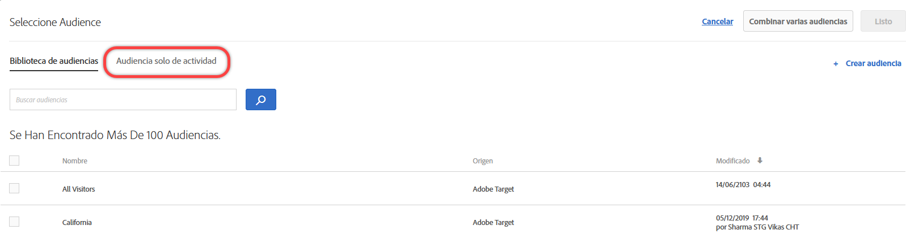 </p> <p>Para obtener más información, consulte  <a href="../c-target/creating-activity-only-audience.md#concept_A6BADCF530ED4AE1852E677FEBE68483" format="dita" scope="local"> Creación de una audiencia solo de actividad</a>. </p> </li> 
      <li id="li_691812682A5B42C0941324F2BC7D5740"> <p>En el caso de todas las actividades, puede elegir una métrica de éxito que cualifique al usuario para la audiencia. Anteriormente, Target cualificaba a los usuarios para una audiencia cuando estos entraban en la actividad, mientras que ahora se puede elegir cuándo se evalúa la audiencia mediante una métrica de éxito. (TGT-15805) </p> <p> 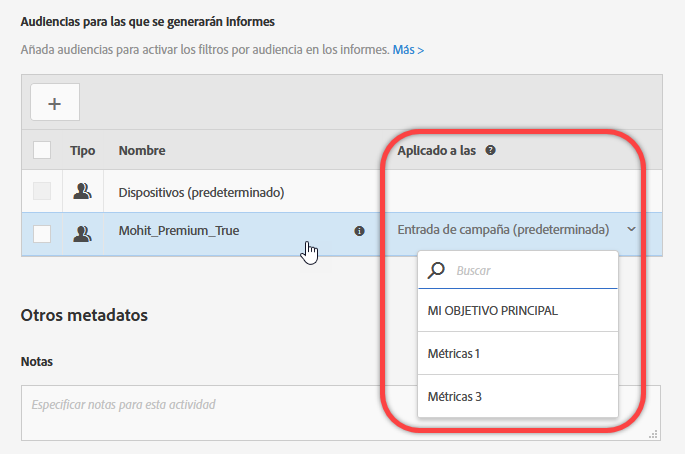 </p> </li> 
     </ul> </p> <p>Para obtener más información, consulte  <a href="../c-target/apply-reporting-audience-success-metric.md#concept_5F11149ACCA84FE79C7B9F766B6B0595" format="dita" scope="local"> Aplicación de una audiencia de informes a una métrica de éxito</a>. </p> </td> 
  </tr> 
  <tr> 
   <td colname="col1" class="premium"> <p>Segmentación automática </p> </td> 
   <td colname="col2"> <p> 
     <ul id="ul_6F89BD36373E47C4B3A6F8584D431D82"> 
      <li id="li_5F7B590AF8F24066ADD270E9F75CB12F"> <p>Las actividades de segmentación automática ahora admiten la realización de informes en el nivel de segmento. (TGT-22777) </p> <p>Para obtener más información, consulte <a href="../c-activities/auto-target-to-optimize.md#concept_67779E5B7F67427A97D7EA2A6FB919B3" format="dita" scope="local">Establecimiento de destino automático para experiencias personalizadas</a>. </p> </li> 
      <li id="li_35042E7D6BB04265B42F08A23A774E92"> <p>Puede cambiar el porcentaje de control para las actividades de segmentación automática. (TGT-26467) </p> <p> 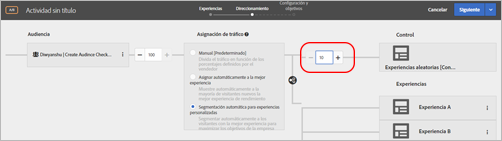 </p> <p>Para obtener más información, consulte <a href="../c-activities/auto-target-to-optimize.md#concept_67779E5B7F67427A97D7EA2A6FB919B3" format="dita" scope="local">Establecimiento de destino automático para experiencias personalizadas</a>. </p> </li> 
     </ul> </p> </td> 
  </tr> 
  <tr> 
   <td colname="col1"> <p>Ofertas </p> </td> 
   <td colname="col2"> <p> 
     <ul id="ul_667DDEDDC5284C8393F8BCA5CD9EF12A"> 
      <li id="li_E00DB93297EC4100B46E42D867757DAA"> <p>Ahora puede ver los detalles de una definición de oferta en forma de tarjeta emergente en la biblioteca de ofertas, sin necesidad de abrir la oferta. (TGT-26377) </p> <p> 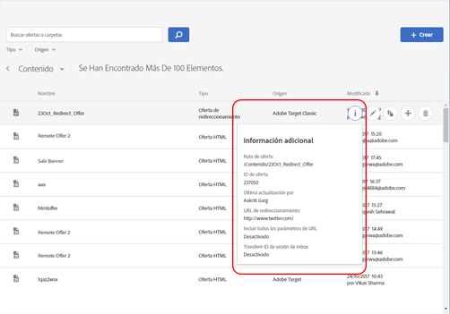 </p> <p>Para obtener más información, consulte <a href="../c-experiences/c-manage-content/manage-content.md#concept_17874A6FCBB743AA84C5988E8571CCF3" format="dita" scope="local">Ofertas</a>. </p> </li> 
      <li id="li_F71AC4FDAC0E4BEE81D39490E82686C0"> <p>Puede copiar y editar ofertas y carpetas en el selector de ofertas mientras se crea una actividad. (TGT-26936) </p> <p> 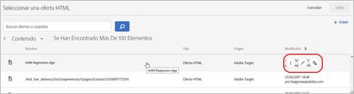 </p> <p>Para obtener más información, consulte <a href="../c-experiences/c-manage-content/manage-content.md#concept_17874A6FCBB743AA84C5988E8571CCF3" format="dita" scope="local">Ofertas</a>. </p> </li> 
     </ul> </p> </td> 
  </tr> 
  <tr> 
   <td colname="col1"> <p>Compositor de experiencias basadas en formularios </p> </td> 
   <td colname="col2"> <p>En el Compositor de experiencias basadas en formularios, los refinamientos se han sustituido por funciones de audiencia completas. Los refinamientos para las actividades existentes se han migrado a  audiencias solo de actividad. (TGT-13646) </p> <p>Para obtener más información, consulte <a href="../c-experiences/form-experience-composer.md#task_FAC842A6535045B68B4C1AD3E657E56E" format="dita" scope="local">Compositor de experiencias basadas en formularios</a>. </p> </td> 
  </tr> 
  <tr> 
   <td colname="col1"> <p>Tokens de respuesta </p> </td> 
   <td colname="col2"> <p>Ahora puede crear tokens de respuesta desde Target sin esperar a que se creen en Target o se importen a dicha aplicación. Anteriormente, en la interfaz de usuario de tokens de respuesta solo podía ver los tokens creados mediante API. Los cambios en esta función también le ayudan a evitar la duplicidad de tokens de respuesta. (TGT-26534) </p> <p>Para obtener más información, consulte <a href="../administrating-target/response-tokens.md#concept_2B21B222F6A344D68CA5929817E836C4" format="dita" scope="local">Tokens de respuesta</a>. </p> </td> 
  </tr> 
 </tbody> 
</table>

**Mejoras, correcciones y cambios**

Esta versión de [!DNL Target] incluye las siguientes mejoras, correcciones y cambios de cara al cliente:

* Puede eliminar audiencias importadas (Target Classic, Experience Cloud, etc.) de la biblioteca de audiencias. Target le avisa si intenta eliminar una audiencia que se utilice en una actividad activa. (TGT-25171)
* Las audiencias importadas desde Target Classic ahora se etiquetan como Adobe Target Classic en la biblioteca de audiencias. Anteriormente, la interfaz de usuario no diferenciaba entre Target Standard/Premium y Target Classic. (TGT-27093)
* Las colecciones ahora se aplican a todos los criterios (incluidos los elementos vistos recientemente). (TGT-26646)
* Puede filtrar por espacio de trabajo en la biblioteca de audiencias y la biblioteca de ofertas (se aplica a los usuarios de Target Premium con permisos de usuario de Enterprise). (TGT-26813)
* Se han realizado mejoras en la interfaz de usuario de Informes en cuanto al desplazamiento por las tablas y la ubicación de las listas desplegables de filtrado. (TGT-23713 y TGT-26819)

### Cambios de la plataforma de Target (13 de octubre de 2017).  {#section_6C298C5C3D01415CB4B658EB2166096C}

<table id="table_8457FAE3508F454F9DFDEF093FBD7E40"> 
 <thead> 
  <tr> 
   <th colname="col1" class="entry"> Cambio </th> 
   <th colname="col2" class="entry"> Detalles </th> 
  </tr> 
 </thead>
 <tbody> 
  <tr> 
   <td colname="col1"> <p> <span class="filepath"> at.js </span> </p> </td> 
   <td colname="col2"> <p><b>13 de octubre de 2017</b> </p> <p> Ya está disponible la versión 1.2.1 de <span class="filepath">at.js</span>. Para obtener más información, consulte <a href="../c-implementing-target/c-implementing-target-for-client-side-web/target-atjs-versions.md#reference_DBB5EDB79EC44E558F9E08D4774A0F7A" format="dita" scope="local">Detalles de la versión de at.js</a>. </p> <p> 
     <ul id="ul_14D6BB3B51974789BBFC036A45B7A56B"> 
      <li id="li_AE9826C8FC4A4DF4BE61BB72C2946C93"> <p>Se ha corregido un error al rastrear los clics de un vínculo con target="_blank" que impedía que Target lo abriera en una nueva pestaña. </p> </li> 
     </ul> </p> </td> 
  </tr> 
 </tbody> 
</table>

### Target Standard/Premium 17.9.1 (25 de septiembre de 2017 y 12 de octubre de 2017) {#section_ECC5DD8B6ED443788B46F53E25FC896E}

Esta versión incluye las siguientes características y mejoras (los números de problema que aparecen entre paréntesis son para uso interno de Adobe):

<table id="table_0A8817F64F434875A485FD671C6988AB"> 
 <thead> 
  <tr> 
   <th colname="col1" class="entry"> Función </th> 
   <th colname="col2" class="entry"> Descripción </th> 
  </tr> 
 </thead>
 <tbody> 
  <tr> 
   <td colname="col1"> <p> Vista previa de Mobile Experience </p> </td> 
   <td colname="col2"> <p><b>Actualizado: 12 de octubre de 2017</b> </p> <p> Ahora puede seleccionar varias actividades de aplicación móvil desde la interfaz de usuario y obtener una vista previa en su dispositivo. Esta función le permitirá inscribirse en varias experiencias para previsualización y control de calidad sin depender de compilaciones de prueba especiales y simuladores. </p> <p>Esta función requiere que descargue e instale la versión apropiada (4.14 o posterior) del SDK de Adobe Mobile. </p> <p>Para obtener más información, consulte  <a href="../c-target-mobile-app/target-mobile-preview.md#concept_5FBF12C2FDFC42429FE4F5CFBD78E19D" format="dita" scope="local"> Vista previa para móviles en Target</a>. </p> </td> 
  </tr> 
  <tr> 
   <td colname="col1"> <p>Lote móvil y entrega de recuperación previa </p> </td> 
   <td colname="col2"> <p><b>Actualizado: 12 de octubre de 2017</b> </p> <p> Puede recuperarse previamente contenido de varios mboxes con una sola llamada y guardarlo localmente en el dispositivo sin importar cómo o cuándo lo verá el usuario final. </p> <p>Esta función requiere que descargue e instale la versión apropiada (4.14 o posterior) del SDK de Adobe Mobile. </p> <p>Para obtener más información, consulte  <a href="../c-target-mobile-app/prefetch-offer-content.md#concept_A355D9D55E1C429AA31FA4055A1DDFAF" format="dita" scope="local"> Recuperación previa de contenido de ofertas</a>. </p> </td> 
  </tr> 
  <tr> 
   <td colname="col1"> <p>Actividades </p> </td> 
   <td colname="col2"> <p>Se han realizado las siguientes mejoras en el flujo de trabajo de creación de actividad: </p> <p> 
     <ul id="ul_2D251AC11FC54E86AE84DEFFB6FDF43C"> 
      <li id="li_AB8F12B3CF654120BD16EAE570517741"> <p>Al editar una actividad, puede realizar los cambios deseados en el paso que se muestra, hacer clic en el desplegable del botón dividido, seleccionar <span class="wintitle">Siguiente</span> para ir al próximo paso, hacer clic en <span class="wintitle">Guardar y cerrar</span> para guardar sus cambios y mostrar la página <span class="wintitle">Información general</span> de la actividad, o hacer clic en <span class="wintitle">Guardar</span> para guardar los cambios y permanecer en el paso. </p> <p> 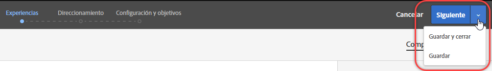 </p> <p>Para obtener más información, consulte <a href="../c-activities/edit-activity.md#concept_BB064C0D4A194BD1A1AE7CCA1E6BB8F0" format="dita" scope="local">Editar una actividad o guardarla como borrador</a>. </p> </li> 
      <li id="li_4C71E2570ECF4BBAB08443D89230CE82"> <p>Al editar una actividad, puede abrir el paso deseado del flujo de trabajo, realizar cambios (por ejemplo, porcentajes de experiencia, audiencias, etc.) y después guardar o cerrar la actividad sin tener que avanzar por el flujo de trabajo guiado de tres pasos. </p> <p> 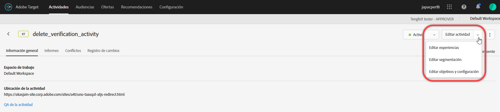 </p> <p>Para obtener más información, consulte <a href="../c-activities/edit-activity.md#concept_BB064C0D4A194BD1A1AE7CCA1E6BB8F0" format="dita" scope="local">Editar una actividad o guardarla como borrador</a>. </p> </li> 
      <li id="li_43C15B13E4F7475E9376A98222AA0253"> <p>Cuando crea una nueva actividad que aún no se ha guardado, o cuando edita una actividad previamente guardada en forma de borrador, en el botón dividido se muestra la opción <span class="wintitle">Guardar borrador</span>. </p> <p> 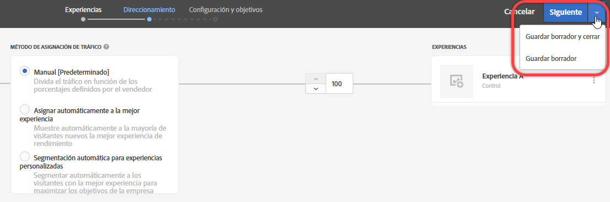 </p> <p>Para obtener más información, consulte <a href="../c-activities/edit-activity.md#concept_BB064C0D4A194BD1A1AE7CCA1E6BB8F0" format="dita" scope="local">Editar una actividad o guardarla como borrador</a>. </p> </li> 
      <li id="li_36EF9AD13B2D40ADB99343C9F758D5FD"> <p>Ahora puede editar o copiar una audiencia pasando el puntero sobre ella en el cuadro de diálogo <span class="wintitle">Elegir audiencia</span> mientras elige una segmentación en el paso 2 del flujo de trabajo guiado de tres pasos. </p> <p>  </p> </li> 
     </ul> </p> <p>Para obtener más información, consulte <a href="../c-activities/t-test-ab/t-test-create-ab/ab-audience.md#concept_A268236C1224451DB7844BF67F41A087" format="dita" scope="local">Selección de audiencias</a>. </p> </td> 
  </tr> 
  <tr> 
   <td colname="col1"> <p>Creación de informes </p> </td> 
   <td colname="col2"> <p>Las siguientes novedades y mejoras están disponibles para la realización de informes: </p> <p> 
     <ul id="ul_2D1AF91D1B4E478FBFFA0B83EE30075E"> 
      <li id="li_98E67A4DA8BF4CFF90C279FAC12F4C54"> <p>Puede elegir la metodología de contabilización para los gráficos de los informes. Tenga en cuenta que esto no se admite en las actividades de segmentación automática y personalización automática (AP). </p> <p>Para obtener más información, consulte la fila “Metodología de contabilización” en  <a href="../c-reports/c-report-settings/report-settings.md#concept_4BB6A7FDAB6F4806A632F9CD989B8BFA" format="dita" scope="local"> Configuración del informe</a>. </p> </li> 
      <li id="li_5803CE90DB764C9E983702CB6C1AFEE3"> <p>Puede ver varias métricas en un mismo informe de actividades A/B de segmentación automática. (TGT-23464) </p> <p>Para obtener más información, consulte <a href="../c-reports/c-report-settings/view-multiple-metrics.md#concept_9E3C3F6F3EC1412FAF252975AC0720B7" format="dita" scope="local">Ver varias métricas en un informe </a>. </p> </li> 
     </ul> </p> </td> 
  </tr> 
  <tr> 
   <td colname="col1"> <p>Audiencias </p> </td> 
   <td colname="col2"> <p>Ahora puede ver las definiciones de audiencias importadas de Target Classic o creadas mediante API. (TGT-22630) </p> <p>  </p> <p>Para obtener más información, consulte “Visualización de definiciones de audiencias” en  <a href="../c-target/c-audiences/audiences.md#concept_65BE870D290E412D8BBF557EEA67C271" format="dita" scope="local"> Acerca de las audiencias</a>. </p> </td> 
  </tr> 
  <tr> 
   <td colname="col1"> <p>Editor de código </p> </td> 
   <td colname="col2"> <p>El Compositor de experiencias basadas en formularios y el editor de ofertas HTML utilizan ahora el mismo editor de código que el Compositor de experiencias visuales (VEC) utiliza con el código personalizado. (TGT-25808) </p> <p>Esta mejora le aporta las siguientes funciones al utilizar el editor de código del Compositor de experiencias basadas en formularios, y al crear ofertas HTML: </p> <p> 
     <ul id="ul_CBB17806FBF34774A8160A61204ED014"> 
      <li id="li_22665F583F1742E280D5BC7EC4203007"> <p>Ahora son visibles los números de línea para mejorar el uso. </p> </li> 
      <li id="li_B0D863CDAD2E46A4B133BB86886EB527"> <p>El resalte de sintaxis le ayuda a evitar errores en las ofertas HTML. </p> </li> 
     </ul> </p> <p>Para obtener más información, consulte  <a href="../c-experiences/c-visual-experience-composer/c-vec-code-editor/vec-code-editor.md#concept_B3A6E9EE3A60406DB640E205EA1745B5" format="dita" scope="local"> Editor de código</a>. </p> </td> 
  </tr> 
  <tr> 
   <td colname="col1"> <p>Segmentación geográfica </p> </td> 
   <td colname="col2"> <p>Ahora puede usar latitud y longitud en la segmentación geográfica. (TGT-12129) </p> <p>Para obtener más información, consulte <a href="../c-target/c-audiences/c-target-rules/geo.md#concept_5B4D99DE685348FB877929EE0F942670" format="dita" scope="local">Información geográfica</a>. </p> </td> 
  </tr> 
  <tr> 
   <td colname="col1"> <p>SDK de Node.JS </p> </td> 
   <td colname="col2"> <p>Puede instalar el SDK de node.js desde <a href="https://www.npmjs.com/package/@adobe/target-node-client" format="https" scope="external">npm @adobe/target-node-client</a> para implementar y ejecutar fácilmente pruebas en el lado del servidor para sus aplicaciones en el node.js. El servicio VisitorID está habilitado en el SDK del nodo para conectar todos sus datos de Adobe y puede optar por Adobe Analytics como fuente de informe (A4T). </p> </td> 
  </tr> 
 </tbody> 
</table>

**Mejoras, correcciones y cambios**

Esta versión de [!DNL Target] incluye las siguientes mejoras, correcciones y cambios de cara al cliente (los números de problema que aparecen entre paréntesis son para uso interno de Adobe):

* Los usuarios con permisos de aprobador ahora pueden generar y habilitar tokens de autenticación de la API del perfil. (TGT-24074)

   Para obtener más información, consulte [Configuración de la API de perfil](../c-implementing-target/c-considerations-before-you-implement-target/c-methods-to-get-data-into-target/profile-api-settings.md#concept_5C4ABA5FA64E4D6CAE9C5902572F2794).

* Cuando se crea una actividad en el Compositor de experiencias visuales y el usuario actualiza la página, la dirección URL de la actividad y las propiedades asociadas se mantienen en la IU. La necesidad de volver a cargar puede producirse si la actividad utiliza contenido mixto (seguro y no seguro), o si existen problemas de permisos. (TGT-28230)
* Se han mejorado los mensajes cuando una actividad utiliza contenido mixto (seguro y no seguro). El mensaje proporciona información que ayuda a los usuarios a realizar los pasos necesarios para abrir un sitio HTTP o un sitio con llamadas mixtas (HTTPS y HTTP). (TGT-26271)

Para obtener más información, consulte [Habilitar contenido mixto en el explorador](../c-experiences/c-visual-experience-composer/r-troubleshoot-composer/mixed-content.md#concept_46D022D50280468C9EF6D5DF6EFC911C).

* Se ha mejorado el flujo de trabajo cuando se agota el tiempo de espera de la sesión de Destinatario de un usuario al configurar las opciones en las páginas Administración, Audiencias y Recommendations. Cuando el usuario hace clic en Guardar se muestra el mensaje de sesión expirada. Sin embargo, cuando vuelve a iniciar la sesión, un cuadro de diálogo indica que el inicio de sesión se ha realizado correctamente y que la interfaz de usuario permanece en la misma página de Target, sin que se haya producido pérdida de datos. (TGT-25557)

### Cambios en la plataforma de Target (27 de septiembre de 2017).  {#section_AC32516DFBA64AD2AC9A74171D452778}

<table id="table_701D8D53D1DF4F28ADAC6EC221B0208A"> 
 <thead> 
  <tr> 
   <th colname="col1" class="entry"> Cambio </th> 
   <th colname="col2" class="entry"> Detalles </th> 
  </tr> 
 </thead>
 <tbody> 
  <tr> 
   <td colname="col1"> <p> <span class="filepath"> at.js </span> </p> </td> 
   <td colname="col2"> <p><b>27 de septiembre de 2017</b> </p> <p> La versión 1.2.0 de <span class="filepath">at.js</span> ya está disponible como una versión de mantenimiento que contiene principalmente correcciones de errores. Para obtener más información, consulte <a href="../c-implementing-target/c-implementing-target-for-client-side-web/target-atjs-versions.md#reference_DBB5EDB79EC44E558F9E08D4774A0F7A" format="dita" scope="local">Detalles de la versión de at.js</a>. </p> <p> 
     <ul id="ul_D11024549C3643C7A756988087498D24"> 
      <li id="li_E1B3994125B64F6AB20B29FE8BCD8459"> <p>Se ha corregido un problema que impedía utilizar acciones predeterminadas en casos especiales de rastreo de clics. (TNT-28089) </p> </li> 
      <li id="li_53806C902AA04B31B59AA87A1E707348"> <p>Se ha corregido un problema producido al rastrear clics en un vínculo con <span class="codeph">target="_blank"</span>, y que impedía que Target abriera el vínculo en una pestaña nueva. (TNT-28072) </p> </li> 
      <li id="li_94F5794330D14C71BA07B3F17D0705FD"> <p> Se pueden usar direcciones IP como dominio de la cookie. (TNT-28002) </p> </li> 
      <li id="li_7D2A11B17672419583F9632CDA00D28F"> <p>Se ha corregido un problema que causaba parpadeo en las ofertas de redireccionamiento con un mbox global u otros mboxes regionales. (TNT-27978) </p> </li> 
      <li id="li_BA27A749A7A242478080F3D8E04148FC"> <p> Se ha corregido un problema por el que la configuración de una actividad de segmentación de experiencias fallaba dentro del VEC al cambiar entre Examinar y Componer. (TNT-27942) </p> </li> 
      <li id="li_FA11ABA5B9CD435080426805C5359A51"> <p> Se ha corregido la gestión incorrecta en clases de estilo de parpadeo para elementos de rastreo de clics. (TNT-27896) </p> </li> 
      <li id="li_E2DFBAE52FCA4996BA083868CBFCCD10"> <p>Se ha corregido un problema que causaba que los parámetros de mbox global se mezclaran con todos los parámetros de mbox. (TNT-27846) </p> </li> 
      <li id="li_B3153BBD66AA4D51AE81EF6C903CF78D"> <p>Se han realizado cambios para garantizar que <span class="filepath">at.js</span> gestione adecuadamente Handlebars, Mustache y otras bibliotecas de creación de plantillas del lado del cliente. (TNT-27831) </p> </li> 
      <li id="li_B859939C1B5A4DF78CF8ADF236B88306"> <p>Se han realizado cambios para asegurar que <span class="codeph">sdidParamExpiry</span> se inicialice apropiadamente y se pase al API de visitante. Esto es una regresión que se ha añadido a <span class="codeph">at.js 1.1.0</span>. Las versiones anteriores de <span class="filepath">at.js</span> no se ven afectadas. Solo afecta a los clientes que utilizan ofertas de redireccionamiento y A4T. (TNT-27791) </p> </li> 
      <li id="li_24A748DFB7824AE6AC7331B7EA940BFF"> <p>Se han realizado cambios para garantizar que <span class="codeph">SCRIPT</span> se ejecute independientemente del tipo de atributo utilizado. (TNT-27865) </p> </li> 
     </ul> </p> </td> 
  </tr> 
  <tr> 
   <td colname="col1"> <p>Segmentación de experiencias (XT) </p> </td> 
   <td colname="col2"> <p><b>21 de septiembre de 2017</b> </p> <p>Con la versión del 21 de septiembre, Target cambiará el modo en que se coloca a los usuarios en experiencias en las actividades de segmentación de experiencias (XT; pruebas de página de aterrizaje en Target Classic). Para todas las actividades nuevas y existentes, tanto en Target Standard/Premium como en Target Classic, los usuarios deben satisfacer las reglas de segmentación de experiencias en todos los aspectos para seguir viendo el contenido de la experiencia y ser contabilizados en los informes. Anteriormente, aunque un usuario dejara de cumplir los requisitos de cualquier experiencia, seguía viendo el contenido de la última experiencia para la que estuvo cualificado y se lo contabilizaba en sus informes. </p> <p>Este cambio se producirá automáticamente como parte de la versión para todas las actividades existentes y para cualquier actividad creada posteriormente. Si prefiere el método antiguo (el anterior al 21 de septiembre), puede crear audiencias empleando scripts de perfil, de modo que el usuario solo deba satisfacer una vez una condición para poder seguir perteneciendo a esa audiencia en el futuro. A continuación, utilice esas audiencias para cada experiencia de la actividad. </p> </td> 
  </tr> 
 </tbody> 
</table>

### Target Standard/Premium 17.8.1 (22 de agosto de 2017) {#section_71A554D072F04B18B359C1626529E5D8}

<table id="table_AAC16F89060D4CC09762A370B86C0885"> 
 <thead> 
  <tr> 
   <th colname="col1" class="entry"> Función </th> 
   <th colname="col2" class="entry"> Descripción </th> 
  </tr> 
 </thead>
 <tbody> 
  <tr> 
   <td colname="col1" class="premium"> <p>Permisos de usuario de Enterprise para Target Premium </p> </td> 
   <td colname="col2"> <p>Cree espacios de trabajo separados en Target y luego asigne a los usuarios distintos roles y permisos para disfrutar de distintas propiedades digitales. </p> <p>Para obtener más información, consulte  <a href="../administrating-target/c-user-management/property-channel/property-channel.md#concept_E396B16FA2024ADBA27BC056138F9838" format="dita" scope="local"> Permisos de usuario de Enterprise</a>. </p> <p>Para obtener más información sobre la introducción, consulte <a href="../r-release-notes/known-issues-resolved-issues.md#concept_625C3A16B7F24D4B82EFF130F0945541" format="dita" scope="local">Problemas conocidos y Problemas resueltos</a>. </p> </td> 
  </tr> 
  <tr> 
   <td colname="col1"> <p>Modo de control de calidad </p> </td> 
   <td colname="col2"> <p>Realice un control de calidad de actividades sencillo con vínculos de vista previa que nunca cambian, segmentación opcional de audiencias y realización de informes de control de calidad que permanecen segmentados a partir de datos de actividad en directo. </p> <p>Para obtener más información, consulte <a href="../c-activities/c-activity-qa/activity-qa.md#concept_9329EF33DE7D41CA9815C8115DBC4E40" format="dita" scope="local">Control de calidad de las actividades </a>. </p> </td> 
  </tr> 
 </tbody> 
</table>

**Mejoras, correcciones y cambios**

Esta versión de [!DNL Target] incluye las siguientes mejoras, correcciones y cambios de cara al cliente (los números de problema que aparecen entre paréntesis son para uso interno de Adobe):

* Se han añadido más lugares donde pueden verse detalles de definición de audiencias en una tarjeta emergente de la interfaz de usuario sin necesidad de abrir la audiencia. Tenga en cuenta que esta funcionalidad se aplica solo a las audiencias creadas en [!DNL Target Standard/Premium. (TGT-25772)]
* Ahora puede ver definiciones de audiencias ad hoc dentro de la creación de actividad/información general. (TGT-25570)
* Las siguientes variables están ahora disponibles como  Matrices de [Velocity](../c-recommendations/c-design-overview/customizing-a-template.md#concept_94F1554C3F2E4CDB9A2C3D78F10EDA59): `entiites` y `entityN.categoriesList`.

### Cambios en la plataforma de Target (3 de agosto de 2017) {#section_FA5BF6808EA74F3A9E8E941530879208}

<table id="table_1B43199F1AE64E69AE65313B23741444"> 
 <thead> 
  <tr> 
   <th colname="col1" class="entry"> Cambio </th> 
   <th colname="col2" class="entry"> Detalles </th> 
  </tr> 
 </thead>
 <tbody> 
  <tr> 
   <td colname="col1"> <p> <span class="filepath"> at.js </span> </p> </td> 
   <td colname="col2"> <p><b>3 de agosto de 2017</b> </p> <p> Ya está disponible la versión 1.1 de <span class="filepath">at.js</span>. Para obtener más información, consulte <a href="../c-implementing-target/c-implementing-target-for-client-side-web/how-to-deployatjs/implementing-target-without-a-tag-manager.md#concept_1E1F958F9CCC4E35AD97581EFAF659E2" format="dita" scope="local">Descargar at.js</a>. </p> <p>En la versión 1.1 de <span class="filepath">at.js</span> se incluyen las siguientes mejoras y correcciones: </p> <p> 
     <ul id="ul_B7408267413347888938E2E7D48ABDBD"> 
      <li id="li_4DDF6DCFE6014C6795B6A9C9DFB54C21"> <p>Se ha añadido la gestión de tokens de respuesta. Para obtener más información, consulte <a href="../administrating-target/response-tokens.md#concept_2B21B222F6A344D68CA5929817E836C4" format="dita" scope="local">Tokens de respuesta</a>. </p> </li> 
      <li id="li_741CD22B7D074FBA90180B2E36FACE0D"> <p>Se ha resuelto un problema para que <span class="codeph">document.currentScript polyfill</span> no interfiera con Angular 1.X. </p> </li> 
      <li id="li_EF1B3D3DCC7F4D2490D2BFE660EC661C"> <p>Se han realizado cambios para asegurar que el rastreo de clics no interfiera con la propiedad Visibilidad. Los elementos de rastreo de clics se marcan con la clase CSS <span class="codeph">at-element-click-tracking</span> en vez de con <span class="codeph">at-element-marker</span>. </p> </li> 
     </ul> </p> </td> 
  </tr> 
 </tbody> 
</table>

### Target Standard/Premium 17.7.3 (3 de agosto de 2017).  {#section_D90CB766679442C7A0642E5D79657674}

<table id="table_C81EA97B251547169BC9681E5DDB4B8F"> 
 <thead> 
  <tr> 
   <th colname="col1" class="entry"> Función </th> 
   <th colname="col2" class="entry"> Descripción </th> 
  </tr> 
 </thead>
 <tbody> 
  <tr> 
   <td colname="col1"> <p>Tokens de respuesta </p> </td> 
   <td colname="col2"> <p>Los tokens de respuesta le permiten generar automáticamente variables elegibles (p. ej., atributos de perfil) en las respuestas de Target que envían actividades (mboxes de visualización). Los tokens de respuesta pueden usarse para depuración o para la integración con proveedores de terceros (como Clicktale). </p> <p>Los tokens de respuesta son similares a los complementos de servidor de <span class="keyword">Adobe Target Classic</span> y ofrecen paridad de características entre las dos soluciones. </p> <p> <p>Nota: Los tokens de respuesta están disponibles con <span class="filepath">at.js</span> 1.1 o versiones posteriores. No son compatibles con <span class="codeph">mbox.js</span>. </p> </p> <p>Para obtener más información, consulte <a href="../administrating-target/response-tokens.md#concept_2B21B222F6A344D68CA5929817E836C4" format="dita" scope="local">Tokens de respuesta</a>. </p> </td> 
  </tr> 
 </tbody> 
</table>

### Target Standard/Premium 17.7.2 (27 de julio de 2017) {#section_6980EC04D3CF4A00919953B9B10BC472}

<table id="table_DB51BD66756F4EBD875ED008B2C7C5D0"> 
 <thead> 
  <tr> 
   <th colname="col1" class="entry"> Función </th> 
   <th colname="col2" class="entry"> Descripción </th> 
  </tr> 
 </thead>
 <tbody> 
  <tr> 
   <td colname="col1" class="premium"> <p>Segmentación automática </p> </td> 
   <td colname="col2"> <p>La segmentación automática está ahora disponible para todos los clientes de Target Premium. </p> <p>La segmentación automática utiliza aprendizaje automático avanzado para identificar varias experiencias de alto nivel de rendimiento definidas por expertos en marketing, y ofrece a cada visitante la experiencia más adaptada en función de su perfil de cliente y del comportamiento de visitantes anteriores con perfiles similares, todo ello con el fin de personalizar el contenido y dirigir las conversiones. </p> <p>Al crear una actividad A/B mediante el flujo de trabajo guiado de tres pasos, tiene la opción de asignar el tráfico mediante la opción <span class="wintitle">Segmentación automática para experiencias personalizadas</span>: </p> <p> 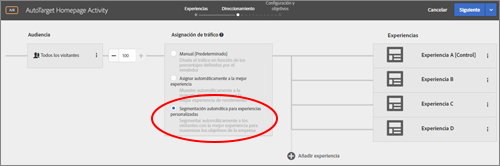 </p> <p>Para obtener más información, consulte <a href="../c-activities/auto-target-to-optimize.md#concept_67779E5B7F67427A97D7EA2A6FB919B3" format="dita" scope="local">Establecimiento de destino automático para experiencias personalizadas</a>. </p> </td> 
  </tr> 
 </tbody> 
</table>

### Target Standard/Premium 17.7.1 (20 de julio de 2017) {#section_BB75DE30174F4ADD963451909FB81D74}

<table id="table_BCE36E0D56804E7B8861858DCF2F380E"> 
 <thead> 
  <tr> 
   <th colname="col1" class="entry"> Función </th> 
   <th colname="col2" class="entry"> Descripción </th> 
  </tr> 
 </thead>
 <tbody> 
  <tr> 
   <td colname="col1"> <p>Audiencias </p> </td> 
   <td colname="col2"> <p>Ahora, en varios puntos de la interfaz de usuario de Target puede ver detalles de la definición de una audiencia en forma de tarjeta emergente, sin necesidad de abrir la audiencia. Tenga en cuenta que esta funcionalidad se aplica solo a las audiencias creadas en <span class="keyword">Target Standard/Premium. </span> </p> <p>  </p> </td> 
  </tr> 
  <tr> 
   <td colname="col1"> <p>Métricas de éxito </p> </td> 
   <td colname="col2"> <p>Anteriormente, Target permitía la dependencia de una única métrica, y era preciso alcanzar dicha métrica antes de que su contador aumentara. Ahora dispone de dependencia respecto a varias métricas y tiene la posibilidad de elegir si una métrica debe alcanzarse o no para que su contador aumente. </p> <p>La funcionalidad de dependencia respecto a varias métricas no se admite en estos casos: </p> <p> 
     <ul id="ul_EC856F910B704D648065EA7DA13EE5B0"> 
      <li id="li_1A82414FE50B414CAA1A0A88E80BCC1B"> <p>Actividades de Recommendations. La funcionalidad admite los demás tipos de actividad. </p> </li> 
      <li id="li_2D6CF42264D445FCB6C400ED321DE952"> <p>Si utiliza Analytics como fuente de informes (A4T). </p> </li> 
      <li id="li_E3A983A70BB04AE8B25A7CEC1F5FE1D9"> <p>El tipo de métrica “Visualizó una página”. </p> </li> 
      <li id="li_9AAF6BB275F7489BA691676E308172D5"> <p>El tipo de métrica “Se hizo clic en un elemento” para actividades del Compositor de experiencias visuales (VEC). </p> </li> 
     </ul> </p> <p>Para obtener más información, consulte los temas siguientes: </p> <p> 
     <ul id="ul_4B0EFFDD257C42579E19569DCBE15BE3"> 
      <li id="li_2402575F27F547968BD536C460BF81B5"> <p>A/B: <a href="../c-activities/t-test-ab/t-test-create-ab/ab-goals-and-settings.md#reference_B25389FD6F3A4989801E740364B089CC" format="dita" scope="local">Objetivos y configuración </a> </p> </li> 
      <li id="li_FB5E7CBC0154406C989F5A5C6CAA0C8F"> <p>Personalización automatizada (AP): <a href="../c-activities/t-automated-personalization/create-ap-activity.md#task_8AAF837796D74CF893CA2F88BA1491C9" format="dita" scope="local">Creación de una actividad de personalización automatizada </a> </p> </li> 
      <li id="li_57C36A7945A24A52BCBD62CA0F15B668"> <p>Segmentación de experiencias (XT): <a href="../c-activities/t-experience-target/t-xt-create/xt-goals-and-settings.md#reference_B25389FD6F3A4989801E740364B089CC" format="dita" scope="local">Objetivos y configuración </a> </p> </li> 
      <li id="li_06674A3152A547268A1AE5EE818EF1A5"> <p>Multivariado (MVT): <a href="../c-activities/c-multivariate-testing/t-create-multivariate-test/goals-and-settings.md#reference_B25389FD6F3A4989801E740364B089CC" format="dita" scope="local">Objetivos y configuración </a> </p> </li> 
     </ul> </p> </td> 
  </tr> 
  <tr> 
   <td colname="col1"> <p>Creación de informes (pruebas A/B de asignación automática) </p> </td> 
   <td colname="col2"> <p>La capacidad para ver varias métricas ya está disponible para las actividades A/B de asignación automática. </p> <p>Para obtener más información, consulte <a href="../c-reports/c-report-settings/view-multiple-metrics.md#concept_9E3C3F6F3EC1412FAF252975AC0720B7" format="dita" scope="local">Ver varias métricas en un informe </a>. </p> </td> 
  </tr> 
  <tr> 
   <td colname="col1"> <p>Audiencias </p> </td> 
   <td colname="col2"> <p>Los tipos de página del sitio de audiencia y los operadores de comparación ahora coinciden con los tipos y los operadores de comparación de Target Classic. </p> <p>Ahora puede crear audiencias de página del sitio empleando su propio “parámetro de consulta definido por el usuario” o “encabezado definido por el usuario”. </p> <p>Para obtener más información, consulte <a href="../c-target/c-audiences/c-target-rules/site-pages.md#concept_6425D5304568490899E8340CC94798A9" format="dita" scope="local">Páginas de sitio</a>. </p> </td> 
  </tr> 
  <tr> 
   <td colname="col1"> <p>Actividades </p> </td> 
   <td colname="col2"> <p>La lista de actividades le permite ahora filtrar por los tipos de actividad Asignación automática y Segmentación automática. </p> <p>Para obtener más información, consulte <a href="../c-activities/activities.md#concept_D317A95A1AB54674BA7AB65C7985BA03" format="dita" scope="local">Actividades</a>. </p> </td> 
  </tr> 
  <tr> 
   <td colname="col1" class="premium"> <p>Criterios y promociones de Recommendations </p> </td> 
   <td colname="col2"> <p>Ahora puede gestionar valores en blanco al filtrar por coincidencia de atributos de entidad, coincidencia de atributos de perfil y coincidencia de parámetros. </p> <p>Para obtener más información, consulte <a href="../c-recommendations/c-algorithms/use-dynamic-and-static-inclusion-rules.md#concept_4CB5C0FA705D4E449BD0B37B3D987F9F" format="dita" scope="local">Uso de reglas de inclusión dinámicas y estáticas</a>. </p> </td> 
  </tr> 
 </tbody> 
</table>

Esta versión de [!DNL Target] incluye las siguientes mejoras y correcciones de cara al cliente (los números de problema que aparecen entre paréntesis son para uso interno de Adobe):

* Se ha mejorado el flujo de trabajo cuando la sesión de [!DNL Target] de un usuario excede el tiempo de espera mientras crea o edita una actividad u oferta. Cuando el usuario hace clic en [!UICONTROL Guardar] se muestra el mensaje de sesión expirada. Sin embargo, tras iniciar de nuevo la sesión, un cuadro de diálogo indica que el inicio de sesión se ha realizado correctamente y que la interfaz permanece en la misma interfaz de usuario de [!DNL Target], sin que se haya producido pérdida de datos.

   Si un usuario realiza una acción intermitente en una página de [!DNL Target] y supera el tiempo de espera, se le obliga a iniciar sesión de nuevo y, a continuación, se le dirige a la última página en la que trabajó en la interfaz de usuario de [!DNL Target].

* Se ha corregido un problema que causaba la pérdida de los cambios realizados en el código personalizado si el usuario se “alejaba” (si cambiaba de experiencia, de página o de audiencia, si hacía clic en Siguiente, etc.) y olvidaba guardar los cambios. Ahora se solicita al usuario que guarde los cambios. (TGT-23766)
* Cuando se archiva una actividad, se muestra “Ha archivado la actividad” en vez de “Actualizando la actividad”. (KB-1517)
* El selector desplegable en los siguientes lugares de la interfaz de usuario de Target ha sido sustituido por una funcionalidad de relleno automático que mejora la velocidad y el rendimiento: (TGT-22939)

   * Página Actividad > *actividad* > Paso 3 > Selector de grupo de informes
   * Audiencias > Crear audiencia > Perfil del visitante
   * Recommendations > Creación de fuentes > Cuando el tipo de origen es > Analytics > Selector de grupo de informes

* Mensajes de error mejorados cuando un sitio tiene “X-Frame-options” establecido en SAMEORIGIN y no se puede cargar en el Compositor de experiencias visuales (VEC). El mensaje solicita al usuario que cambie al Compositor de experiencias mejorado en Administración > Compositor de experiencias visuales. (TGT-17356)
* Los informes de Target Standard/Premium se muestran ahora en la zona horaria de la tienda, no en la del servidor de Target (US EST). (TGT-24868)
* Si las actividades creadas en [!DNL Target] se actualizan desde fuera de [!DNL Target] (por ejemplo, mediante Adobe I/O), los siguientes atributos de actividad se importan de vuelta en [!DNL Target]:

   `thirdpartyId`

   `startDate`

   `endDate`

   `status`

   `priority`

   `marketingCloudMetadata(remoteModifiedBy)`

   Este trabajo de importación se ejecuta cuando se abre la página de actividades, con un retardo máximo de diez minutos. (KB-1526)

### Target Standard/Premium 17.6.2 (22 de junio de 2017).  {#section_F0372B07B56E454CB048CE79FF56E9CD}

<table id="table_8C4DB1B83B874E4C85CE9FF352E7B857"> 
 <thead> 
  <tr> 
   <th colname="col1" class="entry"> Función </th> 
   <th colname="col2" class="entry"> Descripción </th> 
  </tr> 
 </thead>
 <tbody> 
  <tr> 
   <td colname="col1" class="premium"> <p>Actividades de personalización automatizada (AP) </p> </td> 
   <td colname="col2"> <p> 
     <ul id="ul_F5BB1074DD4140C798CB55D68DEEF824"> 
      <li id="li_9596AABA14C64DEEB2E70E8ADED8AA74">Pueden crearse actividades de personalización automatizada empleando el Compositor basado en formularios. </li> 
      <li id="li_315F5FF590404670A677FEA6E4E0DF5D">Nuevos números de confianza para la personalización automatizada </li> 
     </ul> </p> </td> 
  </tr> 
  <tr> 
   <td colname="col1" class="premium"> <p>Recommendations: Criterios y promociones </p> </td> 
   <td colname="col2"> <p> Ahora puede crear criterios y promociones dinámicos basados en la coincidencia de atributos de perfil y la coincidencia de parámetros. </p> <p> 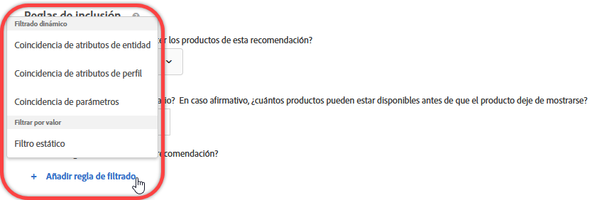 </p> <p> <p>Nota: Si está familiarizado con el modo en que se configuraban las reglas de inclusión antes de la versión de Target 17.6.1 (junio de 2017), notará que algunas de las opciones y operadores han cambiado. Solo se muestran los operadores aplicables a la opción seleccionada y el nombre de algunos ha cambiado (“coincide” es ahora “es igual que”), de modo que la experiencia sea más coherente e intuitiva. Todas las reglas de inclusión creadas antes de esta versión se migran automáticamente a la nueva estructura. No es necesaria reestructuración alguna por su parte. </p> </p> </td> 
  </tr> 
  <tr> 
   <td colname="col1"> <p>Mejoras en el editor de código del VEC </p> </td> 
   <td colname="col2"> <p> Si el formato de página cambia y no se pueden aplicar acciones, ahora aparece una alerta encima de cada acción fallida. Anteriormente, un error general notificaba al usuario que la estructura de la página había cambiado. Ahora, el editor de código resalta las acciones fallidas. </p> </td> 
  </tr> 
 </tbody> 
</table>

Esta versión de [!DNL Target] incluye las siguientes mejoras y correcciones de cara al cliente:

* Rendimiento mejorado en los grupos de hosts y páginas de búsqueda de la entidad Recommendations.
* Mensajes de error más descriptivos en todo Target, especialmente los relacionados con fallos de sincronización.
* Se ha corregido un problema que causaba que la contabilidad en el diagrama de actividad fuera en ocasiones incorrecta en la interfaz al aplicar deduplicación automática después de crear grupos de exclusión.
* Se ha corregido un problema por el que las inclusiones manuales podían no reflejarse correctamente en la interfaz de usuario al editar una actividad existente con grupo de exclusión.

### Target Standard/Premium 17.6.1 (8 de junio de 2017).  {#section_1D05FE23CE3744DDB5D28E933341F575}

<table id="table_47117524922A472AA977C652B581B356"> 
 <thead> 
  <tr> 
   <th colname="col1" class="entry"> Función </th> 
   <th colname="col2" class="entry"> Descripción </th> 
  </tr> 
 </thead>
 <tbody> 
  <tr> 
   <td colname="col1"> <p>Actividades de segmentación de experiencias (XT) </p> </td> 
   <td colname="col2"> <p>La funcionalidad de arrastrar y soltar le permite organizar audiencias y experiencias en el orden deseado al crear o editar actividades XT. Las experiencias de los visitantes se evalúan en orden, de arriba abajo. </p> <p> 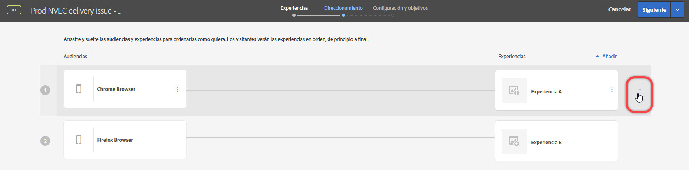 </p> <p>Para obtener más información, consulte  <a href="../c-activities/t-experience-target/t-xt-create/xt-add-experience.md#task_454646F2895242D3B92DC395A0CE1A00" format="dita" scope="local"> Crear experiencia</a>. </p> </td> 
  </tr> 
  <tr> 
   <td colname="col1"> <p>Creación de informes: A/B, XT y Recommendations </p> </td> 
   <td colname="col2"> <p>Los informes de actividades A/B, XT y Recommendations incluyen representaciones visuales que le permiten ver el intervalo de confianza y el alza, de modo que se pueda determinar un ganador con mayor precisión. Puede pasar el cursor sobre las representaciones para ver los números reales. Esta característica no está disponible para actividades que utilicen Analytics como fuente de informes (A4T). </p> <p>  </p> <p>Para obtener más información, consulte <a href="../c-reports/c-report-settings/report-settings.md#concept_4BB6A7FDAB6F4806A632F9CD989B8BFA" format="dita" scope="local">Configuración de informes</a>. </p> </td> 
  </tr> 
  <tr> 
   <td colname="col1" class="premium"> <p>Actividades de personalización automatizada (AP) </p> </td> 
   <td colname="col2"> <p>Puede crear grupos de exclusión en actividades AP para asegurarse de que las experiencias con ofertas determinadas queden excluidas automáticamente. </p> </td> 
  </tr> 
  <tr> 
   <td colname="col1" class="premium"> <p>Recommendations: Criterios y promociones </p> </td> 
   <td colname="col2"> <p><b>(programado para su lanzamiento el 22 de junio de 2017)</b> Ahora puede crear criterios y promociones dinámicos basados en la coincidencia de atributos de perfil y la coincidencia de parámetros. </p> <p>  </p> <p>Para obtener más información, consulte <a href="../c-recommendations/c-algorithms/use-dynamic-and-static-inclusion-rules.md#concept_4CB5C0FA705D4E449BD0B37B3D987F9F" format="dita" scope="local">Uso de reglas de inclusión dinámicas y estáticas</a>. </p> <p> <p>Nota: Si está familiarizado con el modo en que se configuraban las reglas de inclusión antes de la versión de Target 17.6.1 (junio de 2017), notará que algunas de las opciones y operadores han cambiado. Solo se muestran los operadores aplicables a la opción seleccionada y el nombre de algunos ha cambiado (“coincide” es ahora “es igual que”), de modo que la experiencia sea más coherente e intuitiva. Todas las reglas de inclusión creadas antes de esta versión se migran automáticamente a la nueva estructura. No es necesaria reestructuración alguna por su parte. </p> </p> </td> 
  </tr> 
  <tr> 
   <td colname="col1"> <p>Nombres de actividades </p> </td> 
   <td colname="col2"> <p>Ahora se le indicará que asigne un nombre a la actividad antes de guardarla. No es posible guardar una actividad sin nombre. </p> </td> 
  </tr> 
  <tr> 
   <td colname="col1"> <p>Nueva ubicación para el foro de Target </p> </td> 
   <td colname="col2"> <p> El foro de Target se ha trasladado a la nueva <a href="https://forums.adobe.com/community/experience-cloud/marketing-cloud/target" format="https" scope="external">Adobe Community Platform</a>. </p> </td> 
  </tr> 
 </tbody> 
</table>

Esta versión de [!DNL Target] incluye las siguientes mejoras y correcciones de cara al cliente (los números de problema que aparecen entre paréntesis son para uso interno de Adobe):

* Se ha corregido un error en la seguridad XSS con [!DNL mbox.js]. Este es una corrección en el lado del servidor que no requiere una actualización de [!DNL mbox.js].

### Target Standard/Premium 17.4.1 (27 de abril de 2017) {#section_24E6889AF1E0405497F6F77A407A9A46}

Esta versión incorpora las siguientes funciones y mejoras:

<table id="table_9554D0094421417C88548BDC97B710F5"> 
 <thead> 
  <tr> 
   <th colname="col1" class="entry"> Función </th> 
   <th colname="col2" class="entry"> Detalles </th> 
  </tr> 
 </thead>
 <tbody> 
  <tr> 
   <td colname="col1"> Creación de informes </td> 
   <td colname="col2"> <p><b>Ver múltiples objetivos/métricas: </b>ahora puede ver varias métricas en las actividades A/B y de segmentación de experiencias (XT), con la excepción de  <a href="../c-activities/automated-traffic-allocation/automated-traffic-allocation.md#concept_A1407678796B4C569E94CBA8A9F7F5D4" format="dita" scope="local"> Asignación automática </a> y actividades A/B de <a href="../c-activities/auto-target-to-optimize.md#concept_67779E5B7F67427A97D7EA2A6FB919B3" format="dita" scope="local"> segmentación automática </a>. </p> <p>Para obtener más información, consulte <a href="../c-reports/c-report-settings/view-multiple-metrics.md#concept_9E3C3F6F3EC1412FAF252975AC0720B7" format="dita" scope="local">Ver varias métricas en un informe </a>. </p> </td> 
  </tr> 
 </tbody> 
</table>

Esta versión de [!DNL Target] se centra en la corrección de errores en el back-end e incluye las siguientes mejoras y correcciones de cara al cliente (los números de problema que aparecen entre paréntesis son para uso interno de Adobe):

* Se ha corregido un problema que provocaba que el ajuste “Aumentar recuento, liberar usuario y bloquear su reentrada” en la Configuración avanzada de actividades no funcionara correctamente. (TNT-26556)
* Se ha corregido un problema que impedía que los datos de Atributos del cliente se eliminaran de Target después de actualizarse con NULL en la interfaz de usuario de Experience Cloud. (TNT-26462)

### Cambios en la plataforma de Target (13 de abril de 2017).  {#section_B59C26405EB7482AA80820D6D39B9C44}

<table id="table_6167ECB7B44F40DCADF299F46F1F795C"> 
 <thead> 
  <tr> 
   <th colname="col1" class="entry"> Cambio </th> 
   <th colname="col2" class="entry"> Detalles </th> 
  </tr> 
 </thead>
 <tbody> 
  <tr> 
   <td colname="col1"> <p> <span class="filepath"> at.js </span> </p> </td> 
   <td colname="col2"> <p> Ya está disponible la versión 0.9.6 de <span class="filepath">at.js</span>. Para obtener más información, consulte <a href="../c-implementing-target/c-implementing-target-for-client-side-web/how-to-deployatjs/implementing-target-without-a-tag-manager.md#concept_1E1F958F9CCC4E35AD97581EFAF659E2" format="dita" scope="local">Descargar at.js</a>. </p> <p>En la versión 0.9.6 de <span class="filepath">at.js</span> se incluyen las siguientes mejoras y correcciones: </p> <p> 
     <ul id="ul_108DF85393614C69988E299485D338FD"> 
      <li id="li_4117C900982240B5AFFCFE1B2716A443"> <p>Compatibilidad con ofertas de redireccionamiento para A4T. Una vez que descargue e instale la versión 0.9.6 de <span class="filepath">at.js</span>, podrá usar ofertas de redireccionamiento en actividades que empleen <span class="keyword">Adobe Analytics</span> como la fuente de informes de <span class="keyword">Target</span> (A4T). Aparte de la versión 0.9.6 de <span class="filepath">at.js</span>, existen otros requisitos mínimos que su implementación debe cumplir para usar ofertas de redireccionamiento y A4T. Para obtener más información y otros detalles importantes adicionales que debe conocer, consulte las <a href="../c-integrating-target-with-mac/a4t/r-a4t-faq/a4t-faq-redirect-offers.md#concept_21BF213F10E1414A9DCD4A98AF207905" format="dita" scope="local">preguntas más frecuentes de A4T sobre las ofertas de redireccionamiento </a>. </p> </li> 
      <li id="li_DA5321D72E81496DB7C49D589E1A59C4"> <p>Antes de <span class="filepath">at.js</span> 0.9.6, cuando la API de visitantes estaba presente en la página y la opción <span class="codeph">visitorApiTimeout</span> era demasiado agresiva, Target podía encontrar una situación en la que no se enviara ningún dato MCID en la solicitud de <span class="keyword">Target</span>. Esto podía conllevar problemas como visitas no retenidas en <span class="keyword">Analytics</span> al usar A4T. </p> <p>Este comportamiento se ha cambiado en <span class="filepath">at.js</span> 0.9.6, incluso si el valor de <span class="codeph">visitorApiTimeout</span> se define en, por ejemplo, 1 ms, Target tratará de recopilar los datos del SDID, los servidores de seguimiento y los ID de clientes, y de enviarlos en la solicitud de Target. </p> </li> 
      <li id="li_B11CE11D9A594CB1ABB85BD0D93C4A15"> <p>Se ha añadido la opción <span class="codeph">selectorsPollingTimeout</span>. Para obtener más información, consulte <a href="../c-implementing-target/c-implementing-target-for-client-side-web/cmp-atjs-functions.md#concept_8DACBC47ABDE4279BB102B42609FE506" format="dita" scope="local">targetGlobalSettings()</a>. </p> </li> 
      <li id="li_D6F862099A374FE394F4DA3520A1BBF0"> <p>Se ha cambiado el formato de la respuesta de <span class="codeph">getOffer()</span>. Para obtener más información, consulte <a href="../c-implementing-target/c-implementing-target-for-client-side-web/cmp-atjs-functions.md#reference_C81525D1598A4A1199740DCAB81A7FDF" format="dita" scope="local">adobe.target.getOffer(options)</a>. </p> </li> 
      <li id="li_80166567ED8945ECB37FEEE2C5F06ACE"> <p>Se ha añadido el registro en la consola de declaraciones <span class="codeph">&lt;!DOCTYPE&gt;</span> no admitidas. </p> </li> 
      <li id="li_02904EBAE8D3400092B762F0B28B0C86"> <p>Se ha corregido un problema por el que los complementos de <span class="keyword">Target Classic</span> no se aplicaban correctamente cuando se enviaban varias ofertas predeterminadas a un único mbox. (TGT-22664)</p> </li> 
      <li id="li_7016022D9DDE4529B77984F195825AB7"> <p>Se ha mejorado el establecimiento de cookies para los dominios de nivel superior (TLD) de dos letras con la finalidad de garantizar que la cookie de mbox se establezca correctamente en dichos dominios (por ejemplo, <span class="filepath">test.no</span>, <span class="filepath">autodrives.ca</span>, etc.). </p> </li> 
      <li id="li_3B1F618DEC744056B5BB172C4DBB359A"> <p>El algoritmo para extraer el dominio de nivel superior que debería usarse al guardar cookies ha cambiado en la versión 0.9.6 de <span class="codeph">at.js</span>. Debido a ello, no es posible guardar cookies en direcciones que utilicen IP. La mayoría de las veces se usan direcciones IP con fines de prueba, pero como solución alternativa se pueden utilizar entradas DNS o ajustar el archivo de anfitriones en un cuadro local. </p> </li> 
      <li id="li_A52181499E63402DB4E16E33E36A9400"> <p>Se ha corregido la gestión de las acciones mover y reorganizar cuando las propiedades son valores de cadena, no números enteros. </p> </li> 
     </ul> </p> <p>Para obtener más información sobre esta y las versiones anteriores de <span class="filepath">at.js</span>, consulte <a href="../c-implementing-target/c-implementing-target-for-client-side-web/target-atjs-versions.md#reference_DBB5EDB79EC44E558F9E08D4774A0F7A" format="dita" scope="local">Detalles de la versión de at.js</a>. </p> </td> 
  </tr> 
 </tbody> 
</table>

### Target Standard/Premium 17.3.1 (30 de marzo de 2017; actualizado el 13 de abril de 2017) {#section_5C13660A8AA34F35A9CBEFEEC88738D0}

Esta versión incorpora las siguientes funciones y mejoras:

<table id="table_4BA8DA701BC64427957355E144570EFE"> 
 <thead> 
  <tr> 
   <th colname="col1" class="entry"> Función </th> 
   <th colname="col2" class="entry"> Descripción </th> 
  </tr> 
 </thead>
 <tbody> 
  <tr> 
   <td colname="col1"> <p>Analytics for Target (A4T) </p> <p>Ofertas de redireccionamiento </p> </td> 
   <td colname="col2"> <p><b>Actualizado el 13 de abril de 2017.</b> </p> <p>Ya puede usar ofertas de redireccionamiento en actividades que utilicen <span class="keyword">Analytics</span> como la fuente de informes. </p> <p>Estas bibliotecas deben incluirse en la página con la oferta de redireccionamiento y en aquella a la que se redireccione al visitante. Como parte de este cambio, se añadirán nuevos parámetros de URL automáticamente a sus URL de redireccionamiento si el servicio de ID de visitante está implementado en su sitio, con independencia de que use Analytics como la fuente de informes para esa actividad o no. </p> <p>Para obtener más información, consulte las <a href="../c-integrating-target-with-mac/a4t/r-a4t-faq/a4t-faq-redirect-offers.md#concept_21BF213F10E1414A9DCD4A98AF207905" format="dita" scope="local">preguntas más frecuentes de A4T sobre las ofertas de redireccionamiento</a>. </p> </td> 
  </tr> 
  <tr> 
   <td colname="col1"> <p>Audiencias </p> </td> 
   <td colname="col2"> <p>Se han realizado las siguientes mejoras en la segmentación de audiencia: </p> <p> 
     <ul id="ul_C920198404654C97A33190A29ACA6990"> 
      <li id="li_DB52EF909C9640649981940460CDF2B5"> <p><b>Partición por semana y día:</b> puede establecer las opciones de <span class="wintitle">Partición por semana y día</span> para crear patrones recurrentes en la segmentación de audiencia. </p> <p>Para obtener más información, consulte <a href="../c-target/c-audiences/c-target-rules/time-frame.md#concept_0FE1E8DACD104F8B870B0BADE3197F0A" format="dita" scope="local">Periodo de tiempo</a>. </p> </li> 
      <li id="li_2541A6EF2D604CE098012A16909C237E"> <p><b>Exclusiones en audiencias combinadas: </b>ahora puede añadir reglas de exclusión y excluir audiencias al combinar varias audiencias. </p> <p>Para obtener más información, consulte <a href="../c-target/combining-multiple-audiences.md#concept_A7386F1EA4394BD2AB72399C225981E5" format="dita" scope="local">Combinar varias audiencias</a>. </p> </li> 
     </ul> </p> </td> 
  </tr> 
  <tr> 
   <td colname="col1" class="premium"> <p>Recommendations </p> </td> 
   <td colname="col2"> <p><b>Promociones dinámicas: </b>ahora, Recommendations de Target admite coincidencias dinámicas en las promociones. </p> <p>Para obtener más información, consulte <a href="../c-recommendations/c-algorithms/use-dynamic-and-static-inclusion-rules.md#concept_4CB5C0FA705D4E449BD0B37B3D987F9F" format="dita" scope="local">Uso de reglas de inclusión dinámicas y estáticas</a>. </p> </td> 
  </tr> 
 </tbody> 
</table>

>[!NOTE]
>
>La posibilidad de ver varias métricas en un informe, incluida en la versión 17.3.1 de Target (30 de marzo de 2017), se ha eliminado debido a un comportamiento inesperado. Esta característica volverá a estar disponible en una próxima versión.

Esta versión de [!DNL Target] incluye las siguientes mejoras y correcciones:

* La interfaz de usuario de [!DNL Target] se ha actualizado para que admita ofertas de redireccionamiento en las actividades que usan [!UICONTROL Analytics for Target] (A4T) como fuente de informes. Esta funcionalidad necesita la versión 0.9.6 de [!DNL at.js], que estará disponible próximamente.
* La interfaz de usuario de [!DNL Target] se ha actualizado en algunos sitios:

   * Ahora, algunas opciones de informes y actividades ([!UICONTROL Editar], [!UICONTROL Compartir en el canal], [!UICONTROL Ver las URL de la experiencia], etc.) son accesibles haciendo clic en el icono de [!UICONTROL Más opciones] (

      ).
   * Ahora, en la biblioteca [!UICONTROL Ofertas], las ofertas se muestran en forma de lista y no como tarjetas. También se han realizado otros cambios menores en la interfaz de usuario de la biblioteca [!UICONTROL Ofertas].

* Se ha mejorado de forma significativa el rendimiento de la listas de [!UICONTROL actividades] y [!UICONTROL audiencias]. Además, los resultados de búsqueda se cargan mucho más rápido.
* Ahora, “Vistas” es “Visitas” en el [!UICONTROL Informe de nivel de oferta] de los informes de [!UICONTROL Personalización automatizada].
* [!DNL Target] ya permite cambiar de un entorno (grupo de hosts) a otro en las actividades de [!UICONTROL Personalización automatizada].
* Ahora, las actividades de [!UICONTROL Personalización automatizada] admiten grupos de hosts.

### Target Standard/Premium 17.2.1 (21 de febrero de 2017) {#section_FC6412353DE64E848FFD5E8EFF72C7C7}

>[!NOTE]
>
>Ahora, [!DNL Adobe Experience Manager] 6.2 con FP-11577 (o posterior) es compatible con las implementaciones de [!DNL at.js] mediante su integración [!UICONTROL Servicios de nube de Adobe Target]. Para obtener más información, consulte [Paquetes de características](https://docs.adobe.com/docs/en/aem/6-2/release-notes/feature-packs.html) e [Integración con Adobe Target](https://docs.adobe.com/docs/en/aem/6-2/administer/integration/marketing-cloud/target.html) en la documentación de *Adobe Experience Manager 6.2*.

Esta versión de [!DNL Target] se centra en las mejoras del uso y el rendimiento. Incluye las mejoras y correcciones siguientes (los números de problema que aparecen entre paréntesis son para uso interno de Adobe):

* Se han añadido más elementos al menú de ayuda al que se puede acceder desde la esquina superior derecha de la interfaz de usuario de [!DNL Target]. Las opciones nuevas son “Blogs” y “Vídeos”. Ahora, la opción “Estado de Adobe Experience Cloud” es “Estado de Adobe Target Standard/Premium”. (TGT-22629)
* Al eliminar una audiencia, [!DNL Target] muestra una lista de actividades que hacen referencia a dicha audiencia. Los usuarios pueden hacer clic en las actividades de la lista para mostrar la página [!UICONTROL Información general] de cada una. (TGT-17997)
* Se ha mejorado `user.activeCampaigns` para que devuelva el ID de campaña de todas las campañas o actividades en las que se encuentra el usuario aunque este no haya interactuado con la campaña o actividad en cuestión durante la sesión actual. (TNT-26237)
* Ahora, el botón [!UICONTROL Crear actividad] de la página [!UICONTROL Actividades] está activo antes de que se carguen los nombres de todas las actividades en la lista. Esta mejora permite a los usuarios crear actividades nuevas más rápido, especialmente cuando la cuenta tiene muchas actividades configuradas. (TGT-21470)
* Se han realizado mejoras en el Compositor de experiencias mejorado (EEC) para acelerar los tiempos de carga en los sitios web que ejecutan HTTPS a través de un proxy. Target ya no busca recursos estáticos a través de un proxy. (TGT-21793)
* Se han realizado mejoras de rendimiento en la página [!UICONTROL Objetivos y configuración], especialmente en el tiempo de carga cuando hay muchas métricas definidas en una actividad. (TGT-21654)
* Se ha añadido un aviso en la página [!UICONTROL Objetivos y configuración] de todas las actividades que usan la creación de informes en [!UICONTROL Analytics for Target] (A4T) para informar a los usuarios de que no se necesita un servidor de seguimiento si las páginas de la actividad tienen cargado at.js (versión 0.9.1 o posterior) o mbox.js (versión 61 o posterior). (TGT-22607)
* Ahora, los nombres de las métricas aparecen en la página [!UICONTROL Objetivos y configuración] sin que los usuarios tengan que expandir cada métrica para ver el nombre completo. Esta mejora permite a los usuarios editar las métricas de forma más rápida y eficaz. (TGT-21276)
* Se pueden aplicar reglas de inclusión de [!DNL Recommendations] a criterios personalizados (cargados a través de CSV), al igual que con cualquier otro criterio. (TGT-21896)
* Se ha mejorado la interfaz de usuario y el uso de la página [!UICONTROL Ofertas], especialmente al crear o administrar carpetas y al crear ofertas. (TGT-22509 y TGT-22187)
* Se ha mejorado la experiencia de usuario en el [!UICONTROL Compositor de experiencias visuales] (VEC) al seleccionar elementos para ocultarlos. 
(TGT-22224)
* Se ha mejorado la experiencia de usuario al crear actividades con el [!UICONTROL Compositor de experiencias basadas en formularios]. Al elegir una ubicación de mbox, el borde de validación permanece resaltado después de hacer clic en [!UICONTROL Siguiente]. (TGT-22221)
* Se han mejorado los informes descargados para diferenciar entre las ofertas activas y las eliminadas. (TGT-22449)
* Se ha corregido un problema que impedía que los activos antiguos se mostraran en la lista de activos de desplazamiento infinito en la interfaz de usuario del servicio principal de Experience Cloud Assets. (TGT-19733)
* Se ha corregido un problema que hacía que la configuración de pedidos extremos no se respetara en los informes CSV descargados. (TGT-21871)
* Se ha corregido un problema que impedía que los pedidos extremos se marcaran correctamente en el informe CSV [!UICONTROL Detalles del pedido] descargado. (TGT-22500)
* Se ha corregido un problema que provocaba que se mostrara una hora de pedido equivocada en el informe CSV [!UICONTROL Auditoría de campaña] descargado aunque en el informe apareciera la fecha de pedido correcta. (TNT-26469)
* Se ha corregido un problema que impedía que la opción [!UICONTROL Deshabilitar JavaScript] funcionara correctamente en las actividades de varias páginas. (TGT-15130)
* Si usa el Compositor de experiencias basadas en formularios con un mbox que no sea el mbox global creado automáticamente (`target-global-mbox`) y luego elige una métrica de participación como métrica de éxito, la métrica solo se incrementa en las páginas que tienen el mbox usado en la actividad. Por ejemplo, si el mbox es `homepage_mbox`, la métrica [!UICONTROL Páginas por visita] es el número de peticiones al servidor realizadas a `homepage_mbox` durante esa visita.

   Si esto no es lo que quiere, puede añadir otra ubicación a la actividad, asignar el mbox global a esa ubicación y darle un contenido predeterminado. Esta solución conecta el mbox global con la actividad y permite a Target contabilizar la métrica a la hora de crear los informes.

### Cambios de la plataforma de Target (18 de enero de 2017).  {#section_EA41802B2B24426FBA88D25E17DBE360}

<table id="table_3A2CD47252894F119B0E60BF6A9285B0"> 
 <thead> 
  <tr> 
   <th colname="col1" class="entry"> Cambio </th> 
   <th colname="col2" class="entry"> Detalles </th> 
  </tr> 
 </thead>
 <tbody> 
  <tr> 
   <td colname="col1"> <p> Versión 0.9.4 de <span class="codeph">at.js</span> </p> </td> 
   <td colname="col2"> <p>18 de enero de 2017 </p> <p> La versión 0.9.4 de <span class="codeph">at.js</span> contiene las siguientes modificaciones: </p> <p> 
     <ul id="ul_8F149C28E2D946B9888B4D2F45167C3C"> 
      <li id="li_93E866BBFE374E93BCDB65BCFAC33B62"> <p> Los nombres de mbox ahora pueden contener caracteres especiales, incluido el símbolo &amp;, para que sean coherentes con los requisitos de los nombres de mbox que usan <span class="codeph">mbox.js</span>. (TNT-26144) </p> <p>Para obtener más información, consulte <a href="../c-implementing-target/c-implementing-target-for-client-side-web/how-to-deployatjs/implementing-target-without-a-tag-manager.md#concept_2FA0456607D04F82B0539C5BF5309812" format="dita" scope="local">Configuración de at.js</a>. </p> </li> 
      <li id="li_99309046030B4D93B59113C01A8789DA"> <p>Se ha añadido la opción de configuración <span class="codeph">secureOnly</span> que indica si <span class="codeph">at.js</span> debería utilizar solo HTTPS o se le debería permitir alternar entre HTTP y HTTPS según el protocolo de la página. Se trata de un ajuste avanzado que se establece en False de manera predeterminada y puede anularse mediante <span class="codeph">targetGlobalSettings</span>. (TNT-26183) </p> <p>Para obtener más información, consulte <a href="../c-implementing-target/c-implementing-target-for-client-side-web/cmp-atjs-functions.md#concept_8DACBC47ABDE4279BB102B42609FE506" format="dita" scope="local">targetGlobalSettings()</a>. </p> </li> 
      <li id="li_D84D578C43A24D4896795999F841CEB8"> <p>La opción <span class="wintitle">Compatibilidad con navegadores anteriores</span> está disponible en la versión 0.9.3 (y anteriores) de <span class="codeph">at.js</span>. Esta opción se ha eliminado en la versión 0.9.4 de <span class="codeph">at.js</span>. </p> <p>Para obtener más información, consulte <a href="../c-implementing-target/c-implementing-target-for-client-side-web/how-to-deployatjs/implementing-target-without-a-tag-manager.md#concept_2FA0456607D04F82B0539C5BF5309812" format="dita" scope="local">Configuración de at.js</a>. </p> </li> 
     </ul> </p> <p>Para obtener información detallada sobre los cambios en cada versión de <span class="codeph">at.js</span>, consulte <a href="https://docs.adobe.com/content/help/en/target/using/implement-target/client-side/target-atjs-versions.html" format="html" scope="external">Detalles de la versiones de at.js</a>. </p> </td> 
  </tr> 
 </tbody> 
</table>

### Target Standard/Premium 17.1.1 (19 de enero de 2017) {#section_88AFA2F54CF24DF7822CFEBB07DFABE2}

Esta versión incorpora las siguientes funciones y mejoras:

<table id="table_4F7D4A71F5DF4E8782C7DBEEEF24AD04"> 
 <thead> 
  <tr> 
   <th colname="col1" class="entry"> Función </th> 
   <th colname="col2" class="entry"> Descripción </th> 
  </tr> 
 </thead>
 <tbody> 
  <tr> 
   <td colname="col1"> <p>Contenido/Ofertas </p> </td> 
   <td colname="col2"> <p>Ya están disponibles para las ofertas las siguientes mejoras: </p> <p> 
     <ul id="ul_7D8E81443E0F48B6A0C1D1DF6F27D292"> 
      <li id="li_EA529EF4EBC2416E9D3B9E7251E7AAAB"> <p>Se ha cambiado el nombre de la página Contenido a Ofertas. Además, ahora hay dos fichas a la derecha para separar las ofertas de código de las ofertas de imágenes. </p> <p>Si tuviera código e imágenes en la misma carpeta antes de esta versión, Target lo separará en dos carpetas duplicadas. </p> </li> 
      <li id="li_9574FA6BDCFB4BAB938273BF7F4B21C8"> <p>Las ofertas creadas mediante Target Classic, Adobe Experience Manager (AEM), Adobe Mobile Services (AMS) y API ahora son visibles en la interfaz de usuario de Target Standard/Premium. Las ofertas creadas en Target Classic pueden editarse en Target Standard/Premium. (TGT-15738) </p> <p> Las ofertas actualizadas en los últimos dos años que usen estos métodos serán visibles en Target Standard/Premium (es decir, de enero de 2015 en adelante). </p> </li> 
      <li id="li_CAD67C9EBB564525ABD2269D918275F8"> <p>Ahora puede filtrar las ofertas por fuente y por tipo. </p> </li> 
     </ul> </p> <p>Para obtener más información, consulte <a href="../c-experiences/c-manage-content/manage-content.md#concept_17874A6FCBB743AA84C5988E8571CCF3" format="dita" scope="local">Ofertas</a>. </p> <p>Se han implementado las siguientes mejoras en la segmentación por ubicación geográfica: </p> <p> 
     <ul id="ul_DD8B50F980B8447A8C37EA96530D8949"> 
      <li id="li_348E04AB29B14E6F83E3A7E7BF7D75B8"> <p>Ahora puede usar valores <span class="codeph">profile.geolocation</span> directamente como tokens en ofertas, complementos, etc. (TNT-25967) </p> </li> 
     </ul> </p> <p>Para obtener más información, consulte <a href="../c-target/c-audiences/c-target-rules/geo.md#concept_5B4D99DE685348FB877929EE0F942670" format="dita" scope="local">Información geográfica</a>. </p> </td> 
  </tr> 
  <tr> 
   <td colname="col1"> <p>Creación de informes </p> <p> <p>Nota: Estas mejoras no se aplican a los informes de Analytics for Target (A4T). </p> </p> </td> 
   <td colname="col2"> <p>Las siguientes mejoras en la creación de informes ya están disponibles para los informes de Target. </p> <p> 
     <ul id="ul_ACFCA821B120419EA252EF5031309D52"> 
      <li id="li_0B634602BB044AEDB26DAF78189AB833"> <p>Se ha rediseñado la interfaz de usuario de los informes. </p> </li> 
      <li id="li_309435D10AE84E8795C4CCC1F36747F7"> <p>Los informes de Target tienen ahora una opción para restablecer los datos del informe y eliminar los datos antiguos. (TGT-5933) </p> </li> 
      <li id="li_9D30BFCC4CD6461B9DDCD5797A5E2B3A"> <p>Las opciones de metodología de contabilización para informes incluyen Visitantes (predeterminado), Visitas e Impresiones de actividad. (TGT-10002) </p> </li> 
     </ul> </p> <p>Para obtener más información, consulte <a href="../c-reports/c-report-settings/report-settings.md#concept_4BB6A7FDAB6F4806A632F9CD989B8BFA" format="dita" scope="local">Configuración de informes</a> y <a href="../c-reports/conversion-rate.md#concept_EC19BC897D66411BABAF2FA27BCE89AA" format="dita" scope="local">Metodología de recuento</a>. </p> <p>Las siguientes mejoras para informes ya están disponibles para los informes descargables de CSV: </p> <p> 
     <ul id="ul_18B0636A41B94F9F903ABFE3E13285DA"> 
      <li id="li_2422075AA0A34F868809C5D580FC5D4B"> <p>El informe de CSV a nivel de oferta ahora tiene más detalles sobre cada oferta. (TGT-18995) </p> </li> 
      <li id="li_659D126E846348D4BE4544962F41539F"> <p>Los archivos de CSV a nivel de oferta descargados ahora incluyen datos de los segmentos destinados y de control para los informes de <span class="wintitle">Personalización automatizada</span>. (TGT-22000) </p> </li> 
     </ul> </p> <p>Las siguientes mejoras para informes ya están disponibles para los informes de Personalización automatizada (AP). </p> <p> 
     <ul id="ul_5743684487CD4905BA998C298FD423D7"> 
      <li id="li_EB48BA21E00C4878B4408D24DD23BA9C"> <p>Se ha mejorado el tiempo de carga de informes para actividades de Personalización automatizada. </p> </li> 
      <li id="li_B8ECCE250A674B83A66705AD5C45B9C3"> <p>El intervalo de confianza para variables continuas (tipos de métrica de ingresos y participación) ahora se muestra en los informes resumidos de Personalización automatizada (AP). </p> </li> 
     </ul> </p> </td> 
  </tr> 
  <tr> 
   <td colname="col1"> <p>Actividades </p> </td> 
   <td colname="col2"> <p>Las siguientes mejoras ya están disponibles para las actividades de Target: </p> <p> 
     <ul id="ul_436556860E6C4AEEB35411A02E78A199"> 
      <li id="li_5CC3B995D0AF4B658B3D6C3F6895AA41"> <p>Ahora, las actividades creadas en <span class="keyword">Adobe Mobile Services</span> se muestran en la interfaz de usuario de <span class="keyword">Target Standard/Premium</span>. (TGT-10806) </p> <p>Para obtener más información, consulte <a href="../c-activities/activities.md#concept_D317A95A1AB54674BA7AB65C7985BA03" format="dita" scope="local">Actividades</a>. </p> </li> 
      <li id="li_684F9FC5CF414F4A892E6495352B5939"> <p>Ahora, al crear pruebas multivariable, puede excluir más del 10 % de las experiencias de la prueba siempre y cuando tenga en cuenta la advertencia de utilizar la creación de informes sin conexión para el análisis. (TGT-21719) </p> <p>Para obtener más información, consulte <a href="../c-activities/c-multivariate-testing/t-create-multivariate-test/preview-experiences.md#task_21A700587E88453A9FC2210C0DE53A28" format="dita" scope="local">Previsualizar experiencias para una Prueba multivariable</a>. </p> </li> 
      <li id="li_B2FC7414C76848B39AD6EA20EE483F06"> <p>El ID de campaña ahora es visible en la página de información general de cada actividad. Esto resulta útil para operaciones de solución de problemas y API. (TGT-20928) </p> </li> 
      <li id="li_5A9880AFE5FB46168D92255AA088B854"> <p>Se ha mejorado el diseño de las páginas Conflictos y Registro de cambios. </p> </li> 
      <li id="li_1489EA6C30C94B2AB394189E5FAFF6F6"> <p>La longitud máxima permitida para nombres de ofertas anónimas en actividades Personalización automatizada (AP) ha aumentado de 30 a 250 caracteres. </p> </li> 
     </ul> </p> </td> 
  </tr> 
  <tr> 
   <td colname="col1"> <p>Audiencias </p> </td> 
   <td colname="col2"> <p>Ya están disponibles para las audiencias las siguientes mejoras: </p> <p> 
     <ul id="ul_F1D1F97266134D4ABE627CF2DCE2C6D4"> 
      <li id="li_99A611FCC1254D229D79B8FD075B952A"> <p> <span class="wintitle"> Nombre de marketing de dispositivo</span> ahora está disponible como una opción integrada desde la lista desplegable al crear audiencias segmentadas por dispositivos móviles. </p> <p>Este cambio le permite elegir el nombre de un modelo de dispositivo en lugar de buscar el número de modelo del dispositivo apropiado. Por ejemplo, el nombre de dispositivo de marketing del Galaxy S7 es “Samsung Galaxy S7 Edge”, mientras que el modelo del dispositivo es “SM-G9350”. (TGT-18393) </p> <p>Para obtener más información, consulte <a href="../c-target/c-audiences/c-target-rules/mobile.md#concept_2A794199DC1A4D349FFFBC7DCF1FEB89" format="dita" scope="local">Móvil</a>. </p> </li> 
     </ul> </p> </td> 
  </tr> 
  <tr> 
   <td colname="col1" class="premium"> <p>Recommendations </p> </td> 
   <td colname="col2"> <p>Se han implementado las siguientes mejoras en Recommendations: </p> <p> 
     <ul id="ul_9D3644890C0C472D8B485DE9A52898B3"> 
      <li id="li_1E5662348F6E4ABDB2B74FE3326F2FD3"> <p>La línea de resultado del algoritmo de copia de seguridad ahora está incluido en las descargas de CSV Más vistas y Más compradas. La copia de seguridad de Recommendations empieza por “*,” </p> </li> 
      <li id="li_91DFD809378D4C20918F8F875747CE07"> <p>Los estados adicionales le permiten conocer el progreso de sus fuentes de Recommendations. </p> <p>Para obtener más información, consulte <a href="../c-recommendations/c-products/feeds.md#concept_1228B31E3D0B483B9DD42C5E2AE436E3" format="dita" scope="local">Fuentes</a>. </p> </li> 
     </ul> </p> </td> 
  </tr> 
  <tr> 
   <td colname="col1"> <p>Se ha mejorado el compositor de experiencias visuales (VEC) </p> </td> 
   <td colname="col2"> <p>Se han actualizado las direcciones IP para el compositor de experiencias visuales (VEC) mejorado. </p> <p>Si lista de permitidos las direcciones IP utilizadas para el VEC, agregue las nuevas direcciones IP. </p> <p>Para obtener más información, consulte <a href="../c-experiences/c-visual-experience-composer/r-troubleshoot-composer/troubleshoot-composer.md#reference_77743144F10143A3A89D56E116D296E4" format="dita" scope="local">Solución de problemas del Compositor de experiencias visuales </a>. </p> </td> 
  </tr> 
 </tbody> 
</table>

## Versiones 2016 {#reference_607661929B504CCFAB3791B13C0DCDBE}

### Target Standard/Premium 16.10.2 (8 de noviembre de 2016) {#section_2FDEFB3D56CC4BD7BC04DBEECFF6E942}

**Correcciones**

Esta versión incluye las siguientes correcciones:

* Se ha corregido un problema en [!DNL Recommendations] en el que no se podían crear fuentes para ningún entorno no predeterminado (grupos de host).
* Se han realizado numerosas mejoras para reducir los errores en la sincronización de actividades.
* Ya no puede crear ofertas de redireccionamiento para actividades utilizando [!DNL Analytics for Target] (A4T).

### Target Standard/Premium 16.10.1 (25 de octubre de 2016) {#section_F76F7329FCAC452FB88F8BE0BA727044}

Esta versión incorpora las siguientes funciones y mejoras:

<table id="table_F8C01B2A9F07443490DB3025AC3AAC2A"> 
 <thead> 
  <tr> 
   <th colname="col1" class="entry"> Función </th> 
   <th colname="col2" class="entry"> Descripción </th> 
  </tr> 
 </thead>
 <tbody> 
  <tr> 
   <td colname="col1"> Asignación automática: distintivo de ganador </td> 
   <td colname="col2"> <p>Ahora, hemos facilitado el proceso de determinación de un ganador en una actividad A/B de asignación automática. </p> <p>Muchos especialistas en marketing cometen el error de declarar una experiencia ganadora precipitadamente antes de que los resultados indiquen el claro ganador. </p> <p>Al utilizar la función <span class="wintitle">Asignación automática de tráfico</span>, <span class="keyword">Target</span> muestra un distintivo en la parte superior de la página de la actividad indicando “Ningún ganador aún” hasta que la actividad alcance el número mínimo de conversiones con suficiente confianza. Cuando se declara un claro ganador, <span class="keyword">Target</span> muestra “Ganador: Experiencia X”. </p> <p>Para obtener más información, consulte <a href="../c-activities/automated-traffic-allocation/automated-traffic-allocation.md#concept_A1407678796B4C569E94CBA8A9F7F5D4" format="dita" scope="local">Asignación automática de tráfico</a> y <a href="../c-activities/automated-traffic-allocation/determine-winner.md#concept_5741A89ED7224E1285A3BC34B2CCD0F9" format="dita" scope="local">Determinar un ganador</a>. </p> <p> <p>Nota: Ya no se admiten las actividades A/B de asignación automática en Analytics for Target (A4T). Con esta versión, cualquier actividad A/B de asignación automática con A4T activado pasará al modo <span class="wintitle">manual</span> (asignación equitativa del tráfico). </p> </p> </td> 
  </tr> 
  <tr> 
   <td colname="col1"> Dispositivos móviles de Target por operador </td> 
   <td colname="col2"> <p>Crear un audiencia para dispositivos móviles de Target según el operador de telefonía móvil (Verizon, Sprint, AT&amp;T, T-Mobile, etc.). La opción <span class="wintitle">Operador de telefonía móvil</span> se encuentra en la configuración <span class="wintitle">Información geográfica</span>. </p> <p>Para obtener más información, consulte <a href="../c-target/c-audiences/c-target-rules/geo.md#concept_5B4D99DE685348FB877929EE0F942670" format="dita" scope="local">Información geográfica</a>. </p> </td> 
  </tr> 
  <tr> 
   <td colname="col1"> Generar testigo de autenticación de mboxTrace desde la interfaz de usuario de Target </td> 
   <td colname="col2"> <p>Activar herramientas de depuración de <span class="keyword">Target</span> avanzadas creando un testigo de autenticación temporal. </p> <p>Click <span class="uicontrol"> Generate Authentication Token </span> on the <span class="wintitle"> Implementation Details </span> page ( <span class="uicontrol"> Administration </span> &gt; <span class="uicontrol"> Implementation </span>). A continuación, puede añadir el parámetro resultante a las URL de su página web para la resolución de problemas. </p> <p>Para obtener más información, consulte “Recuperar el testigo de autenticación para utilizarlo con herramientas de depuración” en  <a href="../c-activities/c-troubleshooting-activities/content-trouble.md#concept_D2548B486C984B1E97ED7A72075B8EEA" format="dita" scope="local"> Solución de problemas de publicación de contenido</a>. </p> </td> 
  </tr> 
  <tr> 
   <td colname="col1" class="premium"> Recommendations: Secuenciación de conjuntos de criterios </td> 
   <td colname="col2"> <p>Utilice conjuntos de hasta cinco criterios creados anteriormente en una experiencia individual para obtener un mayor control sobre las recomendaciones presentadas a los visitantes. </p> <p>Para obtener más información, consulte  <a href="../c-recommendations/c-algorithms/create-criteria-sequence.md#task_8A9CB465F28D44899F69F38AD27352FE" format="dita" scope="local"> Creación de secuencias de criterios</a>. </p> </td> 
  </tr> 
  <tr> 
   <td colname="col1" class="premium"> Recommendations: Inserte promociones externas </td> 
   <td colname="col2"> <p>Añada elementos promocionados y controle su ubicación en sus diseños de Recommendations. </p> <p>Para obtener más información, consulte <a href="../c-recommendations/t-create-recs-activity/adding-promotions.md#task_CC5BD28C364742218C1ACAF0D45E0E14" format="dita" scope="local">Adición de promociones</a>. </p> </td> 
  </tr> 
  <tr> 
   <td colname="col1" class="firstlook"> <p><b>Primera impresión</b> </p> Segmentación automática en actividades A/B </td> 
   <td colname="col2"> <p> <p>Nota: La opción “Primera impresión” está activada para algunos clientes en esta versión, para probar y recibir comentarios. </p> </p> <p>Automáticamente, las experiencias de destino en las pruebas A/B sirven de experiencia correcta para el visitante correcto. </p> <p>Para obtener más información, consulte <a href="../c-activities/auto-target-to-optimize.md#concept_67779E5B7F67427A97D7EA2A6FB919B3" format="dita" scope="local">Establecimiento de destino automático para experiencias personalizadas</a>. </p> </td> 
  </tr> 
 </tbody> 
</table>

### Cambios en la plataforma de Target (10 de octubre de 2016) {#section_0761AED70C3E44EA9D8546107B162CC1}

<table id="table_E3E52A4362724D05A8472DB5F51A2429"> 
 <thead> 
  <tr> 
   <th colname="col1" class="entry"> Cambio </th> 
   <th colname="col2" class="entry"> Detalles </th> 
  </tr> 
 </thead>
 <tbody> 
  <tr> 
   <td colname="col1"> <p> Versión 0.9.3 de <span class="codeph">at.js</span> </p> </td> 
   <td colname="col2"> <p>10 de octubre de 2016 </p> <p> Está disponible la versión 0.9.3 de <span class="codeph">at.js</span>. </p> <p> 
     <ul id="ul_E4D300700390433E9EF8D5C9D3AA7669"> 
      <li id="li_E916EB3A77ED4CFF90CF6B4D30F188B1"> <p>Garantiza que las llamadas de mbox se realicen en Microsoft Internet Explorer 11 si los navegadores heredados están desactivados en la configuración de <span class="codeph">at.js</span>. </p> </li> 
      <li id="li_1130509832CE429DB6DE636404CC54E1"> <p>Garantiza que se procese el contenido predeterminado si una oferta remota dinámica falla (por ejemplo, si la URL es incorrecta y devuelve un error 404). </p> </li> 
      <li id="li_21B5225D894B43CB863A775C937F66F4"> <p>Garantiza que los elementos se revelen rápidamente si los selectores de seguimiento de clics de VEC no se encuentran en DOM. </p> </li> 
     </ul> </p> <p>Para obtener más información, consulte <a href="../c-implementing-target/c-implementing-target-for-client-side-web/target-atjs-versions.md#reference_DBB5EDB79EC44E558F9E08D4774A0F7A" format="dita" scope="local">Detalles de la versión de at.js</a>. </p> </td> 
  </tr> 
 </tbody> 
</table>

### Target Standard/Premium 16.9.1 (22 de septiembre de 2016) {#section_3CD20678B6254DE1A9BD41FDD2255DDD}

Esta versión incorpora las siguientes funciones y mejoras:

<table id="table_FED049F97C054CA895E0AEA3F2B180BF"> 
 <thead> 
  <tr> 
   <th colname="col1" class="entry"> Función </th> 
   <th colname="col2" class="entry"> Descripción </th> 
  </tr> 
 </thead>
 <tbody> 
  <tr> 
   <td colname="col1"> Combinar audiencias </td> 
   <td colname="col2"> <p>Combine varias audiencias (incluidas las de <span class="keyword">Adobe Experience Cloud</span> y las de <span class="keyword">Target</span>) sobre la marcha durante el flujo de trabajo de creación de actividades. </p> <p>Por ejemplo, puede dirigirse a todos los clientes fieles incluyendo un segmento de <span class="keyword">Audience Manager</span> para el estado de fidelidad y combinarlo con un segmento de <span class="keyword">Target</span> constituido por personas que se registraron en el programa de fidelidad durante la sesión actual en lugar de crear una tercera audiencia permanente. </p> <p>Para obtener más información, consulte <a href="../c-target/combining-multiple-audiences.md#concept_A7386F1EA4394BD2AB72399C225981E5" format="dita" scope="local">Combinar varias audiencias</a>. </p> </td> 
  </tr> 
  <tr> 
   <td colname="col1"> Dirigirse a los visitantes durante un periodo de tiempo determinado </td> 
   <td colname="col2"> <p>Añada fechas de inicio y fin para dirigirse a una audiencia. </p> <p>Por ejemplo, con las audiencias combinadas ad-hoc mencionadas arriba, puede dirigirse a las personas que gastan poco para mostrarles contenido específico durante los tres días anteriores al Black Friday y otro contenido después del Black Friday. </p> <p>Para obtener más información, consulte <a href="../c-target/c-audiences/c-target-rules/time-frame.md#concept_0FE1E8DACD104F8B870B0BADE3197F0A" format="dita" scope="local">Periodo de tiempo</a>. </p> </td> 
  </tr> 
  <tr> 
   <td colname="col1"> Guardar colecciones inteligentes </td> 
   <td colname="col2"> <p>Ahora, las funciones de búsqueda de la página <span class="wintitle">Contenido</span> incluyen carpetas guardadas, denominadas colecciones inteligentes, para ahorrar tiempo al efectuar búsquedas parecidas. </p> <p>Para obtener más información, consulte <a href="../c-experiences/c-manage-content/filter-and-search-content.md#concept_3B59B8F025BF4CEA82ECC5199D365276" format="dita" scope="local">Buscar contenido y crear colecciones inteligentes</a>. </p> </td> 
  </tr> 
  <tr> 
   <td colname="col1"> Compositor de experiencias basadas en formularios </td> 
   <td colname="col2"> <p>Añada un vínculo a una imagen. Puede ser un vínculo de pulsaciones, de destino o de aterrizaje. </p> <p>Para obtener más información, consulte <a href="../c-experiences/form-experience-composer.md#task_FAC842A6535045B68B4C1AD3E657E56E" format="dita" scope="local">Compositor de experiencias basadas en formularios</a>. </p> </td> 
  </tr> 
 </tbody> 
</table>

**Mejoras**

Esta versión incluye las siguientes mejoras:

| Mejora | Descripción |
|---|---|
| Compositor de experiencias visuales (VEC) | Mensajes de error mejorados. |

**Problemas conocidos**

* Actualmente, la opción [!UICONTROL Representar usando JavaScript] no se puede usar cuando existe código personalizado en el Compositor de experiencias visuales.

### Cambios en la plataforma de Target (septiembre de 2016).  {#section_1955146045A247D393DB824669A2A916}

<table id="table_8FDAEED5D84C4C718AB863BD6C383F20"> 
 <thead> 
  <tr> 
   <th colname="col1" class="entry"> Cambio </th> 
   <th colname="col2" class="entry"> Detalles </th> 
  </tr> 
 </thead>
 <tbody> 
  <tr> 
   <td colname="col1"> <p> Versión 0.9.2 de <span class="codeph">at.js</span> </p> </td> 
   <td colname="col2"> <p>21 de septiembre de 2016 </p> <p> Está disponible la versión 0.9.2 de <span class="codeph">at.js</span>. </p> <p> 
     <ul id="ul_0778A9049C9D48A7B6CB4B79A95F0F4C"> 
      <li id="li_689FF306179F4EC3B391DEE3C53F4B1D"> <p>Se ha añadido la opción de configuración <span class="codeph">optoutEnabled</span> para habilitar o deshabilitar la exclusión de Device Graph. Si esta opción se establece en <span class="codeph">true</span> y el visitante ha excluido el seguimiento, su navegador no hará llamadas de mbox. Device Graph está aún en versión beta. Esta opción está definida en <span class="codeph">false</span> de forma predeterminada; si se usa Device Graph, hay que establecerla en <span class="codeph">true</span>. En la versión 61 de <span class="codeph">mbox.js</span> existe una opción parecida. </p> </li> 
      <li id="li_663462C0680049F89CA8FE1853F31807"> <p>Se ha añadido compatibilidad con <span class="codeph">CustomEvent</span> para el mecanismo de notificación. Antes, el mecanismo de notificación de los eventos de <span class="codeph">at.js</span> no se podía usar desde las API Standard del DOM, como <span class="codeph">document.addEventListener()</span>. Ahora, se puede usar <span class="codeph">document.addEventListener()</span> para suscribirse a los eventos de <span class="codeph">at.js</span>, como eventos de solicitud y eventos de representación de contenido. </p> </li> 
      <li id="li_3FB2914F8D2F4AFFAA9B4622E8CA1EFF"> <p>Se ha arreglado un error relacionado con las ofertas creadas en el Compositor de experiencias visuales (VEC). Antes de esta versión, Target ocultaba los selectores y solo los mostraba cuando todos coincidían. En la versión 0.9.2 de <span class="codeph">at.js</span>, Target muestra los selectores en cuanto coinciden. </p> </li> 
     </ul> </p> <p>Para obtener más información, consulte <a href="../c-implementing-target/c-implementing-target-for-client-side-web/target-atjs-versions.md#reference_DBB5EDB79EC44E558F9E08D4774A0F7A" format="dita" scope="local">Detalles de la versión de at.js</a>. </p> </td> 
  </tr> 
 </tbody> 
</table>

### Target Standard/Premium 16.9.1 (22 de septiembre de 2016) {#section_60ADF842E4A0424E8D2A81FB8B813A7A}

Esta versión incorpora las siguientes funciones y mejoras:

<table id="table_896218AECE4C4EC691B76E79CC7DC356"> 
 <thead> 
  <tr> 
   <th colname="col1" class="entry"> Función </th> 
   <th colname="col2" class="entry"> Descripción </th> 
  </tr> 
 </thead>
 <tbody> 
  <tr> 
   <td colname="col1"> Combinar audiencias </td> 
   <td colname="col2"> <p>Combine varias audiencias (incluidas las de <span class="keyword">Adobe Experience Cloud</span> y las de <span class="keyword">Target</span>) sobre la marcha durante el flujo de trabajo de creación de actividades. </p> <p>Por ejemplo, puede dirigirse a todos los clientes fieles incluyendo un segmento de <span class="keyword">Audience Manager</span> para el estado de fidelidad y combinarlo con un segmento de <span class="keyword">Target</span> constituido por personas que se registraron en el programa de fidelidad durante la sesión actual en lugar de crear una tercera audiencia permanente. </p> <p>Para obtener más información, consulte <a href="../c-target/combining-multiple-audiences.md#concept_A7386F1EA4394BD2AB72399C225981E5" format="dita" scope="local">Combinar varias audiencias</a>. </p> </td> 
  </tr> 
  <tr> 
   <td colname="col1"> Dirigirse a los visitantes durante un periodo de tiempo determinado </td> 
   <td colname="col2"> <p>Añada fechas de inicio y fin para dirigirse a una audiencia. </p> <p>Por ejemplo, con las audiencias combinadas ad-hoc mencionadas arriba, puede dirigirse a las personas que gastan poco para mostrarles contenido específico durante los tres días anteriores al Black Friday y otro contenido después del Black Friday. </p> <p>Para obtener más información, consulte <a href="../c-target/c-audiences/c-target-rules/time-frame.md#concept_0FE1E8DACD104F8B870B0BADE3197F0A" format="dita" scope="local">Periodo de tiempo</a>. </p> </td> 
  </tr> 
  <tr> 
   <td colname="col1"> Guardar colecciones inteligentes </td> 
   <td colname="col2"> <p>Ahora, las funciones de búsqueda de la página <span class="wintitle">Contenido</span> incluyen carpetas guardadas, denominadas colecciones inteligentes, para ahorrar tiempo al efectuar búsquedas parecidas. </p> <p>Para obtener más información, consulte <a href="../c-experiences/c-manage-content/filter-and-search-content.md#concept_3B59B8F025BF4CEA82ECC5199D365276" format="dita" scope="local">Buscar contenido y crear colecciones inteligentes</a>. </p> </td> 
  </tr> 
  <tr> 
   <td colname="col1"> Compositor de experiencias basadas en formularios </td> 
   <td colname="col2"> <p>Añada un vínculo a una imagen. Puede ser un vínculo de pulsaciones, de destino o de aterrizaje. </p> <p>Para obtener más información, consulte <a href="../c-experiences/form-experience-composer.md#task_FAC842A6535045B68B4C1AD3E657E56E" format="dita" scope="local">Compositor de experiencias basadas en formularios</a>. </p> </td> 
  </tr> 
 </tbody> 
</table>

**Mejoras**

Esta versión incluye las siguientes mejoras:

| Mejora | Descripción |
|---|---|
| Compositor de experiencias visuales (VEC) | Mensajes de error mejorados. |

**Problemas conocidos**

* Actualmente, la opción [!UICONTROL Representar usando JavaScript] no se puede usar cuando existe código personalizado en el Compositor de experiencias visuales.

### Adobe Target Standard/Premium 16.8.1 (23 de agosto de 2016) {#section_A8854D4EDF014AEBB81F49EB104D4A20}

La versión Adobe Target Standard/Premium 16.8.1 (23 de agosto de 2016) incluye las siguientes características y mejoras:

<table id="table_AE048CB9EA1C4C7BBC2E9D90D26F7395"> 
 <thead> 
  <tr> 
   <th colname="col1" class="entry"> Función </th> 
   <th colname="col2" class="entry"> Descripción </th> 
  </tr> 
 </thead>
 <tbody> 
  <tr> 
   <td colname="col1"> <p>Administración de hosts y entornos (grupos de hosts) </p> </td> 
   <td colname="col2"> <p>Organice sus sitios y entornos de preproducción para facilitar la administración y la creación de informes individuales. </p> <p>Los hosts se agrupan en entornos para facilitar la administración. Los entornos preestablecidos son los de producción, ensayo y desarrollo. También puede añadir entornos nuevos. </p> <p>Esta función logra la paridad de características con <span class="keyword">Target Classic</span>. </p> <p>Para obtener más información, consulte <a href="../administrating-target/hosts.md#concept_516BB01EBFBD4449AB03940D31AEB66E" format="dita" scope="local">Hosts</a>. </p> </td> 
  </tr> 
  <tr> 
   <td colname="col1"> <p>Afinidad de la categoría </p> </td> 
   <td colname="col2"> <p>La función de afinidad de la categoría captura automáticamente las categorías que visitan los usuarios y calcula la afinidad del usuario hacia las categorías, de forma que se pueda establecer como objetivo y se le apliquen segmentos. Esto contribuye a garantizar que el contenido se orienta a los visitantes que tienen más probabilidades de realizar alguna acción a partir de esa información. </p> <p>Esta función logra la paridad de características con <span class="keyword">Target Classic</span>. </p> <p>Para obtener más información, consulte <a href="../c-target/c-visitor-profile/category-affinity.md#concept_75EC1E1123014448B8B92AD16B2D72CC" format="dita" scope="local">Categoría de afinidad</a>. </p> </td> 
  </tr> 
  <tr> 
   <td colname="col1"> <p>Habilitar/deshabilitar el Compositor de experiencias mejorado en el nivel de actividad </p> </td> 
   <td colname="col2"> <p>Puede habilitar/deshabilitar el <span class="wintitle">Compositor de experiencias mejorado</span> en la cuenta (el ajuste se aplicará en todas las actividades de la cuenta) o en cada actividad por separado. </p> <p>Antes, el Compositor de experiencias mejorado solo se podía habilitar/deshabilitar en el nivel de cuenta. </p> <p>Para obtener más información, consulte  <a href="../c-experiences/experiences.md#concept_A2E10F6AFB3D4AEAB6951EE14688848D" format="dita" scope="local"> Experiencias</a>. </p> </td> 
  </tr> 
  <tr> 
   <td colname="col1"> <p class="premium">Personalización automatizada: informe del rendimiento de las ofertas </p> </td> 
   <td colname="col2"> <p>Descargue un informe del rendimiento de las ofertas con todas las métricas de éxito de las actividades de Personalización automatizada. </p> </td> 
  </tr> 
 </tbody> 
</table>

**Mejoras**

Esta versión incluye las siguientes mejoras:

<table id="table_E2E4BE72BD79413A821C6A6D1A3AB0F8"> 
 <thead> 
  <tr> 
   <th colname="col1" class="entry"> Mejora </th> 
   <th colname="col2" class="entry"> Descripción </th> 
  </tr> 
 </thead>
 <tbody> 
  <tr> 
   <td colname="col1"> <p>Se ha rediseñado la interfaz de usuario del editor de código </p> </td> 
   <td colname="col2"> <p>La interfaz de usuario del editor de código se ha actualizado para hacerla más intuitiva y fácil de usar. </p> <p>Para obtener más información, consulte  <a href="../c-experiences/c-visual-experience-composer/c-vec-code-editor/vec-code-editor.md#concept_B3A6E9EE3A60406DB640E205EA1745B5" format="dita" scope="local"> Editor de código</a>. </p> </td> 
  </tr> 
 </tbody> 
</table>

Se han informado los siguientes problemas conocidos:

* Algunos de los textos de interfaz de usuario de la característica [!UICONTROL Afinidad de la categoría] solo aparecen en inglés. El texto estará disponible en otros idiomas en la versión de [!DNL Target] que se publicará en septiembre.

### Cambios en la plataforma de Target (julio de 2016) {#section_09C18773707B4059852A41C764F817E4}

<table id="table_33B60910EAE24BAFA778F280F72FB683"> 
 <thead> 
  <tr> 
   <th colname="col1" class="entry"> Cambio </th> 
   <th colname="col2" class="entry"> Detalles </th> 
  </tr> 
 </thead>
 <tbody> 
  <tr> 
   <td colname="col1"> <p> Versión 0.9.1 de <span class="filepath">at.js</span> </p> </td> 
   <td colname="col2"> <p>14 de julio de 2016 </p> <p> Ya está disponible la versión 0.9.1 de <span class="filepath">at.js</span>. </p> <p>Para obtener más información, consulte <a href="../c-implementing-target/c-implementing-target-for-client-side-web/target-atjs-versions.md#reference_DBB5EDB79EC44E558F9E08D4774A0F7A" format="dita" scope="local">Detalles de la versión de at.js</a>. </p> </td> 
  </tr> 
 </tbody> 
</table>

### Adobe Target Standard/Premium 16.7.1 (21 de julio de 2016) {#section_DB583EF9A30247A488EE319583911F22}

La versión Adobe Target Standard/Premium 16.7.1 (21 de julio de 2016) incluye las siguientes características y mejoras:

<table id="table_EBA34BD2F5C745DD9EC5231AD79F6C00"> 
 <thead> 
  <tr> 
   <th colname="col1" class="entry"> Función </th> 
   <th colname="col2" class="entry"> Descripción </th> 
  </tr> 
 </thead>
 <tbody> 
  <tr> 
   <td colname="col1"> Configuración de prioridad para las actividades </td> 
   <td colname="col2"> <p>Ahora se pueden definir niveles de prioridad de actividad de 0 a 999 para lograr un control mucho más preciso de qué actividad se muestra si se asignan varias a la misma ubicación y con la misma audiencia. </p> <p>This option must be enabled in <span class="wintitle"> Administration </span> &gt; <span class="wintitle"> Reporting </span> . </p> <p>La opción de prioridades específicas se aplica a las actividades Prueba A/B, Personalización automatizada, Segmentación de experiencias y Prueba multivariable. </p> <p>Para obtener más información, consulte los temas siguientes: </p> <p> 
     <ul id="ul_FD92CD06CF25480887AC171274262E18"> 
      <li id="li_D321FAED82944D2685DA69EB310D80BE"><b>Prueba A/B: </b> <a href="../c-activities/t-test-ab/t-test-create-ab/ab-goals-and-settings.md#reference_B25389FD6F3A4989801E740364B089CC" format="dita" scope="local"> Objetivos y configuración </a> </li> 
      <li id="li_12ECDFD71DB94E22A85AB13B487E8503"><b>Personalización automatizada: </b> <a href="../c-activities/t-automated-personalization/automated-personalization.md#task_8AAF837796D74CF893CA2F88BA1491C9" format="dita" scope="local"> Personalización automatizada </a> </li> 
      <li id="li_84B893C214994246AB36E28E84C51460"><b>Segmentación de experiencia: </b> <a href="../c-activities/t-experience-target/t-xt-create/xt-goals-and-settings.md#reference_B25389FD6F3A4989801E740364B089CC" format="dita" scope="local"> Objetivos y configuración </a> </li> 
      <li id="li_26533B659C0E49D6A6D3B3FEBE9CA930"><b>Prueba multivariable: </b> <a href="../c-activities/c-multivariate-testing/t-create-multivariate-test/goals-and-settings.md#reference_B25389FD6F3A4989801E740364B089CC" format="dita" scope="local"> Objetivos y configuración </a> </li> 
      <li id="li_FBACF2B73B2E491BBB85618153AC4568"><b>Actividades: </b> <a href="../c-activities/activity-settings.md#task_C6B2FF8374724933BE79A83549B9CD02" format="dita" scope="local"> Configuración de actividad </a> </li> 
     </ul> </p> </td> 
  </tr> 
  <tr> 
   <td colname="col1" class="premium"> Atributos de recomendaciones de varios valores </td> 
   <td colname="col2"> <p>Ahora, todos los atributos personalizados de <span class="keyword">Recommendations</span> pueden contener varios valores de entidad. </p> <p>Para obtener más información, consulte <a href="../c-recommendations/c-products/custom-entity-attributes.md#concept_E5CF39BCAC8140309A73828706288322" format="dita" scope="local">Atributos de entidad personalizada</a>. </p> </td> 
  </tr> 
  <tr> 
   <td colname="col1"> Compatibilidad con ofertas remotas/dinámicas </td> 
   <td colname="col2"> <p>El contenido dinámico puede formar parte de cualquier actividad basada en formularios en <span class="keyword">Target Standard/Premium</span>. El contenido dinámico se almacena fuera de <span class="keyword">Target</span>. </p> <p>Para obtener más información, consulte <a href="../c-experiences/c-manage-content/about-remote-offers.md#concept_657016A0E6174C22B89036E9C8A0170F" format="dita" scope="local">Creación de ofertas remotas</a>. </p> </td> 
  </tr> 
  <tr> 
   <td colname="col1"> Copiar audiencias y scripts de perfil </td> 
   <td colname="col2"> <p>Ahora se puede copiar una audiencia existente que se puede editar para crear otra parecida. </p> <p>Para obtener más información, consulte  <a href="../c-target/c-audiences/create-audience.md#task_E18BD77A9A8F4ED0AC50569F94556558" format="dita" scope="local"> Crear una audiencia</a>. </p> <p>También se pueden copiar los scripts de perfil existentes. </p> <p>Para obtener más información, consulte <a href="../c-target/c-visitor-profile/profile-parameters.md#concept_8C07AEAB0A144FECA8B4FEB091AED4D2" format="dita" scope="local">Atributos de script de perfil</a>. </p> </td> 
  </tr> 
  <tr> 
   <td colname="col1"> Usar clases para determinar selectores de elementos </td> 
   <td colname="col2"> <p>Ahora, los selectores de elementos se pueden basar en clases o identificadores de las actividades de Personalización automatizada y Prueba multivariable. En versiones anteriores, esta opción solo estaba disponible para las actividades de Prueba A/B. </p> <p>Para obtener más información, consulte <a href="../c-experiences/c-visual-experience-composer/vec-selectors.md#concept_4EB7663E255F439B8D24079D23479337" format="dita" scope="local"> Selectores de elementos utilizados en el Compositor de experiencias visuales</a>. </p> </td> 
  </tr> 
  <tr> 
   <td colname="col1" class="premium"> Recommendations: Similitud de contenido </td> 
   <td colname="col2"> <p> Use reglas de similitud de contenido para hacer recomendaciones según los atributos de artículos o medios. </p> </td> 
  </tr> 
 </tbody> 
</table>

<table id="table_699755B33F8F48ECABB6FC7E78289A79"> 
 <thead> 
  <tr> 
   <th colname="col1" class="entry"> Mejora </th> 
   <th colname="col2" class="entry"> Descripción </th> 
  </tr> 
 </thead>
 <tbody> 
  <tr> 
   <td colname="col1"> <p>Mejoras en los informes </p> </td> 
   <td colname="col2"> <p>Ahora, las descargas de informes de métricas de éxito muestran los nombres de las métricas y los segmentos en lugar de los identificadores. </p> </td> 
  </tr> 
  <tr> 
   <td colname="col1" class="premium"> Evaluar la condición de entrada de mbox en cada solicitud en las actividades de Personalización automatizada </td> 
   <td colname="col2"> <p>En las actividades de Personalización automatizada, los criterios de entrada (segmentación por URL, reglas de plantilla, objetivo de audiencia) se evalúan en cada solicitud para lograr que la entrega de ofertas sea más precisa. </p> <p>Para obtener más información, consulte <a href="../c-activities/t-automated-personalization/automated-personalization.md#task_8AAF837796D74CF893CA2F88BA1491C9" format="dita" scope="local">Personalización automatizada </a>. </p> </td> 
  </tr> 
 </tbody> 
</table>

### Adobe Target Standard/Premium 16.6.1 (16 de junio de 2016) {#section_C1E9F43111BF4160AF31482CD53E00BD}

No hay ningún lanzamiento orientado al cliente planificado para junio.

**Correcciones**

Esta versión incluye las siguientes correcciones:

* Se ha arreglado un problema que hacía que algunos clientes vieran una pantalla en blanco al intentar editar su página desde el Compositor de experiencias visuales.

**Problemas conocidos**

Se han informado los siguientes problemas conocidos:

* Cuando se selecciona “Desactivar JavaScript” para una página A en la actividad de múltiples páginas, se desactiva JavaScript en todas partes, incluso si no se ha seleccionado “Desactivar JavaScript” en las demás páginas.
* Un problema con las direcciones URL de vista previa en las experiencias con un redireccionamiento. Para solucionarlo, en el Compositor de experiencias, haga clic en **[!UICONTROL Configurar]**, elija **[!UICONTROL Varias audiencias]** y añada **[!UICONTROL Todos los visitantes]** como audiencia única. Guarde la actividad. Esto hace que funcione la vista previa, pero no cambia la entrega de la actividad. Esto se arreglará en la versión de Adobe Target que se publicará en julio.

* La documentación muestra el comportamiento esperado para la casilla de verificación Dirección URL de redireccionamiento. Sin embargo, debido a un error, esta casilla no aparece seleccionada de forma predeterminada. Este defecto se arreglará pronto.

   Para marcar esta opción en una actividad existente con una oferta de redireccionamiento, haga lo siguiente:

   1. Abra la ventana emergente Redireccionar a dirección URL.
   1. Cambie la dirección por una URL ficticia y guarde.
   1. Vuelva a cambiar la URL ficticia por la dirección URL de redireccionamiento esperada de la campaña.
   1. Marque la opción “Incluir parámetros de consulta actuales” y guarde.

   Si marca la opción al crear una oferta de redireccionamiento nueva, los parámetros de consulta se incluirán en el redireccionamiento.

   En el caso de las actividades antiguas, si se marca esta opción en el compositor de experiencias de la actividad, el redireccionamiento incluirá los parámetros de consulta. Si no se marca, los parámetros de consulta actuales no se incluirán en el redireccionamiento.

### Adobe Target Standard/Premium 16.5.1 (19 de mayo de 2016).  {#section_406CE09317994F55A26C2FDB77C77FEA}

La versión Adobe Target Standard/Premium 16.5.1 (19 de mayo de 2016) incluye las siguientes características y mejoras:

<table id="table_DDC5356FD6B8443EAA6EB81C03ADF73A"> 
 <thead> 
  <tr> 
   <th colname="col1" class="entry"> Función </th> 
   <th colname="col2" class="entry"> Descripción </th> 
  </tr> 
 </thead>
 <tbody> 
  <tr> 
   <td colname="col1"> Versiones de las experiencias </td> 
   <td colname="col2"> <p>Ahora, se pueden configurar versiones dirigidas a distintas audiencias dentro de las actividades A/B. </p> <p>Consulte <a href="../c-activities/t-test-ab/t-test-create-ab/target-experience-to-multiple-audiences.md#task_0138112E283A4A5B9F8AB9AAF2FBC2FF" format="dita" scope="local">Destino de una experiencia a varias audiencias</a>. </p> </td> 
  </tr> 
  <tr> 
   <td colname="col1"> Direcciones URL de control de calidad/vista previa </td> 
   <td colname="col2"> <p>Las direcciones URL de vista previa ya están disponibles para el compositor de experiencias basado en formularios. </p> <p>Consulte <a href="../c-activities/t-automated-personalization/experience-preview.md#task_586C6655A6FD4AF08F5678FC3F481EFC" format="dita" scope="local"> Ver direcciones URL de experiencias</a>. </p> </td> 
  </tr> 
  <tr> 
   <td colname="col1" class="premium"> Algoritmos personalizados de Recommendations </td> 
   <td colname="col2"> <p>Las asignaciones de algoritmos personalizados se pueden cargar en un archivo CSV. Ya no es necesario utilizar la API basada en XML. </p> <p>Consulte <a href="../c-recommendations/c-algorithms/recommendations-csv.md#task_1BBA49883E794670A09F0ABE1B3F4288" format="dita" scope="local">Cargar criterios personalizados</a>. </p> </td> 
  </tr> 
  <tr> 
   <td colname="col1"> Analytics for Target: Servidor de seguimiento de Analytics </td> 
   <td colname="col2"> <p>Para garantizar un seguimiento de informes adecuado, debe especificar un servidor de seguimiento al crear o editar actividades que empleen Analytics for Target (A4T). Las actividades existentes seguirán ejecutándose con la configuración actual. </p> <p>Consulte <a href="../c-integrating-target-with-mac/a4t/analytics-tracking-server.md#task_72077BA7E93C4A65A715A18F32228823" format="dita" scope="local">Uso de un servidor de seguimiento de Analytics</a> </p> </td> 
  </tr> 
  <tr> 
   <td colname="col1"> Nuevos vídeos instructivos </td> 
   <td colname="col2"> <p>Se han añadido los siguientes vídeos instructivos como ayuda: </p> <p> 
     <ul id="ul_47BAE946E764404497B7D81EE4C5D076"> 
      <li id="li_E16E50F94D3748E2985FB78F75140626">Usar DTM para pasar parámetros al mbox global </li> 
      <li id="li_A8CCDE3EFF25430580E6C372000CF964">Usar DTM para implementar Target </li> 
      <li id="li_8897F7B5930B448D87274CEDFCC75AE4">Configurar una prueba multivariable </li> 
      <li id="li_2573DF52CE974ED0AF9EA433C97BC4C0">Crear una actividad A/B </li> 
      <li id="li_52F28040D54D43E787B763E6AA998614">Descripción de los tipos de actividad </li> 
      <li id="li_577C8DDEB4CE429CA3C14BE5655F6E11">Definir la configuración de las actividades </li> 
      <li id="li_2F7FCA657FD04E02ADD6E6964A8EA1F0">Dirigir una actividad </li> 
      <li id="li_A08B8AFF48764D1B9EA706977F72AA66">Crear audiencias </li> 
      <li id="li_493CDC3BEA5F4EA0821B971579177E03">Usar audiencias </li> 
      <li id="li_19045C86E1524649B56F82416934EF13">Usar la biblioteca de contenido </li> 
      <li id="li_8E89F3691A6F4400A2DFDFE5186DFA83">Usar scripts de perfil </li> 
      <li id="li_2EBB2B61BFA24F5FB858C0551AB20F70">Establecer las preferencias de la cuenta </li> 
      <li id="li_E1886818C7BF4F36B07EC293F1A45911">Descripción de los modos del Compositor de experiencias visuales </li> 
      <li id="li_F74D2BA5ACD04595B658955A489602E5">Configurar e implementar mbox.js </li> 
      <li id="li_A87B876298344B2987BDC5FFD5580EC0">Crear y administrar usuarios de Target </li> 
      <li id="li_F90E1083444E4DBAA8C406AC293C0FD6">Establecer métricas de éxito </li> 
     </ul> </p> </td> 
  </tr> 
  <tr> 
   <td colname="col1"> Mejoras en la interfaz de usuario </td> 
   <td colname="col2"> <p>Se han hecho mejoras de interfaz de usuario en el Compositor de experiencias visuales y en la búsqueda de Recommendations. </p> </td> 
  </tr> 
  <tr> 
   <td colname="col1" class="premium"> Descarga de CSV de Recommendations </td> 
   <td colname="col2"> <p>Ahora, las descargas de CSV tienen una línea para todos los entornos, incluidos los que no disponen de recomendaciones de entidad (por ejemplo: 
     <code>
       # environment: 1724 
     </code>). </p> </td> 
  </tr> 
 </tbody> 
</table>

**Mejoras**

Se ha mejorado el proceso de aprovisionamiento de A4T.

**Problemas conocidos**

Se han informado los siguientes problemas conocidos:

* Cuando se selecciona “Desactivar JavaScript” para una página A en la actividad de múltiples páginas, se desactiva JavaScript en todas partes, incluso si no se ha seleccionado “Desactivar JavaScript” en las demás páginas.
* Un problema con las direcciones URL de vista previa en las experiencias con un redireccionamiento. Para solucionarlo, en el Compositor de experiencias, haga clic en **[!UICONTROL Configurar]**, elija **[!UICONTROL Varias audiencias]** y añada **[!UICONTROL Todos los visitantes]** como audiencia única. Guarde la actividad. Esto hace que funcione la vista previa, pero no cambia la entrega de la actividad. Esto se arreglará en la versión de Adobe Target que se publicará en julio.

### Biblioteca de implementación de Target nueva, at.js 0.8.0 (5 de mayo de 2016).  {#section_6A44C277E82D409AB6DCD0901F43794A}

at.js es una nueva biblioteca de implementación para Target que está diseñada tanto para implementaciones web típicas como para aplicaciones de una sola página.

at.js reemplaza a mbox.js para implementaciones de Adobe Target.

>[!NOTE]
>
>Aunque at.js reemplaza a mbox.js, mbox.js podrá seguir usándose. Para la mayoría de las personas, at.js proporciona ventajas con respecto a mbox.js. Esto le da tiempo de probar at.js y cambiar la implementación en las páginas.

Entre otras ventajas, at.js mejora los tiempos de carga de página para implementaciones web, mejora la seguridad y proporciona mejores opciones de implementación para aplicaciones de una sola página.

at.js contiene los componentes que se incluían en target.js, de modo que ya no hay más una llamada a target.js.

Al implementar at.js, tenga en cuenta lo siguiente:

* Los redireccionamientos del Compositor de experiencias visuales no funcionan.
* Las versiones anteriores a Internet Explorer 8 no son compatibles.
* La implementación asincrónica significa que las integraciones anteriores como el plugin de Test&amp;Target con SiteCatalyst pueden no funcionar.
* Los complementos de Target que hacen referencia a objetos y métodos de mbox.js no son compatibles.
* Todas las llamadas a Target se realizan mediante XMLHTTPRequest y el contenido se devuelve mediante JSON.

### Corrección de Adobe Target Standard/Premium 16.4.1 (5 de mayo de 2016).  {#section_70552F61E83140C7B4D2A245198B630E}

* La versión 0.8.0 de at.js ya está disponible para su descarga desde la interfaz de Target.
* Las API de Target han cambiado. `applyOffer` ahora requiere `mbox param [0]`.

   ```
   adobe.target.applyOffer({ 
       "mbox": "target-global-mbox", 
    "params": {"test": "true"}, 
       "selector": ".banner-text", 
       "offer": offer 
   });
   ```

### Adobe Target Standard/Premium 16.4.1 (21 de abril de 2016) {#section_C968860FAB81485BA12BD588F4ECA401}

Esta versión incorpora las siguientes funciones y mejoras:

<table id="table_162CC5A0DB324B38A8A4252A18976686"> 
 <thead> 
  <tr> 
   <th colname="col1" class="entry"> Función </th> 
   <th colname="col2" class="entry"> Descripción </th> 
  </tr> 
 </thead>
 <tbody> 
  <tr> 
   <td colname="col1"> Mejoras en la interfaz de usuario </td> 
   <td colname="col2"> <p>La interfaz de usuario se ha modificado considerablemente en esta versión. Algunos de los cambios más destacables son: </p> <p> 
     <ul id="ul_28F382C60ADE43F5A3A4BD0CD5A5CE52"> 
      <li id="li_C47240826E5844D6843314F453F042FC">La navegación se ha movido de la izquierda a la zona superior. </li> 
      <li id="li_3BB03504E98C40CC85583DCD9A4CEA06">Se han mejorado los cuadros de diálogo. </li> 
      <li id="li_AE71506DF1E748A788C40E1F09951732">Ha mejorado el flujo de creación de actividades. </li> 
     </ul> </p> <p>Se ha cambiado la forma de seleccionar las soluciones de Experience Cloud, incluyendo Target. Para acceder a las soluciones y los servicios de Experience Cloud, haga clic en el icono de menú. </p> <p>  </p> <p>Para obtener más información sobre cómo tener acceso a Target y hacer que Target sea la página predeterminada después de iniciar sesión en Experience Cloud, consulte  <a href="../c-intro/target-access-from-mac.md#task_5467C72DAFCB4BB583762CAAFC00A5CF" format="dita" scope="local"> Acceder a Target desde Adobe Experience Cloud</a>. </p> <p>Para obtener más información sobre las mejoras en la interfaz de usuario, consulte <a href="https://docs.adobe.com/content/help/en/core-services/interface/release-notes/marketing-cloud-interface.html" format="https" scope="external">Novedades de Adobe Experience Cloud: primavera de 2016</a>. </p> </td> 
  </tr> 
  <tr> 
   <td colname="col1" class="premium"> Las reglas de inclusión se pueden deshabilitar para recomendaciones de copia de seguridad </td> 
   <td colname="col2"> <p>Cuando se habilitan recomendaciones de copia de seguridad, puede elegir no aplicar reglas de inclusión a recomendaciones de copia de seguridad. </p>  </td> 
  </tr> 
  <tr> 
   <td colname="col1" class="premium"> Recommendations: nuevas funciones de depuración en área de texto mediante <span class="codeph">mboxTrace </span> </td> 
   <td colname="col2"> <p>Al agregar <span class="codeph">&amp;mboxTrace</span> a una dirección URL, se reemplazan las recomendaciones de esa página por detalles de depuración, que incluyen: información sobre recomendaciones proporcionadas, criterios, diseño, exclusiones, inclusiones, recomendaciones de copia de seguridad proporcionadas, etc. </p> </td> 
  </tr> 
  <tr> 
   <td colname="col1" class="premium"> API de Recommendations: cargar un CSV para el criterio personalizado </td> 
   <td colname="col2"> <p>Puede cargar un CSV para el criterio personalizado mediante API. </p> <p>Esta capacidad se agregará a la interfaz de usuario de Target Premium en una versión próxima. </p>  </td> 
  </tr> 
  <tr> 
   <td colname="col1" class="premium"> API de Recommendations: nuevas API de diseño </td> 
   <td colname="col2"> <p>Nuevas API de diseño permiten administrar los diseños de Recommendations mediante API. </p>  </td> 
  </tr> 
  <tr> 
   <td colname="col1" class="premium"> AP: métricas de éxito dependientes </td> 
   <td colname="col2"> La ahora admite la posibilidad de limitar una métrica de éxito para que solo cuente si ya se ha cumplió una métrica de éxito previa. <p>Para obtener más información, consulte <a href="../c-activities/r-success-metrics/success-metrics.md#reference_D011575C85DA48E989A244593D9B9924" format="dita" scope="local">Métricas de éxito</a>. </p> </td> 
  </tr> 
  <tr> 
   <td colname="col1" class="premium"> AP: descarga de vista de resumen de informes </td> 
   <td colname="col2"> La opción de descarga ahora permite que los usuarios descarguen la vista de resumen (por ejemplo, comparando tráfico de Control y Automatizado) como desglosado por medio de todas las métricas de éxito disponibles. </td> 
  </tr> 
  <tr> 
   <td colname="col1"> Atributos del cliente utilizables como tokens en ofertas </td> 
   <td colname="col2"> <p>Anteriormente se podía hacer referencia a los atributos de cliente en las secuencias de comandos de perfil con el formato <span class="codeph">crs.get('&lt; <span class="varname">Nombre de origen de datos</span>&gt;.&lt; <span class="varname"> Nombre de atributo </span>&gt;')</span>. </p> <p>Ahora los atributos están disponibles como tokens en secuencias de comandos de perfil y directamente en ofertas sin que resulte necesario requerir primero una secuencia de comandos de perfil. El token debe presentar el siguiente formato: <span class="codeph">$crs. <span class="varname"> datasourceName</span>. <span class="varname"> attributeName</span></span>. </p> <p>Consulte <a href="../c-target/c-visitor-profile/variables-profiles-parameters-methods.md#section_62B4821EB6564FF4A14159A837AD4EDB" format="dita" scope="local">Tokens CRS</a>. </p> </td> 
  </tr> 
  <tr> 
   <td colname="col1"> Mejora del código personalizado </td> 
   <td colname="col2"> Ahora, el código personalizado puede ejecutar el código de JavaScript en la etiqueta <span class="codeph">&lt;head&gt;</span>. La ejecución del código ya no espera que la etiqueta <span class="codeph">&lt;body&gt;</span> esté presente en el DOM. Antes, el selector solo era el primer elemento de la etiqueta <span class="codeph">&lt;body&gt;</span>. </td> 
  </tr> 
  <tr> 
   <td colname="col1"> Nuevos vídeos instructivos </td> 
   <td colname="col2"> Se han agregado vídeos instructivos para facilitar las tareas. Actualmente, puede ver vídeos sobre el  <a href="../c-experiences/experiences.md#concept_A2E10F6AFB3D4AEAB6951EE14688848D" format="dita" scope="local"> Compositor de experiencias visuales y Compositor de experiencias basadas en formularios </a>. Se agregarán más vídeos en las próximas semanas. </td> 
  </tr> 
 </tbody> 
</table>

**Correcciones**

Esta versión incluye las siguientes correcciones:

* Se ha corregido el problema introducido por la versión 48 de Chrome que ocasionaba un funcionamiento incorrecto del Compositor de experiencias visuales en Chrome. Para aprovechar esta corrección, actualice Chrome a la versión 50.

**Problemas conocidos**

Se han informado los siguientes problemas conocidos:

* Cuando se selecciona “Desactivar JavaScript” para una página A en la actividad de múltiples páginas, se desactiva JavaScript en todas partes, incluso si no se ha seleccionado “Desactivar JavaScript” en las demás páginas.

### Adobe Target Standard/Premium 16.3.1 (15 de marzo de 2016).  {#section_A5A9B03A5CCD4213AD656BE722B5FF67}

Esta versión incorpora las siguientes funciones y mejoras:

<table id="table_F2A89DF1EAB443B4B4C7E0BC6118384B"> 
 <thead> 
  <tr> 
   <th colname="col1" class="entry"> Función </th> 
   <th colname="col2" class="entry"> Descripción </th> 
  </tr> 
 </thead>
 <tbody> 
  <tr> 
   <td colname="col1"> <p>Primera impresión: </p> <p>Nueva biblioteca de implementación de Target, at.js </p> </td> 
   <td colname="col2"> <p> <p>Nota: Esta oferta de “primera impresión” está disponible mediante descarga de API. Estará disponible mediante la interfaz de Target en una versión próxima. Mientras tanto, puede descargar la biblioteca at.js, probarla en su entorno e implementarla en la implementación de producción de Target. </p> </p> <p> at.js es una nueva biblioteca de implementación para Target que está diseñada tanto para implementaciones web típicas como para aplicaciones de una sola página. </p> <p> at.js reemplaza a mbox.js para implementaciones de Adobe Target. </p> <p> <p>Nota: Aunque at.js reemplaza a mbox.js, mbox.js se seguirá admitiendo. No obstante, para la mayoría de las personas, at.js proporciona ventajas sobre mbox.js. Esto le da tiempo de probar at.js y cambiar la implementación en las páginas. </p> </p> <p>Entre otras ventajas, at.js mejora los tiempos de carga de página para implementaciones web, mejora la seguridad y proporciona mejores opciones de implementación para aplicaciones de una sola página. </p> <p>at.js contiene los componentes que se incluían en target.js, de modo que ya no hay más una llamada a target.js. </p> <p>Al implementar at.js, tenga en cuenta lo siguiente: </p> <p> 
     <ul id="ul_8C50C669AA7B4464A5FDECFCFD8662ED"> 
      <li id="li_6065B208480D46178055B40A2654E0C6">Los redireccionamientos del Compositor de experiencias visuales no funcionan. </li> 
      <li id="li_A2FABD3C21994511A45DED84283E526E">Las versiones anteriores a Internet Explorer 8 no son compatibles. </li> 
      <li id="li_04499B391F784B89B09A1D6329B1C790">La implementación asincrónica significa que las integraciones anteriores como el plugin de Test&amp;Target con SiteCatalyst pueden no funcionar. </li> 
      <li id="li_D3C00EF206154038A54F53CA40B34DC3"> Los complementos de Target que hacen referencia a objetos y métodos de mbox.js no son compatibles. </li> 
     </ul> </p> <p>Consulte <a href="../c-implementing-target/c-implementing-target-for-client-side-web/t-mbox-download/c-target-atjs-implementation/target-atjs-implementation.md#concept_8AC8D169E02944B1A547A0CAD97EAC17" format="dita" scope="local">Implementación de at.js</a> para ver la documentación. </p> </td> 
  </tr> 
  <tr> 
   <td colname="col1"> Métricas de éxito dependientes </td> 
   <td colname="col2"> <p>Esta característica proporciona la opción por métrica de éxito para contar a un usuario que alcanza la métrica de éxito solo si ha alcanzado previamente una métrica de éxito diferente. </p> <p> Por ejemplo, una prueba podría cambiar la imagen a pantalla completa (hero) en la página de inicio. El comerciante podría solo querer contar conversiones para personas que hicieron clic en la imagen a pantalla completa (hero). Por lo tanto, el comerciante puede establecer una métrica de éxito para “clic en imagen a pantalla completa (hero) de página de inicio” y luego otra métrica para compras. A continuación, el comerciante puede agregar una regla en la métrica de “compra” para garantizar que los visitantes hayan llegado primero a la métrica de éxito “clic en imagen a pantalla completa (hero) de página de inicio”. </p> <p> <p>Nota: Si se establece la segmentación de audiencia en una ubicación de una métrica de éxito, no se admite esta característica para esa métrica. </p> </p> <p> Las Métricas de éxito dependientes se admiten en actividades AB, XT y MVT. La compatibilidad con la Personalización automatizada y Recommendations estará disponible más adelante. </p> <p>Para obtener más información, consulte <a href="../c-activities/r-success-metrics/success-metrics.md#reference_D011575C85DA48E989A244593D9B9924" format="dita" scope="local">Métricas de éxito</a>. </p> </td> 
  </tr> 
  <tr> 
   <td colname="col1"> Mejoras en el uso de Asignar automáticamente </td> 
   <td colname="col2"> <p>Una vez que esté listo el modelo para una actividad de Asignar automáticamente, no se permiten las siguientes operaciones de la interfaz del usuario: </p> <p> 
     <ul id="ul_52B790B2B0D746769A3471E09CE1A122"> 
      <li id="li_B9F0FFF019CE4CB697F5D0B60061DC27">Cambiar el modo “Asignación del tráfico” a “Manual” </li> 
      <li id="li_C271B0BE4C5C4B06BB21703239E7B061">Cambiar la fuente de informes de “Adobe Target” a “Analytics” y viceversa </li> 
      <li id="li_E023DDA7ED9142B58D54F42904ADC994">Cambiar el tipo de la métrica de objetivo </li> 
      <li id="li_619F4765CEEC48E0A45E1821C282A082">Cambiar opciones en el panel “Configuración avanzada” </li> 
     </ul> </p> <p>Para ver la documentación sobre la asignación automática, vaya a <a href="../c-activities/automated-traffic-allocation/automated-traffic-allocation.md#concept_A1407678796B4C569E94CBA8A9F7F5D4" format="dita" scope="local">Asignación automática del tráfico</a>. </p> </td> 
  </tr> 
 </tbody> 
</table>

**Problemas conocidos**

Se han informado los siguientes problemas conocidos:

* Cuando se selecciona “Desactivar JavaScript” para una página A en la actividad de múltiples páginas, se desactiva JavaScript en todas partes, incluso si no se ha seleccionado “Desactivar JavaScript” en las demás páginas.
* Es posible que haya ciertos problemas con la interfaz en Internet Explorer 10, como parpadeos de la pantalla y lentitud.
* La actualización de la versión 48 de Chrome introdujo un problema que ocasionaba un funcionamiento incorrecto del Compositor de experiencias visuales en Chrome. Google está trabajando en una solución. Para obtener información, consulte [https://code.google.com/p/chromium/issues/detail?id=582603](https://code.google.com/p/chromium/issues/detail?id=582603). Para encontrar una solución alternativa a este problema:

   * Use Firefox o Internet Explorer.
   * Enable the Enhanced Experience Composer, which can be configured from within the **[!UICONTROL Administration]** > **[!UICONTROL Visual Experience Composer]** tab.

### Adobe Target Standard/Premium 16.2.1 (18 de febrero de 2016) {#section_47E5CEE2EED24CB3B71D7457673F3200}

Esta versión incorpora las siguientes funciones y mejoras:

| Función | Descripción |
|---|---|
| Segmentación de entrada de actividad por porcentaje. | Ahora puede limitar entradas en actividades  Actividades [A/B](../c-activities/t-test-ab/t-test-create-ab/test-create-ab.md#task_68C8079BF9FF4625A3BD6680D554BB72) y [multivariable](../c-activities/c-multivariate-testing/t-create-multivariate-test/create-multivariate-test.md#task_BF870FA60A8245AB8F0B775BE32EA710) con un porcentaje de visitantes o miembros de audiencia. Por ejemplo, podría limitar las entradas al 50 % de todos los visitantes o al 45 % de la audiencia de California. |
| Compatibilidad con Ingresos, Pedidos y Participación en Asignar automáticamente | Ahora puede elegir las métricas de participación (RPV), Pedidos e Interacción como objetivos para las actividades A/B con Asignación automática seleccionada. Anteriormente, solo eran compatibles las métricas de conversión. Consulte [Asignación automática del tráfico](../c-activities/automated-traffic-allocation/automated-traffic-allocation.md#concept_A1407678796B4C569E94CBA8A9F7F5D4). |
| Filtrar por fuente | Ahora puede filtrar la lista Actividades por fuente donde se creó la actividad. Las opciones son Adobe Target y Adobe Experience Manager. Consulte  [Actividades](../c-activities/activities.md#concept_D317A95A1AB54674BA7AB65C7985BA03). |
| Mejoras de rendimiento de la Personalización automatizada | La se ha rediseñado para que tenga un mejor rendimiento con un gran número de combinaciones de ofertas y ubicaciones. |

**Problemas conocidos**

Se han informado los siguientes problemas conocidos:

* Cuando se selecciona “Desactivar JavaScript” para una página A en la actividad de múltiples páginas, se desactiva JavaScript en todas partes, incluso si no se ha seleccionado “Desactivar JavaScript” en las demás páginas.
* Es posible que haya ciertos problemas con la interfaz en Internet Explorer 10, como parpadeos de la pantalla y lentitud.
* La actualización de la versión 48 de Chrome introdujo un problema que ocasionaba un funcionamiento incorrecto del Compositor de experiencias visuales en Chrome. Google está trabajando en una solución. Para obtener información, consulte [https://code.google.com/p/chromium/issues/detail?id=582603](https://code.google.com/p/chromium/issues/detail?id=582603). Para encontrar una solución alternativa a este problema:

   * Use Firefox o Internet Explorer.
   * Enable the Enhanced Experience Composer, which can be configured from within the **[!UICONTROL Administration]** > **[!UICONTROL Visual Experience Composer]** tab.

### Adobe Target Standard/Premium 16.1.1 (28 de enero de 2016) {#section_8BF7705B452C449F961AEFC568A0778C}

Esta versión incorpora las siguientes funciones y mejoras:

<table id="table_8525ECC9B6D0435ABEF8C27F747B7A0C"> 
 <thead> 
  <tr> 
   <th colname="col1" class="entry"> Función </th> 
   <th colname="col2" class="entry"> Descripción </th> 
  </tr> 
 </thead>
 <tbody> 
  <tr> 
   <td colname="col1"> Mejoras en la interfaz de usuario. </td> 
   <td colname="col2"> <p>El diseño de las listas Actividades y Audiencias se ha mejorado, así como la funcionalidad de búsqueda y orden. En próximas versiones se incluirán más cambios en la interfaz de usuario. </p> <p>Consulte  <a href="../c-activities/activities.md#concept_D317A95A1AB54674BA7AB65C7985BA03" format="dita" scope="local"> Actividades</a>. </p> </td> 
  </tr> 
  <tr> 
   <td colname="col1"> Superaudiencias </td> 
   <td colname="col2"> <p>Al configurar las audiencias, use la lógica anidada Y/O. </p> <p>Consulte <a href="../c-target/c-audiences/create-audience.md#task_E18BD77A9A8F4ED0AC50569F94556558" format="dita" scope="local"> Crear una audiencia</a>. </p> </td> 
  </tr> 
  <tr> 
   <td colname="col1"> Selección de grupos de hosts en los informes </td> 
   <td colname="col2"> <p>Los grupos de hosts están disponibles en los informes. </p> <p> <p>Nota: Esta opción no está disponible para la función. </p> </p> </td> 
  </tr> 
  <tr> 
   <td colname="col1"> Compatibilidad con Internet Explorer 11 </td> 
   <td colname="col2"> <p>Internet Explorer 11 ahora es compatible con la interfaz de Target. </p> <p>Consulte <a href="../c-implementing-target/c-considerations-before-you-implement-target/supported-browsers.md#reference_01B4BF99E7D545A7998773202A2F6100" format="dita" scope="local">Exploradores compatibles</a>. </p> </td> 
  </tr> 
  <tr> 
   <td colname="col1"> Visualización de Intervalo de confianza en los informes de Target para la obtención de variables continuas </td> 
   <td colname="col2"> <p>Aplique la función Rango de intervalos de confianza para cada tipo de métrica de ingresos (RPV, AOV, Ventas, Pedidos) y métricas de participación. </p> <p>Por ejemplo, si RPV = 200,00 y Rango de IC = 50,00, en el caso de RPV se mostrará así: 200,00 +/- 50,00. </p> <p>Este cambio se aplica a A/B, Segmentación de experiencias, y Pruebas multivariable. </p> <p>Consulte <a href="../c-reports/conversion-rate.md#concept_0D0002A1EBDF420E9C50E2A46F36629B" format="dita" scope="local">Nivel de confianza e intervalo de confianza</a>. </p> </td> 
  </tr> 
  <tr> 
   <td colname="col1"> Mejora de las reglas para las URL del Compositor de experiencias visuales </td> 
   <td colname="col2"> <p>Anteriormente, las reglas para las plantillas de URL del Compositor de experiencias visuales creaban una condición O (O) con la URL de la página. Ahora puede elegir Y u O cuando especifica varias direcciones URL. La condición O es la predeterminada. </p> </td> 
  </tr> 
  <tr> 
   <td colname="col1"> <p class="premium">Recommendations: </p> <p>Cambios en la codificación de entrega de mbox global </p> </td> 
   <td colname="col2"> <p>Al crear un diseño, la opción predeterminada ahora es envolver un diseño HTML en un elemento <span class="codeph">&lt;div&gt;</span>. </p> <p>Para obtener más información sobre cómo crear un diseño, consulte <a href="../c-recommendations/c-design-overview/create-design.md#task_CC5BD28C364742218C1ACAF0D45E0E14" format="dita" scope="local">Creación de diseños</a>. </p> </td> 
  </tr> 
  <tr> 
   <td colname="col1"> <p>Técnica para reforzar el aprendizaje automático del valor de vigencia (LTV) </p> </td> 
   <td colname="col2"> <p>El nuevo algoritmo se centra en la conversión a largo plazo entre muchas sesiones en lugar de centrarse en mejorar la conversión solo en esta sesión. Esta técnica resulta muy útil para los sitios con muchos visitantes recurrentes, ya que se optimiza a partir de los ingresos generales para el conjunto de interacciones con el visitante. </p> <p>Consulte <a href="../c-activities/t-automated-personalization/automated-personalization.md#task_8AAF837796D74CF893CA2F88BA1491C9" format="dita" scope="local">Personalización automatizada</a>. </p> </td> 
  </tr> 
  <tr> 
   <td colname="col1"> <p>Mejora: permitir la segmentación en fragmentos hash (#) </p> </td> 
   <td colname="col2"> <p>Ahora puede segmentar una parte de una URL que siga un hash (#). </p> <p>Consulte <a href="../c-experiences/c-visual-experience-composer/temtest.md#task_2539D51A18044F82B0D9895636546781" format="dita" scope="local">Incluir la misma experiencia en páginas similares</a> y otros temas relevantes. </p> </td> 
  </tr> 
  <tr> 
   <td colname="col1"> <p> Descargar informe de métricas de éxito </p> </td> 
   <td colname="col2"> <p> Descargar un solo archivo csv con todas las métricas de éxito enumeradas, en lugar de un informe que solo tenía el objetivo de la actividad global. </p> <p>Consulte <a href="../c-reports/reports.md#concept_B5077F5503AA4C98901AA99EDCE6CDE6" format="dita" scope="local">Informes</a>. </p> </td> 
  </tr> 
 </tbody> 
</table>

**Correcciones**

Esta versión incluye las siguientes correcciones:

* Se ha corregido un problema que provocaba que todas las actividades basadas en AEM se comportasen como actividades de segmentación de experiencias (XT). AEM ahora usa los tipos de actividades adecuados para las actividades del tipo A/B y XT.
* Se ha eliminado la opción que permitía el uso de métricas de no conversión como objetivo en las nuevas actividades asignadas automáticamente. Esta restricción dejará de aplicarse en versiones posteriores.
* Se ha corregido un problema que causaba que no se pudiera eliminar un script de perfil creado en Target Classic desde Target Standard.
* Se ha corregido un problema que agrupaba una plantilla Recommendations no escrita en HTML en un elemento `<div>` al usarla en un flujo de trabajo basado en formularios.
* Se ha corregido un problema que, en el caso de grandes cantidades de actividades, provocaba que se agotara el tiempo de espera de los cálculos de colisiones.
* Se ha corregido un problema que, al descargar un elemento CSV, causaba que se mostrara el informe Resumen en lugar del informe Métricas de éxito.
* Se ha eliminado el mensaje emergente “ID exclusivo” que a veces aparecía al editar elementos.

**Problemas conocidos**

Se han informado los siguientes problemas conocidos:

* Cuando “Deshabilitar JavaScript” está habilitado para pageA en una actividad de varias páginas, JavaScript permanece habilitado para todas las páginas, pero la funcionalidad permanece deshabilitada.
* Es posible que haya ciertos problemas con la interfaz en Internet Explorer 10, como parpadeos de la pantalla y lentitud.
* La actualización de la versión 48 de Chrome introdujo un problema que ocasionaba un funcionamiento incorrecto del Compositor de experiencias visuales en Chrome. Google está trabajando en una solución. Para obtener información, consulte [https://code.google.com/p/chromium/issues/detail?id=582603](https://code.google.com/p/chromium/issues/detail?id=582603). Para encontrar una solución alternativa a este problema:

   * Use Firefox o Internet Explorer.
   * Enable the Enhanced Experience Composer, which can be configured from within the **[!UICONTROL Administration]** > **[!UICONTROL Visual Experience Composer]** tab.

## Versiones 2015 {#reference_8E940F500A374F9FBCD68CDE9E7E1A00}

### Adobe Target Standard/Premium 15.10.1 (2 de noviembre de 2015) {#section_B5135D75FA0D42A1A3C2711CA3A1B812}

<!-- 

target/r_release-notes-2015.xml

 -->

Esta versión incorpora las siguientes funciones y mejoras:

<table id="table_EE13D9B959DA4FB0AD6BC03FBF78AEF6"> 
 <thead> 
  <tr> 
   <th colname="col1" class="entry"> Función </th> 
   <th colname="col2" class="entry"> Descripción </th> 
  </tr> 
 </thead>
 <tbody> 
  <tr> 
   <td colname="col1"> <p>Asignar automáticamente en pruebas A/B </p> </td> 
   <td colname="col2"> <p> Ahora tiene la opción de asignar tráfico automáticamente a fin de aumentar el alza de la campaña en general y descubrir las experiencias ganadoras más rápidamente. Este algoritmo aumenta el rendimiento general de la campaña a la vez que mantiene la integridad de un prueba A/B. </p> <p>El algoritmo se basa en intervalos de confianza y de rendimiento medido (por ejemplo, la tasa de conversión) para producir una distribución de tráfico que se cambia hasta dos veces cada hora. </p> <p>Ventajas principales   </p> <p> 
     <ul id="ul_A41C74C0C7C844F3A923CD6EA5D5D952"> 
      <li id="li_86D3C6A4993F4DC0907BF42986E6CCD1">Se asegura de que los visitantes se queden en la misma experiencia, como en una prueba A/B manual normal, a fin de preservar la integridad de una prueba A/B. </li> 
      <li id="li_B849EB2709F84831A1B7A4F312EAFA7E">Encuentra una experiencia ganadora con relevancia estadística más rápido que una prueba A/B manual </li> 
      <li id="li_3F258C6DEB7245E2924115C5628BC3C6">Proporciona un alza de la campaña de media superior a la de una prueba A/B manual </li> 
      <li id="li_C9E82388B93E4A298000984B69CBAEDE">También le permite cambiar a una prueba manual en cualquier momento </li> 
     </ul> </p> <p>Consulte <a href="../c-activities/automated-traffic-allocation/automated-traffic-allocation.md#concept_A1407678796B4C569E94CBA8A9F7F5D4" format="dita" scope="local">Asignación automática del tráfico</a>. </p> </td> 
  </tr> 
  <tr> 
   <td colname="col1"> <p>Atributos del cliente </p> </td> 
   <td colname="col2"> <p> Cargue datos propios, llamados Atributos del cliente, con el servicio principal de Experience Cloud y elija atributos para compartirlos con Target. Esta funcionalidad se lanzó en marzo para Analytics y ahora se integra directamente en Target. </p> <p> Por ejemplo, puede usar datos de cliente como el estado de pertenencia (oro, plata, etc.), el historial de compras, el destino favorito, la tienda local, etc. en el sistema de administración de la relación con los clientes o en el sistema de comercio electrónico o de punto de venta. Ahora puede cargar esos datos en Experience Cloud. Después de que el usuario se autentique en el sitio, Target puede relacionar esos datos con su comportamiento en Internet. </p> <p>Consulte <a href="https://docs.adobe.com/content/help/en/core-services/interface/customer-attributes/attributes.html" format="https" scope="external">Atributos del cliente</a>. </p> </td> 
  </tr> 
  <tr> 
   <td colname="col1"> <p>Hay varias empresas disponibles al seleccionar Analytics como fuente de informes para Target. </p> </td> 
   <td colname="col2"> <p>Si selecciona Analytics como fuente de informes para Target, debe seleccionar también un grupo de informes de Analytics en el que recibir los datos de la actividad en Target. Para ello, elija primero una de las empresas de Analytics a la que esté asociada su cuenta y, a continuación, seleccione el grupo de informes adecuado para la actividad. Solo se podrán seleccionar los grupos de informes que estén aprovisionados para conectarse a Adobe Target. Si no ve los grupos de informes previstos, cierre la sesión y vuelva a iniciarla en Adobe Experience Cloud para probar de nuevo. Si aún no aparece el grupo de informes en la lista, póngase en contacto con el Servicio de atención al cliente. </p> </td> 
  </tr> 
  <tr> 
   <td colname="col1"> <p>Nuevas opciones integradas para la creación de audiencias </p> </td> 
   <td colname="col2"> <p>Hay nuevas opciones integradas para la audiencia: </p> <p> 
     <ul id="ul_16E7B53E324B4FB79E1B1E97A1CE65AC"> 
      <li id="li_60B55A81119E48FE83639B9740A2FD21">Dirija la campaña a los visitantes en función del idioma que usen en el navegador. Es un método más preciso que la segmentación por idioma basada en la ubicación geográfica. </li> 
      <li id="li_84CAAE7E02CA48FA9C7C00C0415046B6">Dirija la campaña a los visitantes en función no solo del tipo de navegador, sino también de la versión. </li> 
      <li id="li_AAF8170CAF4C45BB965D1A9A4E9204D5">Ahora puede dirigir la campaña a varios navegadores en vez de solo a uno. </li> 
     </ul> </p> <p>Consulte <a href="../c-target/c-audiences/c-target-rules/browser.md#concept_221D8EEF53CC45AEACEB17CF336A3658" format="dita" scope="local"> Opciones del navegador</a>. </p> </td> 
  </tr> 
  <tr> 
   <td colname="col1" class="premium"> <p class="Premium">Recommendations </p> <p class="Premium">Excluir compras anteriores </p> </td> 
   <td colname="col2"> <p>Ahora Target excluye automáticamente los elementos comprados anteriormente desde las recomendaciones de un visitante. Esta opción se puede desactivar para cualquier criterio. </p> <p>Todos los criterios ya establecidos tienen esta opción activada, incluidos los que se usan en actividades que estaban en marcha antes de esta versión. Si no quiere excluir las compras anteriores, debe editar esas actividades. </p> <p>Consulte <a href="../c-recommendations/c-algorithms/create-new-algorithm.md#task_28DB20F968B1451481D8E51BAF947079" format="dita" scope="local">Reglas de inclusión</a>. </p> </td> 
  </tr> 
  <tr> 
   <td colname="col1" class="premium"> <p class="Premium">Recommendations </p> <p> Ponderación de atributo </p> </td> 
   <td colname="col2"> <p> Las reglas de clasificación de Recommendations han cambiado los criterios. Este cambio afecta a las Recomendaciones existentes. </p> <p> Use la ponderación de atributo para “desplazar” el algoritmo. Los comerciantes pueden influir en el algoritmo con base a la descripción importante o los metadatos concernientes al catálogo de contenido. Aplique una mayor ponderación a estos artículos en liquidación para que aparezcan con más frecuencia en la recomendación. Los artículos que no están en liquidación no quedan completamente excluidos pero se muestran con menor frecuencia. Se pueden aplicar ponderaciones múltiples al mismo algoritmo y las ponderaciones se pueden probar sobre el tráfico dividido en la recomendación. </p> <p>Estas nuevas ponderaciones se han aplicado automáticamente a todas las actividades. </p></td> 
  </tr> 
  <tr> 
   <td colname="col1" class="premium"> <p class="Premium">Recommendations </p> <p>Establecer la hora para el procesamiento de la fuente </p> </td> 
   <td colname="col2"> <p>Especifique la hora en la que quiere que se actualice una fuente. </p> <p>Consulte <a href="../c-recommendations/c-products/feeds.md#task_C6CD9EA905744C2CA0BB8259BB74C867" format="dita" scope="local">Crear fuente</a>. </p> </td> 
  </tr> 
  <tr> 
   <td colname="col1" class="premium"> <p class="Premium">Recommendations </p> <p>Usar la lista de fuentes para establecer que una fuente no se ejecute nunca </p> </td> 
   <td colname="col2"> <p>En la lista de fuentes, establezca que una fuente no se ejecute nunca si no quiere actualizarla. </p> <p>Consulte <a href="../c-recommendations/c-products/feeds.md#task_C6CD9EA905744C2CA0BB8259BB74C867" format="dita" scope="local">Crear fuente</a>. </p> </td> 
  </tr> 
  <tr> 
   <td colname="col1" class="premium"> <p class="Premium">Recommendations </p> <p>Establecer un nuevo tipo de criterio en función de la similitud del contenido </p> </td> 
   <td colname="col2"> <p>Un criterio basado en elementos que se puede usar en lo siguiente: </p> <p> 
     <ul id="ul_86BDF2DE0FCE4665A2985D0C56E50A53"> 
      <li id="li_D83669F9019B431891E072C973B317D7">Elementos actuales con atributos similares </li> 
      <li id="li_4E45848423F2450999C699C64E0EE9E2">Último elemento comprado con atributos similares </li> 
      <li id="li_901D4AAF7BE244FCB9277DC7EDD91E32">Atributos personalizados que coinciden con un parámetro entity.id especificado y usan elementos con atributos similares </li> 
      <li id="li_49D52B0182F346E982C11A0C2DA50B4F">Último elemento visualizado con atributos similares </li> 
      <li id="li_2DBAF32476AC435EB57D08D96CB55683">Elemento más visualizado con atributos similares </li> 
     </ul> </p> <p>Consulte <a href="../c-recommendations/c-algorithms/create-new-algorithm.md#task_28DB20F968B1451481D8E51BAF947079" format="dita" scope="local">Reglas de inclusión</a>. </p> </td> 
  </tr> 
  <tr> 
   <td colname="col1"> Nuevos filtros para la lista de actividades </td> 
   <td colname="col2"> <p>Se han agregado varios filtros para ayudarle a mostrar las actividades que más le interesa ver en la lista de actividades. </p> <p>Consulte  <a href="../c-activities/activities.md#concept_D317A95A1AB54674BA7AB65C7985BA03" format="dita" scope="local"> Actividades</a>. </p> </td> 
  </tr> 
  <tr> 
   <td colname="col1" class="premium"> <p class="Premium">Recommendations </p> <p>Mejora: configuración de criterios de forma relevante para el sector </p> </td> 
   <td colname="col2"> <p>Se han eliminado opciones irrelevantes durante la configuración. Anteriormente, algunas opciones de configuración para algunos sectores (por ejemplo, medios de comunicación) no siempre eran relevantes. </p> </td> 
  </tr> 
  <tr> 
   <td colname="col1" class="premium"> <p class="Premium">Recommendations </p> <p>Nuevos criterios ya establecidos </p> </td> 
   <td colname="col2"> <p> 
     <ul id="ul_47E67312A04E414EB797F9AE2A1F7599"> 
      <li id="li_5EDF9006145B4498B2EAD95D642057C5">Más vídeos como este </li> 
      <li id="li_6A8DAACE7CD741D0BB766EBCB52BCD88">Más artículos como este </li> 
      <li id="li_1B44AB35B045416B8D8B72C428750822">Más contenido como este </li> 
      <li id="li_FEC84CCF3DF3444DAB39F4764DE897B0">Más presentaciones como esta </li> 
      <li id="li_5E874ACB5B004CACBDB4F8FF217BC593">Más productos como este </li> 
     </ul> </p> <p>Consulte <a href="../c-recommendations/c-algorithms/algorithms.md#concept_4BD01DC437F543C0A13621C93A302750" format="dita" scope="local">Criterios</a>. </p> </td> 
  </tr> 
  <tr> 
   <td colname="col1"> Mejora: se muestran detalles mejorados de informes al usar Analytics como fuente de informes. </td> 
   <td colname="col2"> <p>Ahora, los detalles que se muestran de forma predeterminada en un informe de Analytics cuando se usa A4T coinciden con los detalles que se muestran en el informe de Target. </p> </td> 
  </tr> 
 </tbody> 
</table>

**Correcciones**

Esta versión incluye las siguientes correcciones:

* Se ha corregido un problema en el Compositor de experiencias globales que impedía arrastrar una esquina para cambiar el tamaño de una ventanilla móvil personalizada.

**Problemas conocidos**

Se han informado los siguientes problemas conocidos:

* Cuando “Deshabilitar JavaScript” está habilitado para pageA en una actividad de varias páginas, JavaScript permanece habilitado para todas las páginas, pero la funcionalidad permanece deshabilitada.

### Adobe Target Standard/Premium 15.9.1 (30 de septiembre de 2015).  {#section_A54204291A99476688E8C0BD8255F93C}

Esta versión incorpora las siguientes funciones y mejoras:

<table id="table_907A952F54084C2A9C61F10E2B7A7BFF"> 
 <thead> 
  <tr> 
   <th colname="col1" class="entry"> Función </th> 
   <th colname="col2" class="entry"> Descripción </th> 
  </tr> 
 </thead>
 <tbody> 
  <tr> 
   <td colname="col1"> Compositor web móvil de experiencias </td> 
   <td colname="col2"> <p> Visualiza tu sitio tal y como se muestra en varios dispositivos móviles y en diferentes tamaños de pantalla. Establece una vez puntos de interrupción adaptables y úsalos en todas las actividades para asegurarte de que las actividades de optimización tengan un aspecto impecable en todos los dispositivos que usan los visitantes. </p> <p>Consulte <a href="../c-experiences/c-visual-experience-composer/mobile-viewports.md#concept_8E45527C4ABC41D59AA3553BEDC76FA5" format="dita" scope="local">Ventanillas móviles para las experiencias adaptables</a>. </p> </td> 
  </tr> 
  <tr> 
   <td colname="col1"> Segmentación por ubicación en la creación de actividades basada en formularios </td> 
   <td colname="col2"> <p> Aplique segmentación en sus ubicaciones de mbox para limitar dónde se muestra su actividad. </p> <p>Consulte <a href="../c-experiences/form-experience-composer.md#task_FAC842A6535045B68B4C1AD3E657E56E" format="dita" scope="local">Compositor de experiencias basadas en formularios</a>. </p> </td> 
  </tr> 
  <tr> 
   <td colname="col1"> Selección del color de fondo en el Compositor de experiencias visuales para actividades de prueba multivariable y de Personalización automatizada </td> 
   <td colname="col2"> <p>Un selector de color le permite establecer colores de fondo cuando edita actividades de Personalización automatizada y de prueba multivariable. </p> <p>Esta característica antes solo estaba disponible para las actividades A/B y de Segmentación de experiencias. </p> <p>Consulte <a href="../c-experiences/c-visual-experience-composer/viztarget-options.md#reference_3BD1BEEAFA584A749ED2D08F14732E81" format="dita" scope="local"> Opciones del Compositor de experiencias visuales</a>. </p> </td> 
  </tr> 
  <tr> 
   <td colname="col1"> Edición de texto enriquecido y de código HTML en el Compositor de experiencias visuales para actividades de prueba multivariable y de Personalización automatizada </td> 
   <td colname="col2"> <p> Se puede aplicar formato de texto y de HTML en una ventana de tipo procesador de Word cuando se editan actividades de Personalización automatizada y de prueba multivariable. </p> <p> Esta característica antes solo estaba disponible para las actividades A/B y de Segmentación de experiencias. </p> <p>Estas acciones ofrecen funciones de edición de texto enriquecido, ya que permiten agregar etiquetas HTML o aplicar estilos. Las modificaciones que se hacen con el editor de texto enriquecido para cualquier acción se pueden ver en la vista del origen correspondiente. Los usuarios pueden pulsar el botón HTML del editor de texto enriquecido para ver la vista del origen. Los estilos que se agreguen con el editor de texto enriquecido pueden interferir con los estilos de los sitios web del cliente. En este caso, los usuarios pueden dirigirse a la vista del origen y editar las modificaciones para alinearlas con los estilos de sus sitios web. </p> <p>Consulte <a href="../c-experiences/c-visual-experience-composer/viztarget-options.md#reference_3BD1BEEAFA584A749ED2D08F14732E81" format="dita" scope="local"> Opciones del Compositor de experiencias visuales</a>. </p> </td> 
  </tr> 
  <tr> 
   <td colname="col1" class="premium"> <p class="Premium">Recommendations </p> <p class="Premium">Recomendaciones basadas en formularios </p> </td> 
   <td colname="col2"> <p> Cree actividades de recomendación para ubicaciones que no sean sitios como, por ejemplo, correos electrónicos, consolas, quioscos, etc. </p> <p>Consulte <a href="../c-experiences/form-experience-composer.md#task_FAC842A6535045B68B4C1AD3E657E56E" format="dita" scope="local">Compositor de experiencias basadas en formularios</a>. </p> </td> 
  </tr> 
  <tr> 
   <td colname="col1" class="premium"> <p class="Premium">Recommendations </p> <p> Mostrar información sobre la clave del diseño </p> </td> 
   <td colname="col2"> <p>Muestre el elemento clave del diseño de Recommendations. </p></td> 
  </tr> 
  <tr> 
   <td colname="col1" class="premium"> <p class="Premium">Personalización automatizada </p> <p>Informe basado en conversiones </p> </td> 
   <td colname="col2"> <p> Si el objetivo de optimización es una métrica de conversión, ahora en el informe de detalle de oferta se muestra el impacto de las principales variables predictivas en conversiones al alza e incrementales. Antes este informe estaba basado únicamente en los ingresos, de modo que esta capacidad garantiza que las actividades sin datos de ingresos puedan producir estadísticas relevantes y que le permitan tomar acciones. </p> <p>Consulte <a href="../c-reports/reports-ap.md#concept_C02BAFC922114A44846998FD956E345A" format="dita" scope="local"> Informes de Personalización automatizada</a>. </p> </td> 
  </tr> 
  <tr> 
   <td colname="col1"> Integración del correo electrónico de Adobe Campaign en Target Standard </td> 
   <td colname="col2"> <p> Anteriormente, era necesario usar Target Classic para configurar mediante Adobe Campaign una campaña de correo electrónico segmentada. Con la publicación de dos nuevas características en Target Standard (la creación de actividades basada en formularios y las ofertas de redireccionamiento), ahora es posible usar Target Standard para configurar una campaña de correo electrónico segmentada con Adobe Campaign.</p></td> 
  </tr> 
  <tr> 
   <td colname="col1"> Redirigir ofertas en la creación de actividades basada en formularios </td> 
   <td colname="col2"> <p> Ahora se admiten las funciones de ofertas de redireccionamiento de Target Classic en el flujo de creación de actividades basada en formularios en Target Standard. </p> <p>Consulte <a href="../c-experiences/form-experience-composer.md#task_FAC842A6535045B68B4C1AD3E657E56E" format="dita" scope="local">Compositor de experiencias basadas en formularios</a>. </p> </td> 
  </tr> 
  <tr> 
   <td colname="col1"> Mejora: las direcciones URL de experiencias incluidas en actividades ya no usan cookie en el sitio </td> 
   <td colname="col2"> <p> Las direcciones URL de la experiencia de previsualización que hay disponibles por actividad ahora son más fiables. Copie fácilmente las direcciones URL y compártalas con otros integrantes del equipo, aunque no usen Adobe Target. </p> <p> <p>Nota: Las direcciones URL actualizadas de la experiencia solo funcionan en las actividades creadas después del 30 de julio de 2015. En las anteriores se siguen usando funciones de previsualización basadas en cookies. </p> </p> </td> 
  </tr> 
  <tr> 
   <td colname="col1"> <p> Mejora en los informes con Analytics como fuente de informes para Target </p> </td> 
   <td colname="col2"> <p> Haga clic para ver el informe de Analytics completo directamente desde la página de informes de la actividad. </p></td> 
  </tr> 
  <tr> 
   <td colname="col1"> Mejoras en el rendimiento de la lista de actividades </td> 
   <td colname="col2"> <p>Se ha mejorado considerablemente el tiempo de carga de las actividades de la lista. Ahora es mucho más fácil buscar y filtrar en la lista, sobre todo cuando incluye muchas actividades. </p> </td> 
  </tr> 
 </tbody> 
</table>

**Correcciones**

Esta versión incluye las siguientes correcciones:

* Se ha corregido un problema que impedía que se mostraran grupos de informes de Target en el selector de grupos de informes de Target, después de activarlo para Analytics for Target.
* Se ha corregido un problema que impedía buscar actividades por dirección URL.

**Problemas conocidos**

Se han informado los siguientes problemas conocidos:

* Cuando “Deshabilitar JavaScript” está habilitado para pageA en una actividad de varias páginas, JavaScript permanece habilitado para todas las páginas, pero la funcionalidad permanece deshabilitada.

### Adobe Target Standard/Premium 15.8.1 (20 de agosto de 2015).  {#section_1C26CB72316A404DB655EBE655F5B8C1}

El objetivo de esta versión es proporcionar paridad de características con Target Classic. Ahora las características de Target Classic que más se usan están disponibles en Target Standard.

Esta versión incorpora las siguientes funciones y mejoras:

<table id="table_DF5B434D639345B4ACE2467B8966A908"> 
 <thead> 
  <tr> 
   <th colname="col1" class="entry"> Función </th> 
   <th colname="col2" class="entry"> Descripción </th> 
  </tr> 
 </thead>
 <tbody> 
  <tr> 
   <td colname="col1"> Crear y editar scripts de perfil </td> 
   <td colname="col2"> <p>Los scripts ejecutan “cazadores” de atributos de perfil en cada solicitud de mbox. Cuando se recibe una solicitud de mbox, Target ejecuta todos los scripts de perfil relevantes, determina qué actividad se debe ejecutar y muestra contenido adecuado para la actividad y la experiencia. A continuación, hace un seguimiento del éxito de la actividad. Esto le permite rastrear información sobre la visita como, por ejemplo, la ubicación del visitante, la hora del día, la cantidad de veces que el visitante ha estado en el sitio, si había realizado compras con anterioridad, etc. A continuación, esta información se agrega al perfil del visitante con el objetivo de rastrear mejor su actividad en el sitio. </p> <p>Consulte <a href="../c-target/c-visitor-profile/profile-parameters.md#concept_01A30B4762D64CD5946B3AA38DC8A201" format="dita" scope="local">Atributos del perfil</a>. 
     <!--(Copy help from Classic)--> </p> </td> 
  </tr> 
  <tr> 
   <td colname="col1"> Intervalo de confianza para métricas binarias </td> 
   <td colname="col2"> <p>En los informes actualizados con datos basados en Target se muestra el intervalo de confianza del alza, en comparación con el control. </p> <p>Consulte <a href="../c-reports/conversion-rate.md#concept_0D0002A1EBDF420E9C50E2A46F36629B" format="dita" scope="local">Nivel de confianza e intervalo de confianza</a>. </p> </td> 
  </tr> 
  <tr> 
   <td colname="col1"> Descargar datos de informe de actividades de exportación </td> 
   <td colname="col2"> <p>Descargue datos en formato .csv para poder importarlos rápidamente a Excel o a cualquier otro programa de análisis de datos. Esta característica funciona para actividades multivariable, A/B y de segmentación de experiencias. </p> <p>Consulte <a href="../c-reports/reports.md#section_3099BC87DCAE46A2B075E1FF5B6552A6" format="dita" scope="local">Descargar informes</a>. </p> </td> 
  </tr> 
  <tr> 
   <td colname="col1"> Edición de texto enriquecido y de HTML en el Compositor de experiencias visuales </td> 
   <td colname="col2"> <p>Hay opciones de formato disponibles cuando se edita texto y HTML para actividades A/B y de segmentación de experiencias en el Compositor de experiencias visuales. Puede seleccionar un tipo de letra, elegir un estilo de letra y cambiar la alineación del texto, entre otras opciones estándar de formato de texto. Cuando modifica el código HTML, puede cambiar entre la vista de código y la vista de edición enriquecida del código HTML. </p> <p>Consulte <a href="../c-experiences/c-visual-experience-composer/viztarget-options.md#reference_3BD1BEEAFA584A749ED2D08F14732E81" format="dita" scope="local"> Opciones del Compositor de experiencias visuales</a>. </p> </td> 
  </tr> 
  <tr> 
   <td colname="col1"> Selección del color de fondo en el Compositor de experiencias visuales </td> 
   <td colname="col2"> <p>Un selector de color le permite establecer colores de fondo cuando edita actividades A/B y de segmentación de experiencias en el Compositor de experiencias visuales. Esta opción no está disponible si hay establecida una imagen de fondo. </p> <p>Consulte <a href="../c-experiences/c-visual-experience-composer/viztarget-options.md#reference_3BD1BEEAFA584A749ED2D08F14732E81" format="dita" scope="local"> Opciones del Compositor de experiencias visuales</a>. </p> </td> 
  </tr> 
  <tr> 
   <td colname="col1"> Archivar actividades </td> 
   <td colname="col2"> <p>Envíe una actividad al archivo. Puede aprobar una actividad archivada para volver a activarla. De forma predeterminada, las actividades del archivo no se muestran en la lista de actividades. </p> <p>Consulte  <a href="../c-activities/activities.md#concept_D317A95A1AB54674BA7AB65C7985BA03" format="dita" scope="local"> Actividades</a>. </p> </td> 
  </tr> 
  <tr> 
   <td colname="col1" class="premium"> <p>Personalización automatizada </p> <p>Segmentación de nivel de oferta </p> </td> 
   <td colname="col2"> <p>Permite a los comerciantes aplicar reglas de segmentación en las ofertas de la Personalización automatizada. Hace posible excluir ofertas concretas para que no se muestren a un grupo especificado de personas. </p> <p>Consulte <a href="../c-activities/t-automated-personalization/ap-target-offers.md#task_F207ED7A41B84FD39BB6FCBFABF4B23E" format="dita" scope="local"> Segmentar ofertas de la Personalización automatizada</a>. </p> </td> 
  </tr> 
  <tr> 
   <td colname="col1" class="premium"> <p>Recommendations Premium </p> <p>Mostrar el número de actividades que usan un diseño </p> </td> 
   <td colname="col2"> <p>En la biblioteca de diseños se muestra cuántas actividades publicadas e inactivas usan cada diseño. </p></td> 
  </tr> 
  <tr> 
   <td colname="col1" class="premium"> <p>Recommendations Premium </p> <p>Se muestra un título dinámico personalizado en el diseño </p> </td> 
   <td colname="col2"> <p>Elija un título para mostrarlo cuando se use un diseño concreto. No es necesario que ese título coincida con el que se muestra a los visitantes de la página. </p></td> 
  </tr> 
  <tr> 
   <td colname="col1" class="premium"> <p>Recommendations Premium </p> <p>Token de la API </p> </td> 
   <td colname="col2"> <p>Puede establecer el token de la API cliente desde Recommendations Premium. </p></td> 
  </tr> 
  <tr> 
   <td colname="col1"> Mejora: direcciones URL usadas a menudo </td> 
   <td colname="col2"> Al introducir una dirección URL para una actividad o para una página nueva incluida en una actividad, se muestran en un menú las direcciones URL más recientes y las usadas más a menudo. </td> 
  </tr> 
  <tr> 
   <td colname="col1"> Nuevas opciones de segmentación de dispositivos móviles </td> 
   <td colname="col2"> <p>Ahora puede definir segmentaciones para varios dispositivos móviles sin necesidad de que se especifique un script de perfil. </p> <p>Consulte  <a href="../c-target/c-audiences/c-target-rules/mobile.md#concept_2A794199DC1A4D349FFFBC7DCF1FEB89" format="dita" scope="local"> Móvil</a>. </p> </td> 
  </tr> 
 </tbody> 
</table>

### Adobe Target Standard/Premium 15.7.1 (30 de julio de 2015) {#section_9C888BFD04A94DD58616D3F67D209CCC}

Esta versión incorpora las siguientes funciones y mejoras:

<table id="table_46FF5AF77D824ADC941B1E472234F05C"> 
 <thead> 
  <tr> 
   <th colname="col1" class="entry"> Función </th> 
   <th colname="col2" class="entry"> Descripción </th> 
  </tr> 
 </thead>
 <tbody> 
  <tr> 
   <td colname="col1"> Registro de cambios de actividades </td> 
   <td colname="col2"> <p>El registro de cambios contiene una lista con los cambios realizados a una actividad. La acción y el usuario aparecen con una marca de tiempo para cada cambio. </p> <p>Consulte <a href="../c-activities/change-log.md#task_D6F224E8CE8346699187D21CD9A2B4AB" format="dita" scope="local"> Registro de cambios de actividades</a>. </p> </td> 
  </tr> 
  <tr> 
   <td colname="col1"> Actividad de varias páginas </td> 
   <td colname="col2"> <p>Una actividad de varias páginas le permite crear una historia en varias páginas, con un diseño que es específico de cada página. </p> <p>Por ejemplo, podría querer probar una oferta para envío gratuito con compras superiores a cierto monto. Podría querer que esa oferta apareciera en su página de aterrizaje, una página de categoría y ciertas páginas de producto, pero desea que tenga un tamaño diferente y esté en una ubicación diferente en cada tipo de página. Podría mostrar una oferta destacada en su página de inicio y luego reforzar esa oferta con ofertas más pequeñas en otras páginas relevantes. </p> <p>También puede usar una actividad de varias páginas para definir diferentes diseños para sus sitios de escritorio y los móviles que no responden. </p> <p>Consulte  <a href="../c-experiences/c-visual-experience-composer/multipage-activity.md#concept_277E096063E14813AC5D8EDFA1D2ED48" format="dita" scope="local"> Actividad de varias páginas</a>. </p> </td> 
  </tr> 
  <tr> 
   <td colname="col1"> Creación de actividad basada en formularios </td> 
   <td colname="col2"> <p>Cree una actividad sin usar el Compositor de experiencias visuales. En cambio, elija ubicaciones y ofertas a través de un formulario. Con esto, las actividades de Target Standard se pueden entregar en correos electrónicos, aplicaciones móviles, kioscos y otros lugares que no trabajan con el Compositor de experiencias visuales. </p> <p>Consulte <a href="../c-experiences/form-experience-composer.md#task_FAC842A6535045B68B4C1AD3E657E56E" format="dita" scope="local">Compositor de experiencias basadas en formularios</a>. </p> </td> 
  </tr> 
  <tr> 
   <td colname="col1"> <p>Nuevo mbox.js </p> </td> 
   <td colname="col2"> <p> La versión 58 de mbox.js garantiza que el servicio de ID de visitante de Experience Cloud esté listo antes de que se realicen las llamadas de Target. Esto garantiza que los datos de audiencia compartidos a través del servicio principal Perfiles y audiencias estén disponibles en la misma visita. Sin embargo, puede ocurrir un desplazamiento en la página mientras Target espera que el servicio vuelva, por lo que es importante un control de calidad completo antes de la actualización. Esta versión de mbox.js solo está disponible a través de la API. </p></td> 
  </tr> 
  <tr> 
   <td colname="col1"> Métricas de éxito configurables </td> 
   <td colname="col2"> <p> Las opciones específicas permiten determinar cómo contar las métricas de éxito. Las opciones incluyen contar la métrica por impresión o una vez por visitante, y elegir si conservar el usuario en la actividad o quitarlo. Es equivalente a las “opciones avanzadas” para métricas de éxito disponibles en Target Classic. </p> <p>Consulte <a href="../c-activities/r-success-metrics/success-metrics.md#reference_D011575C85DA48E989A244593D9B9924" format="dita" scope="local"> Métricas de éxito</a>. </p> </td> 
  </tr> 
  <tr> 
   <td colname="col1"> Mejora: Se quitó el límite de experiencia de Segmentación de experiencias. </td> 
   <td colname="col2"> Se ha quitado el límite anterior de diez experiencias en Segmentación de experiencias. </td> 
  </tr> 
  <tr> 
   <td colname="col1"> Opciones de administración y edición de mbox.js </td> 
   <td colname="col2"> <p>Toda configuración y edición de mbox.js ahora está disponible dentro de Target Standard. Ya no necesita realizar modificaciones en Target Classic. </p> <p>Consulte <a href="https://marketing.adobe.com/resources/help/es_ES/target/ov/r_advanced_mboxjs_settings.html" format="https" scope="external">Configuración avanzada de mbox.js</a>. </p> </td> 
  </tr> 
  <tr> 
   <td colname="col1"> Sincronización de perfiles en tiempo real para datos de 3rdPartyId </td> 
   <td colname="col2"> Cuando el visitante de un sitio inicia sesión en la mitad de la sesión y obtiene un 3rdpartyId, todos los atributos de perfil previamente cargados asociados al 3rdPartyId ahora quedan disponibles de forma inmediata. Consulte <a href="../c-target/c-audiences/c-target-rules/visitor-profile.md#concept_E972690B9A4C4372A34229FA37EDA38E" format="dita" scope="local"> Perfil del visitante</a>. </td> 
  </tr> 
  <tr> 
   <td colname="col1" class="premium"> Recommendations Premium: búsqueda de nombre de faceta </td> 
   <td colname="col2"> Ahora puede buscar un nombre de faceta. </td> 
  </tr> 
  <tr> 
   <td colname="col1" class="premium"> Personalización automatizada: seguimiento de métricas después del objetivo </td> 
   <td colname="col2"> <p> Anteriormente, Target reiniciaba una experiencia cuando el visitante llegaba al objetivo de modelado. Ahora, los usuarios pueden continuar en la actividad con fines de seguimiento después de alcanzar el objetivo de modelado. </p> <p> Por ejemplo, a menudo se usa una actividad de Personalización automatizada para mejorar las tasas de clics, y eso se establece en el objetivo de modelado. Sin embargo, es importante ver cómo las tasas de clics incrementadas llevan a conversión final, por lo que resulta esencial el seguimiento a través de la conversión final. </p> Consulte <a href="../c-activities/t-automated-personalization/automated-personalization.md#task_8AAF837796D74CF893CA2F88BA1491C9" format="dita" scope="local">Personalización automatizada</a>. </td> 
  </tr> 
 </tbody> 
</table>

**Correcciones**

Esta versión incluye las siguientes correcciones:

* Analytics como fuente de informes para Target ahora se admite para actividades de XT.
* Se ha corregido un problema que provocaba que la experiencia de control mostrada en Analytics se muestre una vez que la actividad esté activa.
* Se ha corregido un problema que afectaba la habilitación de target.js cuando los usuarios nuevamente aprovisionados descargaban mbox.js.
* Se ha corregido un problema donde los valores después de un # en una dirección URL se consideraban parte de la ruta de acceso durante la creación de audiencia/segmento.

**Problemas conocidos**

Se han informado los siguientes problemas conocidos:

* Cuando “Deshabilitar JavaScript” está habilitado para pageA en una actividad de varias páginas, JavaScript permanece habilitado para todas las páginas, pero la funcionalidad permanece deshabilitada.

### Adobe Target Standard/Premium 15.6.1 (25 de junio de 2015).  {#section_43FEA310830E4E8E853FAB56B12B1301}

Esta versión incorpora las siguientes funciones y mejoras:

<table id="table_C0B37E1730014ADA8C36310093F5C43A"> 
 <thead> 
  <tr> 
   <th colname="col1" class="entry"> Función </th> 
   <th colname="col2" class="entry"> Descripción </th> 
  </tr> 
 </thead>
 <tbody> 
  <tr> 
   <td colname="col1"> <p>Mejoras en la compatibilidad del Compositor de experiencias visuales </p> </td> 
   <td colname="col2"> <p> Una nueva configuración de toda la cuenta para hacer que sea más fácil para Target generar los selectores CSS adecuados. Por ejemplo, se puede especificar si Target debería usar clases o ID. Esto mejora la compatibilidad con AEM. Esta configuración se puede anular por actividad </p> </td> 
  </tr> 
  <tr> 
   <td colname="col1"> <p>Compatibilidad de Segmentación de experiencias con Analytics como fuente de informes </p> </td> 
   <td colname="col2"> <p>Ahora puede usar Analytics como fuente de informes para actividades de Segmentación de experiencias. </p></td> 
  </tr> 
  <tr> 
   <td colname="col1" class="premium"> <p>Personalización automatizada: Indicación visual de estado de modelo </p> </td> 
   <td colname="col2"> <p> Una vez que un modelo predictivo pasa los criterios de calidad requeridos y que se considera válido, se considera listo y se usa para calcular una puntuación personalizada para decisiones de ofertas. Un icono de reloj cambia a un marca de verificación cuando el modelo está listo y Target puede comenzar a entregar contenido personalizado. Como se espera un alza solo después de que los modelos estén listos, la indicación visual permite establecer la expectativa adecuada. Use el estimador de tráfico en el Compositor de experiencias visuales para obtener instrucciones sobre cuándo estarán listos los modelos. </p></td> 
  </tr> 
  <tr> 
   <td colname="col1" class="premium"> <p>Recommendations Premium: Examinar y navegar en el Compositor de experiencias visuales </p> </td> 
   <td colname="col2"> <p> Permite abrir el Compositor de experiencias visuales en una página y, después, seguir los vínculos y los envíos de formulario para llegar a otras páginas del sitio, como el carro de compras. Cuando se encuentra en la página que quiere probar, cambie el Compositor de experiencias visuales al modo “Componer” y cree sus experiencias. Por ejemplo, puede cambiar un mensaje en la página Envío y, después, probarlo con respecto al mensaje predeterminado. </p> </td> 
  </tr> 
  <tr> 
   <td colname="col1" class="premium"> <p>Recommendations Premium: Búsqueda en catálogo con faceta </p> </td> 
   <td colname="col2"> <p> Proporciona una manera más robusta de buscar en su catálogo. También facilita la delimitación de los resultados de búsqueda a un conjunto muy específico de productos. </p> </td> 
  </tr> 
  <tr> 
   <td colname="col1"> <p> Mostrar campañas externas en la lista Actividades de Target Standard </p> </td> 
   <td colname="col2"> <p> No verá campañas de Target Classic dentro de la lista Actividades de Target Standard. Si desea filtrar las campañas de Target Classic y solo ver Target Standard, puede usar la opción de filtro de búsqueda “Fuente”. Por ejemplo, para ver solo actividades de Adobe Target Standard, seleccione el filtro de fuente y escriba “Adobe Target” como fuente. La capacidad de ver actividades creadas en Adobe Mobile Services o Recommendations Classic se agregará en una versión futura. </p> <p>Puede activar y desactivar actividades creadas en otras soluciones mediante la interfaz de usuario de Target. Para todos los demás cambios, deberá editar las actividades en la solución de fuente. </p> <p> Para actividades creadas en otras soluciones, la información de audiencia no está visible en la página Información general. Vea la información de audiencia en la solución donde se creó la actividad. </p> <p>Consulte  <a href="../c-activities/activities.md#concept_D317A95A1AB54674BA7AB65C7985BA03" format="dita" scope="local"> Actividades</a>. </p> </td> 
  </tr> 
 </tbody> 
</table>

**Correcciones**

Esta versión incluye las siguientes correcciones:

* Se ha agregado mensaje para indicar que una actividad que no se puede ver está disponible para visualización en Target Classic.
* Se ha corregido un problema que ocasionaba que las direcciones URL se redireccionarán con lentitud.
* Se ha corregido un problema que rompía las métricas de éxito de seguimiento de clics si se eliminaban otras métricas de éxito en la actividad.
* Se ha corregido un problema donde la imagen cargada en el diseño de Recommendations no se mostraba correctamente en el Compositor de experiencias visuales.
* Se ha corregido un problema con el estimador de tráfico en actividades de Personalización automatizada donde se usaba el número de combinaciones en lugar de la suma de ofertas entre ubicaciones.
* Se ha corregido un problema donde los parámetros mbox no siempre se mostrarían en las pantallas de creación de audiencias.
* Se ha corregido un problema que bloqueaba las actualizaciones en las miniaturas para diseños de Recommendations.

### Adobe Target Standard/Premium 15.5.1_Hotfix (28 de mayo de 2015).  {#section_D751F55A3812417FAA72BD6872AE3C2A}

En esta revisión se incluyen las correcciones siguientes:

* Se ha corregido un problema donde no se veía la casilla de verificación Alza estimada en ingresos.
* Se ha corregido un problema que impedía que el botón Crear actividad se muestre correctamente para algunos usuarios.
* Se ha corregido un problema que ocasionaba que el cuadro de texto Nombre de la actividad desapareciera en el Compositor de experiencias visuales mientras se editaban las actividades A/B y de Segmentación de experiencias.

### Adobe Target Standard/Premium 15.5.1 (21 de mayo de 2015).  {#section_FF0F959908784AF0906EFB9E8324F207}

Esta versión incorpora las siguientes funciones y mejoras:

<table id="table_3985F758176F4884A94AFDFB78B24209"> 
 <thead> 
  <tr> 
   <th colname="col1" class="entry"> Función </th> 
   <th colname="col2" class="entry"> Descripción </th> 
  </tr> 
 </thead>
 <tbody> 
  <tr> 
   <td colname="col1"> <p>Especificación y edición personalizadas de código en el Compositor de experiencias visuales </p> </td> 
   <td colname="col2"> <p>Permite ver, editar y agregar nuevas acciones con un editor de código dentro del Compositor de experiencias visuales. </p> <p>Para obtener más información, consulte <a href="../c-experiences/c-visual-experience-composer/c-vec-code-editor/vec-code-editor.md#concept_B3A6E9EE3A60406DB640E205EA1745B5" format="dita" scope="local"> Editor de códigos</a>. </p> </td> 
  </tr> 
  <tr> 
   <td colname="col1"> <p>Agregue JavaScript y CSS a la parte superior de su página </p> </td> 
   <td colname="col2"> <p> Agregue código JavaScript a sus páginas directamente debajo de la etiqueta <span class="codeph">&lt;body&gt;</span>, sin requerir la selección de un elemento en su página. </p> <p>Para obtener más información, consulte <a href="../c-experiences/c-visual-experience-composer/c-vec-code-editor/vec-code-editor.md#concept_B3A6E9EE3A60406DB640E205EA1745B5" format="dita" scope="local"> Editor de códigos</a>. </p> </td> 
  </tr> 
  <tr> 
   <td colname="col1"> <p>Opciones de creación de nueva audiencia </p> </td> 
   <td colname="col2"> <p>Ahora puede segmentar mediante lo siguiente (ubicado en la sección Segmentación geográfica al crear una audiencia): </p> <p> 
     <ul id="ul_FE1E3605FB8042E9B5E80C0DB0C6C2AD"> 
      <li id="li_6D112A4DB2344B4E9F1B84E943A43DD8">ISP </li> 
      <li id="li_5C95F3F55D194D81905F8138FB546288">Dominio de red </li> 
      <li id="li_63E3606516BC4FFC8C91E49297542464">Velocidad de conexión (las opciones son: banda ancha, acceso telefónico, móvil, t1, t3, satélite) </li> 
     </ul> </p> <p>Consulte <a href="../c-target/c-audiences/audiences.md#concept_65BE870D290E412D8BBF557EEA67C271" format="dita" scope="local">Audiencias</a>. </p> </td> 
  </tr> 
  <tr> 
   <td colname="col1" class="premium"> <p>Nuevas características de Recommendations Premium </p> </td> 
   <td colname="col2"> <p> 
     <ul id="ul_6DC206CB52E34498BC762FCCF77807AA"> 
      <li id="li_B26568D642974F17B4B2D6E42CFDC5B9"> <p>Nuevo modo Vista previa para ver diseños con JavaScript </p></li> 
      <li id="li_B8D1ADE874D244F198CBD3387ED3E310"> <p>La Búsqueda en catálogo ahora admite búsqueda libre para el idioma inglés </p> </li> 
      <li id="li_EB8D595EA8A84B37A3262F76543E1B05"> <p>Compatibilidad de nivel de cuenta para escribir una dirección url base y estática con el fin de anteponer a todos los valores de <span class="codeph">entity.thumbnailUrl</span> relativa </p></td> 
  </tr> 
  <tr> 
   <td colname="col1" class="premium"> <p class="Premium"> Mejoras de Recommendations Premium </p> </td> 
   <td colname="col2"> <p> 
     <ul id="ul_1CF5F2D0CDE84DDC9C445B5CD878EEAA"> 
      <li id="li_EB225752776449C6B21C2B2514B508C5"> <p>Mejoras para la vista previa de diseño en VEC </p> </li> 
      <li id="li_2CD8267EF166421DBB6EFBF704625848"> <p>Mejoras de diseño en diseños novedosos </p> </li> 
      <li id="li_D737754C200844638B536A3BE02E9C5F"> La colección se muestra en el diagrama de segmentación</li> 
     </ul> </p> </td> 
  </tr> 
  <tr> 
   <td colname="col1" class="premium"> <p class="Premium"> La funcionalidad de Recommendations Classic ahora se admite en Recommendations Premium </p> </td> 
   <td colname="col2"> <p> 
     <ul id="ul_E0D6A9C12B514DE3B3EA753BB4D56662"> 
      <li id="li_2A728C8938834162A0C0C1C926AC5DD9"> Representación de plantilla parcial <p>Consulte <a href="../c-recommendations/c-algorithms/create-new-algorithm.md#concept_BC16005C7A1E4F1A87E33D16221F4A96" format="dita" scope="local">Configuración de contenido</a>. </p> </li> 
      <li id="li_B1DFC829D19B4570AB5A7F937C7EF2CC"> Especifique reglas de copia de seguridad por criterios </li> 
      <li id="li_F8C9690CEC974E37B72A85C2FACFAA6D"> FTPS admitido para fuentes de productos</li> 
      <li id="li_3C0FA493C87345E4BE994936DF0D0162"> Los algoritmos personalizados ahora aparecen automáticamente como criterios</li> 
      <li id="li_5B074C9FB3CB46EBA6EB4D8B1098480E"> Reindexación automática por hora de catálogos de producto para clientes sin fuentes </li> 
     </ul> </p> </td> 
  </tr> 
  <tr> 
   <td colname="col1" class="premium"> <p>Personalización automatizada: se han agregado vínculos de control de calidad </p> </td> 
   <td colname="col2"> <p> Ahora puede obtener una vista previa del aspecto de sus experiencias al entregarse. Vea y comparta vínculos a sus experiencias AP en su sitio para obtener una “auténtica vista previa” de las experiencias fuera del Compositor de experiencias visuales de Target. </p> <p>Consulte <a href="../c-activities/t-automated-personalization/automated-personalization.md#task_8AAF837796D74CF893CA2F88BA1491C9" format="dita" scope="local">Personalización automatizada</a>. </p> </td> 
  </tr> 
  <tr> 
   <td colname="col1"> <p>MVT basado en Analytics: Experiencia de vista previa desde el informe Rendimiento </p> </td> 
   <td colname="col2"> <p>Al usar Analytics como fuente de informes para pruebas multivariable, puede obtener una vista previa de sus actividades MVT desde el informe Rendimiento. </p> </td> 
  </tr> 
  <tr> 
   <td colname="col1"> <p> Pruebas A/B y Segmentación de experiencias: flujo de creación de actividades de tres pasos </p> </td> 
   <td colname="col2"> <p> <a href="../c-activities/t-test-ab/t-test-create-ab/test-create-ab.md#task_68C8079BF9FF4625A3BD6680D554BB72" format="dita" scope="local"> Crear actividades A/B </a>y <a href="../c-activities/t-experience-target/t-xt-create/xt-create.md#task_D6B3429AC31549E1A70EDF04B3DDC765" format="dita" scope="local"> de segmentación de experiencias </a> en tres pasos en lugar de cuatro. Este cambio hace que los procesos de creación de estas actividades sean más similares a un flujo de trabajo de otros tipos de actividades, como la Personalización automatizada y las Pruebas multivariable. </p> </td> 
  </tr> 
  <tr> 
   <td colname="col1"> <p>Analytics como fuente de informes está disponible con la mayoría de tipos de actividades. </p> </td> 
   <td colname="col2"> <p> El tipo de actividad de A/B con Analytics ya no existe. La opción de usar Analytics como fuente de informes ahora está disponible en la página Configuración y objetivos para todos los tipos de actividades, excepto Personalización automatizada y Segmentación de experiencias. En consecuencia, ya no existe un tipo de actividad por separado con el nombre Prueba A/B con Datos de Analytics. </p> </td> 
  </tr> 
  <tr> 
   <td colname="col1"> <p> Mostrar campañas externas en la lista Actividades de Target Standard </p> </td> 
   <td colname="col2"> <p> No verá campañas de Target Classic dentro de la lista Actividades de Target Standard. Si desea filtrar las campañas de Target Classic y solo ver Target Standard, puede usar la opción de filtro de búsqueda “Fuente”. Por ejemplo, para ver solo actividades de Adobe Target Standard, seleccione el filtro de fuente y escriba “Adobe Target” como fuente. La capacidad de ver actividades creadas en Adobe Mobile Services o Recommendations Classic se agregará en una versión futura. </p> <p>Consulte  <a href="../c-activities/activities.md#concept_D317A95A1AB54674BA7AB65C7985BA03" format="dita" scope="local"> Actividades</a>. </p> </td> 
  </tr> 
  <tr> 
   <td colname="col1"> <p> Exportar Informe de auditoría de pedidos </p> </td> 
   <td colname="col2"> <p> Se ha agregado la capacidad de exportar y descargar Informe de auditoría de pedidos a los informes de Target. </p> </td> 
  </tr> 
  <tr> 
   <td colname="col1"> <p>Beta: alza y confianza de A4T </p> </td> 
   <td colname="col2"> <p> El alza y la confianza ahora están disponibles para eventos personalizados y de métricas estándar de Analytics. </p> </td> 
  </tr> 
 </tbody> 
</table>

**Correcciones**

Esta versión incluye las siguientes correcciones:

* Se ha corregido un problema en la creación de audiencia donde el cambio de operadores eliminaba valores de atributos.
* Se han realizado mejoras de modo que los mboxes regionales y con código personalizado se pueden seleccionar en el Compositor de experiencias visuales.
* Se ha corregido un problema en Recommendations donde los atributos con caracteres de doble byte (para clases de varios idiomas) omitían las reglas de filtrado de inclusión.
* Todos los tipos de actividades ahora admiten nombres de actividades con un máximo de 200 caracteres de largo.

### Adobe Target Standard/Premium 15.3.1 (26 de marzo de 2015) {#section_591371851693496C820175753F588E73}

Esta versión incorpora las siguientes funciones y mejoras:

<table id="table_5A2F2058ACFB455E9F69484CA0C8D3DE"> 
 <thead> 
  <tr> 
   <th colname="col1" class="entry"> Función </th> 
   <th colname="col2" class="entry"> Descripción </th> 
  </tr> 
 </thead>
 <tbody> 
  <tr> 
   <td colname="col1"> <p>Mejoras del Compositor de experiencias visuales </p> </td> 
   <td colname="col2"> <p>Ahora, en el Compositor de experiencias visuales se puede seleccionar el contenido que se muestra solamente al pasar el cursor, como los menús flotantes y los minicarros, para poder editarlo. </p> <p>Consulte <a href="../c-experiences/experiences.md#concept_A2E10F6AFB3D4AEAB6951EE14688848D" format="dita" scope="local">Experiencias</a>. </p> </td> 
  </tr> 
  <tr> 
   <td colname="col1"> <p class="premium">Personalización automatizada: estimador de tráfico </p> </td> 
   <td colname="col2"> <p>El estimador de tráfico, que antes estaba disponible solamente en el tipo de actividad de Prueba multivariable, ya está disponible para las actividades de Personalización automatizada. </p> <p>Consulte <a href="../c-activities/t-automated-personalization/ap-traffic-estimator.md#task_71AA6922AFD447EA8C5E610A78ABA714" format="dita" scope="local">Calcular el tráfico necesario para realizar una prueba con éxito</a>. </p> </td> 
  </tr> 
  <tr> 
   <td colname="col1"> <p class="premium">Personalización automatizada: vista previa </p> </td> 
   <td colname="col2"> <p>Obtenga una vista previa de cada combinación de contenido dentro del Compositor de experiencias visuales. </p> <p>Consulte <a href="../c-activities/t-automated-personalization/ap-preview-experiences.md#task_21A700587E88453A9FC2210C0DE53A28" format="dita" scope="local"> Previsualizar experiencias para una prueba de Personalización automatizada</a>. </p> </td> 
  </tr> 
  <tr> 
   <td colname="col1"> <p class="premium">Recommendations: visualización de contenido mejorada </p> </td> 
   <td colname="col2"> <p>Ahora, cuando vea o edite la colección, podrá ver cada uno de los artículos que cumplen los requisitos para entrar en una colección o para excluirlos de ella. </p></td> 
  </tr> 
  <tr> 
   <td colname="col1"> <p class="premium">Recommendations: resultados de búsqueda mejorados </p> </td> 
   <td colname="col2"> <p>Se muestra el número total de artículos que cumplen cada cadena de búsqueda. </p>  </td> 
  </tr> 
  <tr> 
   <td colname="col1"> <p>Cargar atributos de clientes en Adobe Analytics </p> </td> 
   <td colname="col2"> <p>Los usuarios de Analytics que capturan los datos de clientes empresariales en una base de datos de administración de la relación con los clientes (CRM) pueden cargar esos datos en Experience Cloud. </p> <p>Una vez que los datos se encuentran en Experience Cloud, se puede crear un segmento de audiencia en Analytics que incluya los atributos del cliente en la definición del segmento y, después, compartir esa audiencia con Target. </p> <p> <p>Nota: Target aún no es capaz de utilizar directamente atributos de cliente sin procesar. </p> </p></td> 
  </tr> 
 </tbody> 
</table>

**Correcciones**

Esta versión incluye las siguientes correcciones:

* En el caso de las actividades basadas en Analytics for Target, las columnas Alza y Confianza ahora se muestran ocultas para las métricas de Analytics, donde no se pueden realizar cálculos.
* Se corrigió un problema en el que el formato corto de la metaetiqueta `charset` no se reconocía en el Compositor de experiencias mejorado.

**Problemas conocidos**

* Los eventos de conversión basados en Target para las pruebas multivariable en Target Standard/Premium no se notifican cuando Analytics se usa como fuente de informes para Target. Se espera poder resolver el problema pronto.

### Adobe Target 15.2.1 (19 de febrero de 2015) {#section_9AA19B060D814E08A673FB752E21D0C3}

Esta versión incorpora las siguientes funciones y mejoras:

<table id="table_1558E5A5BAB64CC281C193F5A49E2ECE"> 
 <thead> 
  <tr> 
   <th colname="col1" class="entry"> Función </th> 
   <th colname="col2" class="entry"> Descripción </th> 
  </tr> 
 </thead>
 <tbody> 
  <tr> 
   <td colname="col1"> <p class="premium">Nuevo tipo de actividad: Recommendations </p> </td> 
   <td colname="col2"> <p>Las actividades de Recommendations muestran automáticamente productos o contenido que podría interesar a sus clientes, en función de la actividad previa del usuario. Recommendations le ayuda a dirigir a los clientes hacia artículos relevantes que es posible que no conozcan de otra manera. </p> <p>Recommendations está disponible como parte de la solución Target Premium. No se incluye con Target Standard sin una licencia de Target Premium. </p> </td> 
  </tr> 
  <tr> 
   <td colname="col1"> mbox.js v56 </td> 
   <td colname="col2"> <p> 
     <ul id="ul_4D4AEAC314964ECFA6C3A2669233060F"> 
      <li id="li_F71CE15AD70E4A6E9216521E8AE2B102"> Cambios para Recommendations Premium para admitir el traspaso de parámetros a mbox global. </li> 
      <li id="li_11F777D04DE04B848F681997C6458C8B"> Agrega un tiempo de espera de 5 segundos a la llamada de carga de target.js. En el caso poco frecuente de que el archivo no se cargue, se mostrará la página pero no se mostrará ninguna actividad de Target Standard. </li> 
     </ul> </p> </td> 
  </tr> 
 </tbody> 
</table>

**Correcciones**

Esta versión incluye las siguientes correcciones:

* Se ha corregido un error que provocaba que una oferta de redireccionamiento no funcionara cuando se volvía a visitar una página.

### Adobe Target 15.1.1 (22 de enero de 2015).  {#section_059F9B41804B4FA58D05C4485EDF926D}

Esta versión incorpora las siguientes funciones y mejoras:

<table id="table_5D4C3C5695BA4A88BC65E2721CFB073A"> 
 <thead> 
  <tr> 
   <th colname="col1" class="entry"> Función </th> 
   <th colname="col2" class="entry"> Descripción </th> 
  </tr> 
 </thead>
 <tbody> 
  <tr> 
   <td colname="col1"> Nuevo tipo de actividad: prueba multivariable </td> 
   <td colname="col2"> <p> Una prueba multivariable factorial completa compara todas las combinaciones posibles de ofertas en las áreas de contenido para ayudarle a decidir cuál es la mejor combinación de contenido. Las pruebas multivariable también muestran qué contenido de qué áreas contribuye en mayor medida al éxito de la campaña. Un uso habitual de las pruebas multivariable es el que tiene como finalidad optimizar una página entera después de haber usado una prueba A/B para determinar un diseño óptimo. Con este tipo de prueba, puede optimizar los activos concretos de la página (por ejemplo, la imagen principal, titulares o contenido promocional). </p> <p>Para ver un vídeo introductorio, visite <a href="https://my.adobeconnect.com/p2k6u8iiu6l/" format="https" scope="external">https://my.adobeconnect.com/p2k6u8iiu6l/</a>. </p> </td> 
  </tr> 
  <tr> 
   <td colname="col1"> Examinar las páginas y los elementos dentro de las páginas en el Compositor de experiencias visuales </td> 
   <td colname="col2"> <p> Permite abrir el Compositor de experiencias visuales en una página y, después, seguir los vínculos y los envíos de formulario para llegar a otras páginas del sitio, como el carro de compras. Cuando se encuentra en la página que quiere probar, cambie el Compositor de experiencias visuales al modo “Componer” y cree sus experiencias. Por ejemplo, puede cambiar un mensaje en la página Envío y, después, probarlo con respecto al mensaje predeterminado. </p> <p> El modo Examinar también le permite interactuar con una página para obtener el estado adecuado, como recorrer un carrusel de imágenes, abrir un minicarro o cerrar una ventana emergente. Cuando la página se encuentra en el estado que necesita, cambie al modo “Componer” y cree la prueba. </p> <p> Actualmente funciona con las pruebas A/B, la segmentación de experiencias y las pruebas A/B con Analytics. </p> <p>Para obtener más información, consulte <a href="../c-experiences/experiences.md#concept_A2E10F6AFB3D4AEAB6951EE14688848D" format="dita" scope="local"> Experiencias</a>. </p> </td> 
  </tr> 
  <tr> 
   <td colname="col1"> Segmentación por dispositivo móvil </td> 
   <td colname="col2"> Puede elegir opciones de dispositivo móvil cuando cree una audiencia. <p>Para obtener más información, consulte <a href="../c-target/c-audiences/audiences.md#concept_65BE870D290E412D8BBF557EEA67C271" format="dita" scope="local"> Audiencias</a>. </p> </td> 
  </tr> 
  <tr> 
   <td colname="col1"> Rastreo de clics (Personalización automatizada) </td> 
   <td colname="col2"> <p>Ahora puede realizar el seguimiento de clics en Personalización automatizada. </p> </td> 
  </tr> 
  <tr> 
   <td colname="col1"> Utilidad de depuración de mboxTrace </td> 
   <td colname="col2"> <p> Examine los detalles sobre la implementación de la página en Target y el estado de publicación de la actividad o la experiencia para solucionar los problemas de una manera más eficaz. </p> <p>Consulte <a href="../c-activities/c-troubleshooting-activities/content-trouble.md#concept_D2548B486C984B1E97ED7A72075B8EEA" format="dita" scope="local"> Solución de problemas de publicación de contenido</a> para más información. </p> </td> 
  </tr> 
 </tbody> 
</table>

**Correcciones**

Esta versión incluye las siguientes correcciones:

* Se ha corregido un problema en el que el desplazamiento no funcionó correctamente en IE10.

## Versiones 2014 {#reference_A841709C803C4ECEB236F62E6513EB0F}

### Adobe Target 14.10.2 (6 de noviembre de 2014) {#section_E7036B45DF974FB7B81E67261357A01B}

<!-- 

target/r_release-notes-2014.xml

 -->

Esta versión menor se centra principalmente en la estabilidad del servidor. No hay funciones nuevas funciones como parte de esta versión.

### Adobe Target 14.10.1 (30 de octubre de 2014).  {#section_D557CB331A004155B91CFE5B197076F3}

Esta versión incorpora las siguientes funciones y mejoras:

| Función | Descripción |
|---|---|
| Ofertas de redireccionamiento | Redirija una experiencia a una dirección URL distinta para que pueda probar una página con respecto a otra. Consulte [Creación de una oferta de redirección](../c-experiences/c-visual-experience-composer/redirect-offer.md#task_9578678D42784F5EB9638F8AC8C911FA). |
| Aplicar segmentación a las métricas de éxito | Elija una audiencia guardada para aplicar una métrica de éxito. Con esta característica puede limitar qué acciones cuentan para un evento de éxito concreto. Un ejemplo sería limitar las conversiones a cuando el pedido tenga más de 0 dólares, o solo contar el éxito cuando un usuario vea una página en concreto en la misma sesión en la que participa en la actividad. |
| Personalización automatizada: Seleccionar métricas de RPV/AOV y crear informes con ellas | Ahora puede seleccionar las métricas de RPV y AOV en el flujo de creación de experiencias de Personalización automatizada. Para más información sobre la creación de una actividad de Personalización automatizada, consulte  [Personalización automatizada](../c-activities/t-automated-personalization/automated-personalization.md#task_8AAF837796D74CF893CA2F88BA1491C9). |
| Controles de permisos mejorados | Las audiencias pueden modificarlas únicamente aquellos usuarios que tengan permisos suficientes para hacerlo. |

Esta versión incluye las siguientes mejoras:

* La página de información general muestra el objetivo de la actividad.
* Una advertencia muestra cuándo se introduce JavaScript en el cuadro de edición de HTML.

### Adobe Target 14.9.1 (19 de septiembre de 2014).  {#section_681F27FBFDFF46FE8A1A8E24A50A26F4}

Esta versión incorpora las siguientes funciones y mejoras:

| Función/Mejora | Descripción |
|---|---|
| Permitir inserción y edición de JavaScript | Se agregó la capacidad de editar e inyectar JavaScript personalizado en el editor de experiencia al elegir **[!UICONTROL Editar HTML]** desde el menú de acciones. |
| Importación automática de audiencias | Las audiencias se importan automáticamente en segundo plano cuando un usuario abre la lista de audiencias y las audiencias importadas tienen más de 10 minutos de antigüedad. |
| El tamaño aumentado de las ofertas HTML que se pueden sincronizar con [!DNL Target Classic] | Se incrementó el límite anterior de 64 kB a 256 kB. |

Esta versión incluye las siguientes correcciones:

* Se corrigió un problema en el que las ofertas de vídeo no se entregaban correctamente en Firefox.
* Se corrigió un problema que impedía que una acción de deshacer en el vínculo Editar se mostrara como deshecha en Visual Experience Composer.
* Se corrigió un problema en el editor de experiencia de personalización automatizada que hacía que una oferta de vídeo modificada no apareciera como modificada.
* Se corrigió un error que hacía que la página de colisiones de una actividad se mostrara en Google Chrome como una página en blanco.

### Adobe Target 14.8.1 (21 de agosto de 2014).  {#section_02D0DFA7A8D145B2B3FEFF83591243E1}

Esta versión incorpora las siguientes nuevas funciones y mejoras:

| Función./Mejora | Descripción |
|---|---|
| Se ha mejorado la sincronización de ofertas de HTML con [!DNL Target Classic] mediante el aumento del límite de caracteres. | Se ha elevado el límite de caracteres de una oferta de HTML creada en Contenido para corresponderse con el límite de 256 kB de ofertas de HTML sincronizadas con [!DNL Target Classic]. |
| Se ha mejorado la experiencia del usuario cuando se creaba un error en el Editor de experiencias. | El Editor de experiencias muestra un mensaje cuando cambia la estructura de DOM en los selectores de salto de página. |

**Correcciones**

* Se ha corregido un problema por el cual el gráfico de Informe no se generaba durante la navegación entre actividades.
* Se ha corregido un problema por el cual los vínculos seleccionados no se marcaban como  seleccionados cuando los usuarios hacían clic en **[!UICONTROL Seleccionar vínculo]** en la página [!UICONTROL Configuración y objetivos].

* Se ha corregido un error que evitaba que apareciera una nueva actividad en la [!UICONTROL Lista de actividades] tras ser activada en la página [!UICONTROL Descripción general].

* Se ha corregido un problema que evitaba que los usuarios seleccionaran un vínculo para el rastreo de clics.
* Se ha corregido un problema que provocaba que aparecieran ofertas duplicadas en un informe a nivel de oferta.
* Se ha corregido un problema que evitaba que los elementos de mbox se pudieran insertar.
* Se ha corregido un error que provocaba que las conversiones de clic en vínculo no funcionaran.
* Se ha corregido un error de conversión de rastreo de clics que anulaba `target="_blank" functions.`.
* Se ha corregido un problema por el que el rastreo de clics navegaba fuera de la página.

### Adobe Target 14.6.1 (25 de junio de 2014).  {#section_A520F01EEE0A4C2CBB3F2A37E6DD6F83}

Esta versión incluye las siguientes funciones nuevas:

>[!NOTE]
>
>Algunas de las funciones de esta versión están disponibles solo como parte de la solución de [!DNL Target Premium].

<table id="table_A2A978B157D54E17BD7366ADC04C8FC9"> 
 <thead> 
  <tr> 
   <th colname="col1" class="entry"> Función </th> 
   <th colname="col2" class="entry"> Descripción </th> 
  </tr> 
 </thead>
 <tbody> 
  <tr> 
   <td colname="col1"> <span class="keyword"> Personalización automatizada (Target Premium) </span> </td> 
   <td colname="col2"> <p> La <span class="keyword">Personalización automatizada</span> proporciona algoritmos de aprendizaje del equipo para obtener experiencias personalizadas y tasas de conversión mejoradas para experiencias digitales. </p> <p> <p>Nota:<span class="keyword"> La Personalización automatizada</span> está disponible como parte de la solución <span class="keyword">Target Premium</span>. No se incluye con <span class="keyword">Target Standard</span> sin una licencia de <span class="keyword">Target Premium. </span> Si tiene una licencia de <span class="keyword">Target Standard</span> o <span class="keyword">Target Premium</span>, use la tarjeta <span class="keyword">Target</span> en Adobe Experience Cloud. </p> </p> <p>Implementar un archivo en su sitio y esto le permite apuntar y hacer clic en cualquier contenido y, a continuación, crear y seleccionar opciones de contenido adicionales para dicha área. A continuación, el sistema de modelado determina automáticamente qué parte del contenido ofrecer a cada individuo en función de todos los datos de comportamiento que tiene el sistema del visitante. Esta capacidad proporciona una experiencia personalizada para cada visitante. El especialista en marketing no necesita realizar una prueba, analizar los resultados y luego ofrecer la opción ganadora para poder obtener el alza de la optimización. </p> <p> La <span class="keyword">Personalización automatizada</span> proporciona: </p> 
    <ul id="ul_9EF654B10FFA46169EE2E033683BA82E"> 
     <li id="li_8D201BF8F37B4B2489D039A0340E065E">Dos algoritmos de aprendizaje automática: 
      <ul id="ul_E1DF69071C9047EEA692B5EF01176E4B"> 
       <li id="li_1F4ED87AB6D044C1BE04D0360F42D56F"> <span class="keyword"> Bosque aleatorio </span> </li> 
       <li id="li_BE6388BA88684501B741713CECF5AE91"> <span class="keyword"> Modelo de variación residual </span> </li> 
      </ul> </li> 
     <li id="li_36E18493A95B4C96BFA3133CDFD8826A">Una única línea de implementación de código con edición de contenido WYSIWYG </li> 
     <li id="li_79B1878FA64A40E88A973C57C39FC5FF">El objetivo principal para la actividad actualmente usa métricas de conversión. Los ingresos y la participación están disponibles como métricas adicionales. </li> 
     <li id="li_FE94A79767EF4534BD02B2AFD7E27E1B">La conexión con el <span class="keyword">Perfil de marketing maestro</span> para una recopilación perfecta de datos de comportamiento del visitante avanzados </li> 
    </ul> <p>Consulte <a href="../c-activities/t-automated-personalization/automated-personalization.md#task_8AAF837796D74CF893CA2F88BA1491C9" format="dita" scope="local">Personalización automatizada</a>. </p> </td> 
  </tr> 
  <tr> 
   <td colname="col1"> Múltiples actividades en una página </td> 
   <td colname="col2"> <p>El contenido de las diversas actividades Target Standard puede suministrarse en una página desde una llamada al servidor <span class="keyword">Target</span>. </p> <p> <p>Nota: Esto no afecta a la evaluación de prioridades de Target Classic. </p> </p><p>Para obtener información sobre el modo en que Target determina qué experiencia muestra cuando varias actividades se dirijan a la misma ubicación en una página, consulte <a href="../c-activities/priority.md#concept_1780C11FEA57440499F0047DD6900E0F" format="dita" scope="local"> Prioridad</a>. </p> </td> 
  </tr> 
 </tbody> 
</table>

**Correcciones**

* Se ha corregido un problema en el que algunos públicos compartidos que habían sido eliminados todavía se mostraban en la lista [!UICONTROL Público].
* Se ha corregido un error en el que aparecía un cuadro de diálogo [!UICONTROL Guardar] en Internet Explorer 10.
* Se ha corregido un error de sincronización al guardar una campaña.
* Se ha corregido un problema en el que la audiencia de una experiencia no se mostraba en los informes.
* Se ha corregido un problema que provocaba que las listas de métricas de [!DNL Target] y [!DNL Analytics] no concordaran.

* Se ha corregido un problema que permitía a los usuarios especificar su mbox global para que fuera un mbox utilizado para ofrecer contenido HTML en [!DNL Target Standard]. Utilizar el mbox global de esta forma afecta negativamente a la entrega de contenido y sobre la capacidad de [!DNL Target Classic] de proporcionar múltiples campañas en una única página de una única solicitud.

* Se ha corregido un error que provocaba que elementos eliminados se siguieran mostrando.

### Adobe Target Standard 14.5 (28 de mayo de 2014).  {#section_530EAB9376414D4989CA0740361DDCC2}

En esta versión se incluyen las siguientes correcciones de errores:

* Se corrigió un error que causaba que la vista previa de una experiencia no funcionara correctamente.

### Adobe Target Standard 1.7 (28 de abril de 2014).  {#section_2C2B9B6299ED4F48A3B983AB015F381A}

[Seminario web sobre la versión de Target Standard 1.7](https://my.adobeconnect.com/p1oabaz3cxi/)

Esta versión incluye las siguientes funciones nuevas:

<table id="table_11CD9EE0C9534FF19C9154784C4BFCF0"> 
 <thead> 
  <tr> 
   <th colname="col1" class="entry"> Función </th> 
   <th colname="col2" class="entry"> Descripción </th> 
  </tr> 
 </thead>
 <tbody> 
  <tr> 
   <td colname="col1"> Mejora de los informes de Adobe Analytics para Adobe Target </td> 
   <td colname="col2"> Los clientes de Adobe Analytics pueden seleccionar  Analytics como fuente de informes predeterminada  durante <a href="../c-activities/t-test-ab/t-test-create-ab/create-a4t.md#task_FE48F7B077C44A5BA015B087428412EF" format="dita" scope="local"> el proceso de configuración de prueba </a>. Ya no es necesaria la selección de todas las métricas o audiencias de éxito que quiere utilizar para filtrar sus resultados. En los informes, puede seleccionar cualquier métrica o segmento de audiencia de éxito definida en Analytics y aplicarla de manera retroactiva a sus informes para realizar filtros amplios o análisis en profundidad de sus resultados de optimización. <p> <p>Nota: Para solicitar acceso a esta función, visite <a href="https://www.adobe.com/go/audiences" format="http" scope="external">https://www.adobe.com/go/audiences</a>. </p> </p> </td> 
  </tr> 
  <tr> 
   <td colname="col1"> Perfil de marketing principal de audiencia en tiempo real </td> 
   <td colname="col2"> Aproveche el perfil de marketing principal que unifica el ID y los datos de los visitantes en un único perfil que se puede activar para utilizarlo en todos los programas. Una casilla de verificación durante el proceso de creación de segmentos en Adobe Analytics permite que el segmento esté disponible dentro de la biblioteca de audiencias personalizada de Adobe Target. Un segmento creado en Analytics o Audience Manager puede utilizarse para segmentar visitantes en Target. <p> <p>Nota: Para solicitar acceso a esta función, visite <a href="https://www.adobe.com/go/audiences" format="http" scope="external">https://www.adobe.com/go/audiences</a>. </p> </p> </td> 
  </tr> 
  <tr> 
   <td colname="col1"> Tipo de actividad de segmentación de experiencias </td> 
   <td colname="col2"> <a href="../c-activities/t-experience-target/experience-target.md#task_A53DF336CB9F4D7BB87EF2106099EFC4" format="dita" scope="local"> Dirija diferentes experiencias a diferentes audiencias en una actividad </a>. <p> <p>Nota: La funcionalidad es similar a la de la prueba de página de aterrizaje en Target Advanced. </p> </p> </td> 
  </tr> 
  <tr> 
   <td colname="col1"> Pruebas en varias páginas </td> 
   <td colname="col2"> <p> <a href="../c-experiences/c-visual-experience-composer/temtest.md#task_2539D51A18044F82B0D9895636546781" format="dita" scope="local"> Elija ejecutar una prueba o actividad de destino en un conjunto de páginas web </a>. Ahora puede realizar pruebas con todas las páginas de producto o modificar la navegación global en todas las páginas del sitio. Utilice un único generador de reglas para especificar qué grupo de páginas deberían estar. </p> </td> 
  </tr> 
 </tbody> 
</table>

**Correcciones de errores**

En esta versión se incluyen las siguientes correcciones de errores:

* Se corrigió un error que no permitía que Edge comprimiese `target.js`.
* Se corrigió un error en los informes que no permitía que el recuento de conversiones de la fila Actividad se mostrase para actividades A/B.
* Se corrigió un error en el que un informe dejaba de mostrarse después de que se eliminase una experiencia que contenía datos.
* Se creó una alternativa para evitar automáticamente un defecto de la versión 34 de Chrome que evitaba que se mostraran páginas con contenido mixto. Ahora se pueden utilizar todas las versiones de Chrome.

**Problemas conocidos**

Esta versión incluye los siguientes problemas conocidos. Este problema se corregirá en una actualización próxima.

* El rastreo de clics no funciona en elementos que han sido reorganizados mediante el Compositor de experiencias visuales. Evite configurar el rastreo de clics en elementos reorganizados hasta que se corrija este error.
* Se produce un error de sincronización si se crean audiencias geográficas en Target Standard cuando la geolocalización está deshabilitada en Target Advanced.
* No se puede cambiar una imagen cuando se hace referencia a la imagen en CSS.
* Si cambia una imagen y, a continuación, cambia su tamaño, la experiencia en el Editor de experiencia no se muestra correctamente.

### Adobe Target Standard 1.6 (17 de marzo de 2014).  {#section_DB1319CDD8944F6FB749E525EB551017}

Esta versión incluye las siguientes funciones nuevas:

| Función | Descripción |
|---|---|
| Hay disponibles versiones en otros idiomas | Target Standard ha sido traducido al francés, alemán, japonés y español |
| Implementación simplificada | Se ha mejorado Target Standard con el fin de facilitar la implementación para los usuarios actuales de Target Advanced. La nueva implementación usa los mboxes globales existentes para ejecutar actividades de Adobe Standard. |

**Correcciones de errores**

En esta versión se incluyen las siguientes correcciones de errores:

* Se corrigió un problema que causaba que Eliminar elemento y Editar HTML no funcionaran en determinados casos.

**Problemas conocidos**

Esta versión incluye los siguientes problemas conocidos. Este problema se corregirá en una actualización próxima.

* El ganador se basa solo en objetivos y no cambia según las métricas seleccionadas.
* El rastreo de clics no funciona en elementos que han sido reorganizados mediante el Compositor de experiencias visuales. Evite configurar el rastreo de clics en elementos reorganizados hasta que se corrija este error.
* Se produce un error de sincronización si se crean audiencias geográficas en Target Standard cuando la geolocalización está deshabilitada en Target Advanced.
* No se puede cambiar una imagen cuando se hace referencia a la imagen en CSS.
* El nuevo tipo de mbox viztarget no funciona con la integración de Target Advanced/Adobe Analytics v4, la versión actual.
* En los informes, el formato de los números y la moneda mostrados en el gráfico no coinciden con los de la tabla si se define cualquier configuración regional que no sea “dólar”.
* El cuadro de búsqueda de las audiencias no admite el uso de caracteres que no sean ASCII.
* Para los usuarios de las versiones en español y japonés, al guardar una actividad después de indicar las fechas de inicio y de fin, se produce un error. Se recomienda guardar los cambios sin definir las fechas de inicio y fin y, posteriormente, si fuera necesario, activar y detener la actividad desde la página Información general de la actividad o desde la lista de actividades.

### Adobe Target Standard 1.5 (25 de febrero de 2014).  {#section_5E9E3DDBCB82494AA62A21AC9282063F}

Esta versión incluye las siguientes funciones nuevas:

<table id="table_67115780726F48859DC8E46E34567DC3"> 
 <thead> 
  <tr> 
   <th colname="col1" class="entry"> Función </th> 
   <th colname="col2" class="entry"> Descripción </th> 
  </tr> 
 </thead>
 <tbody> 
  <tr> 
   <td colname="col1"> Conflictos de actividades </td> 
   <td colname="col2"> <p> Target Standard proporciona una lista de conflictos de actividades. Un conflicto de actividades ocurre cuando existen varias actividades configuradas para entregar contenido a la misma página. Si ocurre un conflicto de actividades, posiblemente no vea el contenido previsto en su página porque especificó una actividad diferente. </p> <p> Se muestran todas las actividades de la misma dirección URL, independientemente de si se ha segmentado la audiencia o no en cada actividad. </p> <p> Si su actividad contiene conflictos, se muestra la pestaña <span class="wintitle">Conflictos</span> en la página de información general de la actividad. Abra esta pestaña para ver una lista de las actividades que están en conflicto. Haga clic en una actividad de la lista para ver la página de información general para dicha actividad. </p> <p>Consulte <a href="../c-experiences/c-visual-experience-composer/activity-collisions.md#concept_0BC6B929592744DFA7DA01FF4F91052E" format="dita" scope="local"> Conflictos de actividades</a>. </p> </td> 
  </tr> 
  <tr> 
   <td colname="col1"> Nuevas opciones de segmentación: Perfil, Usuario </td> 
   <td colname="col2"> Ahora puede segmentar por parámetros de perfil y usuario. Consulte <a href="../c-target/c-audiences/audiences.md#concept_65BE870D290E412D8BBF557EEA67C271" format="dita" scope="local">Audiencias</a>. </td> 
  </tr> 
  <tr> 
   <td colname="col1"> Insertar elementos </td> 
   <td colname="col2"> <p>Ahora puede agregar cualquier tipo de elemento a su página además de modificar contenido existente. Agregue texto, código, listas, etc. para crear experiencias que probar completamente diferentes. </p> <p>Consulte <a href="../c-experiences/c-visual-experience-composer/viztarget-options.md#reference_3BD1BEEAFA584A749ED2D08F14732E81" format="dita" scope="local"> Opciones del Compositor de experiencias visuales</a>. </p> </td> 
  </tr> 
 </tbody> 
</table>

Esta versión incluye los siguientes problemas conocidos. Este problema se corregirá en una actualización próxima.

* El ganador se basa solo en objetivos y no cambia según las métricas seleccionadas.
* El rastreo de clics no funciona en elementos que han sido reorganizados mediante el Compositor de experiencias visuales. Evite configurar el rastreo de clics en elementos reorganizados hasta que se corrija este error.
* Se produce un error de sincronización si se crean audiencias geográficas en Target Standard cuando la geolocalización está deshabilitada en Target Advanced.
* No se puede cambiar una imagen cuando se hace referencia a la imagen en CSS.

### Adobe Target Standard 1.4 (20 de enero de 2014).  {#section_CD27AEE32B4F40BDAB422711B96739A5}

Esta versión incorpora las siguientes nuevas funciones y mejoras:

<table id="table_9E303FF0CD954795A29369A6D4166DB5"> 
 <thead> 
  <tr> 
   <th colname="col1" class="entry"> Función </th> 
   <th colname="col2" class="entry"> Descripción </th> 
  </tr> 
 </thead>
 <tbody> 
  <tr> 
   <td colname="col1"> Aumento de ingresos previsto </td> 
   <td colname="col2"> <p>Target puede calcular el aumento de ingresos que obtendría si todos los usuarios vieran la experiencia ganadora. </p> <p>Esto calcula el aumento obtenido por la experiencia ganadora y el número total de visitantes en toda la duración de la prueba, y muestra el aumento que obtendría si todos los visitantes vieran la experiencia ganadora y las tendencias continuaran igual que durante la prueba. </p> <p> La precisión del cálculo depende de varios factores, como las cifras previstas si continuaran las tendencias actuales. Estos valores se calculan según el rendimiento anterior y no debe utilizarse como orientación financiera. Los resultados futuros pueden variar. </p></td> 
  </tr> 
  <tr> 
   <td colname="col1"> Deshacer/rehacer </td> 
   <td colname="col2"> <p>Se pueden deshacer los cambios realizados en actividades durante una sesión de edición. También se pueden rehacer los cambios deshechos. </p> <p>Consulte <a href="../c-experiences/c-visual-experience-composer/viztarget-options.md#reference_3BD1BEEAFA584A749ED2D08F14732E81" format="dita" scope="local"> Opciones del Compositor de experiencias visuales</a>. </p> </td> 
  </tr> 
  <tr> 
   <td colname="col1"> Mover elementos </td> 
   <td colname="col2"> <p>Se pueden mover los elementos de la página. Al contrario que Reorganizar elementos, Mover no desplaza otros elementos para hacer sitio para el elemento que se mueve. Use las teclas de dirección para ajustar el movimiento. </p> <p>Consulte <a href="../c-experiences/c-visual-experience-composer/viztarget-options.md#reference_3BD1BEEAFA584A749ED2D08F14732E81" format="dita" scope="local"> Opciones del Compositor de experiencias visuales</a>. </p> </td> 
  </tr> 
  <tr> 
   <td colname="col1"> Cambiar tamaño de elemento </td> 
   <td colname="col2"> <p>Se puede cambiar el tamaño de un elemento de la página. Al seleccionar Cambiar tamaño, se muestra un control en una esquina del elemento que permite arrastrar dicha esquina para cambiar el tamaño. </p> <p>Consulte <a href="../c-experiences/c-visual-experience-composer/viztarget-options.md#reference_3BD1BEEAFA584A749ED2D08F14732E81" format="dita" scope="local"> Opciones del Compositor de experiencias visuales</a>. </p> </td> 
  </tr> 
  <tr> 
   <td colname="col1"> Establecer una ubicación de destino al configurar una audiencia </td> 
   <td colname="col2"> <p>Al crear una audiencia puede seleccionar una ubicación (mbox) y especificar parámetros para dicha ubicación. </p> <p>Consulte <a href="../c-target/c-audiences/create-audience.md#task_1D507519D3AD4390B507F188BD294DC1" format="dita" scope="local"> Crear una audiencia nueva</a>. </p> </td> 
  </tr> 
  <tr> 
   <td colname="col1"> Vista previa de vínculos (mejora) </td> 
   <td colname="col2"> <p>La vista previa de vínculos funciona correctamente. </p> </td> 
  </tr> 
 </tbody> 
</table>

Esta versión incluye las siguientes correcciones:

* Se han corregido los problemas que no permitían previsualizar los vínculos correctamente.

Esta versión incluye los siguientes problemas conocidos. Estos problemas se corregirán en una próxima actualización.

* Si la opción Alza estimada está habilitada en Target Standard y Target Advanced está configurado en una zona horaria distinta a la del navegador del usuario, puede que el valor de ingresos previstos tarde hasta un día completo en aparecer en la lista de actividades o en la barra de estado de informes. Los datos aparecen en la vista de informe pero no en el alza proyectada, ya que Vista de informe usa la fecha pero no la hora.
* El rastreo de clics no funciona en elementos que han sido reorganizados mediante el Compositor de experiencias visuales. Evite configurar el rastreo de clics en elementos reorganizados hasta que se corrija este error.
* Se produce un error de sincronización si se crean audiencias geográficas en Target Standard cuando la geolocalización está deshabilitada en Target Advanced.
* No se puede cambiar una imagen cuando se hace referencia a la imagen en CSS.

## Versiones 2013

### Adobe Target Standard 1.3 (19 de noviembre de 2013) {#section_D633ACA56FA941648219EB3748D814EC}

Esta versión incorpora las siguientes nuevas funciones y mejoras:

| Función | Descripción |
|---|---|
| Segmentación geográfica | Destino según el país, estado, ciudad, código postal o DMA. |
| Use el Compositor de experiencias visuales para reorganizar los elementos. | El Compositor de experiencias visuales permite cambiar la disposición de los elementos secundarios dentro de su elemento principal. |
| Previsualice experiencias directamente en el sitio. | Cuando guarde una actividad podrá previsualizarla directamente en el sitio, aunque la actividad no esté activa. Esto le permite ver cómo aparecerán, sin publicarlo mediante un iFrame. Puede copiar vínculos en las experiencias de prueba para verlas en el navegador, o bien enviarlas a sus compañeros de equipo para que las vean. Los usuarios que vean estas páginas no serán contabilizados en los informes. |

Esta versión incluye las siguientes correcciones:

* Se ha corregido un problema en el que la métrica de rastreo de clics no se borraba de una actividad si la dirección URL de experiencia se restablecía.
* Se ha corregido un problema en el Compositor de experiencias que causaba que la experiencia predeterminada destellara rápidamente antes de que se mostrara el contenido nuevo durante la navegación por las experiencias.

Esta versión incluye los siguientes problemas conocidos. Estos problemas se corregirán en una próxima actualización.

* Se produce un error de sincronización si se crean audiencias geográficas en Target Standard cuando la geolocalización está deshabilitada en Target Advanced.
* No se puede cambiar una imagen cuando se hace referencia a la imagen en CSS.
* El rastreo de clics no funciona en elementos que han sido reorganizados mediante el Compositor de experiencias visuales. Evite configurar el rastreo de clics en elementos reorganizados hasta que se corrija este error.
* Los usuarios no pueden seleccionar la acción **[!UICONTROL Eliminar]** para el contenido que esté dentro de un mbox.

### Adobe Target Standard 1.2 (31 de octubre de 2013) {#section_420B5E910D7341AA8DB059C8E1071D53}

Hay cuatro problemas conocidos en esta versión. Estos problemas se corregirán en una próxima actualización.

* En algunos clústeres, la edición de una oferta reutilizable puede que no aparezca en las actividades del sitio del cliente si se usa dicha oferta fuera de un mbox.
* Las imágenes intercambiadas en el área de una página que no está controlada por un mbox pueden dar como resultado un error 404.
* Al crear una audiencia nueva, o editar o guardar una existente, no se muestra en la lista de audiencias hasta que se actualiza la pantalla o busca la audiencia.
* Al eliminar una oferta HTML de Target Standard, esta no se elimina de Target Advanced.

En esta versión se incluyen las siguientes correcciones y mejoras:

* Se han corregido varios errores que causaban que no se sincronizaran correctamente con Target Advanced actividades y experiencias.
* Se ha corregido un error que causaba que [!DNL target.js] moviera otras secuencias de comandos fuera de la sección `<head>` de una página.

* Se ha corregido un error que causaba que se copiaran algunos recursos referenciados cuando se copiaba una actividad.
* Se ha corregido un error que causaba que el contenido de una oferta de imágenes actualizada no se actualizara correctamente ni en Scene7 ni en Target Advanced.
* Se ha corregido un error que causaba que, al aplicar un filtro de búsqueda, se borraran las audiencias seleccionadas en “Audiencias de informes”.
* Los gráficos mejorados cambiaban al valor predeterminado, resultados por hora, cuando una prueba había estado activa durante menos de dos días.
* Se ha corregido un error que causaba que no se pudiera copiar una actividad no sincronizada.
* Se ha agregado la función de entrada por teclado a los menús desplegables para la ubicación.
* Se ha corregido un problema por el que un archivo [!DNL mbox.js] descargado de Target Standard recibía el nombre de [!DNL mboxEditor.at.js].

* Se ha mejorado el mensaje de error que se muestra al eliminar una oferta usada en una actividad.

### Adobe Target Standard 1.1 (18 de octubre de 2013).  {#section_79FA6A61D2284D41A34F00014A342F07}

En esta versión se incluye la característica siguiente:

| Función | Descripción |
|---|---|
| Descarga de [!DNL mbox.js] desde Target Standard | The [!DNL mbox.js] file can now be downloaded directly from **[!UICONTROL Administration]** > **[!UICONTROL Implementation]** in the Target Standard interface. Anteriormente, el archivo tenía que descargarse desde Target Advanced o debía proporcionarlo su representante o consultor de cuentas. |

En esta versión se incluyen las siguientes correcciones y mejoras:

* Se ha arreglado un error que hacía que la sincronización de actividad fallara al primer intento de sincronización después de agregar experiencias válidas a una actividad parcial.
* Se ha corregido un problema que generaba el error 500 en el informe Resumen después de eliminar y agregar una experiencia.
* Se ha corregido un error que generaba datos imprecisos sobre visitantes cuando un visitante veía varias experiencias.
* Ahora, las horas de inicio y fin de actividad se sincronizan correctamente entre Standard y Advanced.
* Se ha mejorado la visualización de contenido mixto.
* Se ha corregido un error que causaba que el Compositor de experiencias visuales no funcionara correctamente si el código JavaScript del código HTML anulaba la definición de navegador del objeto JSON.
* Se ha arreglado un error que hacía que el número de actividades mostrado fuera incorrecto al ordenar según el estado.
* Se ha arreglado un error que hacía que el espacio blanco del campo Objetivo no se validara correctamente.
* Se ha arreglado un error que hacía que se crearan varias ofertas para una sola en Advanced cuando se intercambiaba la imagen.
* Se ha arreglado un error que hacía que la búsqueda no funcionara con las imágenes en el selector de contenido.
* Se ha corregido un error que invertía el orden de la lista de actividades al ordenar por nombre o estado.
* Se ha corregido un error que causaba que las ofertas anónimas no se eliminaran cuando dejaban de usarse en una actividad.
* Se ha corregido un error que mostraba un nombre de experiencia incorrecto en una tarjeta compartida al editar una actividad.
* Se ha corregido un error que causaba que una oferta de imágenes actualizada no actualizara correctamente el contenido ni en Scene7 ni en Target Advanced.
* Se ha corregido un error que causaba que, al copiar un recurso de imagen, se copiaran también propiedades relacionadas con Scene7 que no se debían copiar.
