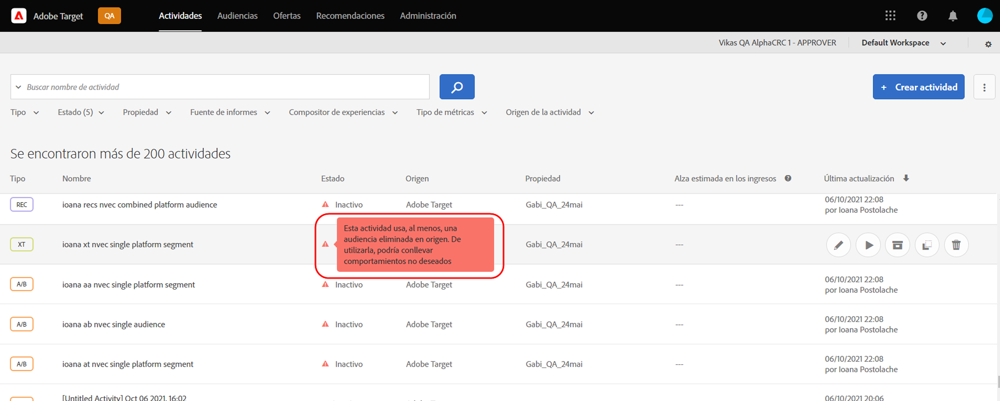
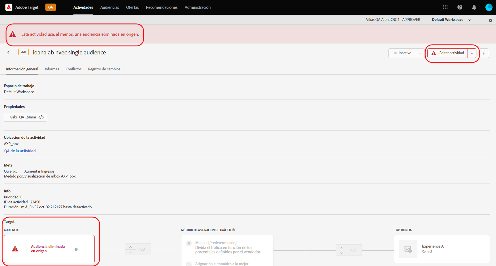

# Notas de la versión de Target (actual)

Estas notas de la versión proporcionan información sobre funciones, mejoras, correcciones y problemas conocidos para todas las versiones de [!DNL Adobe Target Standard] y [!DNL Target Premium]. Además, también se incluyen notas de la versión de las API de Target, los SDK, [!DNL Adobe Experience Platform Web SDK], at.js y otros cambios de plataforma, cuando corresponda.

>[!IMPORTANT]
>
>**Fin de vida útil de mbox.js**: Desde el 31 de marzo de 2021, [!DNL Adobe Target] no es compatible con la biblioteca mbox.js. Después del 31 de marzo de 2021, todas las llamadas que se realicen desde mbox.js producirán errores y afectarán a las páginas que tengan actividades de [!DNL Target] en ejecución para las que se mostrará contenido predeterminado.
>
>Migre a la versión más reciente de [!DNL Adobe Experience Platform Web SDK] o a la biblioteca de JavaScript at.js antes más recientes para evitar posibles problemas con sus sitios. Para obtener más información, consulte [Información general: Implementación de Target en sitios web del lado del cliente](/help/c-implementing-target/c-implementing-target-for-client-side-web/implement-target-for-client-side-web.md).

(Los números entre paréntesis son para uso interno de [!DNL Adobe]).

## Versión 2.7.0 de at.js (28 de octubre de 2021)

Esta versión contiene la siguiente mejora:

* Se ha agregado compatibilidad con [Componentes web](https://developer.mozilla.org/en-US/docs/Web/Web_Components). Esta versión de at.js es necesaria para crear y probar experiencias y ofertas personalizadas en elementos personalizados y en elementos dentro de elementos personalizados. Esta funcionalidad se incluye en la variable [!DNL Target Standard/Premium] Versión 21.10.5.

## [!DNL Target Standard/Premium] 21.10.5 (28 de octubre de 2021)

Esta versión de mantenimiento contiene las siguientes mejoras:

| Función | Detalles |
| --- | --- |
| [!UICONTROL Compositor de experiencias visuales] (VEC) | Se ha agregado compatibilidad con [Componentes web](https://developer.mozilla.org/en-US/docs/Web/Web_Components). Las experiencias y ofertas personalizadas se pueden crear y probar en elementos personalizados y en elementos dentro de elementos personalizados. Para obtener más información, consulte [Opciones del Compositor de experiencias visuales](/help/c-experiences/c-visual-experience-composer/viztarget-options.md#custom). |

## [!DNL Target Standard/Premium] 21.10.4 (21 de octubre de 2021)

Esta versión de mantenimiento contiene las siguientes mejoras:

| Función | Detalles |
| --- | --- |
| Recommendations basado en el carro de compras | Se ha agregado una nueva familia de algoritmos para ofrecer recomendaciones basadas en el contenido del carro de compras del visitante. Para obtener más información, consulte &quot;Basado en el carro de compras&quot; en [Crear criterios](/help/c-recommendations/c-algorithms/create-new-algorithm.md) y &quot;Adiciones al carro de compras/Vistas del carro de compras/Páginas de cierre de compra&quot; y &quot;Excluir elementos que ya están en el carro de compras del visitante&quot; en [Planificar e implementar Recommendations](/help/c-recommendations/plan-implement.md). |

## [!DNL Target Standard/Premium] 21.10.3 (19 de octubre de 2021)

En esta versión de mantenimiento se incluyen las siguientes mejoras, correcciones y cambios:

* Se han corregido problemas que evitaban que los clientes abran el panel [!UICONTROL A4T] en [!DNL Analysis Workspace] al hacer clic en el botón [!UICONTROL Ver en Analytics] en la creación de informes de actividad de [!DNL Target]. (TGT-42099, TGT-42100)
* Se ha corregido un problema que hacía que el botón [!UICONTROL Editar diseño] no se mostrase durante la edición de actividades de [!UICONTROL Prueba A/B] y [!UICONTROL Segmentación de experiencias] (XT) al utilizar el [!UICONTROL Compositor de experiencias basadas en formularios]. (TGT-41980)
* Se ha corregido un problema que impedía que la casilla de verificación [!UICONTROL Compatible] apareciese en la selección de criterios al crear una nueva actividad de [!UICONTROL Recommendations]. (TGT-42053)
* Se ha corregido un mensaje de error incorrecto que se mostraba al no poder seleccionar [!DNL Analytics] como fuente de creación de informes (A4T) debido a la falta de permisos de [!DNL Analytics]. (TGT-41954)
* Se han implementado varias correcciones de accesibilidad para mejorar la navegación mediante el teclado en la IU de [!DNL Target].

## [!DNL Target Standard/Premium] 21.10.2 (13 de octubre de 2021)

Se han añadido las siguientes mejoras al utilizar [!UICONTROL Audiences] de [!DNL Target] con la variable [!DNL Adobe Experience Platform Web SDK]:

* Se han añadido iconos, fuentes y mensajes de advertencia en varios lugares de la IU de [!DNL Target] para indicar que la audiencia se eliminó en el origen y ya no está disponible para su uso en actividades de [!DNL Target].

   En las ilustraciones siguientes se ven algunos de los lugares en que se muestran los iconos, los botones y los mensajes:

   * Página de lista de [!UICONTROL Actividades]

      

   * Páginas de [!UICONTROL Información general] de Actividades:

      

   * Paso [!UICONTROL Experiencias] del flujo de trabajo de creación de actividades:

      ![Audiencia eliminada en el mensaje de origen en la página [!UICONTROL Experiencias]](assets/deleted-at-source-experiences.png)

   * Paso [!UICONTROL Direccionamiento] del flujo de trabajo de creación de actividades:

      ![Audiencia eliminada en el mensaje de origen en la página [!UICONTROL Direccionamiento]](assets/deleted-at-source-targeting.png)

   * Paso [!UICONTROL Configuración y objetivos] del flujo de trabajo de creación de actividades:

      ![Audiencia eliminada en el mensaje de origen en la página [!UICONTROL Objetivos y configuración]](assets/deleted-at-source-goals-settings.png)

   * Mejoras de audiencia ([!UICONTROL reemplazar audiencia] en el paso [!UICONTROL Direccionamiento] del flujo de trabajo de creación de actividades):

* Si intenta usar la función Combinar audiencias y se eliminó una de las audiencias en el origen, [!UICONTROL Guardar] se desactiva.

## [!DNL Target Standard/Premium] 21.10.1 (6 de octubre de 2021)

Esta versión incluye las siguientes nuevas funciones:

| Función | Detalles |
| --- | --- |
| Actualización de la IU de las [!UICONTROL audiencias] | Como parte del esfuerzo continuo del equipo de [!DNL Adobe Target] para mejorar la experiencia del usuario para los usuarios de [!DNL Target], esta versión actualiza las páginas [!UICONTROL Audiencias] y [!UICONTROL Scripts de perfil] en la IU de [!DNL Target]. Esta actualización unifica y estandariza los patrones de diseño que anteriormente eran incoherentes, a la vez que añade nuevas mejoras, como las siguientes:<ul><li>La capacidad de seleccionar y eliminar varias audiencias simultáneamente</li><li>Un [diseño del generador de audiencias](/help/c-target/c-audiences/create-audience.md) actualizado</li><li>Compatibilidad con las reglas de exclusión en el generador de reglas de biblioteca de [!UICONTROL Audiencia]</li><li>El nuevo filtro “Fuente de audiencia” que permite una detección de audiencias más rápida</li><li>Opciones de filtro y búsqueda persistentes de sesión</li></ul>Para obtener más información, consulte [Audiencias](/help/c-target/target.md). **NOTA**: El nuevo [!UICONTROL Audiencias] La interfaz de usuario solo está disponible para clientes seleccionados. La actualización se implementará gradualmente para todos los clientes a partir de enero de 2022. |
| Actualización de la IU de [!UICONTROL Scripts de perfil] | La biblioteca de [!UICONTROL Scripts de perfil] también se ha actualizado e incluye una interfaz renovada y varias actualizaciones de productividad:<ul><li>La capacidad de seleccionar y eliminar varios scripts del perfil simultáneamente</li><li>Un nuevo editor de código para scripts de perfil</li><li>Resaltado de sintaxis y comprobación de errores dentro del editor de código</li><li>Completar automáticamente los parámetros de tokens (mbox o perfil) mediante métodos abreviados del teclado</li></ul>Para obtener más información, consulte [Perfiles de los visitantes](/help/c-target/c-visitor-profile/visitor-profile.md). **NOTA**: El nuevo [!UICONTROL Scripts de perfil] La interfaz de usuario solo está disponible para clientes seleccionados. La actualización se implementará gradualmente para todos los clientes a partir de enero de 2022. |
| Creación y edición de criterios de Recommendations con  | El flujo de trabajo de creación y edición de [!UICONTROL Criterios de Recommendations] se ha optimizado para simplificar la selección del algoritmo y la configuración de las recomendaciones adecuadas para lograr sus objetivos. Para obtener más información, consulte [Creación de criterios](/help/c-recommendations/c-algorithms/create-new-algorithm.md). |
| Mejoras en la ventana retrospectiva y la velocidad de actualización del algoritmo de Recommendations con  | Ahora puede ejecutar los algoritmos “Más visitados” y “Principales vendedores” con una ventana retrospectiva de seis horas para capturar el contenido que es más reciente en la tendencia. Cuando se selecciona la ventana retrospectiva de seis horas, los resultados de las recomendaciones se actualizan de cada tres a seis horas a lo largo del día. Para obtener más información, consulte [Fuente de datos](/help/c-recommendations/c-algorithms/create-new-algorithm.md#data-source) en *Creación de criterios*. |

## Notas de la versión adicionales y detalles de la versión

| Recurso | Detalles |
|--- |--- |
| [Notas de la versión: SDK web de Adobe Target Platform Experience](https://experienceleague.adobe.com/docs/experience-platform/edge/release-notes.html?lang=es) | Detalles acerca de los cambios realizados en cada versión del SDK web de Platform. |
| [Detalles de las versiones de at.js](/help/c-implementing-target/c-implementing-target-for-client-side-web/target-atjs-versions.md) | Detalles sobre los cambios realizados en cada versión de la biblioteca JavaScript de at.js. [!DNL Adobe Target]. |

## Cambios de la documentación, notas de versiones anteriores y notas de la versión de Experience Cloud

Además de las notas de cada versión, los recursos siguientes también contienen información adicional:

| Recurso | Detalles |
|--- |--- |
| Cambios de la documentación | Vea información detallada sobre las actualizaciones que se realizaron en esta guía que no se incluyen en estas notas de la versión. Para obtener más información, consulte [Cambios de la documentación](/help/r-release-notes/doc-change.md#reference_366123CF00994BACBBF9BBDF2C4D840C). |
| Notas de la versión para versiones anteriores | Vea información sobre las nuevas funciones y mejoras de las versiones anteriores de Target Standard y Target Premium. Para obtener más información, consulte [Notas de versiones anteriores](/help/r-release-notes/release-notes-for-previous-releases.md). |
| Notas de la versión de Adobe Experience Cloud | Vea las notas de la última versión de las soluciones de Adobe Experience Cloud. Para obtener más información, consulte las [Notas de la versión de Experience Cloud](https://experienceleague.adobe.com/docs/release-notes/experience-cloud/current.html?lang=es). |

## Información previa al lanzamiento {#section_5D588F0415A2435B851A4D0113ACA3A0}

Los siguientes recursos le permiten ver qué novedades hay en la próxima versión de Target.

| Recurso | Detalles |
|--- |--- |
| Adobe Priority Product Update | Para recibir notificaciones avanzadas sobre futuras mejoras de productos en Target y otras soluciones de Adobe Experience Cloud, regístrese en Adobe Priority Product Update: [https://www.adobe.com/subscription/priority-product-update.html](https://www.adobe.com/subscription/priority-product-update.html) |
| Próximas notas de la versión | Si desea obtener información sobre las versiones de Target publicadas en el mes actual, como la información sobre la versión preliminar, visite la página de [Notas de la versión de Target: versión previa](/help/r-release-notes/target-release-notes.md). |
