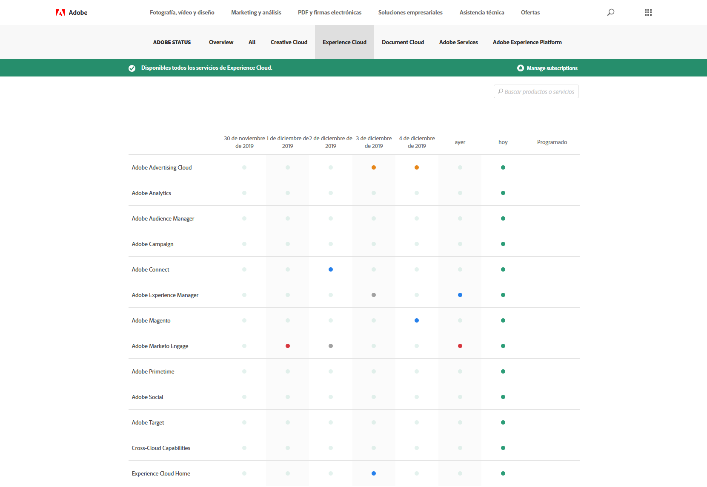

# Actualizaciones del estado del sistema y notificaciones dinámicas

Utilice la página de [!UICONTROL Estado del sistema de Adobe] y las notificaciones proactivas para mantenerse al día del estado de los productos de [!DNL Adobe] y las soluciones de [!DNL Adobe Experience Cloud]. Las notificaciones proactivas le avisan sobre eventos de interrupción y eventos de mantenimiento.

## Actualizaciones de estado del sistema

Utilice la página de [!UICONTROL Estado del sistema de Adobe] para ver el estado actual de [!DNL Target] y otros productos de [!DNL Adobe] y soluciones de [!DNL Adobe Experience Cloud]. Esta página permite determinar si los problemas que pueden tener lugar se deben a las actualizaciones del sistema o a las labores de mantenimiento periódicas.

Acceda a la página [!UICONTROL Estado del sistema] yendo a la siguiente URL:

[https://status.adobe.com](https://status.adobe.com)

Para ver el estado de las soluciones de [!DNL Experience Cloud], incluida [!DNL Target], haga clic en la pestaña [!UICONTROL Experience Cloud].

La parte superior de la página contiene información sobre eventos de mantenimiento en curso e incluye un enlace para suscribirse para recibir actualizaciones de soluciones individuales.

En la ilustración anterior, [!DNL Adobe Analytics], [!DNL Adobe Target] y [!DNL Adobe Campaign] se encontraban bajo actualizaciones de mantenimiento. El resto de los productos y soluciones funcionaban normalmente. Siempre es recomendable consultar esta página si experimenta problemas al utilizar [!DNL Target].

En el lanzamiento mensual de [!DNL Target], se muestra una notificación interna del producto, pero a veces se lanzan actualizaciones secundarias que se enumeran en esta página.

La parte inferior de la página contiene un calendario de los últimos siete días con los estados de cada solución por día. Pase el cursor sobre un indicador de estado para obtener más información:

## Notificaciones dinámicas

Las notificaciones dinámicas son alertas de correo electrónico enviadas a clientes registrados para los próximos eventos abiertos con los servicios incluidos en el perfil del cliente, incluido [!DNL Target]:

* Alertas a nivel de solución (no aíslan servicios específicos dentro de la solución)
* CSO (eventos de interrupción) de Gravedad 1 y Gravedad 2
* CMR (Eventos de mantenimiento)

>[!NOTE]
>
>Debe registrarse para recibir estas alertas. Póngase en contacto con el Administrador de éxito de clientes (CSM) de [!DNL Adobe] o con el ejecutivo de cuentas (AE) de [!DNL Adobe] para iniciar el proceso de registro.

Las ilustraciones siguientes son ejemplos de alerta de correo electrónico de notificaciones dinámicas:

