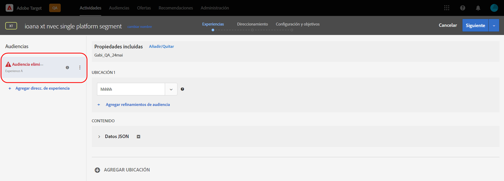
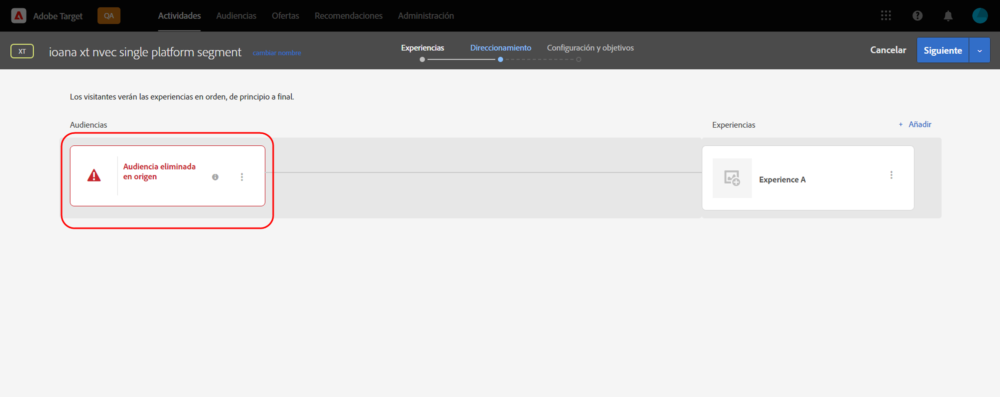

# Notas de la versión de Target (versión previa)

Este artículo contiene información sobre la versión preliminar. Las fechas del lanzamiento, las características y otras informaciones están sujetas a cambios sin previo aviso.

**Última actualización: 11 de octubre de 2021**

Para obtener información acerca de la versión actual, consulte [Notas de la versión de Target](release-notes.md). La información de estas páginas puede ser la misma en función del lanzamiento de las versiones. Los números entre paréntesis son para uso interno de [!DNL Adobe].

>[!IMPORTANT]
>
>**Fin de vida útil de mbox.js**: Desde el 31 de marzo de 2021, [!DNL Adobe Target] no es compatible con la biblioteca mbox.js. Después del 31 de marzo de 2021, todas las llamadas que se realicen desde mbox.js producirán errores y afectarán a las páginas que tengan actividades de [!DNL Target] en ejecución por contenido predeterminado.
>
>Para evitar posibles problemas con sus sitios, migre a la versión más reciente del nuevo [!DNL Adobe Experience Platform Web SDK] o la biblioteca de JavaScript at.js. Para obtener más información, consulte [Información general: Implementación de Target en sitios web del lado del cliente](/help/c-implementing-target/c-implementing-target-for-client-side-web/implement-target-for-client-side-web.md).

## [!DNL Target Standard/Premium] 21.10.2 (13 de octubre de 2021)

Se han añadido las siguientes mejoras al utilizar [!DNL Target] [!UICONTROL Audiencias] con [!DNL Adobe Experience Platform Web SDK]:

* Se han añadido iconos, programas y mensajes de advertencia en varios lugares de la interfaz de usuario de [!DNL Target] para indicar que la audiencia se eliminó en el origen y ya no está disponible para su uso en actividades de [!DNL Target].

   En las ilustraciones siguientes se muestran algunos de los lugares que muestran los iconos, los botones y los mensajes:

   *  Página lista de actividades

      

   * Páginas [!UICONTROL Información general] de actividad:

      

   *  Paso de las experiencias del flujo de trabajo de creación de actividades:

      

   *  Paso de segmentación del flujo de trabajo de creación de actividades:

      

   * [!UICONTROL Objetivos y ] configuración, paso del flujo de trabajo de creación de actividades:

      ![Audiencia eliminada en el mensaje de origen en el  [!UICONTROL paquete Objetivos y ] configuración](assets/deleted-at-source-goals-settings.png)

   * Mejoras de audiencia ([!UICONTROL Reemplazar audiencia] en el paso [!UICONTROL Segmentación] del flujo de trabajo de creación de actividades):

* Si intenta usar la función Combinar audiencias y se eliminó una de las audiencias en el origen, [!UICONTROL Guardar] se deshabilitará.

## Información previa al lanzamiento {#section_7B9D4AAFC6A74388B9D7DEF0658D8B63}

Para recibir notificaciones avanzadas sobre futuras mejoras de productos en Target y otras soluciones de Adobe Experience Cloud, regístrese en Adobe Priority Product Update:

[https://www.adobe.com/subscription/priority-product-update.html](https://www.adobe.com/subscription/priority-product-update.html)
